# Galerina

**A governance-first programming language and runtime for high-assurance software.**

Galerina is built for organisations where software failure is not acceptable — financial platforms, healthcare systems, government services, and regulated enterprise. Every execution is **declared, verified, and audited** by design, not by convention.

> **Maturity (honest status, 2026-07-10 · v1.0.0-beta.2).** Galerina is an **advanced prototype with several hardened zero-trust subsystems** — *not* yet a production-complete platform. The **compiler, security, and governance core are production-grade** (92/92 packages, 6,880 tests, fail-closed border check). The **application-framework layer is now substantially real**: the deny-by-default admission/fusion border (3 gates + multi-module linker + revocation), the `galerina new app` scaffolder, and the governed package resolver are shipped and tested (104 App-Kernel tests). The **governed HTTP transport (B8) is unlocked and in progress** — the TLSTP **S1 K3 cert/channel-validation gate** landed (`galerina-core-network`, 160 tests, fail-closed `revocation-unknown → DENY`) — the kernel's gate 6 now fail-closes on absent/empty auth headers (the mTLS presence-bypass fix), though the full S1 cert/channel verdict is not yet wired into live kernel admission; the *servable api-server / example-app* and the *signed registry index* are the remaining framework gaps. Stage-B self-hosting is in progress (≈80%), and the "Tower" compute layer is a **governed software simulator + bridge-attestation runtime, not real photonic-CPU virtualisation**. See [the component-readiness honest audit (2026-07-10)](docs/architecture/component-readiness-honest-audit-2026-07-10.md); the full roadmap, % audit, and framework plan are maintained in the internal engineering KB.

---

## The Zero-Trust thesis

Galerina optimises for **compile-time-verified governance and fail-closed Zero-Trust containment**: an ecosystem that trusts **no one by default — not the developer, not the network, not the host OS.** Where most languages bolt security on as a library, Galerina treats **every boundary as already hostile** and **verifies the boundary's contract at compile time** (a checked property, not an absolute-security guarantee). Each row below is a boundary and the mandate Galerina enforces at it.

| Boundary | Galerina's mandate | Status |
|---|---|---|
| **Compiler** | Verifies your **pre-resolved policy + execution DAG** strictly for deterministic, mathematically reproducible correctness — the contract is proven at build time, so there is no runtime surprise. | ✅ shipped |
| **I/O — the OS kernel** | Assumes the kernel is *already a compromised, hostile environment*. Native capabilities are **denied by default**; the host is a **dumb byte-mover**; authorisation is the fail-closed **`vAnd` Kleene-K3 gate** — never OS-level I/O injected into a `main`. | ◑ K3 gate shipped · hardened border twinned (`.fungi`) · full bypass = design intent |
| **Packages** | A **signed central registry** with fail-closed kernel verification: cryptographic manifests, content-addressed **hash-pinning**, and transitive **capability masks**. | ✅ admission shipped · **2 of 3 decision twins now EXECUTE** (signed #105-admitted WASM, differential ≡ real `.ts`: `registry-index` · `package-admission`) · `fuse-admission` twinned |
| **Memory** | An actively-governed, **hostile physical boundary**. Standard shared-mutable memory models are **mathematically incompatible** with absolute Zero-Trust invariants — so TLSTP governs network memory *directly* instead of handing it to shared host state. | ◑ governed-surface twinned (checker-clean `.fungi`) · **residency-ceiling hardening merged** (RD-0358: spill→Refuted + `memory.spill` deny-only, compile-checked) · real runtime isolation = design intent (#143) |
| **TLSTP — zero-middleware** | Routes *around* the OS kernel: the host writes raw encrypted packets as **unparsed byte-arrays** straight into WASM linear memory; **decryption happens strictly inside the WASM sandbox** — the kernel never sees plaintext. | ◑ all 6 border decision surfaces twinned (`.fungi`, fail-closed; twin gate 20/20): cert/channel gate · CORS admission · inbound admission + rate-limit · defensive controls (trusted-proxy · uniform responses · opaque ids · bounded pagination) · degrade-only telemetry self-throttle · egress SSRF guard (octet→category classification · deny-by-default egress verdict · DNS-rebind fold · URL guard) · **B8 admission fold now EXECUTES** (`b8-admission.fungi`, signed #105-admitted WASM, differential ≡ the shipped K3 calculus over the 7-gate fold + cert sub-fold; **NOT** DSS.wasm-blocked) · in-sandbox decryption = design intent (DSS.wasm TCB #102-106) |

> **Honest line — shipped vs. design intent.** The **compiler**, the **`vAnd` Kleene-K3 authorisation gate**, **signed package admission** (hash-pin · signature · revocation · closed capabilities), and the **S1 cert/channel-validation gate** are **shipped and tested today**. **Progress (RD-0361 execution-cutover):** several governed *decision surfaces* now **execute as signed #105-admitted WASM** — the package `registry-index` + `package-admission` folds and the **B8** transport-admission fold — each proven **differential** (the WASM verdict equals the real `.ts` verdict over its full corpus) — **27 differential twins · 1 shadow** across the RD-0361 execution column, with `secret-gate` joined via the RD-0389 record-marshalling ABI — the without-`.ts` ceiling. This is *differential, not authoritative*: the R4 flip that deletes the `.ts` decider is `#143`-gated. The full **kernel-bypass / in-sandbox isolation** — decryption inside a *real* WASM sandbox with the host as a pure byte-mover — is the **target architecture**, gated on the real `DSS.wasm` Wasmtime TCB (#102–106, still a stub; a design-spec is in R&D). Treat kernel-bypass / zero-middleware as **design intent**, not yet a shipped runtime property.

---

## What Galerina does

**Declares governance in source code.** Every flow declares its intent, effects, capability boundaries, and invariants in a `contract {}` block. The compiler verifies these at build time. There is no runtime surprise.

**Enforces at runtime via the Governed Tower.** The DSS supervisor tracks the V_DPM (Virtual Dynamic Posture Matrix) register — every capability use is a bitmask check, every trap produces a structured AuditEvent, and rollback is clean (`unreachable` fires before the next instruction). *Today this runs as the Stage-A TypeScript simulation; the real `DSS.wasm` component is Post-P9 (#102–106).*

**Produces a cryptographic audit trail.** Every governed execution generates an Epilogue Receipt (sha256_seal or zk_snark). Every security trap appends to an append-only audit log (CBOR Tag 410 AuditEvent). **Hybrid Ed25519 + ML-DSA-65 (NIST FIPS 204) signing is shipped** on the attestation, proof-graph, and bridge surfaces (both halves required — no post-quantum downgrade; certified mode *mandates* the ML-DSA key). **Opt-in hybrid signing now extends to the `.lmanifest`** as well: the default stays **Ed25519** (unchanged), and setting `GALERINA_MANIFEST_PROFILE=certified` *mandates* the hybrid Ed25519+ML-DSA-65 manifest signature — both halves required, fail-closed (`FUNGI-MANIFEST-PQ-REQUIRED` / `-PUBKEY-MISSING` / `-TAMPER`), with no post-quantum downgrade.

**Compiles to WebAssembly.** Governance is verified by the compiler at build time and enforced on the Stage-A runtime today. **WASM is the production execution path** — independently benchmarked as native-class (see Benchmarks). Full in-WASM self-hosting (P9) is *in progress*: the self-hosted `lexer.fungi` `tokenize` **and the `parser.fungi` entry point `parseFlows`** reach **byte-for-byte Stage-A == Stage-B real-WASM parity** (#143) — the parser ladder is proven from leaf to entry point (`parseParams` → `parseExpr` → `parseStmt` → `parseBlock` → `parseFlows`, 53 differential tests), including self- and mutually-recursive AST readback with **no new ABI**; extending that to the type-checker/governance-verifier flows is the remaining gate.

---

## What makes it different

| Traditional | Galerina |
|---|---|
| Errors as exceptions | Explicit `Result<T, E>` — no silent failure |
| Mutation is silent | `let` = immutable · `mut` = explicit · `readonly` = view |
| Side-effects hidden | Effects declared: `contract { effects { database.write } }` |
| Boundary data silently typed | `unsafe let raw` — untrusted until gated |
| AI guesses at structure | Machine-readable ProofGraph + intent manifests |
| Security checked at runtime | Compile-time: taint, secrets, PCI DSS, governance proofs |
| Dependencies trusted by import | **Signed admission border** — hash-pin · signature · revocation · capability mask before a package runs (see *Package architecture*) |
| Fixed hardware | Declared targets: CPU · WASM · GPU · NPU · Photonic |

---

## What Galerina can and cannot do (honest scope)

Three plain-English blocks. The first is the mature, shipped core; the second is a real but **emulated / owner-gated** frontier; the third is the hard boundary — what Galerina deliberately will **not** do.

### 1) What the governance `contract {}` block is good for *(shipped, production-grade)*

The `contract {}` block declares a flow's **intent, effects, capability boundaries, and invariants**, and the compiler proves them at build time (no runtime surprise). It is strongest for:

- **Authorisation that fails closed** — the three-valued **K3 gate** (`ALLOW / INDETERMINATE / DENY`); an unknown or untrusted input can only ever *lower* a verdict, never manufacture an `ALLOW` (**No-Coercion**, `vAnd = min`).
- **Effect & capability control** — every effect (`database.write`, `crypto.sign`, `network.*`) is **denied by default** and must be declared; native OS capabilities are off unless granted.
- **Intelligent API routing** — `+1` fast-allow / `0` step-up (MFA/WAF) / `-1` deny, with degrade-only telemetry that can throttle but never auto-admit.
- **PII / PHI safety** — protected types + `redact()` enforced *before* data reaches an audit sink.
- **Supply-chain provenance** — signed manifests (Ed25519, opt-in hybrid PQ), hash-pinning, revocation, closed capability masks.
- **Regulated audit** — every governed execution emits a cryptographic receipt + append-only audit log; OWASP/injection classes are blocked at the compiler.

> Best fit: financial platforms, healthcare, government/defence, regulated enterprise — anywhere "software failure is not acceptable".

### 2) What the "can do something" with maths / other compute is good for *(real, but emulated today + owner-gated)*

Galerina can **govern a tolerant numeric sub-kernel** as a deny-by-default, untrusted **compute-only lane** (run on a CPU **photonic emulator** today, cheap-verified, fed back as a *degrade-only* verdict under a signed tolerance witness) — **while every decision stays bit-exact on the digital core**. Useful for the *tolerant MAC half* of:

| Domain (as you'd name it) | What Galerina governs |
|---|---|
| **Weather prediction** | the ML-surrogate (GNN/attention) half — the chaotic core is refused |
| **Finance / stocks** | a covariance MVM on the analog lane; pricing/VaR stays bit-exact digital |
| **3D modelling** | tolerant render/physics (transforms, GI/AO, soft-body), TMR-voted |
| **DNA computing / genomics** | tolerant similarity/embedding inner-products |
| **Computational chemistry** | the MD non-bonded force sub-kernel |
| **Algebra** *(tolerant low-precision matrix)* | ternary/low-bit GEMM/MVM |
| **K3 API routing** · **low-level quantum** | *already ship* (the admission spine · the ffsim governance gate — governs, does not execute) |

> Honest fence: the optics is a **precision-limited analog accelerator (~8-bit)** — **latency ≠ work** (~1.9× emulated, never "instant / free / O(1)"), and the analog lane can only **False-DENY, never False-ALLOW**. The deliverable today is a worked-example `.fungi` (see `examples/gaming-substrate/`) + a compute-only profile — **not a new math kernel, and not silicon.**

### 3) What it cannot do *(the hard boundary — by design)*

- **Bit-exact maths on the analog lane** — **number theory** (primes, factorization, modular arithmetic), **symbolic / high-precision algebra**, and the **DFT / quantum-chemistry core** need exact or fp64 results, so they stay on the digital lane (no analog win).
- **`lane: gaming` (or any domain as a "lane")** — `lane` is a *hardware substrate* axis (`digital | noisy | photonic`), **not** an application domain. A game spans multiple lanes (approximate physics on `photonic`, anti-cheat signing on `digital`), so an unknown lane is **rejected** (`FUNGI-SUBSTRATE-002`), not silently accepted.
- **Crypto on a noisy/photonic lane** — integrity is never tolerance-bounded; `crypto.*` on a noisy lane is denied (`FUNGI-SUBSTRATE-001`) no matter how much voting/averaging/ECC is stacked. **Crypto and any bit-exact result stay digital, always.**
- **AI as an in-path authorizer** — a model may *propose* (untrusted, degrade-only), but a probabilistic/self-reported score can never *lift* a security verdict.
- **"Instant / free / O(1)" optical compute** — refuted; light transit is N-independent in *latency*, but the *work* is Θ(N²) load + Θ(N) I/O.
- **Not yet (roadmap, not "cannot"):** real photonic hardware (emulated today), full in-WASM self-hosting (lexer `tokenize` + the whole parser entry point are byte-parity-proven; type-checker / governance-verifier / gir-emitter are not), and real in-sandbox `DSS.wasm` isolation (#102–106).

---

## Who it is for

| Sector | Why Galerina |
|---|---|
| **Financial platforms** | Every payment flow declares and enforces its effects. Audit trail by default. PCI DSS governance built in (`galerina-devtools-pci`). |
| **Healthcare systems** | PII/PHI is typed and tracked. Redaction is enforced at the type level before data reaches any audit sink. |
| **Government / defence** | Designed for air-gapped deployment, no cloud dependency. Governed BitNet CPU inference is in early integration (Inference Tower ~12%). |
| **Enterprise regulated** | OWASP attack vectors blocked at the compiler. Supply-chain provenance via signed manifests (Ed25519 default; opt-in hybrid Ed25519+ML-DSA-65 via `GALERINA_MANIFEST_PROFILE=certified`, plus hybrid on the attestation/bridge surfaces). |

### Capability radars

A ten-axis capability self-assessment across the surfaces Galerina governs, plus the Galerina governance-first pipeline and a TritMesh cache / `.spore`-passport vs. legacy-caching comparison. Click any chart to open the full SVG.


<table align="center">
  <tr>
    <td align="center" width="100%"><a href="docs/diagrams/radar-1-security-governance.svg"></a><br><sub><b>1 · Security &amp; Governance</b></sub></td>
  </tr>
  <tr>
    <td align="center" width="100%"><a href="docs/diagrams/radar-2-performance-systems.svg">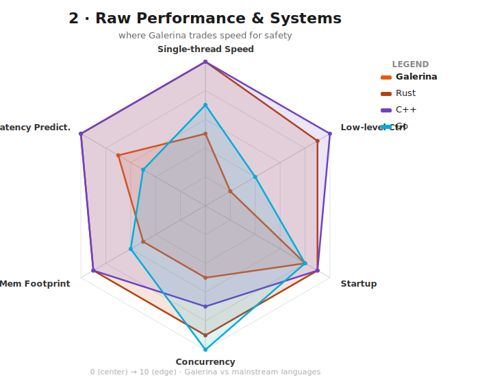</a><br><sub><b>2 · Performance &amp; Systems</b></sub></td>
  </tr>
  <tr>
    <td align="center" width="100%"><a href="docs/diagrams/radar-3-devx-ecosystem.svg">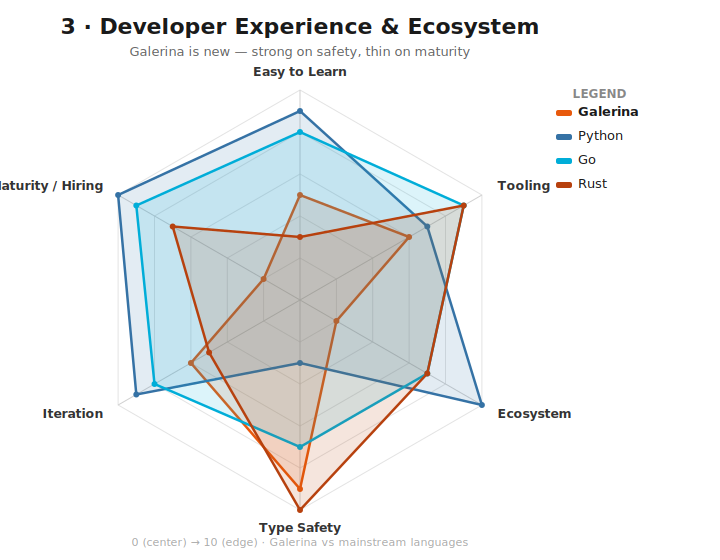</a><br><sub><b>3 · DevX &amp; Ecosystem</b></sub></td>
  </tr>
  <tr>
    <td align="center" width="100%"><a href="docs/diagrams/radar-4-governed-chaos.svg">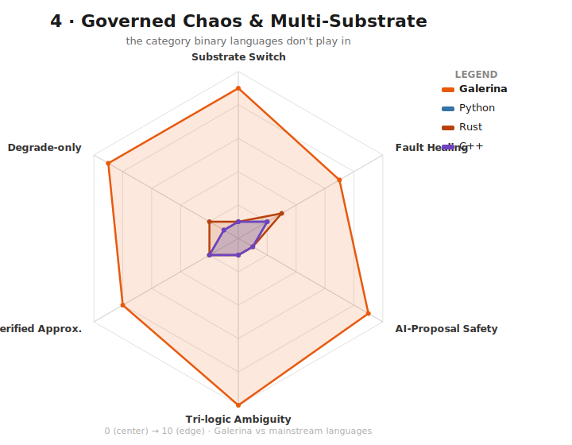</a><br><sub><b>4 · Governed Chaos</b></sub></td>
  </tr>
  <tr>
    <td align="center" width="100%"><a href="docs/diagrams/radar-5-cicd-devsupport.svg">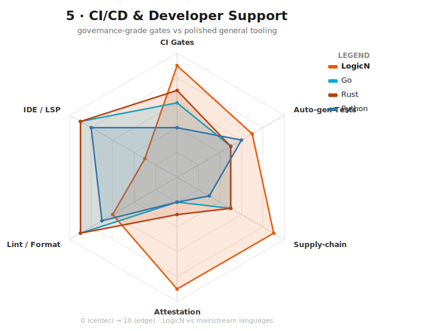</a><br><sub><b>5 · CI/CD &amp; Dev Support</b></sub></td>
  </tr>
  <tr>
    <td align="center" width="100%"><a href="docs/diagrams/radar-6-tri-ternary.svg">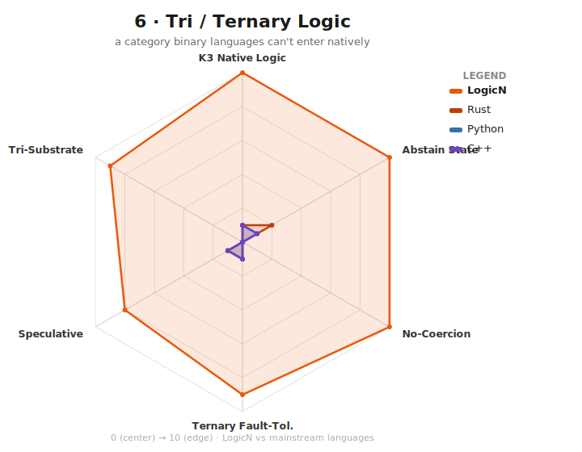</a><br><sub><b>6 · Tri / Ternary</b></sub></td>
  </tr>
  <tr>
    <td align="center" width="100%"><a href="docs/diagrams/radar-7-web-api-secure.svg">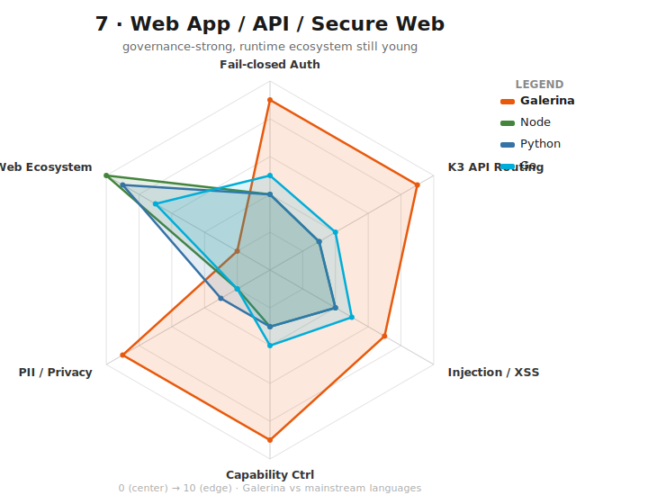</a><br><sub><b>7 · Web &amp; API Secure</b></sub></td>
  </tr>
  <tr>
    <td align="center" width="100%"><a href="docs/diagrams/radar-8-databasing.svg">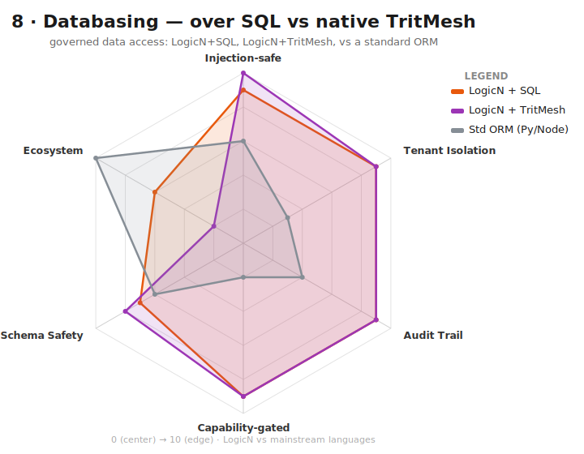</a><br><sub><b>8 · Databasing</b></sub></td>
  </tr>
  <tr>
    <td align="center" width="100%"><a href="docs/diagrams/radar-9-data-science.svg">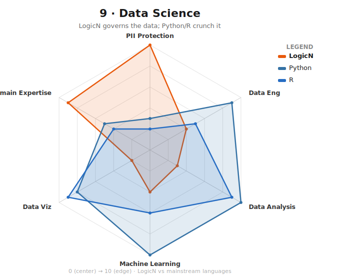</a><br><sub><b>9 · Data Science</b></sub></td>
  </tr>
  <tr>
    <td align="center" width="100%"><a href="docs/diagrams/radar-10-AI-ML-NuroNet.svg">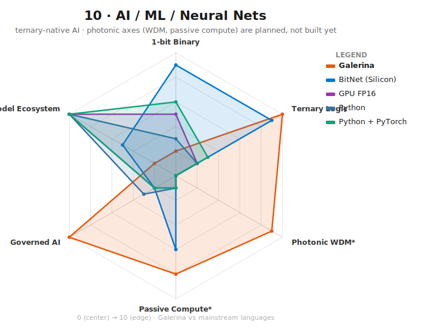</a><br><sub><b>10 · AI / ML / Neural Nets</b></sub></td>
  </tr>
    <tr>
    <td align="center" width="100%"><a href="docs/diagrams/radar-11-language-type-system.svg">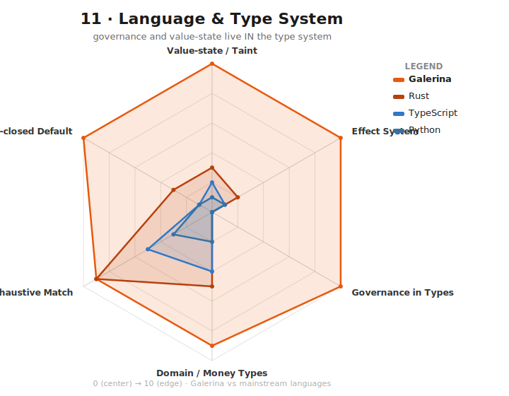</a><br><sub><b>21 · Language &amp; Type System — Galerina vs Rust / TypeScript / Python (radar)</b></sub></td>
  </tr>
  <tr>
    <td align="center" width="100%"><a href="docs/diagrams/galerina-mechanics.svg">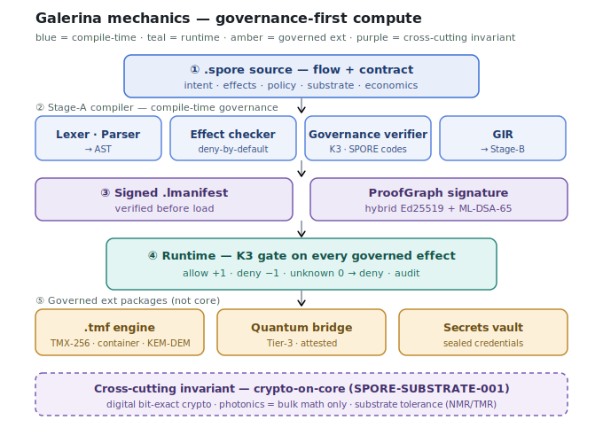</a><br><sub><b>11 · Galerina — governance-first compute pipeline</b></sub></td>
  </tr>
  <tr>
    <td align="center" width="100%"><a href="docs/diagrams/galerina-tritmesh-cache-passport-vs-legacy.svg">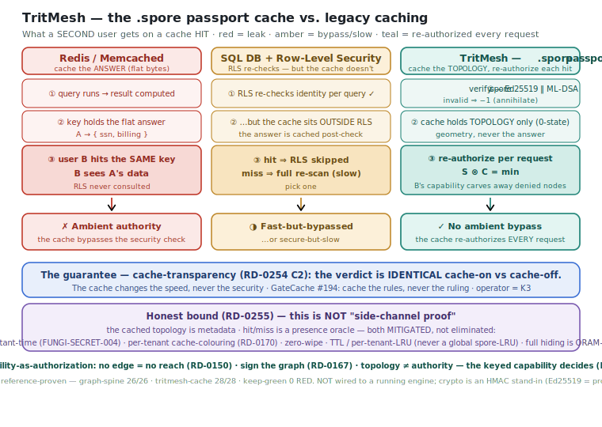</a><br><sub><b>12 · TritMesh — cache &amp; <code>.spore</code> passport vs legacy caching</b></sub></td>
  </tr>
  <tr>
    <td align="center" width="100%"><a href="docs/diagrams/galerina-governed-data-query-lane.svg">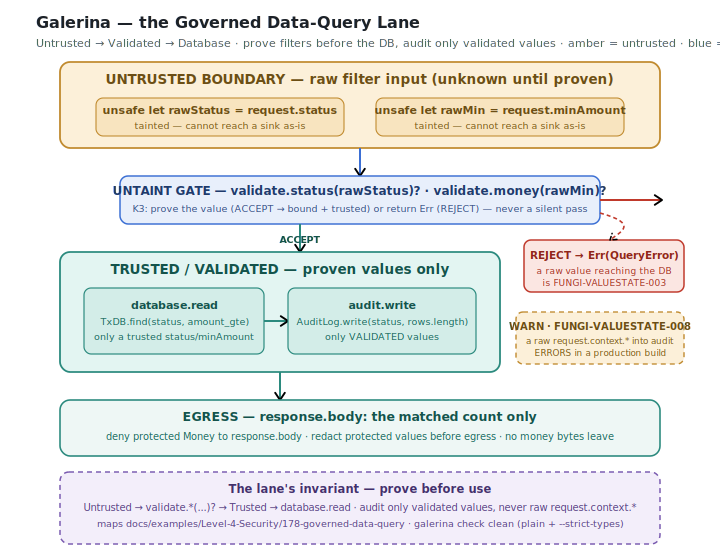</a><br><sub><b>13 · Galerina — the Governed Data-Query Lane (prove before use)</b></sub></td>
  </tr>
  <tr>
    <td align="center" width="100%"><a href="docs/diagrams/galerina-trust-state-lifecycle.svg">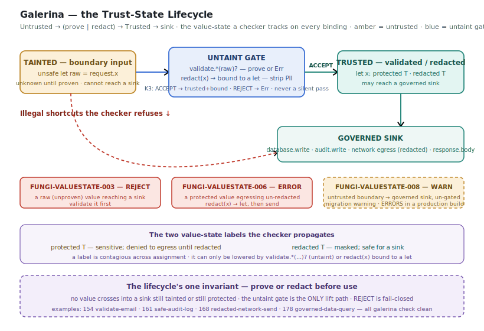</a><br><sub><b>14 · Galerina — the Trust-State Lifecycle (prove or redact before use)</b></sub></td>
  </tr>
  <tr>
    <td align="center" width="100%"><a href="docs/diagrams/galerina-govern-dont-absorb.svg">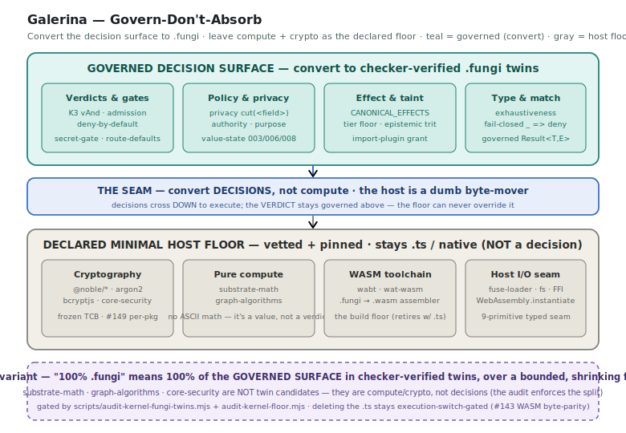</a><br><sub><b>15 · Galerina — Govern-Don't-Absorb (convert decisions, not compute)</b></sub></td>
  </tr>
  <tr>
    <td align="center" width="100%"><a href="docs/diagrams/galerina-ungoverned-vs-governed-breach.svg">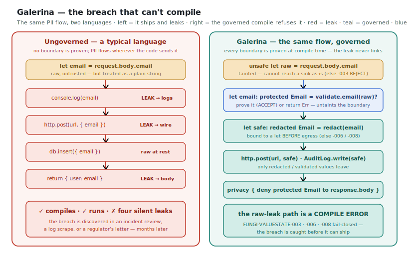</a><br><sub><b>16 · Galerina — the breach that can't compile (ungoverned vs governed)</b></sub></td>
  </tr>
  <tr>
    <td align="center" width="100%"><a href="docs/diagrams/galerina-k3-verdict-lattice.svg">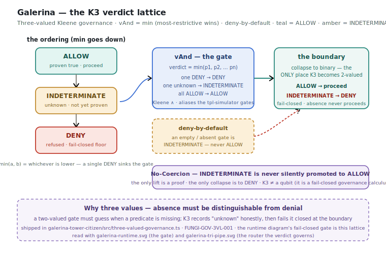</a><br><sub><b>17 · Galerina — the K3 verdict lattice (deny-by-default, No-Coercion min)</b></sub></td>
  </tr>
  <tr>
    <td align="center" width="100%"><a href="docs/diagrams/galerina-privacy-cut-authoring.svg">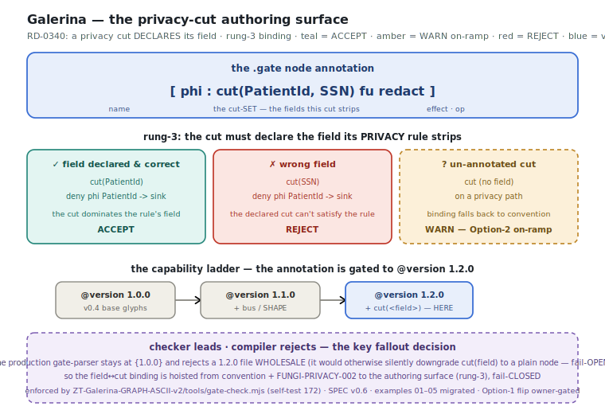</a><br><sub><b>18 · Galerina — the privacy-cut authoring surface (RD-0340 field↔cut)</b></sub></td>
  </tr>
  <tr>
    <td align="center" width="100%"><a href="docs/diagrams/galerina-healthcare-getpatient-flow.svg">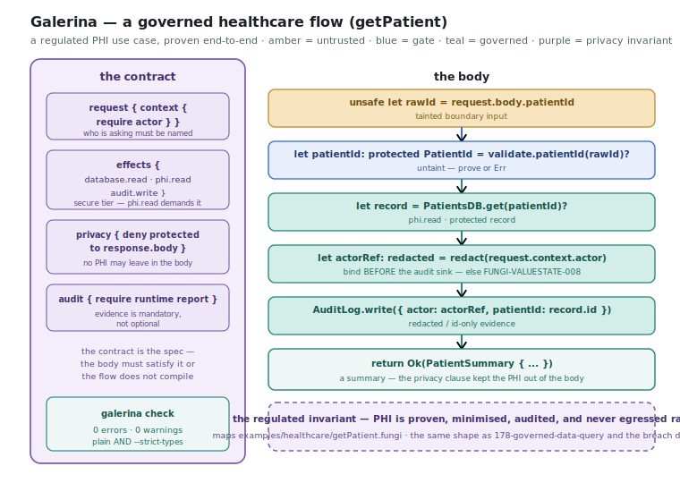</a><br><sub><b>19 · Galerina — a governed healthcare flow (getPatient)</b></sub></td>
  </tr>
  <tr>
    <td align="center" width="100%"><a href="docs/diagrams/galerina-payments-money-lane.svg">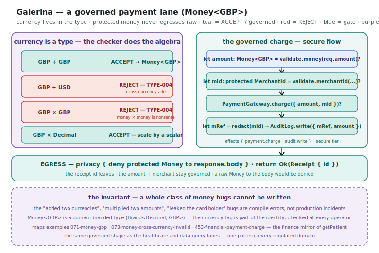</a><br><sub><b>20 · Galerina — a governed payment lane (Money&lt;GBP&gt;)</b></sub></td>
  </tr>
</table>

> **New here?** → [**SETUP.md**](SETUP.md) — install · run your first benchmark · Hello World with full governance comments

---

## Benchmarks (honest numbers — core scoreboard 2026-06-23; Int64 + Tower-of-Hanoi added 2026-06-25)

Run on an **Intel i9-9900K (8C/16T) + NVIDIA RTX 2060**, across Rust (native, generic + AVX2), Node.js (V8), Python (CPython), Galerina's WASM output, the Stage-A interpreter tiers, and real GPU (Deno WebGPU). Harness at `packages-galerina/galerina-devtools-benchmarks`; quote the canonical **§1.5 production-ceiling scoreboard** from `npm run compare` (the standard view — the 3 diagnostic `⟨interp⟩` tiers cannot "win", and the only honest Galerina cost is the shipping **WASM ▶ production** path).

**The production-ceiling scoreboard (WASM ▶ production vs the fastest real runtime):**

- **WASM ▶ production won outright** on `hardware-targets` (1st/4) and `fibonacci-recursive` (1st/5), and lands **~2.0–3.6× the winner** on most hot compute (`record-allocation` 2.0×, `six-digit-guess` 2.0×, `gpu-compute` 2.3×, `matrix-multiply` 3.6× behind the RTX-2060). Winner tally across the comparable set: Node.js 5 · Rust AVX2 5 · Rust (generic) 5 · **WASM ▶ production 2** · Deno-WebGPU 1.
- **Governance is not free, stated honestly:** `governance-cost` is the heavy outlier at **293×** the AVX2 winner (the per-decision K3 fold), and `collection-pipeline` is 61× — these are the cost of compiling governance *into* the binary; on the per-flow `Node/Galerina` view governed overhead is ~**24.6%**.
- **The Stage-A `⟨interp⟩` tiers are diagnostic, not the product** — they are the WASM byte-parity oracle and are *excluded from winning* by the scoreboard standard (they can read 1.0K–1025K× slower and that is expected).
- **`spore-container`** is now benchmarked (Rust 161.5K/s, Node 46.4K/s). `tri-logic` and `data-query` are **excluded — not unit-aligned** (R&D 0092, no silent caps).
- **New (2026-06-25): `tower-of-hanoi`** — a harder cross-language recursion benchmark (3-peg Hanoi n=16 with a threaded move-checksum; all five runtimes agree on `result=42452`, the truth-audit oracle). Throughput ranks Rust ~237M > Node ~114M > Python ~4M > Galerina governed (slowest, by design). And an **Int64-vs-i32 WASM micro-benchmark** (`bench-i64-vs-i32.mjs`): the newly-added faithful 64-bit lowering is **i64 ≈ i32** (add 1.06×, mul 0.95×, within noise) — exact-past-2⁵³ + overflow-trapping integers cost ~0 throughput on a 64-bit host.

---

## Build Progress

| Layer | % | Note |
|---|---|---|
| **Specification / KB** | 100% | ~990 documents (internal engineering KB, maintained in a separate private repository) |
| **Lexer / Parser / Governance Verifier / Contract blocks / Value-state checker** | 100% | full pipeline |
| **DRCM Phases 1–7 (Governed Tower — Stage-A simulation)** | 100% | real `DSS.wasm` is Post-P9 (#102–106) |
| **CBOR Manifests (RFC 8949)** | 100% | |
| **Tests — full suite** | 100% | **93/93 packages · 7,373 tests · 0 failures** |
| **Resilience — first-class fault handlers (0017)** | shipped | `on_*_fault` → fail-closed `halt` default + FUNGI-FAULT-001/003 + `GIRFlow.faultHandlers` |
| **Contract-driven test generation (0016)** | 5/5 vector dimensions | fault-injection · effect-egress · capability-denial · boundary/fuzz · substrate-violation (over GIR) |
| **Type checker / Effect checker** | 97% | *derived* from twin diagnostic-code parity — 28/29 of the TYPE/EFFECT diagnostic charter mirrored with emit+name+severity parity (open rung: FUNGI-TYPE-032) |
| **WAT emitter** | ~89% | #128(a) fail-closed fix landed (unhandled stmt → `unreachable` trap); #128(b)/GAP-4 `forEachStmt` lowering landed (for-in → counted loop over the host array bridge); `for…where` filtered iteration lowers as a guarded loop — all execution + interpreter-fidelity tested |
| **Faithful Int64 (i64) lowering** | lift-ready | exact 64-bit integers end-to-end — interpreter `bigint` ≡ WASM `i64`, overflow **traps** (Fork-A, no silent wrap), the walker≡WASM differential passes non-vacuously over (2⁵³,2⁶³). The `FUNGI-NUMERIC-001` gate stays **closed by design** (declaring a scalar `Int64` errors today); the lift is one owner-gated line + a final cross-flow check. `UInt64` still gated. Throughput i64 ≈ i32. (Integer-types spec: internal engineering KB) |
| **Runtime interpreter** | ~87% | diagnostic tier (see Benchmarks) |
| **Stage-B self-hosting — interpreter parity** | 100% | R6 corpus: Stage-A == Stage-B |
| **Stage-B self-hosting — WASM execution (P9)** | in progress | **verified 2026-07-12: all 7 stage twins (lexer · parser · type/effect-checker · gir-emitter · governance-verifier · runtime) build → WASM (R0) + #105-admit (R1), flows callable** — the WAT emitter is not the blocker. Only lexer `tokenize` is R3 byte-parity-proven so far; the frontier is R3 byte-parity per stage (parser next: AST readback vs the `.ts` reference — the record-readback bridge `readRecordField`/`readArray` already ships, so no new ABI is needed) |
| **Post-Quantum & Hardware Security** | ~40% | hybrid Ed25519+ML-DSA-65 shipped on attestation/proof/bridge; **opt-in `.lmanifest` hybrid shipped** (default Ed25519; `GALERINA_MANIFEST_PROFILE=certified` mandates hybrid, both-halves fail-closed via `FUNGI-MANIFEST-PQ-REQUIRED`). The **CRYPTO-002 no-PQ-downgrade admission policy** (require-hybrid · no downgrade · certified-profile) is now authored in `.fungi` and executes through #105 (`pq-admission-policy.fungi`); the ML-DSA/Ed25519 verify stays host crypto. Custody ladder (TPM/enclave, RD-0365) + hardware signer = post-v1 |
| **`.spore` trust-capsule format (`galerina-ext-spore`)** | slices 1–3 done | A **quantum-resilient universal file & communications format** (not just a database): TMX-256 (3-ary SHAKE256 Merkle-XOF) + container + KEM-DEM golden-verified; codec-agnostic modalities (image/audio/video/document/structured) + seekable anti-truncation streaming. ML-DSA-65 root signing (slice 4) next. **Defensive-publication paper:** [`docs/paper/defensive-papers/`](docs/paper/defensive-papers/) |
| **`env.spore` sealed secrets (`@galerina/ext-secrets-spore`)** | shipped | An **optional encrypted-at-rest `.env` replacement** — sealed credentials in the `.spore` capsule format instead of a plaintext dotenv file; opt-in package, 21 tests |
| **Security hardening — fail-open class taxonomy** | shipped today | 10 recurring fail-open classes named + mechanically detected; **SEC-002 mutation: all gates killed** (every fail-closed gate genuinely guarded); `lint-wat-inline-comments` + the #163/#165/guarded-flow codegen+value-state fixes landed; **the `FUNGI-TIER-001` flow-kind tier-floor is shipped and now enforced on the user-facing `galerina.mjs` production build path** (under `GALERINA_PROFILE=production` an under-declared guarded/plain flow fails the build; `FUNGI-VALUESTATE-008` likewise enforced there — dev/check stay permissive); the value-state 34B-hole + `canCommit` deny-by-default are the next approved items |
| **Passive Execution Plans & Target Bridges** | ~35% | **v1 bar (RD-0363):** plans signed + admitted + replayable on CPU/WASM with replay-time capability re-verification. The **replay-admission decision surface** (§2 six-check deny-by-default fold — signature/hash · capability-currency · freshness · target-binding · step-containment · qualifier-coherence) is authored in `.fungi` and **executes through #105** (R0 build → R1 admit → verdict ≡ spec). Remaining = signed-artifact/admission wiring (P1), capability re-verify (P2, needs RD-0311), the governed replayer loop (P4) |
| **AI Inference Tower (BitNet / GroqCloud / NVFP4)** | ~30% | **v1 bar (RD-0364):** the governed-inference contract enforced over the simulators, BitNet as the one attested reference bridge. The **per-call governance decision surface** (bridge admission · honest identity tiers attested/asserted/reject · output-taint = UNKNOWN-until-discharged · cost caps · cloud egress) is authored in `.fungi` and **executes through #105**. Remaining = `inference.invoke/load` effect names (I1), weights-hash pin (I2), taint→compiler-trit wiring (I3), cloud redaction (I4), metering (I5). Default bridges stay governed simulators |
| **Photonic / Ternary Computing** | ~3% | software simulation only (not hardware) |
| **Application-framework layer** | ~72% | admission/fusion border (3 gates + `planComposition` multi-module linker + revocation, 104 tests) · `galerina new app` scaffolder · governed resolver (hash/sig/registry/install-deny + FUNGI-PKG-006) — all real + tested. **B8 HTTP transport unlocked + in progress** (S1 cert-gate landed, kernel-wiring pending). Servable api-server/example-app + signed registry index are the remaining gaps |
| **B8 governed HTTP transport (TLSTP)** | in progress | **S1 K3 cert gate shipped + the B8 admission fold (`b8-admission.fungi`) now execution-proven ≡ the shipped K3 calculus** (RD-0361 differential — the converged build-first; `revocation-unknown → DENY` soft-fail closure proven; **not DSS.wasm-blocked**). Remaining = raw-byte shim + idempotency-gated 0-RTT · S4 recovering-FSM · ECH/OHTTP · in-sandbox isolation (DSS.wasm #102–106) |
| **Tri-Pipe fault tolerance (binary/hybrid/photonic)** | re-R&D complete | shipped: fail-closed core · arena + overflow traps · DbC post-conditions · K3 fail-safe · NMR tolerance · Freivalds verify · DRCM containment. The multi-agent stability re-R&D is **complete** (results-log 0032) |

**Roadmap (security-first)** + **% audit** (~88% shippable) + build-roadmap are maintained in the internal engineering KB; the in-repo status view is [component-readiness-honest-audit-2026-07-10.md](docs/architecture/component-readiness-honest-audit-2026-07-10.md). *2026-06-25: faithful Int64 WASM lowering is lift-ready (gate closed by design); the Untrusted Governed Lane is documented; the Tower-of-Hanoi cross-language benchmark + the JS-quirks-vs-Galerina R&D (notes/59) landed.* *Latest (2026-06-24, v1.0.0-beta.2): `FUNGI-TIER-001` + `FUNGI-VALUESTATE-008` are now enforced on the `galerina.mjs` production build path, opt-in hybrid Ed25519+ML-DSA-65 `.lmanifest` signing shipped (certified profile), and `@galerina/ext-secrets-spore` (`env.spore` sealed secrets) landed; the next security fix is wiring the S1 cert-gate into live kernel admission (run `node scripts/status.mjs`; `node scripts/component-health.mjs --table` renders the per-component **Zero-Trust-thesis** + **Build-Progress** readiness live, Tests row sourced from `version.json`).*

## Tracking registry

Substantial items tracked *outside* the two tables above — the R&D **§5 registry** (finish-line handover, 2026-07-12). Mirrors `scripts/component-health.mjs --table` (tool = source, README = view). **State** is an honest word — `shipped` · `building` · `design-done` · `build-pending` · `post-v1` · `🔒 owner` — and a bare **%** appears only where a countable ladder (tests / rungs / increments) exists; never an invented number.

| Item | State | Detail |
|---|---|---|
| **Execution-cutover (RD-0361)** | building | execution column shipped · **27 twins differential** (R0 build → R1 #105-admit → R3 ≡ real `.ts`; all string-verdict twins label-verified via the emitter intern-table decode; **secret-gate now executes over a real `Array<SecretPresence>` via the RD-0389 record-marshalling ABI**) · **1 shadow** (kernel / P9 lane) · R4 authority flip 🔒 owner (#143) |
| **Twin corpus + 6 sentinels** | shipped | ~20 pure `.fungi` verdict twins checker-clean across 9 governed dirs (execution is RD-0361) |
| **Hardening / residency (RD-0358)** | shipped | H-1..H-7 **integrated + merged to main** (`f7ff18df`) — per-unit keep-green; H-6 `memory.spill` deny-only + trit-conformance 6/6 + example 182; remaining 🔒 H-5 signed-FuseDescriptor re-sign + #143 |
| **Epistemic trust-trit (RD-0337)** | shipped | PROVEN/UNKNOWN/REFUTED runtime + compiler mirror (Option A) + trit-conformance gate 6/6 |
| **Hallmark open types (RD-0353 H1)** | shipped | developer-minted nominal types + mandatory assay gates; FUNGI-HALLMARK-001..005, example 097 |
| **Value-unit types (RD-0349)** | building | I2/I3 done · I1 ISO-4217 unlocked (§5) · I4–I6 queued; no float bridge |
| **CANONICAL_EFFECTS registry (RD-0341)** | shipped | single-source `domain.verb` + anti-drift self-tests; `memory.spill` deny-only, FUNGI-EFFECT-006 |
| **Contract Registry (RD-0359)** | shipped | `gen-contract-registry.mjs` built — **840 contracts across 446 `.fungi`** → `docs/contract-registry/`; parser-authoritative flow list + intent extraction, `--self-test` + `--check` |
| **Self-hosting Stages 3–6** | post-v1 | bootstrap fixpoint · crypto FFI seam · `.fungi`↔host path · floor-by-floor; P9, non-v1-gate |
| **DSS.wasm supervisor (#102–106)** | post-v1 | real Wasmtime TCB (kernel-bypass / in-sandbox decrypt); design-spec exists; unlocked-to-build, non-v1-gate |
| **Workspace package families** | shipped | 94-pkg denominator built (target×9 · data×12 · db×5 · web×6 · ai · tools); 2 orphans #32-exempt |
| **Package Standard + pub ladder** | building | Standard v1 + pkg-census + 9 schematics done; R1–R6 rungs pending; `.graph` amendment 🔒 owner |
| **Security-infra designs (×4)** | build-pending | SBOM tool exists; fuzz RD-0316 · Z3 RD-0318 · tabletop RD-0319 unlocked (§5), unbuilt |
| **Devtools audit suite** | shipped | 76 tools · 44 audits (incl. claim-hygiene public-doc gate + env-var-literal-strict path-leak + reference-doc-drift) · keep-green + gate-selftests meta-gate; twin-audit execution column shipped (shadow\|differential\|authoritative) |
| **Signing-key custody** | build-pending | the custody **ladder** (where key *bytes* live) — **not** key-rotation (which ships as `tower-citizen/key-rotation.ts`, triple-lock): dev/fixture key ceremony ✓ + L1 `.env` on disk; vault(L2)/TPM(L3)/HW(L4) 🔒 owner-side |
| **RD-0363/0364/0365 wiring (R&D done)** | building | **R&D complete** — all three authored in the KB. RD-0363 replay-admission + RD-0364 inference-governance decision surfaces **execute through #105** (verdict ≡ spec); RD-0365 key-custody design-done. What remains is **build not R&D**: P/I wiring increments (P1/P4, I1–I6) + implement 0365 (renamed 2026-07-15 — "Missing R&D" was a stale backlog label) |
| **KB category indexes** | post-v1 | auto-generated KB grouping (API/Kernel/…); trigger: v1-freeze 🔒 owner |
| **ZTF-KB path-leak guard** | build-pending | `kb-path-leak.mjs` built; 346-leak/101-file remediation + CI wiring unlocked (§5) |
| **TritMesh / `.hypha` / TritMeshQL** | post-v1 | the NEXT project (database on Galerina); RD-0293/0294/0306/0312 designs |
| **myco** | shipped | v0.1.0 committed (graph-indexed grep replacement, own subproject); npm publish 🔒 outward |

---

```text
intent  →  governed execution plan  →  coordinated compute  →  audit proof
```

**Intent** — what a flow is *for*: purpose, allowed effects, boundaries. Intent guides optimisation; authority is granted through `contract.effects` and capability declarations.
**Governed Execution Plan** — the compiler-generated operational contract: capabilities granted, effects allowed, targets approved, behaviours denied.
**Coordinated Compute** — runtime orchestration across CPU/GPU/NPU/WASM and future targets, within declared authority.
**Audit Proof** — structured, cryptographically signed runtime evidence that execution stayed within declared authority. *(Concept specs: internal engineering KB.)*

---

## Code Examples

> **Three-block structure:** `flow name(params) -> ReturnType` (signature) · `contract { ... }` (compile-time governance, *outside* the body) · optional `policy { ... }` (runtime monotonic overlay) · `{ body }`. `contract {}` and `policy {}` are separate blocks, not nested.

```galerina
// ── Governed secure flow: PII handling ───────────────────────────────────────
;; Creates a patient record with protected PII — email is validated, stored, then REDACTED
;; before it can reach the audit log; raw PII never crosses the audit boundary.
;; V_DPM capability required: database.write, audit.write
;; Proof obligation: PII is redacted before audit.write (enforced by the privacy contract).
// @cause  [HTTP route POST /patients] -> clinician submits the new-patient form.
// @effect [Patients DB + audit log] -> new patient row; PII-redacted audit event appended.
secure flow createPatient(readonly request: CreatePatientRequest) -> CreatePatientResult
contract {
  types   { type CreatePatientResult = Result<Response, ApiError> }
  intent  { "Create a patient record with protected PII handling." }
  effects { database.write  audit.write }
  privacy { contains PII  require redaction before audit.write }
}
{
  unsafe let rawEmail: String = request.body.email
  let email: protected Email  = validate.email(rawEmail)?
  let saved = PatientsDB.insert({ email: email })?
  AuditLog.write({ event: "PatientCreated", patientId: saved.id, email: redact(email) })
  return Ok(Response.created(saved.id))
}

// ── Pure flow: zero side effects, compiler-proved ────────────────────────────
;; Computes 20% GBP VAT — a pure calculation with no runtime authority.
;; Pure — no runtime authority / no effects.
pure flow calculateVat(price: Money<GBP>) -> Money<GBP>
contract { intent { "Calculate 20% VAT on a GBP price." } }
{
  return price * Decimal("0.20")
}

// ── Match: exhaustive by default ─────────────────────────────────────────────
;; Maps a Status enum to a display string — total over the enum; the wildcard is fail-closed.
;; Pure — no runtime authority / no effects.
pure flow describeStatus(s: Status) -> String
contract { intent { "Map a status enum to a display string." } }
{
  match s {
    Active    => { return "live" }
    Suspended => { return "paused" }
    Deleted   => { return "removed" }
    _         => { return "unknown" }   // compulsory wildcard — FUNGI-MATCH-001
  }
}
```

> **Comments carry governance.** The `;;` lines above each flow are **govComments** — preserved into the signed
> `.lmanifest` as the security record (what the flow does, the capability it needs, the proof it owes). `//` and
> `/* */` are ordinary code notes, discarded after parse — including the structured **GSCM tags**
> (`// @cause [Trigger] -> …` · `// @effect [Outcome] -> …` · `// @todo [Assignee] -> …`, only for genuinely
> unfinished work) that document each flow's trigger and outcome for humans and AI without ever entering the
> signed record. Full language reference:
> [`docs/language/fungi/`](docs/language/fungi/README.md) · [`docs/language/gate/`](docs/language/gate/README.md).

---

## Architecture Patterns

Nine canonical patterns. Patterns 1–6 compile today (`drcm_stable_v0`); 7–9 require DRCM phases (`drcm_core_v1`). Each has a verified `.fungi` example in `tests/patterns/`.

| # | Pattern | Profile | When to use |
|---|---|---|---|
| 1 | Pure Transform | stable | Math, string transforms — no I/O |
| 2 | Governed API Route | stable | HTTP routes, webhooks — external ingress |
| 3 | High-Trust Mutation | stable | Payments, medical, government data |
| 4 | Cross-Boundary Workflow | stable | External APIs — `security.interim` until `step` ships |
| 5 | Secret-Using Flow | stable | Reads a credential — `secrets {}` + taint guards |
| 6 | Multi-Tier Service | stable | API → business → data, three governed flows |
| 7 | Governed WASM Module | `drcm_core_v1` | DRCM Phase 5 — DSS supervision, DWI isolates |
| 8 | Emergency Policy Overlay | `drcm_core_v1` | DRCM Phase 4 — auto-tightening `policy {}` |
| 9 | .lmanifest Compliance | `drcm_core_v1` | DRCM Phase 3 — PCI DSS / SOC 2 artifact |

> Full reference: the architecture-patterns spec (internal engineering KB) · in-repo pattern examples: [`docs/patterns/`](docs/patterns/) + `tests/patterns/`

---

## Building an application

A Galerina app is **compile-time conventions + signed governed packages fused at declared seams — not runtime middleware.** Scaffold one with `galerina new app`:

```text
my-orders-app/
├── App.fungi          composition-root flow (the app entry)
├── App.manifest     declarative descriptor → folded into the SIGNED build/App.lmanifest
├── flows/           your governed business logic (routeOrders, createOrder, …)
├── deps/            signed governed components admitted at the fuse border
├── proofs/          contract-driven generated tests
└── .gitignore       build/ output + .env secrets are never committed
```

`galerina build App.fungi` produces **one signed `build/App.wasm` + `build/App.lmanifest`** (Ed25519). A host **App Kernel** admits that wasm at a deny-by-default **fuse border** — three fail-closed gates — before it runs a single instruction:

1. **hash-pin** — the `.wasm` sha256 must equal the signed descriptor.
2. **signature + revocation** — a valid Ed25519 signature from a **non-revoked** key.
3. **closed capabilities** — a declared capability with no host shim is refused (link-time `LinkError → CRITICAL_SECURITY_VIOLATION`).

At runtime the app reaches the world **only** through the deny-by-default **Capability Host** (network · db · secrets), with governance — K3, contracts, fail-closed, audit — **compiled into** the wasm rather than wrapped around it. Capability binding lives in the signed `.lmanifest fuse{}` block; `.env` secrets are injected at runtime, never compiled in.

> Detailed plan + flowchart: the framework plan (internal engineering KB) · in-repo framework designs: [`docs/framework/`](docs/framework/)

---

## Architecture

### Compiler pipeline
```
.fungi source
  ↓ lexer          — tokenise, FUNGI-LEX-001..006
  ↓ parser         — AST: flow/contract/match/record/for/import
  ↓ symbol resolver — FUNGI-NAME-001..003
  ↓ type checker   — FUNGI-TYPE-001..023
  ↓ value-state    — FUNGI-VALUESTATE/SECRET/TAINT/GATE
  ↓ effect checker — FUNGI-EFFECT-001..005
  ↓ governance     — FUNGI-GOV-001..020, FUNGI-TERM-001, ProofGraph
  ↓ GIR emitter    — Governed Intermediate Representation
  ↓ tiered runtime — cache · bytecode VM · sync · WASM · tree-walker
```

### Package architecture

The 94 package directories (**92 active and test-bearing**; the 2 remaining — the benchmark harness and the signed registry — are deliberately test-exempt) are organised into **families by prefix**, with two hard rules governing the boundaries between them.

| Family | Role | Trust |
|---|---|---|
| `galerina-core-*` (19) | The governance/compiler/runtime **core** — compiler, security (taint · redaction · OWASP), network (TLSTP S1 cert-gate), economics, logic. | **TCB** (production-grade) |
| `galerina-tower-citizen` | The **governed runtime** — K3 verdict algebra, bridge attestation, revocation registry, substrate model. | **TCB** |
| `galerina-framework-*` (3) | The **application layer** — the app-kernel admission/fusion border, the api-server REST adapter, the example-app golden template. | governed host |
| `galerina-ext-*` (8) | **Govern-Don't-Absorb border extensions** — the `.spore` trust engine (TMX-256 · KEM-DEM), the secrets-vault rotation engine, the native bridges (BitNet · quantum · C++). | governed at the border |
| `galerina-devtools-*` (14) | Dev/audit **tooling** — the security + PCI auditors, the benchmark suite, the project/code/KB graph generators. | host-side tools |
| `galerina-target-*` (7) | **Target adapters** — cpu · wasm · gpu · native · js, each deny-by-default capability-gated. | governed contract packages — all 7 test-bearing |
| `galerina-data-*` · `galerina-db-*` · `galerina-web-*` · `galerina-registry` | The data engine, database adapters, web governance, and the signed package registry. | data/db/web shipped + test-bearing · registry planned |

**Two rules hold the architecture together:**

1. **Govern-Don't-Absorb.** The **core governs**; the **`ext` packages do the heavy lifting** (cryptography, native compute, file formats) *at the border* — never absorbed into the TCB. The `.spore` KEM-DEM crypto lives in `galerina-ext-spore`, **governed** by the core's `FUNGI-SUBSTRATE-001` (crypto-on-core) invariant, so the core never grows a dependency it would have to trust. A bridge or codec is a *governed participant*, not part of the trusted base.
2. **Self-contained packages, explicit boundaries.** There are **no npm workspaces** — every package installs and builds independently via `file:../` deps, so each boundary is an explicit, individually-deployable seam, and a package enters an app **only across the signed admission border**, never by ambient import.

> **Licensing model (planned).** The intended split is **`core` = Apache-2.0** (free forever — the compiler, runtime, governance core) and an **`enterprise` tier under BSL** (compliance/reporting packages). This is a recorded design decision, not yet a physical directory split.

### Package layout (status-labelled)
```
packages-galerina/
├── galerina-core-compiler/     ACTIVE — full pipeline, 4,419 tests
├── galerina-core-security/     ACTIVE — taint profiles, redaction, OWASP boundaries
├── galerina-core-economics/    ACTIVE — CostGraph, ValueGraph, breach-risk matrix
├── galerina-core-logic/        ACTIVE — Tri, Decision, RiskLevel
├── galerina-tower-citizen/     ACTIVE — governed ternary/BitNet simulator + K3 + bridge attestation + revocation (338 tests)
├── galerina-ext-spore/           ACTIVE — .spore trust engine: TMX-256 + container + KEM-DEM (slices 1–3)
├── galerina-devtools-security/ ACTIVE — runSecurityAudit, PCI DSS 4.0.1
├── galerina-devtools-pci/      ACTIVE — PCI DSS 4.0.1 (FUNGI-PCI-001..010)
├── galerina-devtools-benchmarks/ ACTIVE — 23 benchmarks across all runtimes
├── galerina-core-network/      ACTIVE — network I/O policy + egress/inbound guards + TLSTP S1 K3 cert-validation gate (160 tests)
├── galerina-framework-app-kernel/ ACTIVE — admission/fusion host: fuse-loader 3 gates + planComposition multi-module linker + revocation + fail-closed secrets seam (104 tests)
├── galerina-framework-{example-app,api-server}/  REFERENCE — REST adapter (e2e-fused) + worked-example scaffolds
└── galerina-target-*, data/db/web  ACTIVE — governed contract packages, all test-bearing; galerina-registry PLANNED

examples/auth-service/        31 governed flows (verifyPassword, charge, sovereign...)
docs/                         language · framework · security · patterns docs (the 867-doc specification KB is maintained in a separate private repository)
```

### Five-layer execution stack
```
Layer 1: Galerina Source (.fungi)         — what the developer writes
       ↓ compiler pipeline
Layer 2: Governed IR (GIR)            — verified governance contract
       ↓ target bridge
Layer 3: WASM / bytecode / native     — compiled execution (WASM = production path)
       ↓ runtime
Layer 4: RunResult                    — retVal + auditLog (observable effects)
       ↓ governance
Layer 5: ProofGraph + .lmanifest      — cryptographic audit proof (Ed25519 default; opt-in hybrid Ed25519+ML-DSA-65 via certified profile; hybrid on attestation/bridge)
```

---

## Running the Tools

```bash
# Tests — core suite (4 packages) / full suite (93 packages, 7,373 tests)
node scripts/run-all-tests.cjs --core
npm test

# Scaffold a new governed app (App.fungi + App.manifest + flows/ deps/ proofs/, deny-by-default)
galerina new app my-orders-app

# Full benchmark suite (~5–10 min) on this machine, then compare
cd packages-galerina/galerina-devtools-benchmarks && npm run run && npm run compare

# Compile a .fungi program to WASM and run it
galerina build examples/auth-service/sovereignTransaction.fungi
galerina run   examples/auth-service/verifyPassword.fungi --invoke verifyPassword
galerina check examples/auth-service/verifyPassword.fungi

# Run a .wasm binary without Node.js
wasmtime --invoke main build/benchmark.wasm

# Plugin border check (fail-closed admission)
node galerina.mjs border-check

# Security + PCI audit sweep
node packages-galerina/galerina-devtools-security/dist/cli.js audit examples/auth-service/verifyPassword.fungi
node packages-galerina/galerina-devtools-pci/dist/cli.js audit examples/auth-service/
```

---

## Key Documents

| Document | What it covers |
|---|---|
| [SETUP.md](SETUP.md) | Install on Windows / Linux / macOS, benchmarks, Hello World |
| [`docs/paper/`](docs/paper/) | Publishing standard (defensive-pub + measured-negative only, **no flagship by design**) + all 25 defensive-publication notes (`defensive-papers/`) + the eprint draft (`scientific-papers/`) + UK/US/EU compliance checklist |
| [`AGENTS.md`](AGENTS.md) | The AI-agent entry point — authoritative sources, package map, conventions |
| [`docs/architecture/component-readiness-honest-audit-2026-07-10.md`](docs/architecture/component-readiness-honest-audit-2026-07-10.md) | Per-component readiness — the in-repo honest status view |
| [`docs/rules/`](docs/rules/) | In-repo rule set — design principles, boundary safety, governance doctrine, non-negotiables |
| [`docs/framework/`](docs/framework/) | Framework designs — app kernel, HTTP transport, MCP/AI tool boundaries |
| [`docs/security/`](docs/security/) | Security passes + runbooks — key ceremony, MCP tool-poisoning, SLSA/BOLA |
| Independent zero-trust audit (2026-06-17) *(in the private engineering KB)* | Latest full-repo review — advanced-prototype verdict; the in-repo view is the component-readiness audit above |
| Internal engineering KB *(separate private repository, 867 docs)* | Master KB index · roadmaps + % audits · concept specs · numbered FUNGI rule registry · fail-open taxonomy · zero-trust engine · DRCM · integer types · architecture patterns |

---

## Licence

Galerina is licensed under the Apache License 2.0. See [`LICENSE`](LICENSE), [`NOTICE.md`](packages-galerina/galerina-core/NOTICE.md), and [`THIRD-PARTY-NOTICES.md`](THIRD-PARTY-NOTICES.md) (all third-party dependencies are permissively licensed and free for commercial use).
