# Galerina beta v1 to SLIDE roadmap

Date: 2026-08-30
Branch: `main`

## Registry durability production release seam - 2026-09-13

`admitRegistryDurabilityProfile` remains intentionally non-authorizing: it
returns a frozen candidate with `authorityReleased: false` and
`productionAuthorizing: false`. A separate `activateRegistryDurabilityProfile`
path now exists for the missing promotion step. It accepts only a process-local
candidate plus an exact owner-signed release authorization bound to the
candidate's evidence and generation, with a bounded validity window and a
separate owner verifier. Copied candidates, target substitutions, key-role
reuse, stale windows and verifier failures refuse closed.

The new path is covered by the full app-kernel suite (**233/233**). It is an
implementation seam, not a production release: no owner authorization,
platform durability receipts or live native provider evidence has been issued
on this host, so no current candidate has been promoted and the production
authority gate remains **HOLD**.

## I/O – OS kernel status refresh - 2026-09-13

The current implementation point is `main` at
`e716fc677d3ca609b016cf76d7f994b67fd36466`; this is a documentation-only
refresh and preserves the existing untracked `gate-selftests-local.json`.
GPT-6 Astra independently reviewed the exact source and current evidence. The
bounded kernel/auth/fuse/secret, host-floor, egress, inbound and durability
checks pass `152/152` across 17 suites. The execution registry now reflects 29
authoritative twins; the July handover's 28-twin count is historical.

The roadmap row remains **72% asserted**, correctly. The bounded controls prove
fail-closed channel admission, least-authority host-import classification,
checked egress resolution and candidate-versus-production durability separation.
They do not provide general native I/O. The app-kernel fuse loader still refuses
general inbound/outbound operations with `-1`; the durability production
allow-list is empty; and admitted candidate profiles retain
`authorityReleased: false` and `productionAuthorizing: false`.

Completion therefore remains on hold pending operational I/O adapters with
checked address use, hostile-code containment and complete resource limits,
authenticated crash/termination receipts, named-platform restart/power-loss
durability and production authority. The bounded linked-host executable and
Windows checks are useful progress but remain non-authorizing. No percentage
change, consumer switch, TypeScript retirement, corpus rerun or `.gate` work is
claimed.

The latest KB material was checked directly. RD-0606 keeps platform/filesystem
production proof open; RD-0670 separates linked-host identity from external
signed-host activation; RD-0768 treats durable-log ordering as a necessary
obligation; and RD-0835 keeps returned-value verification separate from hostile
execution containment. The governed RD-0768 lookup was refused because tracked
KB sources are dirty, so these records are not an exhaustive fresh KB verdict.

## RD-0361 authority hash and shadow-bake re-baseline attempt - 2026-09-13

A re-baseline was investigated at Galerina `main` HEAD
`e716fc677d3ca609b016cf76d7f994b67fd36466` / tree
`80aa41e53fd9cacd608bf0ba392b1d8f2c005e0a`, but it is **not admitted**. The
working tree derives `secret-gate.fungi` as
`f062217154df66e3a72bc6adc82e47e72392c5a8d56bc8d40442090a8c8c9166`, while
the committed ledger still pins
`ce662c325ef9ba682688a4b18097f5020fe54235ce522773f20e13d0cfda3c36`.

The working-tree verifier reports 29/29, but the committed-versus-dirty
contradiction is `HOLD_TOOLCHAIN_DRIFT`; the dirty value must not be repinned
merely to restore green status. The bounded semantic and mutation checks are
useful evidence only. RD-0361 remains **HOLD** pending an immutable
implementation-freeze reproduction, independent adjudication, caller-route and
shadow-bake proof, and fresh exact-head admission. No consumer switch,
TypeScript retirement, production authority or Fungi translation follows.

The earlier 28/29 result and historical 278-byte digest remain retained as
pre-repair observations.

## RD-0873 triNot preauthoring evidence check - 2026-09-12

- [!] The owner reports this checkpoint is superseded by `RD-1003`. The checked KB record `ZTF-Knowledge-Bases/private/research/rd/RD-1003-interval-witness-defensive-admission-PRIVATE.md` is a separate private interval-witness research construction and explicitly contains no Galerina, SLIDE, `.fungi`, physical experiment, signing, hosted run or push. The relationship is therefore unconfirmed: retain this triNot receipt as historical `HOLD_NON_AUTHORING`, do not substitute RD-1003 for a Galerina exact-head admission, and do not resume this authoring lane until the owner names a Galerina-related superseding record or confirms the hold is still needed.

- [x] Rebound the exact source snapshot to the pre-documentation `main` HEAD
  `cd01e2f1300cbeb5a9d1f60f00a7a3b6a0058c78` / tree
  `69aae5442b03a4aaeb7f83fd16590e3235f1df97`; later changes in this checkpoint
  are documentation-only. The `triNot` source file and
  lines 83-85 span hashes match the reviewed scope. The bounded evidence is
  `docs/independent-audits/2026-09-12-rd0873-trinot-preauthoring-evidence-v1.json`.
- [x] Run the existing `galerina-core-logic` typecheck, build and package suite:
  65/65 tests passed. The product target and additive focused test were not
  created, and the existing four-operation suite remains unchanged.
- [x] Record the available SLIDE scalar contract, compiler and tool-manifest
  identities at their own exact head/tree. These are profile-owner references,
  not an executed closure receipt or physical admission.
- [!] Keep authoring `HOLD_NON_AUTHORING`: no named host adapter is present in
  the scoped package. The only nearby `hostBoundary` helper is test-only and is
  insufficient for triNot because it forwards NaN, infinities and fractions; the
  local source dependency closure has no module imports, and its local references
  plus the unbound host `TypeError` constructor are listed in the receipt. The
  compiler build input set is measured at 846 tracked inputs, with 64/64
  focused cross-stage checks passing, but the authoritative
  checker/emitter/assembler closure and profile owner receipt are still missing.
  Primary source input is 13,409 bytes within the 16,384 cap; the 2,990-byte
  existing suite is separate ancillary evidence, while a runner that aggregates
  them to 16,399 bytes must hold. The 68,510-byte raw compiler build-evidence
  file exceeds the 65,536 evidence cap and remains an out-of-band digest-only
  observation. A 5,483-byte compact closure reference is now recorded at
  `docs/independent-audits/2026-09-12-rd0873-trinot-compiler-closure-reference-v1.json`,
  but it does not close the authoritative toolchain gate.
- [ ] If the owner confirms this lane remains needed, next bounded step: name the exact host boundary or an owner-approved
  boundary exclusion, bind the complete compiler/profile closure in bounded
  evidence, and obtain a fresh non-empty owner admission naming `triNot`, its
  target and limits. No
  queue read, corpus rerun, consumer switch or TypeScript retirement is part of
  this step.


## RD-0873 exact next translation scope - 2026-09-12 (review revision)

The next bounded product-runtime scope is the single pure K3 operation
`triNot`, from `packages-ts/galerina-core-logic/src/index.ts` lines 83-85, at
the reviewed source snapshot at `main` HEAD
`30c5c8be8d94db3b47bade0f7024371f8b9588c6` / tree
`d222695b9505206530ce9da3a70196ce774c79e5`; later commits in this checkpoint
are documentation-only. Its product target is
`packages/fungi/products/galerina/rd0873-core-logic/tri-not.fungi`.

The focused harness will be a new additive
`packages-ts/galerina-core-logic/tests/tri-not-fungi-conversion.test.mjs` for
the product asset. The existing
`packages-ts/galerina-core-logic/tests/tri-ops-fungi-conversion.test.mjs`
remains unchanged so its four-operation coverage is preserved. The
compiler is `@galerina/core-compiler@1.0.0-beta.2` using
`slide.pure-scalar.v1` (`scalar-1`). The singleton limits are one symbol and
one source file, 16,384 input bytes, 65,536 output/evidence bytes, 600,000 ms,
concurrency 1 and zero automatic retries; overflow is HOLD and abort.

The scope manifest is
[`docs/reports/2026-09-12-rd0873-next-translation-scope.md`](reports/2026-09-12-rd0873-next-translation-scope.md)
with receipt
`docs/independent-audits/2026-09-12-rd0873-next-translation-scope-v1.json`.
The advisory Grok adjudication is preserved in the private KB RD-0873 record;
the independent GPT-6 Astra review is recorded in
`docs/reports/2026-09-12-rd0873-astra-trinot-scope-review.md` with receipt
`docs/independent-audits/2026-09-12-rd0873-astra-trinot-scope-review-v1.json`.
This selects work only: no target, consumer switch, TypeScript retirement,
queue promotion, corpus assurance or SLIDE/VOK authority follows yet. Before
authoring, the host must validate exact `Tri` membership before coercive WASM
ingress, and the profile owner, compiler closure and input accounting must be
recorded. A runner that counts source plus ancillary test bytes over the
16,384-byte cap is fail-closed `HOLD`.

## RD-0873 selective conversion role inventory - 2026-09-12

The package-role map is complete at exact `main` HEAD
`19195609b3fcf72c835eca7c5ebb48e401870144` / tree
`a2f29d30a38d7e9ab98d46a58c39358e956b8a4b`. All 100 `packages-ts` manifests
are assigned exactly once: 20 product/runtime Fungi candidates, 11 compiler
and bootstrap packages retained in TypeScript, 20 development/build/test/CI
packages retained in TypeScript, 14 mixed packages requiring symbol/path
review, and 35 host, extension, research or compatibility packages retained
with their owners.

The detailed non-authorizing map is
[`docs/reports/2026-09-12-selective-conversion-role-inventory.md`](reports/2026-09-12-selective-conversion-role-inventory.md)
and its receipt is
`docs/independent-audits/2026-09-12-rd0873-role-inventory-v1.json`. Native
Rust/VOK paths, root scripts, workflows, tests, examples and generated/index
surfaces are explicitly retained. Every TypeScript source remains a
differential shadow. The inventory guides future bounded admissions; it does
not authorize package-wide replacement, queue promotion, consumer switching,
corpus assurance or production authority.

## RD-0873 housekeeping owner disposition - 2026-09-12

The prior read-only housekeeping refusal now has an explicit owner
disposition at exact `main` head
`35aae097acc4b4ccfe75a47927958dc471f7e51a`. All 716 bounded-execution
findings are retained for manual review and deferred cleanup. The hard-linked
release executable at
`build/rd0858-requirement-launcher/bad-ready-target/release/deps/galerina_requirement_launcher.exe`
and its second observed hard-link name are retained in place; the observed
318,464-byte SHA-256 is recorded in
`docs/reports/rd0873-housekeeping-owner-disposition-2026-09-12.md` and the
executable was not run or changed.

This resolves the missing owner-decision prerequisite without changing the
instrument result: the earlier run remains `HOUSEKEEPING REFUSED` / exit 2 and
is not relabeled `COMPLETE`. Memory preflight remains separate. No deletion,
quarantine, move, replacement, queue change, branch/worktree change or source
mutation follows from this disposition; any cleanup needs a new exact owner
operation.

## RD-0873 isBuiltin and validateTransition canonical classifiers - 2026-09-12

The two remaining devtools classifier shapes are now canonical and semantically
verified at exact committed head
`39a51fcd8e47d61ca01c90263e548a6359dd8342` / tree
`2020e84a4ff7367502ba2262e59d875ae0428625`. `isBuiltin` in
`packages-ts/galerina-devtools-context/src/receipt-generator.ts` uses exact
literal equality for its 18 names, removing dependence on a mutable Set. Its
existing twin is stored at
`packages/fungi/products/galerina/rd0873-devtools-context/builtin-name.fungi`.
`validateTransition` in
`packages-ts/galerina-devtools-project-graph/src/graphs/resource-graph.ts` uses
ordered literal branches for the 11 permitted lifecycle transitions, removing
the private Map/Set lookup. Its existing twin is stored at
`packages/fungi/products/galerina/rd0873-devtools-project-graph/resource-transition.fungi`.

The focused proofs pass `3/3` and `2/2`; the complete package suites pass
`38/38` and `92/92` with typecheck and build green. The builtin public fixture
parses with zero diagnostics, routes all 18 names through call-expression nodes,
and leaves only `customHelper` in the generated receipt. The transition proof
covers 121 pairs (seven states plus four hostile strings on each side) across
the TypeScript shadow, interpreter and signed Wasm. GPT-6 Astra independently
reviewed the final head and found no material defect.

The exact-head, non-authorizing receipt is
`docs/independent-audits/2026-09-12-rd0873-is-builtin-validate-transition-v1.json`.
This closes semantic classifier and product-layout work only. TypeScript shadows
remain the executing differential layer; SLIDE/VOK physical admission, consumer
switching, TypeScript retirement and production authority remain separate holds.
No conversion queue was read and PROJECT corpus assurance was not rerun.

## Pre-translation retention gate hardening - 2026-09-12

GPT-6 Astra reviewed this bounded change before implementation. A single
per-commit workflow now builds the governed compiler dependency closure and
runs the enforcing retention gate. The gate rejects child spawn failures,
timeouts, signals, missing exit status and unaccepted codes, and consumes a
complete machine-readable scanner result instead of the former 60-finding
human display. Retention contract tests pass 5/5 and component-health readiness
tests pass 2/2; the real gate passes 19/19
bounded-cache regressions and scans 138 source files with zero new findings.
The governed closure build completes for 15 packages, and hosted run
`34688917949` passes for implementation commit
`7b4006db8ce77af39e7a9840a9e184699233b868`. The dynamic cross-platform
nightly/release stage remains separate and unscheduled. This item does not authorize translation, PROJECT reruns,
consumer switching, TypeScript retirement or `.gate` work.

## RD-0873 exact-head one-symbol admission packet - 2026-09-12

The pre-translation scope is now explicit and deliberately narrow. The packet
`docs/independent-audits/2026-09-12-rd0873-current-head-single-symbol-admission-v1.json`
binds `isResponseSafeClassification` in
`packages-ts/galerina-data-model/src/index.ts` to its existing product twin at
`packages/fungi/products/galerina/rd0873-data-model/response-safe-classification.fungi`.
It is tied to `main` HEAD
`a636ab44c020c5b5718d4d87b9d467765fcd7b2b` / tree
`d32873777de832a730543c053a996cfa584e1922` and permits one serial profile-1
revalidation step only: one symbol and file, 16,384 input bytes, 32,768
evidence bytes, 600,000 ms, concurrency 1 and zero retries. The focused proof
passed 2/2 and its 2,474-byte receipt is
`docs/independent-audits/2026-09-12-rd0873-current-head-single-symbol-revalidation-receipt-v1.json`.

This is a `PROPOSAL_NON_AUTHORIZING` record for the existing-twin scope. It
creates no Fungi source, rewrites no twin, promotes no queue row and supplies
no consumer or production authority. SLIDE/VOK evidence is still a
stage-specific HOLD; the housekeeping refusal and stale memory working-set
also remain visible. The separately scoped `isTri` repair is recorded below
and does not inherit this packet.

## RD-0873 isTri numeric leaf and retained unknown boundary - 2026-09-12

The unresolved `isTri(value: unknown)` block is now reduced to an explicit
host/Fungi split without reading the conversion queue. The retained synchronous
TypeScript API remains the authoritative primitive-kind boundary and returns
false for every non-number. The tested adapter contract invokes the product leaf
`packages/fungi/products/galerina/rd0873-core-logic/is-tri.fungi` only for a
primitive Number, preserving the exact payload on a `Float64` parameter; no
production dispatch or consumer switch is claimed. The
leaf compares only `-1`, `0` and `1`; signed zero follows JavaScript strict
equality and non-finite numeric inputs return false without coercion or property
access. The TypeScript shadow remains authoritative and no consumer switch or
retirement is claimed.

The focused interpreter, Wasm and composed-adapter proof passes 5/5, including
hostile proxy and wrong-kind controls, zero non-number Fungi calls, one-call
numeric dispatch, and an explicit Float64-to-canonical-Bool ABI check. GPT-6
Astra reviewed the split as semantically sound. The exact bounded packet and
receipt are
`docs/independent-audits/2026-09-12-rd0873-is-tri-admission-v1.json` and
`docs/independent-audits/2026-09-12-rd0873-is-tri-receipt-v1.json`.

Physical admission remains a stage-specific HOLD: the current independent
SLIDE pure-scalar profile refuses the Float64 ABI before bundle creation, so
VOK re-derivation cannot run. This does not promote the queue, rerun PROJECT
assurance, or grant production authority.

## RD-0873 canonical Omni uncertainty membership - 2026-09-12

The `isOmniUncertain` semantic HOLD is resolved by making its six documented
uncertain states a direct literal-membership contract in the TypeScript
classifier. The retained `OMNI_UNCERTAIN_STATES` export remains available for
enumeration compatibility, but it is deprecated and no longer controls
classification. Set mutation, a replaced `has` method, and a replaced
`Array.prototype.includes` cannot alter the result or the downstream
`omniToDecision` review reason.

The existing Fungi twin is checked against the live TypeScript predicate across
all recorded vectors. The focused interpreter/Wasm and mutation suite passes
`5/5`; the complete `galerina-core-logic` package suite passes `65/65`, with
typecheck and build green. GPT-6 Astra independently reviewed the corrected
implementation. The exact-head non-authorizing receipt is
`docs/independent-audits/2026-09-12-rd0873-omni-uncertain-canonical-membership-v1.json`.

Physical SLIDE/VOK admission remains a separate HOLD. This repair does not
promote the queue, rerun PROJECT assurance, switch a consumer, retire the
TypeScript shadow or grant production authority.

## Active selective conversion - 2026-09-12

Continue approved product/runtime translation and repair under the
[selective-conversion policy](plans/2026-09-11-selective-fungi-conversion-scope.md).
Authorization to do this work is distinct from the evidence needed to claim
correct execution. Historical stale receipts must not be promoted to current
proof, and they must not invent repeated permission gates for authorized work.
The six vector/tensor non-finite dimension repairs pass 78 focused parity checks
and independent semantic review. The agent-limits custom diagnostic path is
implemented with 27 focused checks and has passed independent scoped review.
The explicit positive-value Float64 classifier now closes the typed agent-limit
NaN/infinity gap, with 147 focused checks, a successful package build and
independent review of its namespace/type boundary. Golden Pack is current.
The remaining work is runtime-scope reconciliation and the unresolved host,
alias/container and physical-admission obligations. Unary Float64 negation is
already in `main`.

## RD-0873 GPT-6 Astra architecture review and R&D cross-check - 2026-09-12

The pre-translation architecture was reviewed read-only by GPT-6 Astra at
`main` head `f4b4b24d9be5ef1522423eff43286fe800ef66b5` / tree
`5c99fd20ba78e21b607b860eab60ca5d14ec7721`. The advisory record is
`docs/independent-audits/2026-09-12-rd0873-astra-pretranslation-architecture-review.md`.
It keeps work authority, scheduling, semantic verification, physical admission
and production activation separate; requires one immutable manifest with
durable stage-qualified receipts; and places scalar profile 1 before packed 64
and high-throughput 256. Profile 32 remains a compatibility fallback only.

The KB R&D gold control passed `12/12`. The range query for `RD-0858..RD-0873`
was refused because tracked RD source paths in the KB checkout are dirty, so
the refusal is retained and no current decision is inferred from the private
metadata index. Its locators continue to mark RD-0858 as
`SOURCE-CHECKED`/`HOLD` for compiler implementation and language admission and
RD-0873 as `SOURCE-CHECKED`/`HOLD` until corpus, conversion-receipt and queue
foundations are green.

This review is architecture guidance, not an authorizing admission. The next
work is the bounded pre-translation checklist and owner-visible disposition of
the existing housekeeping/memory holds. No new `.fungi` source, queue
promotion, PROJECT rerun, consumer switch, TypeScript retirement or production
authority follows from this entry.

Candidate implementation, bounded semantic verification and production
admission remain distinct stages. The existing queue is retained as historical
inventory/evidence pending role reconciliation; its zero whole-file candidate
count does not prohibit authorized symbol-level repairs. No production consumer
switch, TS retirement, release authority or full-corpus rerun is inferred.
Older dated checkpoints below retain their original evidence scope.

## RD-0873 housekeeping and compact checkpoint - 2026-09-12

The implementation point used for this checkpoint was `main` at
`f4b4b24d9be5ef1522423eff43286fe800ef66b5` (tree
`5c99fd20ba78e21b607b860eab60ca5d14ec7721`) before this advisory
documentation update. Re-read live Git before any later source action. The NASM 3.02 static-host prerequisite matches the pinned
recipe and reports `CANDIDATE`. The typed positive-float repair and its
documentation are complete at this point; the broader conversion goal remains
open.

The read-only session housekeeping pass is explicitly
`HOUSEKEEPING REFUSED`/HOLD. It found 716 existing bounded-execution findings
and a hard-linked release executable under
`build/rd0858-requirement-launcher/bad-ready-target/release/deps/`.
No cleanup or quarantine authority follows from the finding. Memory preflight
also remains non-green because two top-level generated memory files are
unindexed and lack the memory-graph frontmatter contract, four notes have
mixed line endings, the Galerina working-set owner is absent, and case drift is
report-only; stale volatile facts were zero.

Translation is paused for this compact. The next safe action is an owner-visible
disposition of those findings, followed by the existing runtime inventory route.
This checkpoint does not promote the queue, rerun PROJECT assurance, switch a
consumer, retire TypeScript, or grant production authority.

## RD-0873 generated graph/index refresh - 2026-09-12

The repository-owned graph, semantic-assurance graph, KB graph, dev-tool
index, retirement graph, package provenance and roadmap outputs were refreshed
at committed `main` head
`8bc1d9d9d0c4915d116caf0d422fe5256a845cec` / tree
`883bb31c0c95cfc50e8ca2de8f2886a9ddbaf74e`. The graph orchestrator passes 9/9
and its focused graph/index tests pass 34/34. The external navigation index is
fresh at this head with 78,326 nodes and 203,562 edges; it remains
navigation-only.

The generated contract registry records 3,973 contracts across 2,991 parsed
`.fungi` files, including the Galerina product tree. The selective conversion
queue remains at 1,605 rows with `CANDIDATE: 0`, `BLOCKED: 921` and
`BOOTSTRAP_FLOOR: 684`. Existing authorizing evidence is tied to an older head
and review-only revalidation, so this checkpoint claims no new source,
consumer switch, TypeScript retirement, production authority or corpus rerun.

## RD-0873 current-head role reconciliation refresh - 2026-09-12

The selective conversion role map was rechecked at `main` head `f61312b9f919d2e7e8ad3be1f57310ce5b0910a4` / tree `19a64592445eb8ffa9f21dc6a15c1da11eda5e46`. Product/runtime candidates, retained compiler/bootstrap and development-tooling JS/TS, and native/host boundaries remain separated by role. The product tree has 20 `.fungi` assets; the queue remains `CANDIDATE: 0` with 921 blocked and 684 bootstrap-floor entries. The project graph reports 100 packages and 11,612 relationships, and the external navigation index is fresh at 78,124 nodes and 203,363 edges.

This is routing evidence only. Waves 3-4 and the two held dev-tools symbols remain closed, and no new source, queue promotion, consumer switch, TypeScript retirement, production authority or corpus rerun is claimed. Receipt: `docs/independent-audits/2026-09-12-rd0873-current-head-role-reconciliation-v1.json`.
The owner-ready exact-head request is recorded in `docs/independent-audits/2026-09-12-rd0873-current-head-authoring-release-request-v2.json`; it remains non-authorizing until explicitly admitted.

### RD-0873 exact-head packet successor - 2026-09-12

The graph-refresh successor is committed at `main` head
`0510aed4f4cb8a72c6820b28ee976d7bd4288404` / tree
`b747b04baa6b3a86257a5a9cc45f7fd6fae68060`. It changes evidence identity only;
the role map, queue counts and five-symbol scope are unchanged. The external
navigation index is fresh at this head with 78,251 nodes and 203,590 edges.
The exact five-symbol request is rebound in
`docs/independent-audits/2026-09-12-rd0873-current-head-authoring-release-request-v3.json`.
It remains non-authorizing pending an exact owner admission; no new source,
queue promotion, consumer switch, TypeScript retirement or corpus rerun is
claimed.

## RD-0873 existing scalar-twin product-path relocation - 2026-09-12

The five existing Wave 1-4 scalar Fungi twins now live under the native
product tree: `packages/fungi/products/galerina/rd0873-core-config/`,
`rd0873-core-logic/`, `rd0873-core-runtime/`, `rd0873-core-tasks/` and
`rd0873-data-model/`. Their bytes are unchanged from the package-owned copies;
the TypeScript shadows, tests and compatibility oracles remain in
`packages-ts`. Package manifests and boundary reports no longer claim the old
`src/self-hosted` paths, and the focused package suites pass `192/192` with a
`20/20` strict product-tree check.

This is a storage/layout correction, not a new authoring wave. It leaves the
queue at `CANDIDATE: 0`, keeps consumer switching, TypeScript retirement and
production authority closed, and does not rerun PROJECT corpus assurance. The
non-authorizing receipt is
`docs/independent-audits/2026-09-12-rd0873-product-path-relocation-v1.json`.

## Selective conversion: Float64 Option ABI repair - 2026-09-12

The compiler and WASM host now have a bounded, versioned Float/Float64/Double
Option payload lane. Option handles remain i32; finite f64 payloads, signed zero
and explicit None are preserved, wrong-kind and malformed handles are refused,
and non-finite payloads or defaults fail closed. Typed `Some`, `unwrapOr`,
statement `match` and valid Option-returning `?` propagation select the f64
bridges, while Decimal stays out of this binary-float path.

Evidence is 26/26 focused Float64/host-oracle checks, 72/72 adjacent compiler
regressions, 27/27 runtime tests, the full compiler package suite (6997/6997),
passing compiler/runtime typechecks and a clean compiler build. Astra's
independent scoped review returned PASS; the
exact committed repair receipt is recorded under `docs/independent-audits/`.
The full navigation graph at this checkpoint reports 77,737/77,737 nodes and
203,041/203,041 edges and resolves `__option_some_f64_v2`; its truncated
exclusion list keeps it navigation-only for admission and corpus claims.
This is a bounded ABI repair, not closure of generic Option or a production
consumer switch. Float64 array producers, contextual widening, expression
match typing, Int64, nested, String, record, active-object/alias, hostile or
sparse container semantics and admission remain open.

The current product candidate set was rechecked at exact `main` HEAD
`a0445091b7756c0933515db256119f0469b6fce2`: strict governance passes for all
15 product `.fungi` files, the retained differential set is 117/117, and the
AI-agent and core-vector package suites are 22/22 and 5/5. This is recorded by
the non-authorizing receipt
`docs/independent-audits/2026-09-12-rd0873-current-head-product-proof.json`.

The role routing record now binds to this head and records that all 13
AI-agent/core-vector runtime exports already have candidate twins. The remaining
work is host marshalling, sparse or hostile behavior, physical admission and
the intentionally retained compiler/tooling boundaries; no duplicate vector
translation is planned.

The next bounded repair proposal targets the existing `validateAgentLimits`
candidate only: a path-taking helper with a default-path wrapper, preserving
the five ordered diagnostics and optional values. It is recorded as
non-authorizing evidence in
`docs/independent-audits/2026-09-12-rd0873-agent-limits-custom-path-proposal.json`
and still needs fresh exact-head owner admission before the candidate is edited.

The proposed helper/wrapper shape has also passed a disposable strict-governance
compiler probe with 0 errors and 0 warnings; no repository source or admission
authority was created. The four existing Wave 1-4 source/twin pairs were
rechecked at the current head with matching hashes and 8/8 focused checks. This
freshness evidence is recorded in
`docs/independent-audits/2026-09-12-rd0873-four-symbol-current-head-freshness-v2.json`;
the exact-head owner admission remains a separate gate.

The retained `galerina-test` overlay stream also passes its bounded package
check at this source point: typecheck and build are green, all 53 wave checks
pass, and the suite is 211/211 across 58 suites. The receipt is
`docs/independent-audits/2026-09-12-rd0873-overlay-harness-package-proof-v1.json`;
it remains test evidence only and does not admit product source creation.

The five Wave 1-4 runtime package chapters also pass their bounded checks at
this source point: typecheck and build are green, and the focused suites pass
192/192 across 20 suites. The receipt is
`docs/independent-audits/2026-09-12-rd0873-wave1-4-package-proof-v1.json`;
it remains package evidence only and does not promote the blocked queue.

The overlay coverage is now explicit: all 2,200 assets are bound by 55
decision tests; 1,690 cases execute directly, while 510 are covered by binding
and duplicate/template checks. The coverage receipt is
`docs/independent-audits/2026-09-12-rd0873-overlay-coverage-v1.json`; this is
retained test evidence, not full execution or product admission.

Role reconciliation also confirms that the `vectorTierSelectionCore` overlay
is a test decision core rather than a product twin: it adds profile admission
and an unknown-tier fallback that `selectVectorTier` does not perform. It stays
under `packages-ts/galerina-test` pending typed profile lowering, exact
differential vectors and fresh admission. The audit is recorded in
`docs/independent-audits/2026-09-12-rd0873-overlay-role-audit-v1.json`.

## Selective conversion progress - 2026-09-12

The [first chapter inventory](reports/2026-09-12-selective-fungi-first-chapters.md)
keeps all six AI-agent and seven core-vector exports in the runtime target while
retaining declarations and development tools separately. Nested-field lowering
and optional numeric payload repairs have focused WASM evidence for two existing
validator twins. Negative Float64 expression lowering, the merge-policy core and
the report-construction core also have focused executable regressions,
preserving signed zero, non-finite refusal, ordered policy/report warnings,
Float64 metrics and fail-closed review routing. Other runtime/border obligations
remain open; there is no full
chapter closure, consumer switch or production-authority change.

The AI-agent native product candidates are stored under
`packages/fungi/products/galerina/rd0873-ai-agent/` and
`packages/fungi/products/galerina/rd0873-ai-agent-report/`; core-vector
candidates are under `packages/fungi/products/galerina/rd0873-core-vector/`.
Their retained TypeScript oracles and differential tests remain in
`packages-ts`; the path move does not imply consumer admission or TypeScript
retirement.
The current-head path check finds all 15 product sources in that tree; strict
Fungi checks are 15/15 and the retained AI-agent and core-vector package suites
are 21/21 and 5/5. Its non-authorizing receipt is
`docs/independent-audits/2026-09-12-rd0873-product-tree-path-check.json`.
The core-vector product candidate now also covers `validateMatrixType`, with
rows-then-columns diagnostic parity at the safe-integer boundary.
It now covers `validateTensorType` for dense dimension arrays, including the
empty-shape rule and ordered invalid-dimension diagnostics. Typed dimension
records carry Float64 values across the array handle ABI; sparse and hostile
JavaScript-array behavior remains a separate host-ABI obligation.
The vector operation candidate also preserves per-input validation order and a
single final shape-mismatch diagnostic, with safe-integer boundary coverage.
The AI-agent product candidates also include `validateAgentTaskGroupPlan`, with
the three structural diagnostics checked in source order.
The core-vector candidates now include `validateTensorOperation`, preserving
operation-name, input-order and output-order diagnostics over typed Float64
dimension records.
The vector report candidate makes optional lists explicit, aggregates vector
diagnostics before tensor diagnostics, and preserves warning projection order.
The vector construction candidate now returns a typed `Result<VectorType, String>`
with ten WASM vectors preserving successful values, exact joined constructor
failure text and `±Infinity` lane failures. A raw `Float64.isFinite` ingress
classifier repairs the prior non-finite boundary while preserving the global
arithmetic and ordering guards. Astra's scoped review passes 25 focused checks,
39 independent checks and 220 constructor cases; the review receipt is under
`docs/independent-audits/`. Error projection, aliases and consumer admission
remain separate obligations.
The earlier full code-graph receipt is retained as historical evidence for its
recorded source tree. The latest navigation refresh was run at exact `main`
HEAD `82447afa3d3472a778951fc8ac34c5faca13d35d` / tree
`635f88c4548232f345b88a0e8d20da7a0422df25`, reporting 77,635/77,635 nodes and
202,823/202,823 edges. Full mode excludes selected generated, target, dist and
dependency directories, with a truncated exclusion list; the graph remains
navigation-only for Fungi admission and corpus claims.

The retained `validateAgentLimits` oracle now has a focused custom-path check
in the AI-agent package (22/22 tests pass). The existing Fungi twin still
hardcodes its default `limits.*` paths, so custom-path parity remains HOLD; the
non-authorizing exact-head review is recorded in
`docs/independent-audits/2026-09-12-rd0873-agent-limits-custom-path-review.json`.
The generic scalar `Option<Int>` i32 lane now has a bounded shared-ABI repair at
`main` commit `ca2bc2fb515133d77ae33785d380603f6a693c6b`: legacy raw helper
imports remain stable and new compiler output uses distinct `_v2` registry
imports for presence and payload. Negative values, `None`, malformed handles,
producers, matching, `?` and the raw loop bridge are covered by the independent
review receipt
`docs/independent-audits/2026-09-12-rd0873-option-abi-repair-v2-review.json`.
Wider Float64/Int64/nested payloads, hostile or sparse containers,
active-object/alias behavior, custom limits and product admission remain open.

## RD-0873 current-head gate refresh - 2026-09-12

The non-authorizing bulk gate is rebound to exact `main` HEAD
`5b825ca3d38dbfa329c45bd9e4a50301b00f4b8a` with tree
`db9e7f95f1dce54df4a99818b5db05199fcc954e`. Its four eligible existing scalar
twins, three held symbols, singleton limits and concurrency 1 are unchanged.
The queue remains `CANDIDATE: 0`; this identity refresh does not rerun corpus
assurance or authorize new source creation. A fresh owner admission naming a
non-empty scope is still required before another translation wave.

## Selective runtime conversion scope - owner clarification 2026-09-11

The [current conversion policy](plans/2026-09-11-selective-fungi-conversion-scope.md)
targets most product runtime logic for Fungi while retaining development tools
and build orchestration in JS/TS unless conversion has a concrete benefit.
The owner's principle is non-fanatical translation; retained tools and their
outputs keep the applicable zero-trust build checks regardless of language.
Compiler product logic, mixed files and dynamic runtime helpers require explicit
role classification. Progress will distinguish converted runtime, retained
tooling/host boundaries and unresolved runtime work; it will not equate completion
with removal of every JS/TS file. Queue role reconciliation is the next planning
step, not an already completed migration or production-authority change. The
current routing record is
`docs/reports/2026-09-12-selective-conversion-role-reconciliation.md`.

## RD-0873 current housekeeping state - 2026-09-11

The current working model is local `main` HEAD
`560920cf4ce103722c6d8703f764c203ac8a7945` with tree
`e29f2484685dd1f63e1da5265a3b20db6352c2a1`. Wave 01 contains four bounded
AI-agent validator twins; Wave 02 verified seven existing twins. TypeScript is
retained and no consumer authority has moved.

Waves 03 and 04 remain held because their mutable containers, Map/Set and
callback behavior, hostile accessors, sparse arrays, aliasing and numeric or
malformed-object cases do not yet have an admitted profile plus physical
SLIDE/VOK evidence. The queue is unchanged at 1,605 rows with
`CANDIDATE: 0` (`921 BLOCKED`, `684 BOOTSTRAP_FLOOR`) under queue SHA
`60e7118a4fede9eb80b0e6008fedad0f86894fc47be04955b676a287a016a784`.

The housekeeping run is `HOUSEKEEPING REFUSED`/HOLD: it recorded 716 existing
bounded-execution findings and a hard-linked release executable. No cleanup was
performed, and the historical full-corpus receipt was not rerun. Future waves
must be manifest-driven and resumable, with a bounded receipt after each shard;
Astra is an advisory cross-check, not an authority substitute.

## RD-0873 current-head translation gate - 2026-09-11

The proposed first wave is rebound to exact `main` HEAD
`65c1b3a5ec7cb10c7662236f984e275b0ce5114e` with tree
`3c8635bbd8a2cd9dc1f29f6f905f370995518a82` in
`docs/independent-audits/2026-09-11-rd0873-current-head-bulk-translation-gate.json`.
It retains the four eligible existing scalar twins, excludes the semantic and
physical holds, and records singleton steps with concurrency 1 and the
proposed byte/time ceilings as unexecuted limits.

The gate remains `HOLD_NON_AUTHORIZING`: the previous exact-head owner
authorization allowed revalidation of existing twins only, while the earlier
bulk proposal is bound to an older head. A fresh owner admission must explicitly
permit source creation and name a non-empty scope before actual translation can
start. Queue state remains `CANDIDATE: 0`.

## RD-0873 next source dossier checkpoint - galerina-core-cli - 2026-09-11

The bounded CLI assessment is recorded at exact main HEAD
`4c36cf95d1dbdafe31e724f7835e945a64d7f79a` with tree
`b5b9fac64029017ee946a7e7e758ee7039e8cf21` in
`docs/independent-audits/2026-09-11-rd0873-galerina-core-cli-source-dossier.json`.
The queue scope is 15 files: ten TypeScript/declaration sources and five tests.
The package boundary reports 11 scanned nodes, 16 internal edges and six
external dependencies. Two existing Fungi assets provide only a redaction
marker and diagnostic constant.

The existing package checks pass **21/21**. Astra's same-head review keeps
translation on HOLD because environment and command routing, unbounded
subprocess buffering, task/report completion semantics, path and graph
freshness/partial-write hazards, and the redaction callback's numeric-prefix
defect all require explicit preservation or correction. The scaffold tests do
not prove Fungi compilation or execution.

All 15 queue rows remain `BLOCKED:DOSSIER_REQUIRED`; the conserved queue remains
`CANDIDATE: 0`. No Fungi source, queue relabel, consumer switch, TypeScript or
CommonJS retirement, topology change or corpus assurance rerun occurred. The
first actual translation wave still requires a separate exact non-empty owner
admission, bounded differential and host-effect proof, physical SLIDE/VOK
receipt, execution evidence and independent review. Git remains provenance-only.

## RD-0873 next source dossier checkpoint - galerina-core - 2026-09-11

The bounded package assessment is recorded at exact main HEAD
c24a986f5420fa4e886c4395614227c944cc329c with tree
8718b1d753b05a4e8c3b95139612174a23f54b9a in
docs/independent-audits/2026-09-11-rd0873-galerina-core-source-dossier.json.
The queue scope is 12 files: one TypeScript contract source, five compiler
JavaScript files, four benchmark examples and two tests. The package source
boundary itself has one node, no internal edges and no external dependencies;
the auxiliary CommonJS compiler/example runtime is recorded separately.

Typecheck, build and the package command pass **54/54** (42 prototype
assertions plus 12 Node tests). The TypeScript surface exports three diagnostic
helpers and an unfrozen content-block constant; the compiler parses, checks,
formats, plans placeholder targets, generates schemas/reports and watches files.
There is no Fungi twin. Astra's same-head review keeps translation on HOLD
because parser/comment/brace and checker semantics, partial secret/capability
policies, placeholder-versus-executable outputs, schema constraints, path and
watcher effects, dependency-hash claims and restricted evaluator behavior all
need explicit preservation. The test set is representative, not whole-compiler
equivalence.

All 12 queue rows remain `BLOCKED:DOSSIER_REQUIRED`; the queue remains
`CANDIDATE: 0`. No new Fungi source, queue relabel, consumer switch, TypeScript
retirement, topology change or corpus assurance rerun occurred. Any future
translation requires exact non-empty owner admission, bounded compiler and
host-effect differential proof, SLIDE/VOK receipt, bounded execution evidence
and independent review. Git remains provenance-only.

## RD-0873 next source dossier checkpoint - galerina-core-vector - 2026-09-11

The bounded package assessment is recorded at exact main HEAD
0ec4eb2836a7dec22bf718cf11cdec9ca03c3eaa with tree
9f9a9fe2b1f253aecbb6678c74da86473bc8b764 in
docs/independent-audits/2026-09-11-rd0873-galerina-core-vector-source-dossier.json.
The package boundary graph covers one source node with no internal edges or
external dependencies. It contains seven exported validator/report helpers,
structural vector/matrix/tensor contracts, one Float32 example and no `.fungi`
twin.

Typecheck, build and the focused suite pass **5/5**, covering positive lane
construction, selected matrix/tensor dimensions, vector operation mismatch
diagnostics, report construction and example loading. Astra's same-head review
keeps translation on HOLD: vector element types are checked differently from
matrix/tensor types, tensor operations lack compatibility checks, sparse arrays
and malformed objects expose native behavior, reports retain mutable references,
and aggregate memory/backend/numerical semantics are absent. The package has no
Fungi implementation or execution evidence.

Both queue rows remain `BLOCKED:DOSSIER_REQUIRED`; the queue remains
`CANDIDATE: 0`. No new Fungi source, queue relabel, consumer switch, TypeScript
retirement, topology change or corpus assurance rerun occurred. Any future
translation requires exact non-empty owner admission, bounded structural and
numerical differential proof, SLIDE/VOK receipt, bounded execution evidence and
independent review. Git remains provenance-only.

## RD-0873 next source dossier checkpoint - galerina-core-tasks - 2026-09-11

The bounded package assessment is recorded at exact main HEAD
314c032429dc2d42f8f1ee36c4625b6864ced6f1 with tree
7992b91144edb50d7cef4d82d14aa301a435df4a in
docs/independent-audits/2026-09-11-rd0873-galerina-core-tasks-source-dossier.json.
The package boundary graph covers nine nodes and 16 internal edges with the
allowed `node:fs/promises` and `@galerina/devtools-project-graph` dependencies.
It contains the task parser, permission checks, dependency planning, dry-run and
report surfaces plus one registered task-effect.fungi asset.

Typecheck, build and the two focused suites pass **9/9**, covering task-manifest
parsing, dependency order/cycles, permission failures, dry-run/skipped behavior,
reports and all eight canonical effect strings with hostile surplus text. The
existing Fungi asset proves membership only; it does not replace parsing,
permissions, dependency resolution, execution or reporting. Astra's same-head
review keeps translation on HOLD because parser regex/brace semantics, lexical
path checks, permission ordering, dry-run bypass shape, graph ordering, report
references and wall-clock defaults are all observable. The `isTaskEffect` scope
belongs here; externally owned `isResponseSafeClassification` and
`validateTransition` do not.

One queue row remains `BLOCKED:SCOPED_CANDIDATES_ONLY` with evidence digest
`fcd476bfb7e88c8f6d980e43dd58587bfdf3a882ca63ec71121fd7f63a0e9db1` and ten
remain `BLOCKED:DOSSIER_REQUIRED`; the queue remains `CANDIDATE: 0`. No new
Fungi source, queue relabel, consumer switch, TypeScript retirement, topology
change or corpus assurance rerun occurred. Any future translation requires exact
non-empty owner admission, bounded parser/permission differential and physical
proof, SLIDE/VOK receipt, bounded execution evidence and independent review. Git
remains provenance-only.

## RD-0873 next source dossier checkpoint - galerina-core-sentinel-time - 2026-09-11

The bounded package assessment is recorded at exact main HEAD
46fcc914d7ab99fa6b708186460f7acdc05ddfc6 with tree
04e7c4a93f56af23a3546ef666c893c484b62e20 in
docs/independent-audits/2026-09-11-rd0873-galerina-core-sentinel-time-source-dossier.json.
The package boundary graph covers five nodes and six internal edges with no
external dependencies. It contains four TypeScript source files, one registered
synchronization-gate.fungi asset, and runtime surfaces for logical ticks and
physical drift enforcement.

Typecheck, build and the four focused suites pass **14/14**, including clock
tick/advance/reset, synchronization preconditions, positive/negative drift and
RD-0361 bounded checks. The existing Fungi asset folds only host-supplied sync
and drift facts; it does not implement clock mutation, physical-time arithmetic,
Math.abs or exception details. Astra's same-head review keeps translation on
HOLD because large Number.isInteger values can round or overflow, reset/re-sync
and the envelope are mutable, timestamps/rates/drift accept invalid values, and
integer marshalling cannot represent JavaScript non-finite behavior. RTC sourcing
and AuditLogger integration remain external seams.

One queue row remains `BLOCKED:EXISTING_FUNGI_NOT_CONSUMER_AUTHORITY` and seven
remain `BLOCKED:DOSSIER_REQUIRED`; the queue remains `CANDIDATE: 0`. No new
Fungi source, queue relabel, consumer switch, TypeScript retirement, topology
change or corpus assurance rerun occurred. Any future translation requires exact
non-empty owner admission, bounded timing differential and physical proof,
SLIDE/VOK receipt, bounded execution evidence and independent review. Git remains
provenance-only.

## RD-0873 next source dossier checkpoint - galerina-core-sentinel-state - 2026-09-11

The bounded package assessment is recorded at exact main HEAD
c60d10e8f4fdcb75bb0b50d4603c70f1eea4e590 with tree
9496ec20b93dd68a0dbfc3961e27fac32af9e6ed in
docs/independent-audits/2026-09-11-rd0873-galerina-core-sentinel-state-source-dossier.json.
The package boundary graph covers ten nodes and ten internal edges with the
allowed `node:crypto`, `node:fs` and `node:path` dependencies. It contains five
TypeScript source files, five registered Fungi assets and runtime surfaces for
epoch-aware serialization, atomic persistence and cold-boot restore.

Typecheck, build and the nine focused suites pass **26/26**, including HMAC
epoch rotation, strict-key refusal, atomic snapshot behavior, exact restore
authority verdicts, scrub and RD-0361 cold-boot checks. Existing Fungi assets
fold only restore decisions and identity/version strings; they do not implement
JSON, cryptography, key custody, durable filesystem operations, scrub guarantees
or orchestration. Astra's same-head review keeps translation on HOLD because
authority provenance, provider mutation/revocation, JSON side effects, path
containment, locking/fsync durability, scrub residue and stale Fungi oracle
prefixes remain open obligations. The package's architecture note also
understates the implemented epoch-provider behavior.

One queue row remains `BLOCKED:EXISTING_FUNGI_NOT_CONSUMER_AUTHORITY` and 13
remain `BLOCKED:DOSSIER_REQUIRED`; the queue remains `CANDIDATE: 0`. No new
Fungi source, queue relabel, consumer switch, TypeScript retirement, topology
change or corpus assurance rerun occurred. Any future translation requires exact
non-empty owner admission, bounded crypto/persistence differential and physical
proof, SLIDE/VOK receipt, bounded execution evidence and independent review. Git
remains provenance-only.

## RD-0873 next source dossier checkpoint - galerina-core-sentinel-power - 2026-09-11

The bounded package assessment is recorded at exact main HEAD
73572034f4b59ef9d752c3ea0bd5c675a722a177 with tree
1afdc81826ea5dcf1dc7e7a57cb3486c26a1b42d in
docs/independent-audits/2026-09-11-rd0873-galerina-core-sentinel-power-source-dossier.json.
The package boundary graph covers five nodes and six internal edges with no
external dependencies. It contains four TypeScript source files, one registered
power-governor.fungi asset, and runtime surfaces for thermal validation, state
and kernel selection, adjustment admission and the terminal kill-switch.

Typecheck, build and the three focused suites pass **18/18**, including
threshold boundaries, sensor injection, down-tier admission, terminal refusal,
PowerFault identity and the RD-0361 bounded differential. The existing Fungi
twin folds six host-supplied decision predicates; it does not provide sensor
acquisition, calibration, timing, callback behavior, hardware switching or
consumer enforcement. Astra's same-head review keeps translation on HOLD:
NaN/-Infinity can map to NOMINAL, envelopes and sensors remain mutable by
reference, callbacks can throw or re-enter, no freshness/hysteresis/latch exists,
and Fungi finiteness and invalid-state handling differ from TypeScript.

One queue row remains `BLOCKED:EXISTING_FUNGI_NOT_CONSUMER_AUTHORITY` and six
remain `BLOCKED:DOSSIER_REQUIRED`; the queue remains `CANDIDATE: 0`. No new
Fungi source, queue relabel, consumer switch, TypeScript retirement, topology
change or corpus assurance rerun occurred. Any future translation requires exact
non-empty owner admission, bounded sensor/state differential and physical proof,
SLIDE/VOK receipt, bounded execution evidence and independent review. Git remains
provenance-only.

## RD-0873 next source dossier checkpoint - galerina-core-sentinel-memory - 2026-09-11

The bounded package assessment is recorded at exact main HEAD
0bf7883af75c36028aee6f44cdfb8deb680b979f with tree
bfe1765f5339a54a839deab1eddf24e5135a0b00 in
docs/independent-audits/2026-09-11-rd0873-galerina-core-sentinel-memory-source-dossier.json.
The package boundary graph covers 13 nodes and 17 internal edges with no
external dependencies. It contains seven TypeScript source files, six
registered Fungi assets and the runtime classes for fixed-block allocation,
segment checks, packed ternary state and the local SRAM seam.

Typecheck, build and the twelve focused suites pass **39/39**, including
use-after-free generation checks, segmentation and channel behavior, packed
trit corruption handling and RD-0361 bounded differentials. Existing Fungi
assets cover only host-computed stride, validation, allocation/policy,
segmentation and trit decisions; they do not implement allocator state,
typed-array lifetime, memory ownership or bus effects. Astra's same-head review
keeps translation on HOLD because pool ratios and dynamic state are not bounded,
handles do not authenticate size/segment/owner, pointer-only checks miss ranges
and view lifetime, TPL state can retain stale views and partially mutate, and
local bus checks permit whole-pool or negative-offset edge cases. The review also
records that `memory-validator.fungi::alignUp` omits TypeScript invalid-input and
safe-integer guards, while `scrubFillByte` needs an exact segment-union proof.

One queue row remains `BLOCKED:EXISTING_FUNGI_NOT_CONSUMER_AUTHORITY` and 18
remain `BLOCKED:DOSSIER_REQUIRED`; the queue remains `CANDIDATE: 0`. No new
Fungi source, queue relabel, consumer switch, TypeScript retirement, topology
change or corpus assurance rerun occurred. Any future translation requires exact
non-empty owner admission, bounded stateful differential and physical proof,
SLIDE/VOK receipt, bounded execution evidence and independent review. Git remains
provenance-only.

## RD-0873 next source dossier checkpoint - galerina-core-sentinel-io - 2026-09-11

The bounded package assessment is recorded at exact main HEAD
f34df0688f14a2faab348b926f249c5221b671a9 with tree
f642913dc738ecc2412cac47b9174cbaae69b256 in
docs/independent-audits/2026-09-11-rd0873-galerina-core-sentinel-io-source-dossier.json.
The package boundary graph covers eight nodes and 11 internal edges, with only
the allowed `node:crypto` dependency. It contains six TypeScript source files,
one exported function, eight runtime classes and two existing Fungi assets.

Typecheck, build and the six focused suites pass **25/25**, including manifest
and hardened-border differentials, HMAC/SHA checks, zero-copy/shared mapping and
future bus refusal. The Fungi assets fold host-computed decisions and include
stronger negative/range checks than the direct TypeScript mapper; they do not
implement JSON parsing, cryptography, copying, typed-array views or physical
transport. Astra's same-head review keeps translation on HOLD because manifests
allow gaps, zero-length blocks, arbitrary hex length and unsupported versions;
injected keys and mutable/shared views need custody, and mapping/bus failure and
alignment semantics remain observable.

All 12 queue rows remain `BLOCKED:DOSSIER_REQUIRED` and the queue remains
`CANDIDATE: 0`. No new Fungi source, queue relabel, consumer switch, TypeScript
retirement, topology change or corpus assurance rerun occurred. Any future
translation requires exact non-empty owner admission, bounded differential and
physical proof, SLIDE/VOK receipt, bounded execution evidence and independent
review. Git remains provenance-only.

## RD-0873 next source dossier checkpoint - galerina-core-sentinel-egress - 2026-09-11

The bounded package assessment is recorded at exact main HEAD
816786b5c3847a12aedfd777d1213c3fc21f745d with tree
1ea15df591ff132f9d9af6fa35543ff0a246c51d in
docs/independent-audits/2026-09-11-rd0873-galerina-core-sentinel-egress-source-dossier.json.
The package boundary graph covers six nodes and six internal edges with the
allowed `node:crypto`, `node:fs` and `node:path` dependencies. It contains four
TypeScript source files, one exported egress function, four runtime classes and
two existing Fungi assets.

Typecheck, build and the six focused suites pass **34/34**, including epoch
rotation, tamper verification and RD-0361 bounded differential checks. The
existing Fungi assets cover only a ledger filename and host-computed chain,
epoch and configuration folds; they do not implement cryptography, durable
writes, ring state or consumer authority. Astra's same-head review keeps the
package on HOLD because `flush()` can lose drained records on failure, newline
framing is not authenticated, and reopening a ledger resets genesis/sequence;
key custody, JSONL errors, ring memory and crash/recovery semantics also remain
open obligations.

One queue row remains `BLOCKED:EXISTING_FUNGI_NOT_CONSUMER_AUTHORITY` and nine
remain `BLOCKED:DOSSIER_REQUIRED`; the queue remains `CANDIDATE: 0`. No new Fungi
source, queue relabel, consumer switch, TypeScript retirement, topology change
or corpus assurance rerun occurred. Any future translation requires exact
non-empty owner admission, bounded differential and physical proof, SLIDE/VOK
receipt, bounded execution evidence and independent review. Git remains
provenance-only.

## RD-0873 next source dossier checkpoint - galerina-core-security - 2026-09-11

The bounded package assessment is recorded at exact main HEAD
f1088e9a3f47be33f937e061caf3a186dec346df with tree
e58241fd08806b8497b5dd7538c8c7161177dfd in
docs/independent-audits/2026-09-11-rd0873-galerina-core-security-source-dossier.json.
The package boundary graph covers 14 nodes and 22 internal edges with no
external dependencies. It contains one TypeScript source file, 12 exported
runtime functions, three exported constants, and 13 package `.fungi` files, of
which six are registered loaded assets.

Typecheck, build and the four focused suites pass **28/28**. The TypeScript
surface provides secure references, redaction transforms, permission decisions,
cryptographic-policy validation and security reports; it does not perform
cryptography or secret release. Existing DSS/Fungi assets are bounded evidence,
not replacements or consumer authority. Astra's same-head review keeps the
package on its bootstrap floor pending preservation of regex/Unicode and
failure-mode semantics, mutable reference and wildcard-deny behavior,
validation-versus-enforcement, report defaults, and secret custody.

The DSS review also records that `capability-map.fungi::isCapabilityPermitted`
accepts zero/unknown effect masks while `dss-supervisor.fungi::checkCapabilityBefore`
does not enforce its computed `dagBit`; `interim.fungi::scan` remains a clean
stub. Existing differential tests do not prove deny-by-default for that wrapper.

All five queue rows remain `BOOTSTRAP_FLOOR:FIXPOINT_OR_PLATFORM_EVIDENCE_REQUIRED`
and the queue remains `CANDIDATE: 0`. No new Fungi source, queue relabel,
consumer switch, TypeScript retirement, topology change or corpus assurance
rerun occurred. Any future translation requires exact non-empty owner
admission, bounded differential and fixpoint/platform proof, physical SLIDE/VOK
receipt, bounded execution evidence and independent review. Git remains
provenance-only.

## RD-0873 next source dossier checkpoint - galerina-core-runtime - 2026-09-11

The bounded package assessment is recorded at exact main HEAD
94e04174e664842f52724682d20249dd151561b1 with tree
f93167daee309900ce4a3353961d94176d75b02e in
docs/independent-audits/2026-09-11-rd0873-galerina-core-runtime-source-dossier.json.
The package boundary graph covers seven nodes and one internal edge with no
external dependencies: two TypeScript source files and five existing `.fungi`
assets. The linked private native VOK companion is recorded separately with ten
tracked manifest/source files. The TypeScript surface has 11 exported runtime
functions and 20 exported constants.

Typecheck, build and the eleven focused suites pass **53/53**, including
structured-await admission/reducer behavior and native VOK parity, authority
boundary and bounded benchmark checks. Existing Fungi assets cover only seam and
plan-version scalars, terminal scope, passive-plan replay admission and the
bounded VOK K3 fold; they do not replace the runtime or grant consumer authority.
Astra's same-head advisory keeps translation on HOLD pending preservation of
deny-by-default effect/seam composition, hash and attestation ordering,
immutable structured-await plans, event/time/cancellation/resource semantics,
and the private affine VOK nonce/context/revocation/W^X boundary.

Eleven queue rows remain `BLOCKED:DOSSIER_REQUIRED` and one remains
`SCOPED_CANDIDATES_ONLY`; the queue remains `CANDIDATE: 0`. No new Fungi source,
queue relabel, consumer switch, TypeScript retirement, topology change or corpus
assurance rerun occurred. Any future translation requires exact non-empty owner
admission, bounded differential and physical proof, SLIDE/VOK receipt, bounded
execution evidence and independent review. Git remains provenance-only.

## RD-0873 next source dossier checkpoint - galerina-core-runtime-wasm - 2026-09-11

The bounded package assessment is recorded at exact main HEAD
a5e3e089ad7a7d3b883dadbfdc660f592b041e24 with tree
a2a94546a8f7556a648bcebf9417c1189f442c05 in
docs/independent-audits/2026-09-11-rd0873-galerina-core-runtime-wasm-source-dossier.json.
The package boundary graph covers seven nodes and five internal edges, with the
allowed `node:crypto` and `@galerina/core-runtime` dependencies. It contains
four TypeScript source files, three existing ABI/admission `.fungi` assets, 12
exported runtime functions and three exported constants.

Typecheck, build and the three focused suites pass **27/27**. The existing Fungi
assets expose only the admission-domain string and two record-layout constants;
they do not provide crypto, host-runtime, marshalling or admission authority.
Astra's same-head advisory keeps translation on HOLD pending preservation of
domain-separated Ed25519 encoding, attestation-before-linking, WebAssembly
start/memory timing, mutable host registries and observers, mixed UTF-16/code
point and handle semantics, record-bump bounds, seam composition and numeric ABI
limits. The low-level executor is composition-gated and does not independently
verify admission.

All seven queue rows remain `BLOCKED:DOSSIER_REQUIRED` and the queue remains
`CANDIDATE: 0`. No new Fungi source, queue relabel, consumer switch, TypeScript
retirement, topology change or corpus assurance rerun occurred. Any future
translation requires exact non-empty owner admission, bounded differential and
physical proof, SLIDE/VOK receipt, bounded execution evidence and independent
review. Git remains provenance-only.

## RD-0873 next source dossier checkpoint - galerina-core-reports - 2026-09-11

The bounded package assessment is recorded at exact main HEAD
87c0261898051ba10c1698ee381e072363dd3b84 with tree
5767f11c7692bd5eb008bc9004184cfff3c44e70 in
docs/independent-audits/2026-09-11-rd0873-galerina-core-reports-source-dossier.json.
The package boundary graph covers one TypeScript source node and one existing
report-status.fungi asset, with two nodes, no internal edges and no external
dependencies. It contains 20 exported runtime functions covering report
construction, diagnostic aggregation, validation and JSON serialization.

Typecheck, build and the two focused suites pass **17/17**. The existing Fungi
asset proves only the bounded critical/error/warning/ok status-priority cube
under interpreter and Wasm; it does not replace the report module or grant
consumer authority. Astra's same-head advisory keeps conversion on HOLD pending
preservation of mutable input/reference behavior, Date and nullish defaults,
severity/status ordering, discriminated validation, sparse/proxy/getter cases,
and JSON.stringify/error semantics. Report recovery, cache and storage fields
are descriptions, not executed controls.

All three queue rows remain `BLOCKED:DOSSIER_REQUIRED` and the queue remains
`CANDIDATE: 0`. No new Fungi source, queue relabel, consumer switch, TypeScript
retirement, topology change or corpus assurance rerun occurred. Any future
translation requires exact non-empty owner admission, bounded differential and
physical proof, SLIDE/VOK receipt, bounded execution evidence and independent
review. Git remains provenance-only.

## RD-0873 next source dossier checkpoint - galerina-core-photonic - 2026-09-11

The next bounded package assessment is recorded at exact main HEAD
7d032fbf75f837d0cefcc4ef427f4043645ebba4 with tree
582fbc00131f1e5aa4fa0e93de46b0356832e105 in
docs/independent-audits/2026-09-11-rd0873-galerina-core-photonic-source-dossier.json.
The package boundary graph covers one TypeScript source node with no internal
or external edges. It contains five exported runtime validators/report helpers,
one example and no Fungi assets or twin.

Typecheck, build and the focused suite pass **4/4**. The source and built oracle
are recorded with exact hashes. The package is a pure photonic model and
validation layer; it has no optical hardware, simulation kernel, scheduling,
transport or authority path. The README and KB retain unresolved v0.1/v0.2
transport and diagnostic meanings, so Astra's same-head review keeps conversion
on HOLD pending that reconciliation and proof of finite-number, bounds,
diagnostic ordering, mutation and plan-authority semantics.

Both queue rows remain `BLOCKED:DOSSIER_REQUIRED` and the queue remains
`CANDIDATE: 0`. No new Fungi source, queue relabel, consumer switch, TypeScript
retirement, topology change or corpus assurance rerun occurred. Any future
translation requires exact non-empty owner admission, bounded differential and
physical proof, SLIDE/VOK receipt, bounded execution evidence and independent
review. Git remains provenance-only.

## RD-0873 next source dossier checkpoint - galerina-core-network - 2026-09-11

The next bounded package assessment is recorded at exact main HEAD
b0defa3f11d66bcc7fc40d92bfda9592ba641318 with tree
776a49344687e68f96ec40c2fda1c2ee91b9cae7 in
docs/independent-audits/2026-09-11-rd0873-galerina-core-network-source-dossier.json.
The package boundary graph covers 14 nodes and 7 internal edges plus one
allowed @galerina/tower-citizen workspace dependency. It contains seven
TypeScript source files, seven loaded Fungi assets and 27 exported runtime
functions spanning policy, SSRF, CORS, inbound, K3 certificates, telemetry and
defensive controls.

Typecheck, build and the fifteen focused suites pass **192/192**. Existing
Fungi assets have exact hashes and bounded RD-0361 execution comparisons, but
remain non-authorizing and do not replace TypeScript or grant consumer
authority. Astra's same-head advisory keeps conversion on HOLD pending proof
of URL/IP canonicalization, DNS re-check and allow-list boundaries, supplied
clock/callback behavior, K3/revocation ordering, mutable rate-limit state,
CORS and backend semantics, and the tower-citizen module boundary.

The 24 queue rows remain blocked and the queue remains CANDIDATE: 0. No new
Fungi source, queue relabel, consumer switch, TypeScript retirement, topology
change or corpus assurance rerun occurred. Any future translation requires
exact non-empty owner admission, bounded differential and physical proof,
SLIDE/VOK receipt, bounded execution evidence and independent review. Git
remains provenance-only.

## RD-0873 next source dossier checkpoint - galerina-core-logic - 2026-09-11

The next bounded package assessment is recorded at exact main HEAD
4f3932b8ee9ecc9ee8f97c3b12bb9347caa0dec4 with tree
cc323f33d2193b228f645450e6669efa9ccae55d in
docs/independent-audits/2026-09-11-rd0873-galerina-core-logic-source-dossier.json.
The package boundary graph covers 43 source and Fungi nodes with 43 internal
edges and no external dependencies. It contains the legacy numeric logic
surface plus v0.2 TriState, Decision, BoolBoundary and advisory Omni modules,
with 67 exported runtime functions.

Typecheck, build and the four focused suites pass 57/57. Twenty-two package
Fungi assets are hashed as existing non-authorizing evidence; the Omni
uncertainty and Tri operation twins have bounded package tests, but they do not
replace TypeScript or grant consumer authority. Astra's same-head advisory
keeps conversion on HOLD pending preservation of discriminants, short-circuit
and reason ordering, evidence/reference behavior, deny-first composition,
fail-closed boundaries, Omni confidence, and truth-table limits.

The 27 queue rows remain blocked and the queue remains CANDIDATE: 0. No new
Fungi source, queue relabel, consumer switch, TypeScript retirement, topology
change or corpus assurance rerun occurred. Any future translation requires
exact non-empty owner admission, bounded differential and physical proof,
SLIDE/VOK receipt, bounded execution evidence and independent review. Git
remains provenance-only.

## RD-0873 next source dossier checkpoint - galerina-core-economics - 2026-09-11

The next bounded package assessment is recorded at exact main HEAD
aecc83565ee1dc35795af837ea2f6db78a7e3b09 with tree
73fd6b80293e91f45e741f2d29aa3e6dc1fc393d in
docs/independent-audits/2026-09-11-rd0873-galerina-core-economics-source-dossier.json.
The package graph scopes one TypeScript source file to 48 nodes and 63 edges,
with four exported function nodes and no external dependencies. The package has
one source file, one focused test file, no loaded Fungi assets and no twin.

Its typecheck, build and focused suite pass 15/15. The review covers cost
and risk arithmetic, mutable calibration tables, copied route sorting, budget
braking, proof escalation, literal governance metadata and caller-supplied
vector tiers. Astra's same-head advisory is PASS_NON_AUTHORIZING and keeps
conversion on HOLD because invalid numeric domains, mutable tables, tie and
NaN ordering, budget-before-escalation, and the non-enforcing governance fields
must be preserved or separately resolved.

Both queue rows remain BLOCKED:DOSSIER_REQUIRED and the queue remains
CANDIDATE: 0; no Fungi source, queue relabel, consumer switch, TypeScript
retirement, topology change or corpus assurance rerun occurred. A future
translation still requires exact non-empty owner admission, bounded
differential and physical proof, SLIDE/VOK receipt, execution evidence and
independent review. Git remains provenance-only.

## RD-0873 next source dossier checkpoint - galerina-core-config - 2026-09-11

The next bounded package assessment is recorded at exact `main` HEAD
`ae097a1c2beb2ea3e5df2d4810205505d6eca5f5` with tree
`6b30b9a31cfabfa6c460b973119ffe1ff22c5fb1` in
`docs/independent-audits/2026-09-11-rd0873-galerina-core-config-package-dossier.json`.
The package graph scopes three TypeScript source files to 190 nodes and 364
edges, with 40 extracted function nodes, 84 call edges and six imports. The
package has six loaded `.fungi` assets: one scalar classifier twin and five
constant-return twins. Their hashes and the prior `isEnvironmentMode` evidence
are retained in the dossier; they remain non-authorizing and do not replace the
three TypeScript files.

The package's typecheck, build and six focused suites pass **54/54**. The
assessment covers governance defaults, posture and import profiles, force-HTTPS
and loopback settings, project/environment parsers, runtime handoffs, host
manifest boundaries and vault/report diagnostics. Astra's same-head advisory
review records mutable shared controls, host-time dependence, unchecked
coercion/type assertions, explicit production relaxations, carried-but-unused
expiry, whitespace secret acceptance and the distinction between private Set
snapshots and mutable exported arrays. The package describes policy and reports;
consumer enforcement and production authority remain outside it.

The governance and posture rows remain `BLOCKED:DOSSIER_REQUIRED`; the index row
remains `BLOCKED:SCOPED_CANDIDATES_ONLY` with its existing evidence digest. The
queue remains `CANDIDATE: 0`. This is review evidence only: no new Fungi source,
queue relabel, consumer switch, TypeScript retirement, topology change or corpus
assurance rerun occurred. Any new translation still needs a separate exact
non-empty owner admission, bounded differential and physical proof,
SLIDE/VOK receipt and independent review.

## RD-0873 next source dossier checkpoint - galerina-core-compute - 2026-09-11

The next bounded package assessment is recorded at exact `main` HEAD
`a8453f5fcca6970ff28c997a7e043be24195f4de` with tree
`587f984b1061721b20f605d1dc3c44dba5e2f8c8` in
`docs/independent-audits/2026-09-11-rd0873-galerina-core-compute-source-dossier.json`.
The graph scopes the package to 116 nodes and 151 edges, with five exported
runtime helpers and two private runtime dependencies. The package has one
TypeScript source file, one test file, one JSON example, no external imports,
no loaded Fungi assets and no existing `.fungi` twin. Its four type aliases and
twelve interfaces remain contract evidence rather than translation units.

The package's typecheck, build and focused suite pass `5/5`. The dossier records
the exact source and oracle hashes and the semantics a future bounded
translation would have to preserve: first-match capability selection,
preference order, empty-preference defaults, explicit fallback warnings,
validation-before-selection order, reference retention, diagnostic order,
nullish array defaults, warning extraction, negative-byte-only rejection and
ordered JavaScript numeric reduction. The package describes plans and reports
only; it does not probe hardware, execute kernels, schedule work, transfer
data, verify with a CPU reference or grant authority. GPT-6 Astra independently
passes this assessment as non-authorizing and keeps conversion on HOLD.

Both queue rows remain `BLOCKED:DOSSIER_REQUIRED` and the queue remains
`CANDIDATE: 0`. This is review evidence only: no Fungi source, queue relabel,
consumer switch, TypeScript retirement, topology change or corpus assurance
rerun occurred. A future wave still needs a separate exact non-empty owner
admission, bounded physical and differential proof, SLIDE/VOK receipt and
independent review.

## RD-0873 next source dossier checkpoint - galerina-ai - 2026-09-11

The next bounded package assessment is recorded at exact `main` HEAD
`d3e096ea0e187789462d3c74d21c2c8051a6a32c` with tree
`0948ceca92eb4434bbdd4aeff3f8b7598d9be951` in
`docs/independent-audits/2026-09-11-rd0873-galerina-ai-source-dossier.json`.
The graph scopes the package to 84 nodes and 110 edges, with six exported
runtime helpers and one exported default policy value. The package has one
TypeScript source file, one test file, no external imports, a JSON example, no
loaded Fungi assets and no existing `.fungi` twin. Type-only interfaces and
aliases remain contract evidence rather than translation units.

The package's typecheck, build and focused suite pass `4/4`. The dossier records
the exact source and oracle hashes and the semantics a future bounded
translation would have to preserve: mutable default-policy reads, registry
array/reference aliasing, exact first-match lookup, capability and preference
order, nullish optional fields, diagnostic concatenation, prompt trimming,
numeric edge behavior and target/network safety diagnostics. The package only
describes AI metadata and policy; it does not execute inference, access model
files, invoke backends or issue security authority.

Both queue rows remain `BLOCKED:DOSSIER_REQUIRED` and the queue remains
`CANDIDATE: 0`. This is review evidence only: no Fungi source, queue relabel,
consumer switch, TypeScript retirement, topology change or corpus assurance
rerun occurred. A future wave still needs a separate exact non-empty owner
admission, bounded physical and differential proof, SLIDE/VOK receipt and
independent review.

## RD-0873 next source dossier checkpoint - galerina-ai-neuromorphic - 2026-09-11

The next bounded package assessment is recorded at exact `main` HEAD
`e9af8016fc979a630e4d3313b4ade9051700636a` with tree
`6e093ae617e076d0d3264065fabc8ba2265d4f0f` in
`docs/independent-audits/2026-09-11-rd0873-galerina-ai-neuromorphic-source-dossier.json`.
The graph scopes the package to 55 nodes and 77 edges, with four exported
runtime helpers and one private diagnostic constructor. The package has one
TypeScript source file, two tests, no external imports, no loaded Fungi assets
and no existing `.fungi` twin. Type-only interfaces and aliases remain contract
evidence rather than translation units.

The package's typecheck, build and both suites pass `18/18`. PAT-NEU-01 confirms
that the package is private, post-v1 and explicitly non-executable. The dossier
records the exact source and oracle hashes and the semantics a future bounded
translation would have to preserve: finite non-negative spike times, optional
finite amplitudes, one-time order warnings, safe-integer neuron/synapse counts,
bounded event ceilings, fallback satisfiability, ordered diagnostics, warning
lifting and absent path handling. The package validates records and plans only;
it performs no inference, scheduling, circuit access, actuator control or
hardware execution.

All three queue rows remain `BLOCKED:DOSSIER_REQUIRED` and the queue remains
`CANDIDATE: 0`. This is review evidence only: no Fungi source, queue relabel,
consumer switch, TypeScript retirement, topology change or corpus assurance
rerun occurred. A future wave still needs a separate exact non-empty owner
admission, bounded physical and differential proof, SLIDE/VOK receipt and
independent review.

## RD-0873 next source dossier checkpoint - galerina-ai-neural - 2026-09-11

The next bounded package assessment is recorded at exact `main` HEAD
`8db182b8f3ae2d6d2fe317979594ab9ffbbe3f21` with tree
`b5cb8fdaa7167a23e495536f45dff478e0dd6f5c` in
`docs/independent-audits/2026-09-11-rd0873-galerina-ai-neural-source-dossier.json`.
The graph scopes the package to 49 nodes and 72 edges, with five exported
runtime helpers and one private diagnostic constructor. The package has one
TypeScript source file, one test file, no external imports, no loaded Fungi
assets and no existing `.fungi` twin. Type-only interfaces and aliases remain
contract evidence rather than translation units.

The package's typecheck, build and focused suite pass `4/4`. The dossier records
the exact source and oracle hashes and the semantics a future bounded
translation would have to preserve: safe-integer and positive-number checks,
NaN/Infinity/fraction behavior, Unicode trim and property-read order, input then
output traversal, strict shape equality, Array.every short-circuiting, nullish
plan defaults, report aliases and warning extraction. It also records that
`validateNeuralModel` intentionally does not validate task or layer semantics.
The package describes metadata only; it performs no inference, training, model
file access, kernel execution or runtime scheduling.

Both queue rows remain `BLOCKED:DOSSIER_REQUIRED` and the queue remains
`CANDIDATE: 0`. This is review evidence only: no Fungi source, queue relabel,
consumer switch, TypeScript retirement, topology change or corpus assurance
rerun occurred. A future wave still needs a separate exact non-empty owner
admission, bounded physical and differential proof, SLIDE/VOK receipt and
independent review.

## RD-0873 next source dossier checkpoint - galerina-ai-lowbit - 2026-09-11

The next bounded package assessment is recorded at exact `main` HEAD
`be4ecf3fc8aa7cfbf630241e0f5fd4df6c0c7b71` with tree
`c917d4cf310f8a5545ea76c7aa7606ec906ace56` in
`docs/independent-audits/2026-09-11-rd0873-galerina-ai-lowbit-source-dossier.json`.
The graph scopes the package to 81 nodes and 111 edges, with five local runtime
helpers. The package has one TypeScript source file, one test file, no external
imports, a JSON example, no loaded Fungi assets and no existing `.fungi` twin.
Type-only interfaces and aliases remain contract evidence rather than
translation units.

The package's typecheck, build and focused suite pass `3/3`. The dossier records
the exact source and oracle hashes and the semantics a future bounded
translation would have to preserve: nullish defaults and optional-property
presence, direct model/limit aliasing, Unicode trim/lowercase/suffix behavior,
positive-number versus finite-number behavior, array membership and diagnostic
order, model-validation-first ordering, warning/error severity and malformed
record handling. Backend identifiers and runtime-kind strings are inert plan
metadata; this package performs no BitNet, GPU/NPU, process, remote-runtime or
model inference work.

Both queue rows remain `BLOCKED:DOSSIER_REQUIRED` and the queue remains
`CANDIDATE: 0`. This is review evidence only: no Fungi source, queue relabel,
consumer switch, TypeScript retirement, topology change or corpus assurance
rerun occurred. A future wave still needs a separate exact non-empty owner
admission, bounded physical and differential proof, SLIDE/VOK receipt and
independent review.

## RD-0873 next source dossier checkpoint - galerina-ai-agent - 2026-09-11

The next bounded package assessment is recorded at exact `main` HEAD
`893d136752647ef15d86d16674307927cb377638` with tree
`36489ca68cb3f649f89c1337bcc4c016535f2128` in
`docs/independent-audits/2026-09-11-rd0873-galerina-ai-agent-source-dossier.json`.
The graph scopes the package to 56 nodes and 88 edges, with seven local runtime
helpers. The package has one TypeScript source file, one test file, no external
imports, no loaded Fungi assets and no existing `.fungi` twin. Type-only
interfaces and aliases remain contract evidence rather than translation units.

The package's typecheck, build and focused suite pass `21/21`. The review
records the exact source and oracle hashes and the semantics that a future
bounded translation would have to preserve: Map key identity and conflict
diagnostics, array/string operation order, positive-number versus finite-number
behavior, NaN and optional-property handling, nullish defaults, warning order,
aliasing and delegated validation. The implementation is a contract layer only;
it owns no model inference, scheduling, sandbox, tool execution, cryptography or
authority issuance.

Both queue rows remain `BLOCKED:DOSSIER_REQUIRED` and the queue remains
`CANDIDATE: 0`. This is review evidence only: no Fungi source, queue relabel,
consumer switch, TypeScript retirement, topology change or corpus assurance
rerun occurred. A future wave still needs a separate exact non-empty owner
admission, bounded physical and differential proof, SLIDE/VOK receipt and
independent review.

## RD-0873 next source dossier checkpoint - 2026-09-11

The dossier was audited against `main` HEAD
`fa6d77334d6349d6b4edc47054fcaad54da7d471` with tree
`080cdb5097deaf0e5f635c9ffeb1426963e280e5`. A bounded, non-authorizing dossier
now records `galerina-auth`'s exported `scopeVerdict` function (source lines
37-47) at
`docs/independent-audits/2026-09-11-rd0873-scope-verdict-source-dossier.json`.
The graph resolves two test callers and the `Set.has` dependency; package
typecheck, build and five focused authorization tests pass. There is no Fungi
twin, and the dossier identifies the runtime-input, differential, physical
SLIDE/VOK and owner-admission proofs still missing.

The queue is unchanged at `CANDIDATE: 0` with this entry still
`BLOCKED:DOSSIER_REQUIRED`. No Fungi source, consumer switch, TypeScript
retirement or corpus assurance rerun occurred. Bulk authoring remains closed
until a separate exact-head owner admission names a non-empty scope and its
bounded limits.

The same exact-head review adds the companion
`docs/independent-audits/2026-09-11-rd0873-compose-auth-verdict-source-dossier.json`.
`composeAuthVerdict` is a three-line factor wrapper over Tower-Citizen `allOf`;
its five direct composition cases pass within the `8/8` compose suite. The
historical Slice 94 `Array<Verdict>` ABI blocker, imported dependency identity
and missing physical/differential proofs are recorded. `previewAdmission` stays
outside this dossier because it crosses the authority-adjacent boundary
interpreter. The compose entry remains `BLOCKED:DOSSIER_REQUIRED`; no queue
entry changed and no new Fungi source was authored.

The credential factor is now recorded in
`docs/independent-audits/2026-09-11-rd0873-header-presence-source-dossier.json`.
`headerPresenceVerdict` passes its focused tests `7/7`, while the dossier keeps
the default fail-closed behavior distinct from the explicit legacy
presence-only opt-in and records the missing record/String physical ABI,
differential, security and SLIDE/VOK proofs. It remains
`BLOCKED:DOSSIER_REQUIRED`; no Fungi source was created.

The channel factor is now recorded in
`docs/independent-audits/2026-09-11-rd0873-channel-identity-source-dossier.json`.
Its wrapper tests pass `10/10`. The dossier preserves the distinction between
the existing core-network scalar cert-gate twin and the auth wrapper's raw
`CertGateInput`, side-signal fold, optional revocation and diagnostic callbacks,
and delegated boundary decision. Slice 94 and Slice 98 remain the relevant
Array and option-record ABI blockers. This surface remains
`BLOCKED:DOSSIER_REQUIRED`; no Fungi source was created.

The bearer factor is now recorded in
`docs/independent-audits/2026-09-11-rd0873-bearer-token-source-dossier.json`.
Its native-crypto-focused tests pass `26/26`. The dossier records the
algorithm-pin, key-object, timing-safe comparison, JWT parsing and claim
validation obligations, and preserves the architecture boundary that
cryptographic verification remains host/compute work. This entry remains
`BLOCKED:DOSSIER_REQUIRED`; no cryptography was moved into Fungi.

The bounded `galerina-auth` chapter assessment is closed in
`docs/independent-audits/2026-09-11-rd0873-galerina-auth-chapter-disposition.json`.
Its five implementation surfaces now have review-only dossiers, while
`verdict.ts` and `index.ts` are re-export-only files with no local translation
bodies. All chapter rows remain `BLOCKED:DOSSIER_REQUIRED`; this disposition
does not authorize Fungi authoring or a consumer change.

## RD-0873 authorized four-symbol wave revalidation - 2026-09-11

The owner supplied a fresh exact, non-empty authorization for one bounded
revalidation wave at HEAD
`357c689a691fa7982730e486dd1035601623457e` with tree
`fd8885f4381134db9eaf573efd83c01df0dc34c9`. The authorized symbols are
`isEnvironmentMode`, `isTerminalScope`, `isTaskEffect` and
`isResponseSafeClassification`, each as a named symbol scope in its existing
package-owned TypeScript file. Whole-file replacement and new Fungi source
creation were closed because all four twins already exist.

The sequential singleton wave revalidated all four twins. Their source hashes
and twin hashes matched the authorization, the four focused suites passed
`8/8`, and the signed-Wasm host-substitution probe passed `40/40` vectors while
`Set.prototype.has` and `Array.prototype.includes` were replaced after
compilation. The complete serialized evidence receipt is `7,354` UTF-8 bytes,
inside the `262,144` aggregate cap. No `.fungi` source or checked/GIR artifact
was written; TypeScript shadows remain retained. The durable records are:

- `docs/independent-audits/2026-09-11-rd0873-current-head-admission-owner-authorization-v2.json`
- `docs/independent-audits/2026-09-11-rd0873-four-symbol-wave-execution-manifest.json`
- `docs/independent-audits/2026-09-11-rd0873-four-symbol-wave-execution-receipt.json`

This closes only the authorized revalidation wave. `isOmniUncertain` remains
held for exported mutable-set semantics, and `isBuiltin` plus
`validateTransition` remain held for their physical profiles. Unrestricted
bulk authoring, consumer switching, TypeScript retirement, production
authority, topology changes, remote publication and the completed 2,722-file
PROJECT corpus rerun remain closed.

A read-only held-symbol recheck then passed both held physical twins (`4/4`
focused tests; `266/266` signed-Wasm host-substitution vectors) while keeping
their physical holds. The Omni suite passed its default vectors, but the
exported `ReadonlySet` mutation probe remains a semantic HOLD. The record is
`docs/independent-audits/2026-09-11-rd0873-held-symbol-revalidation.json`;
it grants no admission authority.

## RD-0873 current bounded-wave verification checkpoint - 2026-09-11

The current local `main` remains at exact HEAD
`357c689a691fa7982730e486dd1035601623457e` and tree
`fd8885f4381134db9eaf573efd83c01df0dc34c9`. The existing PROJECT evidence is
bound to that committed identity. The queue check with the approved pinned Git
executable passes: `1605/1605` entries classified, `0` whole-file candidates,
`7` scoped dossiers, `921` blocked and `684` bootstrap-floor entries.

The five admitted scalar Fungi twins pass the local SLIDE/VOK lane `10/10`,
and the first native slice identity and mutation tests pass `3/3`. The current
working tree has no `.fungi` source diff. These are bounded review results;
the owner admission remains non-authorizing and keeps `bulkFungiAuthoring`
false. The two physical holds (`isBuiltin` and `validateTransition`) remain
excluded. A fresh exact, non-empty authorizing bulk admission with explicit
wave scope and limits is required before new bulk Fungi authoring.
The five focused package twin suites were also rerun at this checkout and pass
`10/10`; this reconfirms the existing twins without clearing the Omni semantic
hold or authorizing new source.

The same bounded lane was independently exercised in Ubuntu WSL2. The native
VOK crate passed `30` unit tests and `14` doctests, the live W^X probe returned
`PASS`, and the five existing Fungi twin suites passed `10/10`. The durable
cross-check is
`docs/independent-audits/2026-09-11-rd0873-wsl-vok-translation-crosscheck.json`.
It supplies Linux execution evidence only; it does not provide String ingress
coverage for the native Rust path or change the non-authorizing bulk hold.

The proposed continuous-wave shape is now recorded for later owner release:
one package-owned symbol/file per singleton step, at most five sequential steps
per wave, and `65536` input/output byte ceilings plus a `600000ms` timeout per
step. Input is the selected TypeScript source file's UTF-8 bytes; output is the
newly written Fungi source plus its checked/GIR/receipt artifacts. The five
source files total `84870` bytes. The proposal now records proposed aggregate
caps of `84870` input bytes and `327680` output bytes (five times the per-step
ceiling); these caps are not executed and require explicit owner authorization.
Concurrency is `1` and automatic retries are disabled. Every step carries an
exact source/compiler/profile identity and its own differential, physical and
independent-review receipt; package-level aggregation occurs only after the
chapter completes. This is a non-authorizing schedule derived from advisory
shard guidance.

Astra's fresh read-only recheck is persisted at
`docs/independent-audits/2026-09-11-rd0873-current-head-admission-independent-adjudication-v3.json`.
It confirms the current-head bindings and packet semantics; its closure verdict
remains `HOLD` and it grants no bulk, consumer or production authority.
The corrected packet and wave records were then rechecked by Astra at
`docs/independent-audits/2026-09-11-rd0873-current-head-admission-independent-adjudication-v5.json`.
That receipt supersedes v4 for the revised proposal, passes the packet as
non-authorizing review evidence, keeps `isOmniUncertain` on semantic HOLD, and
records that the proposed aggregate caps and output-budget compliance remain
unexecuted.

The exact owner-ready first-wave request is
`docs/independent-audits/2026-09-11-rd0873-bulk-wave-admission-proposal.json`.
It is bound to the current queue and review digests, names the five review
dossiers, retains the two physical holds, and records the proposed
continuous-wave limits. `isOmniUncertain` is retained in the dossier but stays
on semantic HOLD until its exported mutable-set behavior is resolved. The
proposal remains `PROPOSAL_NON_AUTHORIZING` until the owner issues a fresh
exact-head authorizing admission.

The companion source dossier is
`docs/independent-audits/2026-09-11-rd0873-bulk-wave-source-dossiers.json`.
It records exact spans and digests for the five review symbols, their current
twins and tests, and the bounded helper requirement for `isTaskEffect`. Four
have default-state semantic coverage for a future review wave; host-call
controls remain required, and `isOmniUncertain` remains held because the
exported runtime set is mutable. The dossier remains evidence for a future
wave, not source-writing authority.

## RD-0873 continuation checkpoint after route repair - 2026-09-10

The versioned String checked-snapshot/GIR route now rejects semantically valid
but noncanonical snapshot bytes and maps hostile parse-result accessors to the
typed refusal algebra. The repaired route passes compiler 11/11, the four
retained Fungi/TypeScript differentials 8/8, physical SLIDE/VOK 10/10, and
Lyth's 14 suites / 633 checks with typecheck. The fresh independent audit is
`docs/independent-audits/2026-09-10-rd0873-string-route-independent-completion-audit-v2.json`;
the current-head recheck at `f07803f706934897fe218ff7363e7a266df3be15` is
recorded in
`docs/independent-audits/2026-09-10-rd0873-string-route-independent-completion-audit-v3.json`.

The owner's current `approved, continue full auto` direction and the exact
Galerina/SLIDE/Lyth continuity readback are recorded as non-authorizing
receipts. Bulk translation remains held by the conserved source-owner queue:
1,588 entries, `CANDIDATE: 0`, `BLOCKED: 921`, `BOOTSTRAP_FLOOR: 667`. The
protected queue files remain untouched. The next roadmap gate is an exact,
non-empty owner admission for a bounded reversible candidate set; consumer
switching, TypeScript retirement, production authority, corpus reruns and
topology changes stay closed.

The approved pinned Git executable is available from the existing restart
toolchain and its queue self-test passes 14/14. A live queue check still refuses
the available PROJECT receipt because it is bound to the older head
`4828087b2cc8613efdda53c8e08857cd94f38175`; refreshing that receipt would
reopen the closed corpus assurance. This is a governance-evidence hold, not a
Galerina product dependency.

## Owner-signed RD-0873/RD-0858 transition checkpoint - 2026-09-10

The owner has confirmed that RD-0873 Tasks 7, 8 and 9 are complete and signed
off, and that RD-0858 is complete and pushed to `main`. The benchmark worker
interruption was a crash during execution, not a failed task result. The
accepted benchmark and corpus assurance are therefore closed; the 2,720-file
corpus is not reopened solely because of that interruption.

The post-closure TypeScript-to-Fungi rollout is now recorded in
`docs/reports/rd0873-post-closure-translation-manifest.md`. A first bounded
wave already exists: five scalar Fungi assets have twin tests and a 10/10
physical-lane PASS. That evidence is review-only and non-authorizing; the
TypeScript shadow remains, and no consumer switch or retirement occurred.

The versioned String literal-match checked snapshot and canonical GIR route is
implemented and exercised over the existing `isEnvironmentMode` Fungi twin at
the current local `main` head. The exact pilot is recorded in
`docs/reports/rd0873-string-gir-route-pilot-2026-09-10.md` and remains
non-authorizing; the other three direct literal-match twins in the existing
bounded wave also pass the same local smoke. The next gate is a fresh owner queue decision, exact-subject
SLIDE re-derivation, VOK admission and independent review at one build point.
Until that chain and an explicit owner release are green, consumer switching,
TypeScript retirement, production admission and bulk `.fungi` authoring remain
closed.

## Graph and index housekeeping checkpoint - 2026-09-10

The local graph and indexes were regenerated from the source snapshot
`6325a782c4ac396c5fcfb0e986d0811ed7205c25`, then committed with the bounded
package-graph repair and housekeeping evidence at exact `main` head
`9125b2f60a0bd411ad7256f767416ad1268b8e07`. The package graph is complete for
100 packages (201 outputs), the code index contains 996 codes, the contract
registry covers 3,944 contracts across 2,978 `.fungi` files, the KB index has
2,226 documents, documentation indexing covers 299 indexes and 2,034
documents, and the dev-tool index reports 100 packages, 186 tools and 40
proofs. The external graph is exact at 71,071 nodes and 188,293 edges.

The final graph fixed point is green 10/10. Structural and tooling audits are green, including zero graph-integrity,
tooling-contract, doc-drift and path-leak violations. The convention lint
continues to report 2,086 pre-existing Fungi-quality findings, and one gate
self-test remains open for `audit-conversion-slice-close`. The full suite is
10,192 tests with 97/100 packages passing; the three held packages retain their
existing example-signing, fixture and source/path-drift failures.

Phase close is `REFUSED` because this exact head has no authoritative PROJECT
receipt and pinned Git input. Memory preflight is `HOLD` because two memory
files are unindexed and the Galerina working-set owner is missing. Task 6
remains `HOLD`; Task 7 and `.fungi` authoring remain closed. No corpus sweep,
consumer switch, TypeScript retirement or production admission is opened by
this refresh.

## Current post-RD-0873 bridge checkpoint - 2026-09-10

The approved six-commit detached-scalar admission branch is now fast-forwarded
into local `main` at code tip
`d3d866f4feda4ec013b6124dd777fc815bc249f2`. The current `main` checkpoint is
`037919cd0e2797e67e1aa55e58040082bfb7c353` after a docs-only follow-up. The
source branch remains available; no push, cleanup, or worktree retirement was
performed. `origin/main` remains at the prior head because Git is storage and
audit transport only.

The merged change is bounded to compiler artifact-reference, checked-snapshot
and canonical-GIR contracts, the detached-scalar CLI, and focused tests. It adds
only two detached-scalar `.fungi` fixtures; no bulk authoring occurred. Focused
mutation and retained-boundary tests pass 4/4, compiler typecheck and build pass,
the full suite passes **6,864/6,864**, and the staged-growth gate is clean for
the committed paths.

The earlier PROJECT **2,720/2,720** receipt and governed **96/96** phase-close
remain historical non-authorizing evidence bound to the previous `main` head.
They were not relabeled after this merge, and the redundant replacement sweep
was stopped at the owner's direction. Local-first translation readiness remains
**HOLD**: the owner-bound RD-0858 -> SLIDE -> VOK admission chain and an
independent review at this build point are still absent. No consumer switch,
TypeScript retirement, or bulk `.fungi` authoring is open.

## RD-0873 Task-8 assurance checkpoint - 2026-09-09

The bounded first native scalar slice remains present on `main`; the current
PROJECT evidence was captured at committed HEAD
`2bccf496460dc7757f2828c2bafda07eea7e4ebd` with tree
`62f6cf01e2014a03c231197e9121aa15d1e1912d`. Task 7 introduced the checked
Galerina source and artifact, and the final line-ending pin is recorded in
`.gitattributes`. The local branch remains ahead of `origin/main`; no push was
made.

Task 6's local source-origin selection and admission evidence was the admitted
input to that slice. Its report and independent selection, continuity and
owner-approval receipts remain non-authorizing evidence. Broader repository
assurance remains held: the source-origin frame is non-green with
Git-executable/pinned-toolchain failures, the bounded-execution audit reports
714 findings, memory preflight lacks a Galerina working-set owner while two
top-level memory files remain unindexed, and the scalar-oracle suite is 17/25
with eight compiler-build diagnostic failures.

After rebuilding the ignored local compiler output, Task 8's current-head
receipts are green: WORKSET is PASS 1/1 and PROJECT is PASS 2,720/2,720 across
four complete shards, with no unprocessed files. The graph fixed-point route is
green 10/10, the generator-contract cadence is 20/20, and the current-head
conversion queue check passes with the approved pinned Git 2.55.0.2 executable.
The remaining Task 8 holds are substantive: the diagnostic collision gate finds
a C1 `FUNGI-PARSE-002` reuse; example diagnostics has one new regression in
`368-contract-ai-flow`; and the governed phase-close corpus child was stopped
after a bounded Windows worker observation without a terminal result. Package
estate, Myco/Hypha, independent exact-revision, scalar-oracle, source-origin
and custody gates remain open.


Task 9 custody/integration review and the RD-0873 completion merge therefore
remain closed. Existing branches and worktrees remain untouched; no cleanup or
retirement is implied. Bulk TypeScript-to-Fungi translation stays unopened until
RD-0873 is independently closed and a local-first readiness phase has a verified
inventory, semantic/effect ledger, admission route, rollback plan, bounded first
wave, and independent review.

This checkpoint does not open profile `64` or `256`, compatibility `32`,
TypeScript retirement, Trametes, `.gate`, VOK authority, production admission,
release, or remote KB publication.

## RD-0873 source-origin admission checkpoint - 2026-08-30

The pre-selection corpus, bounded execution, audit-control and conversion-queue
foundation is committed and published through `e77598e4f`. The protected corpus
completed 16/16 terminal shards over 2,719 files with zero unprocessed files;
queue v3 classified 1,581/1,581 executable paths and retained seven scoped
candidates. Phase-close authority wiring passed its 119/119 focused estate and
independent review at Critical 0 / Important 0.

The provisional first candidate is
`packages-ts/galerina-core-config/src/index.ts#isEnvironmentMode`, a pure
`String -> Bool` classifier with no effects, errors or loops. Its future native
target is
`packages/fungi/products/galerina/rd0873-first-native-slice/slice.fungi#isEnvironmentMode`.
This is not an approved Task 6 selection and no Task 7 `.fungi` source exists.

The native Galerina project graph and codebase-memory remain documentary and
discovery evidence. They cannot mint Workbench closure: the native graph has a
different ontology, and a local index produced a known confidence-0.21 false
`has` edge. The independently reviewed AGENTS design therefore requires a
source-origin PROJECT graph, exact sidecar/manifest/envelope custody, a
non-bypassable atomic gateway and a digest-bound zero-applicable-unresolved Task
6 obligation. The repaired design and candidate implementation plan are located
at
`<AGENTS_ROOT>/docs/superpowers/specs/2026-08-30-galerina-source-origin-logic-aig-design.md`
and
`<AGENTS_ROOT>/docs/superpowers/plans/2026-08-30-galerina-source-origin-logic-aig.md`
at candidate commit `ab57f8919a66651be809f65a2683d602d5b8ce0e`, tree
`eacbfe22dd54ac859f2d481a42bf4f680d6b1998`. The design raw SHA-256 is
`0abdef45717f0c20d6e697f6f63db17bad7f25aa1e64ecc3019a1b974f89a058`;
the plan raw SHA-256 is
`4f5feb8451af8931ed3de79cc27358721443a5e874de9b6a729e7c94edb21477`.

The old baseline approval did not approve this repaired candidate, its
eleven-input atomic gateway boundary or implementation. Exact owner approval of
the candidate above is now recorded by the non-authorizing AGENTS receipt at
commit `add1bb404af5b6d79e02570f5f977981cdf68663`, path
`docs/approvals/2026-08-30-galerina-source-origin-logic-aig.json`, raw SHA-256
`647b0476bd0a79ea0de04c2c4b5546b706c43b879a805b290cf96d14e4a5a00c`.
The current AGENTS implementation head after its separate baseline test repair
is `56aa6e3328b2b417883236132fd33ddf5211da13`; the repaired gateway boundary has
exactly 11 inputs.

The owner approval admits the exact design candidate only. It does not
authorize Task 6 selection, `.fungi` authoring, pushing, merging, publishing or
use of private/offline keys. Task 6 remains `HOLD` until that exact approval and
Tasks 2-8 of the candidate plan are committed, independently reviewed and
reproduced at one exact HEAD. Workbench remains `REFUSE` until that exact
implementation produces one immutable admitted PROJECT receipt and a
digest-bound `ZERO_APPLICABLE` obligation.

The later byte-final Task 6 selection report must record
`candidateState: NOT_AUTHORED`, the exact gateway-result digest and the exact
`ZERO_APPLICABLE` obligation digest. It embeds no future review, continuity,
approval or other receipt digest. Task 7 may start only after separate
selection-review, continuity, continuity-review and owner-approval receipts
bind those exact report bytes. No direct `.fungi` conversion is admitted here.

Documentation navigation also remains `HOLD`: dry-run exits 0 and would write
299 indexes linking 2023 documents, while check exits 1 because 290 of 299 are
missing or drifted and writes 0. `--apply` is forbidden until a bounded write
set is proved.

## RD-0873 native Fungi bootstrap and conversion admission - 2026-08-28

The completed scalar-oracle package is now the fixed semantic control for the
next native chapter. It is no longer an unopened locator, but it grants no
general conversion, packed-profile, production or TypeScript-retirement
authority.

The next chapter starts by closing three current repository exits. The latest
complete phase-close is **93/96**: the conversion queue is stale, inherited
conversion receipts omit exact scope, and the monolithic Fungi corpus audit
does not produce a terminal receipt within its 600-second wrapper deadline.
The older **94/96** scalar records remain exact historical evidence and are not
rewritten.

Corpus Audit v2 will have two scopes: a fast exact-file `WORKSET` and a complete
`PROJECT` corpus. Exact content and toolchain digests replace file time/size as
cache authority. A deterministic file-set is split into disjoint bounded
shards, each returning a terminal non-authorizing receipt. The aggregate may
resume only from receipts bound to the same HEAD, tree, compiler and file-set;
missing or foreign shards remain `HOLD`.

Galerina will reuse the canonical AGENTS audit-map and bounded-tool-batch
owners. Approved independent read-only shards may run with default concurrency
two and a hard ceiling of four. Git effects, graph/index/registry/roadmap
writers, Myco refresh, shared build outputs, complete estates and final
phase-close remain sequential exclusive barriers. A finding or refusal stops
new launches and cannot be normalized to PASS.

After the audit foundation is green, graph and queue evidence will select one
small Galerina-specific native slice under `packages/fungi/products/galerina/`.
It must have closed inputs, outputs, effects and exits; scalar profile `1`;
mechanical checked-semantic and GIR comparison; and exact product, policy,
source, artifact and build identities. Product-neutral promotion into
`packages/fungi/shared` or `core` requires measured multi-product reuse and a
later owner decision.

The authoritative route remains checked Galerina source -> immutable checked
snapshot -> width-independent GIR -> detached artifact -> SLIDE physical
binding and independent re-admission -> VOK affine lease -> terminal receipt
or refusal. Lyth remains non-authorizing and `.gate` remains a laboratory lane.

Implementation beyond scalar stays ordered `64`, then `256`; `32` remains an
admission-time compatibility replan. Trametes, quantum products, TypeScript
retirement, VOK authority, production admission and release remain closed.

Governing documents:

- `docs/superpowers/specs/2026-08-28-rd-0873-native-fungi-bootstrap-design.md`
- `docs/superpowers/plans/2026-08-28-rd-0873-native-fungi-bootstrap.md`
- private KB RD-0873 on KB `main`

## Product-family package readiness - 2026-08-26

The TypeScript host estate now lives under `packages-ts/`; package publication
names and language semantics are unchanged. Future native roots remain
locator-only: `packages/fungi/` will own `.fungi` packages and
`packages/gate/` will own non-authorizing `.gate` laboratory packages. No
native directory or native source was created by this chapter.

The future product registry is open to Galerina, Trametes and later research
products but closed to unknown identities. Galerina keeps the governed
checked-snapshot -> detached canonical GIR -> SLIDE physical planning and
re-admission -> VOK affine lease route. Trametes may later select a different
policy product while reusing admitted shared substrate; removing governance is
not permission to bypass admission, target evidence, bounded execution or
receipt identity.

One Trit remains a widthless semantic value in `{−1, 0, +1}`. The implementation
order is scalar `1`, then `64`, then `256`; `32` is compatibility fallback.
Profiles `128`, `512` and adaptive widths remain measurement-only. Profile
selection is deterministic, pre-admitted and receipt-bound, and every fallback
creates a new identity before execution.

Tasks 1–6, 8 and 9 are closed. Task 7's locator and governing-record work is
locally complete, while its remote KB publication gate remains held. Task 8's
non-native verification repair includes repository-pinned whole-package
TypeScript authentication at `35b9832d8`; its final implementation is
`b3d4a41e3`, and exact reviewed checkpoint `f53e11db4` passed immutable review
C0/I0/M0. A fresh Git Custody plan admitted only the fast-forward into
`codex/rd-0858-unit4-process-root`; the contained planning worktree and local
planning branch are retired. The nine-task audit map is therefore **100%
prepared** (9/9) and **89% closed** (8/9). One sequential
100-package run reached 95/100 and 3,152 passing tests in 476.755 seconds;
targeted benchmark 113/113 and KB-graph 31/31 replays produce an exact composite
of 97/100 packages and 3,296 tests, not one final-target full-estate run. Only
the three predeclared HOLD packages remain. The compiler
retained four RD-0858 native RED controls, the example app retained three
legacy signing refusals, and `galerina-test` retained one existing `.fungi`
locator assertion. There were zero timeouts.

All nine repository graph families pass. The reviewed external full graph
`Galerina-product-family-readiness-final-f53e11db-full` contains
65,746/65,746 nodes and 167,667/167,667 edges with zero skipped files and is
bound to tracked checkpoint `f53e11db4`. Exhaustive generator contracts pass 19/19; code and diagnostic
registries contain 987 identities, the contract registry contains 3,938
contracts across 2,974 `.fungi` files, documentation contains 299 indexes for
2,009 documents, and the KB index contains 1,956 documents. The earlier Myco
inventory and Hypha scan remain historical evidence: Myco exposed 208 stale
TypeScript-oracle comments in 205 existing `.fungi` files, deliberately
deferred because this chapter must not edit native source.

The first unopened native locator is
`packages/fungi/products/galerina/rd0858-unit4-scalar-oracle/`. Private
RD-0863 binds that locator, the product-family roots, the physical-profile
state and Gate non-authority without creating a directory or native file. The
four-node audit map adds a workspace-root neighbour: the canonical topology
scan admits only `packages-ts`, so unopened native roots are not discovered as
Galerina packages.

KB histories are losslessly consolidated on local `main`; all former topic
tips are ancestors and RD-0863 resolves `PRIVATE / CURRENT / FRESH`. Remote
publication and main-only retirement remain `HOLD`, however, because the
mandatory KB close card is red on pre-existing memory staleness and case drift.
Remote `main` and its topic branch are therefore preserved. The signed
production registry is separately refused because its private index input is
absent. Neither HOLD may be normalized into a clean pre-Fungi PASS.

The chapter is integrated locally by fast-forward into the active product
branch. A fresh fetch receipt preceded the non-authorizing Git Custody plan;
the planning worktree was removed without force and its fully contained local
branch was deleted. This does not publish the active branch or normalize any
unrelated historical or dirty worktree into a clean claim.

## Current pre-Fungi boundary - 2026-08-24

The current executable route is Galerina checked source -> immutable checked
snapshot -> width-independent canonical GIR -> detached artifact -> SLIDE
registered physical profile and independent re-derivation -> VOK admission ->
one affine lease -> terminal receipt or refusal. Lyth supplies reusable proof
work but cannot mint `ALLOW`. The later `.gate` synthesis experiment remains a
separate non-authorizing laboratory branch.

Scalar profile `1` now has one bounded, hand-authored checked-flow artifact and
non-authorizing TypeScript/Rust execution evidence. This closes the historical
Task 6 Step 1 absence only for the named scalar-oracle artifact; it does not
admit detached GIR, SLIDE execution, VOK leasing, another `.fungi` conversion,
or production selection. Profiles `32`, `64` and `256` remain inactive in
current SLIDE source. The adopted build order remains `1`, then `64`, then
`256`; `32` is an explicit admission-time compatibility replan, never a
preferred profile or silent runtime rescue.

The original scalar fixed-point repair is independently `PASS` at exact
implementation target `0106957`, Critical 0 / Important 0 / Minor 0 in both
code and assurance reviews. Its exact-target LF and physical-CRLF estates pass
118/118. A later owner-visible-checkout replay exposed persistent `dist`
residue and ambient module-resolution gaps. The replacement candidate at
`8464d9557` compiles admitted TypeScript, library and exact `HEAD` project bytes
through a closed virtual host, binds the actually loaded runtime module set,
sanitizes ambient Node resolution state, and uses a content-bound loader.
Hostile compiler/library path substitution cannot change emitted bytes or
identity; reparse or escaped roots refuse and unrelated owner residue remains
preserved. Artifact commit `988cb1d2` is fixed-point exact. The final scalar
closure at `be7adb14a` passes LF and physical-CRLF at 131/131, launcher controls
at 33/33, and independent code plus assurance review at C0/I0/M0. Its exact
external graph reports 66,199 nodes, 169,860 edges and zero skipped files. The
consumed-byte Grok Expert challenge is captured and locally adjudicated; it
found no new code root and sustained only the existing lifecycle boundary. The
first owner-visible fast-forward then exposed an audit-map checkout portability
false refusal: the same committed plan and map were materialized with CRLF.
Exact repair `e045e8388` now binds the governing plan and canonical map through
committed Git-object bytes while accepting only exact LF or its exact whole-file
CRLF checkout projection. Immutable review passes C0/I0/M0 with 8/8 under both
line-ending estates and hostile mixed, dirty and semantic neighbours refused.
The four scalar governance/view files are now explicitly pinned to LF checkout
bytes so Windows autocrlf cannot recreate the false refusal.
The repaired candidate is ready for the owner-approved scalar-local
fast-forward into the active RD-0858 Unit 4 process-root branch.
The last complete phase-close remains explicitly 94/96: 726 historical
conversion receipts omit exact scope and the corpus child has no terminal
receipt within 600 seconds. Those global blockers continue to block `main`,
release, production and broader conversion, but the owner-approved scalar-local
addendum permits only the reviewed local fast-forward into the active product
branch after closure documentation reaches a clean fixed point.
All later profile, conversion and execution work remains closed. See
`docs/architecture/galerina-slide-vok-current-flow-2026-08-24.md` for the
source-verified flow, graph-view design and phased verification map.

The reusable graph mechanism is now implemented on the isolated AGENTS
candidate through Git-custody repair `d3718f1` (Code Logic Workbench
implementation checkpoint `7b265e2`, documentation checkpoint `3ab43f2`): one
full `PROJECT` receipt can derive one lower-scope, digest-bound `WORKSET` for
read-only `scan`, `view`, `draw` and `index` operations. The generic
HOST/FUNGI/GATE typed-view envelope is also implemented. This is enabling
tooling only; Galerina-specific materialization remains `HOLD` because exact
graph-HEAD binding is unavailable and active-skill isolation/integration is
not closed. Independent review verified the workbench implementation evidence
but did not grant installation authority. A separate exact-revision review of
`d3718f1` passed with zero Critical and zero Important findings after 55/55
focused and 236/236 complete-tool checks; this repairs Git-custody snapshot
binding only and does not release installation or integration custody.

## Detached scalar authority route - 2026-08-17

The current route is no longer a report/slice queue. Private RD-0855 and the
master detached-scalar handoff plan retain one widthless semantic Trit domain
with scalar, 64 and 256 physical profiles; 32 is compatibility fallback only.
Each owner stores its own bytes and passes a typed digest/length/provenance
reference. The graph is a locator surface, not artifact storage. Galerina owns
source, checked snapshot and canonical GIR; SLIDE owns representation planning,
physical `.slide` and independent admission; Lyth supplies non-authorizing work
evidence; VOK owns the affine lease, final execution admission and terminal
receipt.

SLIDE Tasks 7-9 and 11 are present at `ebcbd05`, and Lyth Task 10 is present at
`f106172`. That is a verified sibling subchain, not proof of Galerina Tasks 1-6
or the master Task 12. Remaining pre-coding work is split into these live plans:

- `docs/superpowers/plans/2026-08-17-galerina-detached-authority-detectors.md`;
- `docs/superpowers/plans/2026-08-17-galerina-checked-snapshot-detached-gir.md`;
- `docs/superpowers/plans/2026-08-17-galerina-slide-lyth-vok-scalar-chain-integration.md`.

Execution order is detector red/green proof, checked snapshot plus detached GIR,
fresh-process constellation integration, then and only then the bounded
ten-source converter pilot. Tower Citizen, Tri-Pipe and Tri-Fuse remain in the
constellation with their existing governed roles; they do not receive VOK
authority and are not artificial workload requirements for the converter.
Bulk conversion and TypeScript retirement remain paused. Current KB RD lookup
is `STALE/AMBIGUOUS`, and graph freshness is non-authorizing until each owner
returns an independently checked build point.

## Slices 998-1047 - Tower transport, Tri-Pipe and TriRegex

These 50 unique source-order scopes close the final TPL simulator boundary,
exhaust Tower transport and the trit type gate, exhaust Tri-Pipe, then enter
TriRegex through the ASCII digit range singleton. Exact arithmetic is **14
NO_RUNTIME_BEHAVIOR + 33 BLOCKED + 3 CANDIDATE**; threadability is **14 N/A +
33 SERIAL_HARD_PATH + 3 PARALLEL_PURE**. Source build point is `6e58f482` and
the plan-only commit is `72e8bf06`, so graph freshness is `UNKNOWN` until the
final exact-head refresh.

The candidates are the exact TPL canary, regex i32 infinity sentinel and
Unicode maximum code point constants. They remain non-authorizing until
candidate-specific Fungi, GIR, physical `.slide`, independent re-admission/VOK
and complete consumer evidence exist. All active FSM, callback, erasure,
Tri-Pipe authority, recursive compiler, typed-array graph, Error/class and
stateful stream scopes remain blocked. Prior TPL receipts retain sole child
behavior credit. Receipt authoring and fresh no-emit typechecks are complete;
focused suites pass Tower **515/515**, Tri-Pipe **24/24** and TriRegex **34/34**,
and the governed receipt audit passes **987/987**. These remain regression and
shape evidence only. A separate evidence-first verification review finds no
unresolved Critical or Important discrepancy. Authored evidence is committed at
`7f938b61`; registered owner layers close through `431e297b` and pass the
hermetic publisher contract **19/19**. The bounded close matrix passes queue
**1,490/1,490**, package **100/201**, project **5/5**, graph **10,819 nodes /
10,667 edges / zero violations**, semantic **3/3** with **977** tests, source
inventory **149**, code index **975**, receipts **987/987**, Golden **11/11**,
canonical **7/7 = 9,612**, and both leak audits clean. Initial dual-index proof
at clean closure head `baab4221` records Myco **6,665 files / 84,362 terms** and
codebase-memory **61,761 nodes / 148,287 edges** against **61,545 / 148,122**
expected, with one exact untruncated Slice-1047 `D` source hit in each index.
Retain the exact-head repeat after this final record commit. Repository-wide
closure stays `UNKNOWN`.

## Slices 948-997 - Substrate, snapshot, governance and Tower runtime

These 50 unique source-order scopes finish the substrate model, exhaust its
snapshot companion, retain all earlier K3 credits while accounting for eight
uncredited governance scopes, exhaust TowerRuntime and stop after five TPL
encoding constants. Exact arithmetic is **12 NO_RUNTIME_BEHAVIOR + 32 BLOCKED
+ 6 CANDIDATE**; threadability is **12 N/A + 26 SERIAL_HARD_PATH + 12
PARALLEL_PURE**. Source build point is `17a13157`; the plan-only commit is
`cbec016d`, so graph freshness is `UNKNOWN` until the final exact-head refresh.

The candidates are one exact governance diagnostic String and five primitive
TPL integer constants. They are non-authorizing until candidate-specific Fungi,
GIR, physical `.slide`, independent re-admission/VOK and complete consumer
evidence exist. All JavaScript active records, Error behavior, JSON/binary64,
stateful streams, class/Map/Set state, crypto, audit, clock and async lifecycle
scopes remain blocked. Prior Slice-91, Slices90/92-102 and Slices103/123-129
retain sole credit. Receipt authoring and fresh Tower no-emit typecheck,
**515/515** package tests and **937/937** governed receipt checks are complete;
these remain regression/schema evidence only. Three independent read-only
reviews and correction rechecks pass. Authored evidence is committed at
`f19ece7c`; a focused Myco fixture repair at `b19ae0c3` passes no-emit
typecheck and **110/110** tests. Registered owners are committed by provenance
layer through `635253dc`; the hermetic owner contract and bounded close matrix
pass, including **937/937** receipts, **10,768 nodes / 10,617 edges / zero
graph violations**, canonical **7/7 = 9,612**, and clean path/private leak
audits. Initial exact-head proof at `94487cb9` records Myco **6,614 files /
84,287 terms** with five bounded `TRITS_PER_I32` hits and codebase-memory
**61,545/61,545 nodes / 148,122/148,122 edges**, the exact indexed HEAD and an
untruncated Slice-997 source snippet. The post-record exact-head repeat remains
in handoff.

Historical Slice-247 checkpoint (retained as a chronological baseline): the
governed TypeScript/MJS-to-Fungi campaign was then accounted through **Slice
247**. The current checkpoint is Slice 997 above; exact per-symbol results,
blockers, threadability and skill dispositions are in the live
[`Fungi conversion register`](reports/fungi-conversion-batch-33-42-file-status.md).
The conserved queue accounts for **1,486/1,486** executable-family paths, zero
whole-file candidates, seven symbol-scoped candidates and **856** file-level
blockers; **187/187** governed slice receipts pass, with 29 frozen legacy
reports outside that governed denominator.

Slices 123-172 retain JavaScript Error identity, arithmetic-Trit branding,
binary64 coercion, mutable typed memory, cleanup ordering, ledger/effect
boundaries, cryptographic key/signature custody and active inference-bridge
capabilities where no exact current Fungi/SLIDE ABI exists. Erased neutral
bridge declarations are accounted as `NO_RUNTIME_BEHAVIOR`, never as executable
conversion or whole-file retirement. The reusable numeric, benchmark,
cryptographic-evidence and immutable-transport rules are incorporated in both
private Fungi skills; the repositories remain private and unpushed.

Slices 173-182 account erased manifest/oracle declarations and retain exact
binary64/non-finite, signed JSON pre-image, optional-manifest, ToInt32 and public
ESM module boundaries. Slices 183-192 account health vocabulary declarations
and retain open host-result, optional text, mutable maps, timer/callback
capabilities and exact registry identity. Slices 193-197 retain both-map
deletion, distinct liveness/readiness routing, ordered all-check aggregation,
open component records, Promise race and cleanup-before-completion. A narrow
probe also proves that an injected `clearTimer` failure currently rejects direct
registry evaluation despite the source's never-throw claim; that contract defect
is queued rather than hidden behind a host wrapper.

Slices 198-217 account the metrics transport declarations and retain the exact
binary64 histogram, mutable collector, open input, regex/UTF-16 label and
ordered snapshot boundaries. A hostile cardinality probe also proves that
`maxRoutes: 1` plus 100 distinct methods creates 101 series, so the claimed
global memory bound is queued for correction rather than inherited by Fungi.
Slices 218-222 retain JavaScript UTF-16 ordering, Prometheus label escaping and
the exact metrics text wire; the first logger declarations remain erased
`NO_RUNTIME_BEHAVIOR` descriptions with no redaction, clock or sink authority.

Slices 223-247 account the complete logger and adjacent kernel instrumentation
surface. Two option interfaces are erased `NO_RUNTIME_BEHAVIOR`; all active
logger/store/sink/clock/JSON/audit/metrics scopes remain blocked at exact
identity, alias, callback, binary64, wire and affine-effect boundaries. The
async handler wrapper is an `ASYNC_HAPPY_PATH` with one mandatory serialized
metrics-state sub-edge. Hostile probes also establish repair work rather than
conversion authority: mutable log-storage aliases, direct writer throws,
invalid-level fail-open behavior, mutable base fields, nested secret leakage,
mixed failure counters, dynamic `__proto__` hazards, non-string JSON output and
a lossy authority-bearing metrics audit adapter. Both private Fungi skills now
carry the reusable prototype-safe record and JSON-wire discriminators; their
repositories remain private and unpushed.

At the Slice 222 maintenance boundary, the individual retirement/queue,
package/project/KB/semantic graph, graph-integrity, dev-tool/Fungi inventory,
code-index, component-health, status, roadmap/subway and canonical-count owners
are run without invoking crash-linked `graph-all`, full tooling, phase-close or
monolithic memory evaluation. Current bounded results are 100 packages / 201
package outputs, 5/5 project outputs, 4/4 KB outputs, 9,658 graph nodes with zero
integrity violations, 172 tools / 40 proof surfaces, 147 Fungi files, 3/3
semantic outputs with 974 tests, 974 diagnostic identities, three percentage
sections, 5/5 subway outputs and 7/7 canonical count consumers at 9,612 tests.
TypeScript/MJS consumers remain active unless their individual physical/VOK and
retirement gates say otherwise. Repository-wide closure remains **UNKNOWN**
until the crash-linked monolithic lane is replaced by a bounded, resumable
owner; no production, release, signing or push authority is inferred.

Slice 247 is now the current bounded maintenance boundary. The independently
run owner matrix reports 9,690 graph nodes / 9,898 edges with zero integrity
violations, 187/187 governed receipts, current package/project/KB/semantic,
inventory/index/status/roadmap outputs, canonical counts 7/7 at 9,612 and
Golden 11/11. Owner outputs are committed at `dba898ac`; Myco indexed 5,542
files / 83,411 terms and proves the checkpoint and audit-adapter blocker
queryable. Exact codebase-memory graph-HEAD freshness remains `UNKNOWN` after
`Transport closed`; crash-linked aggregates remain excluded.

Historical checkpoint through Slice 122: the governed campaign was accounted
through **Slice 122**, with the exact status and R&D intake recorded in
[`docs/reports/galerina-conversion-and-assurance-status-2026-08-13.md`](reports/galerina-conversion-and-assurance-status-2026-08-13.md).
The conserved queue accounts for **1,486/1,486** executable-family paths, zero
whole-file candidates, seven symbol-scoped candidates and **856** file-level
blockers; **62/62** governed slice receipts pass. Slices 84-88 conserve five
additional exact ABI/authority/custody refusals. Slice 88 proves that the Myco
search-outcome guard cannot move into a read-only mirror or cross the current
exact-record profile without deleting dynamic property behavior. Slice 89 adds
one complete reference-only physical candidate for the impact planner's fixed
documentation-path decision. Slice 90 adds one typed `Verdict -> Verdict`
reference candidate for Tower-Citizen's closed K3 NOT table. The pinned
physical proof uses exhaustive `check`; direct canonical `flip` remains a
follow-on. Slice 91 adds one `Verdict x Verdict -> Verdict` reference candidate
for Tower-Citizen's exact nine-row K3 minimum. Its physical proof binds both
parameters and the result to typed Verdict values. Slice 92 adds the
complementary `Verdict x Verdict -> Verdict` K3 maximum for exported `vOr`.
Its independent physical proof binds both inputs and the result to Verdict type
ID `3`, executes all nine rows without fallback, and releases no authority.
Slice 93 proves exported `vAnd` is exactly superseded by the existing Slice 91
Fungi minimum and physical proof; a duplicate Fungi asset is refused. All four
legacy sources and their consumers remain active. Slice 94 refuses `allOf`:
the current scalar physical profile cannot preserve its arbitrary-length
Verdict-array boundary, empty→Unknown rule and malformed-element behavior.
Slice 95 retains the symmetric `anyOf` K3-maximum array fold at the same exact
container ABI exit; scalar `vOr` proof is not array parity.
Slices 96 and 97 prove exact reuse of the existing package-owned
`collapseVerdict` and `authorizeVerdict` flows across all three K3 rows and
their independent physical SLIDE/VOK lanes; no duplicate asset is admitted.
Slice 98 keeps the complete `decideAtBoundary` record, absent/present
diagnostic and optional exactly-once callback effect blocked until an exact
physical Option/record/callback ABI exists. Host reassembly is refused.
Slices 99-102 retain the two typed-array tensor helpers, N-way Verdict
consensus and binary64 confidence collapse at their exact container/numeric
ABI exits. Scalar K3 proof is not container parity; signed-i32 narrowing,
NaN-bearing Fungi source and host-projected folds are refused.
Slices 103-112 preserve the nominal boundary between arithmetic Trit and
governance Verdict. The equal numeric representation does not grant equal
authority: balanced-ternary SUM maps `-1 + -1` to `+1`. Physical Int erases
the arithmetic brand; physical Verdict launders it. The raw shared helpers
also retain binary64 validation, and the half-adder requires an exact branded
record. All ten scopes remain blocked without placeholder assets; focused
arithmetic/governance proof passes **19/19**, a direct branded-entry probe
passes **7/7**, TypeScript typecheck is clean and Tower-Citizen remains
**515/515**.
Slices 113-122 retain the adjacent TPL consensus, packing and stateful
simulator boundaries. Exact parity needs nominal arithmetic Trit, binary64
coercion, mutable typed memory, canary integrity, higher-order cleanup, active
governance capability identity and audit effects. State erasure must complete
before a failure crosses the boundary; ordinary Result propagation or a host
cleanup wrapper is not parity. All ten scopes remain blocked without
placeholder assets. TypeScript typecheck, the focused four-file **49/49** lane
and Tower-Citizen **515/515** pass with zero skips.
TypeScript/MJS consumers remain
active unless their individual physical/VOK and retirement gates say otherwise.
Repository-wide closure remains **UNKNOWN** until the crash-linked monolithic
lane is replaced by a bounded, resumable owner; no production, release,
signing or push authority is inferred.

Historical checkpoint (superseded for current routing): the bounded
thirty-slice batch through Slice 62 is fully
adjudicated and recorded in
[`docs/reports/fungi-conversion-batch-33-42-file-status.md`](reports/fungi-conversion-batch-33-42-file-status.md).
Slices 33, 34, 36 and 44 have complete physical `.slide` publication,
independent VOK re-admission and hostile-boundary evidence. Slice 42 is
superseded by the already-proved Slice 29 asset. Slice 35 remains an incomplete
helper decomposition; Slice 45 has reference differential evidence but no
two-argument physical admission; every other Slice 37-62 scope is explicitly
blocked at a verified language, physical ABI, host-authority, source-domain or
custody boundary. No blocked scope has a placeholder `.fungi` asset and no
refusal is counted as conversion success.

The conserved queue accounts for **1,458/1,458** executable-family paths with
zero whole-file candidates, seven symbol-scoped candidates and **829**
file-level blockers. The batch closure receipts pass **3/3**, Golden remains
**11/11 checked + 11/11 execution**, and the newest owning-package check is
Sentinel State **26/26**. TypeScript/MJS sources and consumers remain active;
literal retirement, consumer switching, production admission, signing and
release are not authorized. Crash-linked full tooling, normal phase-close,
`graph-all` and monolithic memory evaluation remain excluded, so repository-
wide closure is **UNKNOWN**. The last published canonical aggregate remains
**100/100 packages and 9,612 tests**; it is historical evidence, not a fresh
batch-wide rerun.

Conversion slices were then paused for the private-skill repository custody
gate. The `writing-fungi` repository is privately verified at `d2d955e`; the
`translating-typescript-to-fungi` repository is privately verified at
`9654753`. Each repository scans its current corpus and every bounded reachable
Git blob, carries an independent removed-history refusal test, runs its pinned
private `verify` workflow, exposes private vulnerability reporting, and
protects `main` with the required green check, linear history, resolved
conversations and no administrative bypass. Both private workflows pass on the
named commits, and GitHub reports both repositories as `PRIVATE`. This closes
private repository custody only; no TypeScript retirement, signing, production
or release authority follows. The pin-bound capability reconciliation is now
complete at SLIDE `99a75a6`: the independently checked 91-file reference
manifest and **1,015/1,015** SLIDE suite establish the exact bounded profile
recorded in `reports/slide-capability-reconciliation-slice-63-2026-08-13.md`.
Slice 63 may resume only within that profile and remains subject to physical
`.slide` publication, independent VOK re-admission and differential proof.

The prior thirty-second conversion slice uses local SLIDE `6de4d91` to
publish, independently re-admit, and execute the app-kernel's exact private
literal-verification decision through a typed Boolean boundary. It changes no
SLIDE contract, registry, or limit. SLIDE passes **1,006/1,006 across 101
suites**; its 91-file tool manifest is
`sha256:b07a9e75b6cb2377fb964bce64f0d37ddb4ff0427cf44776f9ac069ae8ff9b32`,
its V2 contract partition covers 96 files, and the catalog covers 101 files.
Complete current security closure remains non-authorizing at K3 `0`.

Thirty-second physical conversion slice 2026-08-12: the localhost candidate
was refused because the selected physical profile has exact trim but no
lowercase operation; frontend expressibility was not recast as physical
parity. The replacement proof admits only private
`registry-index.ts#isLiteralVerificationSuccess`. Its complete
`boolean | "no-key"` source union maps through an explicit physical ABI:
`true -> 1 -> true`, `false -> 0 -> false`, and
`"no-key" -> -1 -> false`; terminal `_ =>` returns false for every surplus
i32 without truthiness or coercion. Strict checking is clean, differential
parity is **2/2**, app-kernel is **231/231**, and independent SLIDE/VOK is
**1/1** with zero skips. The governed manifest focus is **28/28**, while the
canonical owner passes **100/100 packages and 9,612 tests in 284.5 seconds**.
The private translation skill records the reusable closed-union ABI rule at
`0b60eb7`; `writing-fungi` needs no duplicate change. TypeScript, signature
verification, registry admission and both callers remain active. Crash-linked
full tooling, normal phase-close, graph-all and monolithic memory evaluation
remain excluded, so repository-wide closure remains **UNKNOWN**.

Before Slice 31, the conversion lane now has a fail-closed reusable hardening
gate. Failed package children retain bounded digest-bound evidence; Galerina
and SLIDE share the exact non-authorizing `zt.error-envelope.v1` data contract
rather than ambient logging authority; every new conversion report requires a
machine-checked skill/threadability/classification/closure receipt; and bounded
closure receipts validate evidence without relaunching the crash-linked
aggregates. Queue schema v2 now preserves exact `WHOLE_FILE` versus `SYMBOLS`
authority. The conserved queue accounts for **1,450/1,450** executable-family
paths: **629** are bootstrap floors, **821** remain file-level blocked, zero
whole-file candidates are admitted, and exactly one scoped candidate is bound
to `cli.ts#mark`.

Both Galerina source manifests are now bound to the exact current portable-VEO
policy and verifier context, and both committed physical `.slide` publications
were regenerated through the pinned tool. Contract 85 source-free execution
and the complete **19,683-vector** Contract 86 K3 proof remain executable;
caller-owned disposable trust is now refused and cannot mint a deployment
authentication handle. External deployment authentication, signing, platform
durability and production authority remain explicit later exits. TritMesh:QL
is excluded from the admitted mechanical-conversion scope until its six scan
findings close; this exclusion is not a claim that the component is secure.

Thirty-first physical conversion slice 2026-08-12: the first selected JSON
safe-integer candidate was refused before implementation. Current checked-
Fungi SLIDE maps `Int` to physical i32, which cannot prove the TypeScript
source domain through `2^53 - 1`; the exact candidate remains blocked until a
reviewed typed `Int64` SLIDE/VOK boundary exists. The replacement proof admits
only the private `mark` symbol in the test CLI, not its sibling parsing,
rendering, I/O or exit behavior. Package-owned pure
`mark(ok: Bool) -> String` preserves the complete two-value Unicode marker
mapping. Strict checking is clean, typed interpretation plus signed/admitted
Wasm passes **2/2**, and the owning package passes **43/43**. Independent
SLIDE publishes and re-admits one physical `.slide`, verifies both typed VOK
String receipts (**1/1**, zero skips), and refuses missing, surplus, wrong-
typed and non-Boolean arguments, insufficient work, source, receipt, every
safe-value envelope byte and artifact mutation. The governed manifest focus
passes **35/35** with zero skips. The private translation skill now conserves
symbol-vs-file authority and requires source-domain-to-physical-width checks
at commit `c06c72b`; the writing skill needs no change. TypeScript, `mark`,
`printHuman` and all consumers remain active. Crash-linked full tooling,
normal phase-close, graph-all and monolithic memory evaluation remain excluded,
so repository-wide closure remains **UNKNOWN**.

Slice 32 bounded owners are current: Golden **11/11 checked + 11/11
execution**, retirement **1,451 executable-family paths / 135 source Fungi**,
queue **1,451/1,451** with **629** floors, **822** file-level blocked paths,
zero whole-file candidates and one scoped candidate, package graph **100
packages / 201 outputs**, project graph **5/5**, KB graph **4/4**, Fungi
inventory **135**, semantic graph **3/3 with 948 test nodes**, code index
**974**, canonical owner **100/100 packages and 9,612 tests in 284.5 seconds**,
canonical claims **7/7**, and roadmap/subway **5/5**. Both navigation indexes
are refreshed and verified against the final local commit before handoff; they
grant no authority.

The last pre-exclusion aggregate custody baseline was green: normal phase-close
passed every blocking gate in **660.4s**, the direct aggregate passed **100/100 packages and
9,556/9,556 tests** in **293.7s**, and exhaustive phase-close passes every
blocking gate in **844.9s**. The first exhaustive attempt refused only at the
package aggregate after all preceding gates passed; the direct owner rerun and
one unchanged-tree terminal retry both passed. The refusal remains part of the
evidence record and is not relabelled as a pass. A fresh four-repository
security recheck remains an explicit pre-conversion exit.

Thirtieth physical conversion slice 2026-08-12: the reports package's private
`selectReportStatus` decision now has package-owned pure
`selectReportStatus(input: ReportStatusCounts) -> String`. The nominal record
preserves the exact TypeScript input shape and field order. The flow preserves
the complete 27-vector `{-1, 0, 1}^3` priority cube as
`critical > error > warning > ok`; the public `summarizeDiagnostics` caller,
typed interpreter and signed/admitted Wasm differential pass **2/2**.
Independent SLIDE publishes and re-admits one physical `.slide`, then verifies
all 27 typed VOK String receipts (**1/1**, zero skips) under pinned registry
`slide.registry.executable-gir.v2c-bounded-wide-control-flow.v1` with digest
`d805dae4b822392e5092126ce4f0fb27e8bfa6aa2de8862ee88e09e23eed43cc`.
Missing, surplus, inherited, accessor and proxy record shapes, float and NaN
fields, wrong arity, inadequate work, source, receipt, every safe-value
envelope byte, and artifact mutation refuse. The governed tooling manifest was
also reconciled with the physical proof corpus: 22 previously unlisted
Fungi-to-SLIDE tests are now present in both exact command and subject sets,
which conserve **131/131** paths with zero duplicates; the focused manifest,
tooling-contract and runner-policy proof passes **27/27**. TypeScript,
`selectReportStatus`, `summarizeDiagnostics`, and every consumer remain active.
The serial canonical owner passes **100/100 packages and 9,608 tests in
442.6s** with count publication; the exact compiler rerun is **6,382/6,382**.
The earlier package-concurrent attempt's single compiler child refusal remains
in the record. Both private Fungi skills were reviewed and independently
verified at translation-skill commit `4fe934a` and writing-skill commit
`f92c5ab`; the translation workflow now requires a skill update or explicit
`NO_SKILL_UPDATE` record at every slice close.
Generated-owner closure is refreshed below before this slice is called
complete; crash-linked full tooling, normal phase-close, graph-all, and
monolithic memory evaluation remain excluded.

Slice 30 bounded owners are current: Golden **11/11 checked + 11/11
execution**, retirement **1,449 executable-family paths / 133 source Fungi**,
package graph **100 packages / 201 outputs**, project graph **5/5**, KB graph
**4/4**, Fungi inventory **133**, semantic graph **3/3 with 944 test nodes**,
code index **974**, canonical rendered claims **7/7**, roadmap/subway **5/5**,
and the path-leak audit clean. The semantic graph's local K3 `1` is navigation
and assurance evidence only; it grants no production authority.
The primary codebase graph conserves **51,014 nodes / 51,013 expected** and
**136,201 edges / 136,200 expected** at its exact indexed head. Myco indexes
**5,107 files / 77,818 terms** and directly locates the package-owned
`selectReportStatus` flow. Both indexes remain navigation, not authority.

Twenty-ninth physical conversion slice 2026-08-12: CPU kernels' exported
`requiresLowBitKernel` decision now has exact package-owned pure
`requiresLowBitKernel(inputType: String, operation: String) -> Bool`. The flow
accepts only the two fields observed by the source rather than widening the
physical boundary to the complete plan record. It preserves all 42 declared
data-type and operation pairs exactly; eight hostile String pairs return false
and cannot gain low-bit status. The differential proof passes **2/2**.
Independent SLIDE publishes and re-admits one physical `.slide`, then verifies
all 50 declared-plus-hostile typed VOK Bool receipts (**1/1**, zero skips)
under pinned registry
`slide.registry.executable-gir.v2c-bounded-wide-control-flow.v1` with digest
`d805dae4b822392e5092126ce4f0fb27e8bfa6aa2de8862ee88e09e23eed43cc`.
Wrong arity/type, invalid Unicode, inadequate work, source, receipt, every
safe-value envelope byte, and artifact mutation refuse. Strict Fungi checking
is clean, CPU kernels are **5/5 across two suites**, compiler is **6,382/6,382
across 1,259 suites**, and the monitored canonical owner passes **100/100
packages and 9,606 tests in 287s** with captured exit code 0. Golden remains
current at **11/11 checked examples and 11/11 execution vectors**; retirement
derives **1,448** executable-family paths and **132** source Fungi assets.
TypeScript, `requiresLowBitKernel`, `validateCpuKernelPlan`, report generation,
and all consumers remain active; repository-wide closure remains **UNKNOWN**
because crash-linked full tooling, normal phase-close, graph-all, and
monolithic memory evaluation remain excluded.

Twenty-eighth physical conversion slice 2026-08-12: the private `maxClass`
fold in `governance-diff.ts` now has exact package-owned pure
`maxChangeClass(left: String, right: String) -> String`, with supporting
normalization and rank flows in the existing governance qualifier asset. It
preserves `neutral < tightening < expansion < experimental`, all 16 typed
pairs, and left-biased ties. Every unknown physical String becomes conservative
`experimental`; the differential proof passes **2/2**. The first physical
probe correctly refused a depth-three `maximum -> rank -> normalize` shape.
The final source uses ordered checks after normalization and stays within the
verified depth-two ceiling without a SLIDE change. Independent SLIDE publishes
and re-admits one physical `.slide`, then verifies the full declared-plus-
hostile String matrix (**1/1**, zero skips) under pinned registry
`slide.registry.executable-gir.v2c-bounded-wide-control-flow.v1` with digest
`d805dae4b822392e5092126ce4f0fb27e8bfa6aa2de8862ee88e09e23eed43cc`.
Wrong arity/type, invalid Unicode, inadequate work, source, receipt, envelope,
and artifact mutation refuse. Strict Fungi checking is clean, compiler is
**6,382/6,382 across 1,259 suites**, and the monitored canonical owner passes
**100/100 packages and 9,604 tests in 310.6s** with captured exit code 0.
Golden is current at **11/11 checked examples and 11/11 execution vectors**;
retirement derives **1,447** executable-family paths and **131** source Fungi
assets. TypeScript, `CLASS_RANK`, `diffGovernance`, and all consumers remain
active; repository-wide closure remains **UNKNOWN** because crash-linked full
tooling, normal phase-close, graph-all, and monolithic memory evaluation remain
excluded.

Twenty-seventh physical conversion slice 2026-08-12: Tower-Citizen's exported
`permitData` decision now has exact package-owned pure
`s4PermitData(state: Int) -> Bool` in its existing transport FSM asset. It
preserves the frozen encoding exactly: only `Established` (`0`) returns true;
`Recovering`, `Closed`, and every unknown signed Int32 encoding return false.
The differential proof passes **2/2**. Independent SLIDE publishes and
re-admits one physical `.slide`, then verifies seven typed VOK Bool receipts
(**1/1**, zero skips). This comparison needs no optional operation registry;
the proof pins its exact absence. Wrong arity/type, non-finite or fractional
numbers, out-of-range Int, inadequate work, and source, receipt, envelope, or
artifact mutation refuse. Strict Fungi checking is clean, Tower-Citizen is
**507/507 across 59 suites**, and the monitored canonical owner passes
**100/100 packages and 9,602 tests in 301.0s** with captured exit code 0.
Golden is current at **11/11 checked examples and 11/11 execution vectors**.
Retirement derives **1,446** executable-family paths and **131** source Fungi
assets. The complete transport FSM, key custody, timeouts, TypeScript, and all
consumers remain active; repository-wide closure remains **UNKNOWN** because
crash-linked full tooling, normal phase-close, graph-all, and monolithic memory
evaluation remain excluded.

Twenty-sixth physical conversion slice 2026-08-12: exported `effectsSubset`
now has exact package-owned pure `effectsSubsetFungi(required: Int, declared:
Int) -> Bool`. It preserves JavaScript signed-32-bit
`(required & declared) === required` semantics for the complete named boundary
matrix. Equality is routed as a Bool condition with explicit true and terminal
false exits; no `else`, `else if`, exception, or loop form is introduced. The
differential proof passes **1/1**. Independent SLIDE publishes and re-admits
one physical `.slide`, then verifies fourteen typed VOK Bool receipts (**1/1**,
zero skips) under pinned registry
`slide.registry.executable-gir.v2c-bitwise-and.v1` and exact descriptor digest
`361f086de7b88928cde0b49c02ce480669192f16e3494353e9e82a2962a40a8c`.
Wrong arity/type, NaN, infinity, fraction, out-of-range Int, inadequate fuel,
and source, receipt, envelope, or artifact mutation refuse. Strict Fungi
checking is clean, compiler is **6,380/6,380**, and the monitored canonical
owner passes **100/100 packages and 9,600 tests in about 282s** with captured
exit code 0. Retirement derives **1,445** executable-family paths and **131**
source Fungi assets. Effect-name derivation, mask provenance, TypeScript, and
all consumers remain active; repository-wide closure remains **UNKNOWN**
because crash-linked full tooling, normal phase-close, graph-all, and monolithic
memory evaluation remain excluded.

Twenty-fifth physical conversion slice 2026-08-12: exported
`computeExecutionSignature` now has exact package-owned pure
`computeExecutionSignatureFungi`. It returns the closed eight-field
`ExecutionSignatureFungi` record, preserving seven caller-derived Int facts,
one Bool fact, and every camel-case field name unchanged. It performs no
arithmetic, coercion, validation, hashing, or authority inference. The
differential proof passes **1/1** over four boundary vectors. Independent
SLIDE publishes and re-admits one physical `.slide`, then verifies four typed
VOK record receipts (**1/1**, zero skips). The pass-through record needs no
optional operation registry; the proof pins that absence and exact record
descriptor digest
`sha256:1be2ea80225038e88d1fa3b9a48a0863142081ee1bdd3b0d3284c6fd85a121ab`.
Wrong arity/type, NaN, infinity, out-of-range Int, inadequate fuel, and source,
receipt, envelope, or artifact mutation refuse. Strict Fungi checking is
clean, compiler is **6,379/6,379**, Golden Pack is **11/11**, and the
canonical owner passes **100/100 packages and 9,599 tests in 274.6s**.
Retirement records **1,444** executable-family paths and **130** source Fungi
assets. TypeScript, governance-verifier derivation, proof builders, signing,
hashing, caching, and all consumers remain active; repository-wide closure
remains **UNKNOWN** because crash-linked full tooling, normal phase-close, and
monolithic memory evaluation remain excluded.

Twenty-fourth physical conversion slice 2026-08-12: exported
`sharesGovernanceShape` now has exact package-owned pure
`sharesGovernanceShapeFungi`. It compares only the two extracted signature-hash
Strings byte-for-byte. It deliberately performs no trimming, normalization,
hash-format validation, or authentication; equality means only that the two
provided values are equal. The differential proof passes **1/1**. Independent
SLIDE publishes and re-admits one physical `.slide`, then verifies **14**
canonical and hostile typed VOK Bool vectors (**1/1**, zero skips). Wrong
arity/type, lone-surrogate input, inadequate fuel, and source, receipt,
envelope, or artifact mutation refuse under pinned registry
`slide.registry.executable-gir.v2c-immutable-value-ops.v1` with digest
`956e5f12ea00599f67fc4892774c01b78bedcc5d630df70f0164730ee8a25703`.
Strict Fungi checking is clean, compiler is **6,378/6,378**, Golden Pack is
**11/11**, and the canonical owner passes **100/100 packages and 9,598 tests
in 278.7s**. Retirement records **1,443** executable-family paths and **129**
source Fungi assets. TypeScript, `ProofGraph` extraction, and all consumers
remain active; repository-wide closure remains **UNKNOWN** because crash-linked
full tooling, normal phase-close, and monolithic memory evaluation remain
excluded.

Twenty-third physical conversion slice 2026-08-12: the Boolean authority
decision inside exported `canHonour` now has exact package-owned pure
`canHonourFungi`. Four restricted ceiling names return only their corresponding
capability Bool, `unrestricted` returns true, and the terminal wildcard returns
false. The RED differential proof found that the TypeScript `Record` lookup
treated hostile `"__proto__"` as a truthy inherited object and therefore
returned success. The live TypeScript adapter now uses a prototype-free `Map`
lookup, so the Fungi and TypeScript boundaries both deny it. The complete
declared, absent, unknown and hostile differential matrix passes in the focused
**20/20** lane. Independent SLIDE publishes and re-admits one physical
`.slide`, then verifies **56** typed VOK Bool receipts (**2/2** combined
physical tests, zero skips). Wrong type/arity, invalid Unicode, inadequate fuel
and source, receipt, envelope or artifact mutation refuse under pinned registry
`slide.registry.executable-gir.v2c-bounded-wide-control-flow.v1`. Strict Fungi
checking is clean, compiler is **6,377/6,377**, Golden Pack is **11/11**, and
the canonical owner passes **100/100 packages and 9,597 tests in 275.7s**.
Retirement remains **1,442** executable-family paths and **128** source Fungi
assets. TypeScript retains diagnostic construction, host resolution and all
consumers; repository-wide closure remains **UNKNOWN** because crash-linked
full tooling, normal phase-close and monolithic memory evaluation remain
excluded.

Twenty-second physical conversion slice 2026-08-12: exported `resolveHost` now
has exact package-owned pure `resolveHostFungi` in a dedicated one-record Fungi
asset. The physical adapter maps TypeScript absence to `"<undeclared>"`; the
three declared names preserve every exact Boolean and custody String, while all
other Strings return the no-capability record. These are capability claims, not
live platform attestation. Declared, absent, unknown, prototype-shaped,
whitespace, case, Unicode and embedded-NUL differential vectors pass **1/1**.
The first physical RED exposed repeated literal lowering over the fixed
32-instruction ceiling. SLIDE `42b94af` now reuses immutable Boolean and integer
constants only inside their owning basic block; it raises no limit and widens no
registry, with the affected neighborhood **27/27**. Independent SLIDE publishes
and re-admits one physical `.slide`, then verifies thirteen typed VOK record
receipts (**1/1**, zero skips). Wrong type/arity, invalid Unicode, inadequate
fuel and source, receipt, envelope or artifact mutation refuse. Strict Fungi
checking is clean, compiler is **6,376/6,376**, Golden Pack is **11/11**, and
the canonical owner passes **100/100 packages and 9,596 tests in 274.9s**.
Retirement records **1,442** executable-family paths and **128** source Fungi
assets. TypeScript, the host registry and all consumers remain active;
repository-wide closure remains **UNKNOWN** because crash-linked full tooling,
normal phase-close and monolithic memory evaluation remain excluded.

Twenty-first physical conversion slice 2026-08-12: exported `dischargeTrust`
now has exact package-owned pure `dischargeTrustFungi` in the governed
hardening trust module. The physical boundary replaces TypeScript's optional
Boolean with typed K3 verification evidence: false maps to Deny, absence maps
to Unknown, and true maps to Allow. Current Deny is sticky; otherwise the
verification verdict is returned. The complete 3 x 3 differential table passes
**1/1**. Independent SLIDE publishes and re-admits one physical `.slide`, then
verifies all nine typed VOK Verdict receipts (**1/1**, zero skips). Wrong
type/arity, inadequate fuel and source, receipt, envelope or artifact mutation
refuse. The flow requires no registry-set authority. Strict Fungi checking is
clean, compiler is **6,375/6,375**, Golden Pack is **11/11**, and the canonical
owner passes **100/100 packages and 9,595 tests in 277.2s**. Retirement records
**1,441** executable-family paths and **127** source Fungi assets. TypeScript
and all consumers remain active; repository-wide closure remains **UNKNOWN**
because crash-linked full tooling, normal phase-close and monolithic memory
evaluation remain excluded.

Twentieth physical conversion slice 2026-08-12: exported `spillRetype` now has
the exact package-owned pure `spillRetypeFungi` decision in the governed
hardening trust module. It returns a closed record whose `retypedTo` field is
typed K3 Deny, whose code is `FUNGI-HARDEN-007`, and whose reason is byte-exact
to the live TypeScript diagnostic. Differential evidence proves the Deny cannot
cross `boundaryTrusted` and remains contagious under `combineTrust` (**1/1**).
The first physical RED exposed an identifier-boundary mismatch rather than a
K3 gap: Fungi's external descriptor admits camelCase `retypedTo`, while the
internal SLIDE GIR grammar is lower-snake. SLIDE `4024d39` now maps ordered
members to deterministic internal slots and preserves the authenticated
external descriptor unchanged; construction and projection regressions pass
**36/36**. Independent SLIDE publishes and re-admits one physical `.slide`,
then verifies the exact typed VOK record receipt (**1/1**, zero skips); wrong
arity, inadequate fuel and source, receipt, envelope or artifact mutation
refuse. Compiler is **6,374/6,374**, Golden Pack **11/11**, and the canonical
owner is **100/100 packages and 9,594 tests in 290.2s**. Retirement records
**1,440** executable-family paths and **127** source Fungi assets. TypeScript,
the governance verifier and all consumers remain active; repository-wide
closure remains **UNKNOWN** because crash-linked full tooling, normal
phase-close and monolithic memory evaluation remain excluded.

First physical conversion slice 2026-08-11: the four closed Tri operations in
`galerina-core-logic/src/index.ts` now have a package-owned typed `Verdict`
translation at `src/self-hosted/tri-ops.fungi`. Strict Galerina checking reports
zero errors and zero governance warnings; canonical GIR/WAT matches TypeScript
over the complete 3 unary plus 9 binary K3 vectors; and independent SLIDE
builds four physical `.slide` exports, re-admits them, executes every vector
through VOK typed receipts, rejects invalid Verdict arguments and refuses a
one-byte artifact mutation. This is a reference-only, non-retiring slice: the
TypeScript source and consumers remain active, repository retirement counts do
not decrease, and production/signing/durability authority remains closed.

Second physical conversion slice extension 2026-08-11: the compiler-side
`combineTrust`, `boundaryTrusted`, `trustName` and `refute` functions now have a
package-owned typed `Verdict`/`Bool`/`String` translation at
`galerina-core-compiler/src/self-hosted/hardening-trust-boundary.fungi`.
Strict checking reports zero errors and warnings across four flows; the typed
interpreter plus canonical GIR/WAT match the complete nine-row conjunction,
three-row release, three-row trust-name and zero-argument refutation tables; and the owning
compiler package passes **6,344/6,344**. Clean SLIDE `ac8a041` required no
source change: it builds four physical exports, independently re-admits all
sixteen positive VOK vectors, keeps deny and unknown closed, and refuses source,
argument and physical-artifact mutations (**3/3** focused). Current repository
closure is **100/100 packages / 9,556 tests / 0 failures** in **311.9s**,
governed tooling **597 total / 585 pass / 12 intentional skips / 0 fail** in
**85.7s**, graph **7/7**, canonical consumers **7/7**, Golden **11/11 checked +
11/11 vectors**, and
every normal phase-close blocking gate green in **704.8s**. This remains a
non-retiring physical proof, not release, production, bootstrap-fixpoint or
TypeScript-retirement authority.

Fourth physical conversion slice 2026-08-11: the sentinel-power package's
private `powerRank` decision in `power-governor.ts` now has an exact package-
owned pure String-to-Int translation in `src/self-hosted/power-governor.fungi`.
The mapping is `native -> 0`, `simd -> 1`, `shadow -> 2`, and every other
String `-> -1`. Strict checking reports **0 errors / 0 governance warnings**;
all eight canonical and hostile vectors agree across typed interpretation and
signed/admitted Wasm, the focused proof is **1/1**, and the owning package is
**18/18** with zero skips. Clean SLIDE `ac8a041` publishes one physical
`.slide`, independently re-admits it through VOK, executes all eight vectors,
and refuses wrong typed arguments, an unpaired surrogate, source mutation and
a one-byte artifact mutation (**1/1**, zero skips). The TypeScript helper and
public caller remain active. This reference-only proof grants no consumer-
switch, bootstrap, production, hardware, release or retirement authority.
Repository-wide closure remains **UNKNOWN** because the crash-linked full
tooling and normal phase-close processes are deliberately excluded.

Third physical conversion slice 2026-08-11: the compiler's private
`isCompatibleType` decision in `plugin-schema.ts` now has a package-owned pure
String-to-Bool translation at
`galerina-core-compiler/src/self-hosted/plugin-type-compatibility.fungi`.
Strict checking, the complete 7 x 7 canonical matrix, seven hostile String
pairs, the typed interpreter and signed/admitted Wasm all agree; the compiler
package passes **6,346/6,346**. Clean SLIDE `ac8a041` required no source change:
it publishes one physical `.slide`, independently re-admits and executes all
canonical and hostile pairs, and refuses wrong typed arguments, source
mutation and a one-byte artifact mutation (**1/1**, zero skips). The current
aggregate is **100/100 packages / 9,558 tests / 0 failures** in **323.0s**;
governed tooling is **598 total / 585 pass / 13 intentional skips / 0 fail**
in **82.6s**; graph and canonical count consumers are **7/7**. Normal
phase-close is the remaining repository exit. The TypeScript helper and caller
remain active; this proof grants no plugin, consumer-switch, bootstrap,
production, release or retirement authority.

Fifth physical conversion slice 2026-08-11: the compiler's private
`is64BitWatType` decision in `wat-emitter.ts` now has a package-owned pure
String-to-Bool translation at
`galerina-core-compiler/src/self-hosted/wat-64-bit-type.fungi`. It returns true
only for exact `Int64` or `UInt64`. Isolated strict checking is clean; the
typed interpreter, signed/admitted Wasm and public WAT caller proof pass
**3/3**; and the compiler package passes **6,351/6,351**. Clean SLIDE
`ac8a041` publishes one physical `.slide`, independently re-admits it through
VOK, executes nine canonical and hostile vectors, and refuses malformed typed
arguments, an unpaired surrogate, source mutation and a one-byte artifact
mutation (**1/1**, zero skips). The TypeScript helper and callers remain
active. This reference-only proof grants no consumer-switch, bootstrap,
production, release or retirement authority. Repository-wide closure remains
**UNKNOWN** because the crash-linked full tooling and normal phase-close
processes are deliberately excluded.

Sixth physical conversion slice 2026-08-11: the compiler's private
`isValidStrategy` decision in `runtime/retryPolicy.ts` now has a package-owned
pure String-to-Bool translation at
`galerina-core-compiler/src/self-hosted/retry-strategy.fungi`. It returns true
only for exact `none`, `linear` or `exponential_backoff`. The typed interpreter,
signed/admitted Wasm and public `parseRetryPolicy` caller proof pass **3/3**;
the compiler package passes **6,354/6,354**. Clean SLIDE `ac8a041` publishes
one physical `.slide`, independently re-admits it through VOK, executes ten
canonical and hostile vectors, and refuses malformed typed arguments, an
unpaired surrogate, source mutation and a one-byte artifact mutation (**1/1**,
zero skips). The TypeScript predicate and callers remain active. This
reference-only proof grants no consumer-switch, bootstrap, production,
release or retirement authority. Repository-wide closure remains **UNKNOWN**
because the crash-linked full tooling and normal phase-close processes are
deliberately excluded.

Seventh physical conversion slice 2026-08-12: the compiler's private
five-rank qualifier decision in `governance-diff.ts` now has exact
package-owned `qualifierRank` and `qualifierEscalated` flows in
`galerina-core-compiler/src/self-hosted/governance-qualifier-escalation.fungi`.
Unknown Strings preserve rank zero. Public-caller, typed-interpreter and
signed/admitted-Wasm parity pass **2/2**, and the complete compiler package is
**6,354/6,354**. Independent SLIDE `71abe86` selects its existing exact
wide-control registry by lowered block count; the focused SLIDE neighborhood
passes **71/71** and still refuses beyond the unchanged sixteen-block ceiling.
One physical `.slide` is published and independently re-admitted through VOK;
the complete 11 x 11 canonical-plus-hostile matrix is verified through typed
Bool receipts, while malformed arguments, an unpaired surrogate, source
mutation and one-byte artifact mutation refuse (**1/1**, zero skips). The
TypeScript helper and callers remain active. This grants no consumer-switch,
bootstrap, production, release or retirement authority; repository-wide
closure remains **UNKNOWN** because crash-linked full tooling and normal
phase-close remain excluded.

Eighth physical conversion slice 2026-08-12: the naming tool's private
`isImplicitReturnType` decision in `naming-checker.ts` now has an exact
package-owned pure String-to-Bool translation at
`galerina-devtools-naming/src/self-hosted/implicit-return-type.fungi`. It uses
the closed immutable String edge-trim operation and returns true only for
`""`, `"void"`, or `"Void"`. The real public `checkNaming` caller and typed
Fungi interpreter agree across 15 canonical and hostile Strings (**2/2**), and
the naming package passes **17/17**. Independent SLIDE `dc1add7` adds Contract
83/opcode 43, passes its focused compiler/VOK/package/contract neighborhood
**101/101**, publishes one physical `.slide`, independently re-admits it and
verifies typed Bool receipts, while malformed arguments, work exhaustion,
source mutation and one-byte artifact mutation refuse (**1/1**, zero skips).
The complete Galerina package owner passes **100/100 packages and 9,568 tests**
in **274.9s**; graph generation/check is **7/7** and semantic outputs are
**3/3** with 897 test nodes. TypeScript and all consumers remain active. This
reference-only proof grants no consumer-switch, production, release or
retirement authority; crash-linked full tooling and normal phase-close remain
excluded, so repository-wide closure remains **UNKNOWN**.

Ninth physical conversion slice 2026-08-12: the naming tool's private
`isGenericTypeName` decision in `naming-checker.ts` now has an exact
package-owned pure String-to-Bool translation at
`galerina-devtools-naming/src/self-hosted/generic-type-name.fungi`. It reuses
the closed immutable String edge-trim operation and returns true only for exact
`Any`, `Object`, or `unknown`. The real public `checkNaming` caller and typed
Fungi interpreter agree across 18 canonical and hostile Strings (**2/2**), and
the naming package passes **19/19**. Independent SLIDE `dc1add7` needs no
registry widening: it publishes one physical `.slide`, independently re-admits
it through VOK and verifies typed Bool receipts, while malformed arguments,
work exhaustion, source mutation and one-byte artifact mutation refuse
(**1/1**, zero skips). The complete Galerina package owner passes **100/100
packages and 9,570 tests** in **279.7s** with captured exit code 0. TypeScript
and all consumers remain active; repository-wide closure remains **UNKNOWN**.

Tenth physical conversion slice 2026-08-12: Tower-Citizen's exported
`authorize` trust-boundary decision now has package-owned `authorizeVerdict`
in `galerina-tower-citizen/src/self-hosted/authorization-boundary.fungi`.
Exhaustive typed `check` returns true only for exact Allow; Unknown and Deny
remain false. Differential parity is **2/2**, the complete Tower package at
that slice is **503/503**, and independent SLIDE `dc1add7` publishes and
re-admits one physical `.slide` through VOK with typed Bool receipts (**1/1**,
zero skips). Malformed arguments and source/artifact mutation refuse. The
TypeScript function and callers remain active; no production or retirement
authority follows.

Eleventh physical conversion slice 2026-08-12: the adjacent exported
`collapse` decision now has package-owned `collapseVerdict` in the same Fungi
asset. Exact Allow maps to `"allow"`; Unknown and Deny map to `"deny"`.
Differential parity is **2/2**, the combined authorization/collapse
neighborhood is **4/4**, Tower-Citizen is **505/505**, and one independently
admitted physical `.slide` returns typed String receipts through VOK (**1/1**,
zero skips; combined physical neighborhood **2/2**). The monitored complete
owner passes **100/100 packages and 9,574 tests in 277.8s** with captured exit
code 0. Retirement records **1,430** executable-family paths and **120**
`.fungi` source assets. TypeScript and every consumer remain active;
repository-wide closure remains **UNKNOWN**.

Twelfth physical conversion slice 2026-08-12: the compiler's exported
`normalizeCapability` admission helper now has exact package-owned
`normalizeCapability` in
`galerina-core-compiler/src/self-hosted/capability-normalization.fungi`.
Before translation, hostile regression evidence exposed and closed a
prototype-inheritance defect in the retained TypeScript lookup: only five own
alias entries can now normalize, while every other String remains exact.
Typed Fungi and the real public admission caller agree across 18 canonical and
hostile Strings (**10/10** combined), and the compiler package is
**6,357/6,357**. Independent SLIDE `dc1add7` selects the pinned bounded
wide-control registry, publishes one physical `.slide`, independently re-admits
it through VOK and verifies typed String receipts (**1/1**, zero skips).
Malformed arguments, invalid UTF-16, work exhaustion and source/artifact
mutations refuse. The complete owner passes **100/100 packages and 9,577 tests
in 274.0s**. TypeScript and every consumer remain active; repository-wide
closure remains **UNKNOWN**.

Thirteenth physical conversion slice 2026-08-12: exported `normaliseFloor` now
has exact package-owned `normaliseFloor` in
`galerina-core-compiler/src/self-hosted/floor-normalisation.fungi`. A hostile
test first exposed and closed the retained TypeScript helper's prototype-
inheritance defect; only five own aliases can normalize and every other String
remains exact. Typed Fungi agrees over 18 canonical and hostile Strings, while
the real governance verifier emits the canonical `dag_check` obligation for
each alias (**4/4**). The compiler package passes **6,361/6,361**. Independent
SLIDE `dc1add7` uses the unchanged pinned bounded-wide-control registry,
publishes one physical `.slide`, independently re-admits it through VOK and
verifies typed String receipts (**1/1**, zero skips). Malformed arguments,
invalid UTF-16, work exhaustion and source/artifact mutations refuse. The first
aggregate failed closed at final count publication; an unchanged-tree retry
passes **100/100 packages and 9,581 tests in 280.1s**. TypeScript and every
consumer remain active. The shared twelfth/thirteenth bounded owner wave is
current: graph **7/7**, semantic **3/3** with 908 test nodes, roadmap **5/5**,
canonical **7/7** plus self-test, Golden **11/11 checked + 11/11 execution**,
and retirement, percentage, status, code-index, pinned SLIDE, path-leak and
private-document checks all pass. Crash-linked full tooling and normal
phase-close remain excluded, so repository-wide closure remains **UNKNOWN**.

Fourteenth physical conversion slice 2026-08-12: the package resolver's private
`stripQuotes` helper now has exact package-owned
`stripPackageScalarQuotes` in
`galerina-core-compiler/src/self-hosted/package-scalar-quote-stripping.fungi`.
The real `loadPackageManifest` caller and typed Fungi candidate agree over
balanced, unbalanced and mixed quotes, empty quoted values, prototype names,
Unicode normalization variants and embedded NUL (**2/2**). Independent SLIDE
`053cc75` adds Contract 84 as a successor registry with canonical `\\uXXXX`
source escapes and immutable UTF-16 text slicing; the frozen predecessor
refuses opcode 44. One physical `.slide` is independently re-admitted through
VOK with typed String receipts (**1/1**, zero skips), while malformed input,
surrogate-splitting boundaries, work exhaustion and source/artifact mutations
refuse. The focused neighborhood passes **70/70**, the compiler package passes
**6,363/6,363**, and the canonical owner passes **100/100 packages and 9,583
tests in 274.8s**. Retirement records **1,434** executable-family paths,
**489** source `.ts` paths and **123** source `.fungi` assets. TypeScript and
every consumer remain active; repository-wide closure remains **UNKNOWN**.

Fifteenth physical conversion slice 2026-08-12: exported
`tensorElementTypesCompatible` now has exact package-owned
`tensorElementTypesCompatibleFungi`. Typed parity and the real
`FUNGI-TYPE-030` caller pass **3/3**. Independent SLIDE `053cc75` uses the
frozen immutable-text-trim registry to publish and independently re-admit one
physical `.slide` with typed Bool receipts (**1/1**, zero skips); wrong
arguments, invalid UTF-16, work exhaustion and source/artifact mutations
refuse. The focused neighborhood is **44/44**, compiler **6,366/6,366**, and
the canonical owner **100/100 packages and 9,586 tests in 279.6s**. Retirement
records **1,435** executable-family paths and **124** source Fungi assets.
TypeScript and every consumer remain active; repository-wide closure remains
**UNKNOWN**.

Nineteenth physical conversion slice 2026-08-12: exported
`stricterResidency` now has exact package-owned `stricterResidencyFungi` in
the governed residency lattice module. All 25 typed pairs preserve the exact
lower-rank and left-biased-equal behavior. At the physical String boundary,
either unknown tier maps to sentinel `5` and returns strictest
`register_only`; hostile text cannot escape as a residency value or default
loose. Typed parity and hostile-boundary evidence passes **1/1**. Independent
SLIDE `053cc75` publishes and re-admits one physical `.slide` under the frozen
bounded-wide-control-flow registry with typed String receipts (**1/1**, zero
skips); wrong ABI shape, invalid Unicode, step exhaustion and source/artifact
mutations refuse. Golden Pack is **11/11**, compiler **6,373/6,373**, and the
canonical owner is **100/100 packages and 9,593 tests in 272.8s**. Retirement
records **1,439** executable-family paths and **127** source Fungi assets.
TypeScript, reconciliation and all consumers remain active; repository-wide
closure remains **UNKNOWN**.

Eighteenth physical conversion slice 2026-08-12: exported `atLeastAsStrict`
now has exact package-owned `atLeastAsStrictFungi`. The candidate maps the five
closed residency tiers to ranks `0..4`, maps every other String to sentinel
`5`, rejects either sentinel in one combined guard, then evaluates the exact
lower-rank-is-stricter relation. The complete 25-pair matrix plus hostile
Strings passes typed parity (**1/1**). Independent SLIDE `053cc75` publishes
and independently re-admits one physical `.slide` under the frozen bounded-
wide-control-flow registry with typed Bool receipts (**1/1**, zero skips);
wrong ABI shape, invalid Unicode, step exhaustion and source/artifact mutations
refuse. The focused hardening neighborhood is **31/31**, Golden Pack **11/11**,
compiler **6,372/6,372**, and the canonical owner **100/100 packages and 9,592
tests in 278.3s**. Retirement records **1,438** executable-family paths and
**127** source Fungi assets. TypeScript, reconciliation and all consumers remain
active; repository-wide closure remains **UNKNOWN**.

Seventeenth physical conversion slice 2026-08-12: exported `isRoundMode` now
has exact package-owned `isRoundModeFungi`. Two closed helper matches partition
the seven canonical policies within SLIDE's five-branch bound; their wildcards
return false and the public composition never trims, normalizes, aliases or
defaults a rounding mode. Typed parity is **2/2**. Independent SLIDE `053cc75`
publishes and re-admits one physical `.slide` with typed Bool receipts (**1/1**,
zero skips); wrong ABI shape, inadequate work and source/artifact mutations
refuse. The focused Decimal neighborhood is **28/28**, Golden Pack **11/11**,
compiler **6,371/6,371**, and the canonical owner **100/100 packages and 9,591
tests in 275.4s**. Retirement records **1,437** executable-family paths and
**126** source Fungi assets. TypeScript and all consumers remain active;
repository-wide closure remains **UNKNOWN**.

Sixteenth physical conversion slice 2026-08-12: exported
`tensorDimensionCountsCompatible` now has exact package-owned
`tensorDimensionCountsCompatibleFungi` over cardinality-preserving opaque rank
tokens. Typed parity and the real `FUNGI-TYPE-016` caller pass **3/3**.
Independent SLIDE `053cc75` uses the frozen immutable-array registry to publish
and independently re-admit one physical `.slide` with typed Bool receipts
(**1/1**, zero skips); malformed types/arity, oversized arrays, work exhaustion
and source/artifact mutations refuse. The focused neighborhood is **44/44**,
Golden Pack **11/11**, compiler **6,369/6,369**, and the canonical owner
**100/100 packages and 9,589 tests in 273.8s**. Retirement records **1,436**
executable-family paths and **125** source Fungi assets. TypeScript and every
consumer remain active; repository-wide closure remains **UNKNOWN**.

Current-state rule: this opening 2026-08-12 checkpoint supersedes lower dated
counts and open/closed labels. Lower sections remain a chronological evidence
ledger and must not be reinterpreted as current authority.

<!-- ROADMAP:BEGIN (generated by scripts/gen-roadmap.mjs — do not edit; run `node scripts/gen-roadmap.mjs --write`) -->
**v1.0.0-beta.2 · 100 packages · 9612 tests · ship-readiness 100.0% · Zero-Trust thesis avg 78% · build avg 75%**

**Assurance DAG: UNKNOWN** · root `86ad11f96e683d7f6a05735a7b58472c79ff343aa929e0d990c682472a756914` · non-authorizing.



**Self-hosting line (RD-0528).** 7 of 7 compiler stages are AUTHORITATIVE — the `.fungi` stage is the decider of record and the co-located `.ts` is retained as a running differential shadow. All 7 are byte-pinned in the stage-hash baseline.

| stage | lexer | parser | type-checker | effect-checker | gir-emitter | governance-verifier | runtime |
|---|---|---|---|---|---|---|---|
| authority | ● | ● | ● | ● | ● | ● | ● |

**Kernel cutover line (RD-0361).** 29 sentinel twins are authoritative in the ledger. The differential remainder is not counted here — no ledger records a denominator, and inventing one would be a hand-typed number.

| Zero-Trust boundary | % | evidence |
|---|--:|---|
| Compiler | 100% | **asserted** |
| I/O — OS kernel | 72% | **asserted** |
| Packages | 98% | **asserted** |
| Memory | 62% | **asserted** |
| TLSTP — zero-middleware | 56% | **asserted** |

| Build-progress layer | % | evidence |
|---|--:|---|
| Specification / KB | 100% | **asserted** |
| Lexer / Parser / Verifier / Contract / Value-state | 100% | **asserted** |
| DRCM Phases 1-7 (Stage-A simulation) | 100% | **asserted** |
| CBOR Manifests (RFC 8949) | 100% | **asserted** |
| Tests — full suite | 100% | measured |
| Stage-B self-hosting — interpreter parity | 100% | **asserted** |
| Type checker / Effect checker | 94% | measured |
| WAT emitter | 89% | **asserted** |
| Runtime interpreter | 87% | **asserted** |
| Application-framework layer | 72% | **asserted** |
| Post-Quantum & Hardware Security | 40% | **asserted** |
| Passive Execution Plans & Target Bridges | 35% | **asserted** |
| AI Inference Tower (BitNet/Groq/NVFP4) | 30% | **asserted** |
| Photonic / Ternary Computing | 3% | **asserted** |

**No percentage claimed:** Independent SLIDE general executable backend · B8 governed HTTP transport (TLSTP) · Lyth/Weaver Verified Admission Fabric.

**Tracking registry (31):** shipped 16 · building 11 · post-v1 3 — every named workstream, from the same percent-audit source; the map's registry section lists each one.

> **Read the map honestly: 2 of 19 percentages are measured** (a live reading or a countable ladder); the remaining 17 are asserted — a considered judgement, but hand-typed. Burning that ratio down is itself tracked work, which is why the map draws the difference instead of hiding it.

<sub>generated from the closed assurance dependency DAG + component-health + the RD-0528/RD-0361 authority ledgers; exact producer identities are in focused provenance sidecars · regenerate: `node scripts/gen-roadmap.mjs --write`</sub>
<!-- ROADMAP:END -->

Conversion-readiness fixed point 2026-08-10: the canonical Galerina aggregate
passes **100/100 packages and 9,498/9,498 tests**, including compiler
**6,326/6,326**. Graph generation and independent checking pass **6/6**. The
normal phase-close passes every blocking gate in **577.8s**, including **445
tooling tests**, Golden Pack **11/11 checked examples + 11/11 execution
vectors**, code coverage with zero holes, and the compiler security scan over
**31 files with zero findings**. The first close correctly refused four stale
derived artifacts after the compiler/Hypha update; their owning generators
refreshed the Golden runtime closure, code index, coverage provenance and
flat-package root lock before the green rerun. Exhaustive closure then passes
every blocking gate in **859.0s**, including the complete **100/100-package /
9,496-test** lane in **285.8s**. Lyth-Weaver S1-S5 is closed at
repository/laboratory head `bbbb8fe` with **594/594 checks** and a sealed
zero-finding security scan. SLIDE S1 and the TritMesh:QL shipping decision
remain open, so conversion, retirement and production authority remain closed.

VOK assurance-fabric Chapter 1 checkpoint 2026-08-10: Galerina now has a
private bootstrap host for closed Tri-1 result folding, exact candidate-manifest
admission, boundary-untrusted analyzer observations, one-use Signet/Wax Seal
lifecycle, legacy-exit adaptation and a non-authorizing differential shadow
runner. Focused evidence is **49/49**; the unsafe-binding repair is included in
compiler **6,326/6,326**; and the refreshed complete ledger is **100/100
packages / 9,498 tests / zero failures in 278.5s**. A missing seal is `0`; a
broken, copied, forged, wrong-subject, revoked or stale-context seal is `-1`.
An exact live seal is still terminal `UNAUTHENTICATED_REFERENCE` evidence with
both `authorizing` and `replayable` false. The existing phase-close runner
remains authoritative, the governed live command manifest remains absent, and
K3 production authority stays `0`. No package conversion, signing, SLIDE,
retirement, release or hostile-process containment follows from Chapter 1.
After owned regeneration, normal phase-close passes **89/89 in 568.0s**,
including **489 passed tooling tests**, with graph,
Golden Pack, code index, registry, percentage and roadmap checks current. The
legacy runner's `authorizing: true` result is scoped to that repository close;
it is not authenticated Signet, VOK execution or production authority.
Independent review then closed six shadow-boundary gaps: typed outcome
conservation, exact/branded candidate records, candidate-only uncertainty,
strict duplicate-key JSON refusal, explicit environment custody and exact
legacy-root binding. All five candidate process-control fields are retained;
candidate-only cleanup, timeout or output-limit evidence cannot compare as
agreement. Canonical examples 009 and 151 each pass **1 file** only
when invoked from their own admitted example directory; repo-root direct paths
are deliberately ignored and are not evidence. Generated graph/subway
provenance records the pre-publication build point by design, so it remains K3
`0` and non-authorizing rather than pretending to be final-commit identity.
The first post-review close refused 88/89 on a transient Windows file-open
error for the generated graph report; isolated graph generation/checking both
passed 6/6 and the full unchanged-tree rerun passed 89/89. The refusal remains
part of the evidence history and was not converted into a pass by assertion.
A later post-regression run also refused 88/89 on a genuinely stale code index;
the index owning generator and exact check passed before the final 89/89 close.

Memory-index audit 2026-08-10: the Codex routing index still points to Galerina
`90699318`, **9,470** tests and SLIDE **866/866**. Those routes are stale and
must not override the repository ledgers. Memory remains a graph/index; detailed
evidence stays in the linked project and Knowledge Base records.

Housekeeping checkpoint 2026-08-09: the repository contains **32 tracked TODO
files** and **16 tracked roadmap files**. The current authority route is this
document; older dated roadmaps remain historical evidence, while generated
status views were refreshed through their owning tools. The canonical
percentage audit remains **100% ship-readiness / 78% zero-trust thesis / 75%
build progress**. Those are distinct repository evidence classes, not a
production-readiness percentage. Detailed custody, evidence classes and open
exits are recorded in
`docs/reports/todo-roadmap-housekeeping-2026-08-09.md`.
The terminal housekeeping cadence passes **89/89 normal phase-close gates**,
including **444 tooling tests**, generator contracts **16/16**, graph
generation/check **6/6**, Golden Pack **11/11 + 11/11**, and the independent
percent-fresh gate. This remains repository evidence, not production authority.

Pre-conversion security hold 2026-08-09: Galerina G1-G4 and SLIDE S2 are
locally remediated with negative tests. Compile, `run()` and `serve()` now use
one total admission path; risk inputs decode canonically; lexical path checks
cannot claim filesystem identity; tester-facing claims remain explicitly
non-authorizing; and SLIDE manifest traversal retains and revalidates object
identity. SLIDE S1 is only partial: its V2-D execution core and named exported
loader refusal variants are null-free, but the loader still has **131** `null`
matches across **22** functions and the complete source surface remains at
least **500 / 121 functions**. Conversion therefore remains refused. Current
focused/package evidence is compiler **6,324/6,324**, security devtools
**51/51**, and SLIDE **869/869 across 96 suites**. The owner waived the separate
Anthropic-skills repeat; it is not represented as evidence. The full ruling and
exit conditions are in
`docs/security/pre-conversion-security-gate-2026-08-09.md`.

The independent partial-remediation SLIDE checkpoint is `a91a943` with an
**89-file** tool manifest at `25ac6e7f...ed34b48`. Galerina deliberately keeps
its published Contract 85/86 evidence pinned to `39920eb` / `817e9d17...1d8484`
until systemic S1 closure; a partial security checkpoint is not silently
promoted into downstream authority.

The earlier 2026-08-09 Hypha-custody refusal was resolved without discarding
owner work. It remains useful historical evidence that an isolated package
result cannot turn the complete lane green, but its **99/100 / 9,436** count is
not current. The 2026-08-10 aggregate above is the current complete package
ledger, and the 2026-08-10 exhaustive closure above supersedes that refusal.
Conversion and production authority remain closed for the separate SLIDE S1,
TritMesh:QL, signing, platform and durability gates.

The current `restoreVerdict` candidate re-admits and executes exact source-free
`.slide` bytes and independently verifies the typed receipt. Its authenticated
cold-boot consumer remains refused because no deployment authentication
authority is provisioned. The VOK authority candidate preserves the full
**19,683/19,683** nine-trit semantic proof, exactly one computationally allowing
vector, malformed-trit refusal, exact rebuild and mutation refusal. That vector
does not become production-authorizing: caller-owned disposable Ed25519 +
ML-DSA-65 trust is rejected and no authenticated object handle is exposed.

Production-boot composition checkpoint 2026-08-09: local Galerina commits
`06121a57` and hardened closure `47267944` seal a privately registered,
data-only K3 `0` candidate joining the
exact Contract 85 object/profile to a privately admitted durability profile and
the real cold-boot consumer. Four physical preflight executions, four new
admission executions and three new consumer decisions consume **11/11** affine
handle pairs with no fallback. The ordered provenance tuple is distinct and
Proxy-refused. Focused evidence is app-kernel **215/215**, sentinel-state
**26/26**, Tower Citizen **495/495** and Contract 85 **4/4**, zero skips. Both
authority fields remain false and the candidate exports no restore capability.
The hardened boundary carries no internal `null` or `NaN` state: every absent,
malformed or non-numeric input reaches an explicit total refusal exit, matching
the Galerina `_ =>` rule rather than relying on an implicit bottom value.

The fresh post-integration close is green. Graph generation and independent
checking pass **6/6**; the audit/lint meta-gate proves **88/88** detectors with
zero violations; and the final exhaustive aggregate passes **100/100 packages
/ 9,470 tests** in **286.1s**. Normal phase-close passes **89/89** in **612.9s**;
exhaustive passes **90/90** in **868.6s**, including **455 tooling tests** (444
passed, 11 intentional skips, zero failures). Earlier refusals exposed stale
package-boundary, root-lock, golden and code-index evidence. Their owning
generators restored each dependency in order before the final green cadence.
The code index remains **974/974** with zero coverage holes and the KB query
index contains **1,848 external documents** and **1,850 total entries** after
its two Galerina navigation sources. This remains repository/reference evidence;
no green production claim follows.

Documentation housekeeping 2026-08-09: the generated component-health status
blocks now reflect **31 tracking entries (16 shipped, 11 building, 1
build-pending, 3 post-v1)**. The percent audit and history now use explicit
closed variants for percentage, status, added, removed and delta rows; missing
or non-finite state refuses rather than becoming an implicit sentinel. The
subway renderer also refuses unknown registry states and visibly accounts for
all 31 named workstreams.
The Knowledge Base's separate category/flat index remains owned by its own
generator and covers **1,846 tracked, non-private documents**. Galerina's
TF-IDF query generator and the KB category generator currently reuse some
`build/kb-index` filenames when pointed at the same root, so cross-root
generation is not an admitted workflow; separating or fail-closing those
output namespaces remains tooling debt.

RD-0792 route ruling 2026-08-09: Grok and Antigravity independently support
**REWORK**, not adoption of `.gate` v4 ADR-002 as written. A synthesize-only
v4 may be built later as a bounded experiment, but it is not a prerequisite
for the present conversion and grants no authority. The current route remains
Galerina source -> canonical GIR -> physical SLIDE -> independent
re-admission/VOK. Any v4 experiment must prove measured build-time value,
semantic equivalence, closed refusal behavior and no widening of the trusted
computing base before another owner decision.

Roadmap performance increment 2026-08-09: the old package aggregate was
structurally serial and took **416.9s**. A bounded scheduler now isolates the
compiler and cross-package writers, overlaps only ordinary flat peers and
keeps a total **2 package x 2 test-file** ceiling. Its admitted pre-registration
run passed **99/99 / 9,464** in **269.2s** (-35.4%). The registered successor
passes **100/100 / 9,470** in **262.0s** (-37.2%). Exact compiler-content
binding reduces an unchanged Fungi corpus pass from about **79.6s to 3.2s**.
The new flat `galerina-devtools-impact` package derives frequent affected-scope
plans from Git bytes and reverse dependencies; unknown/shared changes require
the full lane. Affected-scope results are explicitly non-authorizing. Registering
that package opens a new **100-package** fixed point. Its aggregate, graphs,
indexes and normal/exhaustive closure are now green. The frequent affected lane
remains non-authorizing and cannot replace those complete gates.

Independent scheduler review 2026-08-09: RD-0788 source-checks the current
runner after the fixed point. The root suite lease, Windows owned-process tree,
bounded **2 package x 2 test-file** pool and serial full-gate cadence remain
valid. A separate global-population claim is not valid yet:
`process-lease-budget.cjs` is unwired pure accounting, and copied environment
counters cannot atomically coordinate concurrent sibling processes. Several
graph/corpus/diagnostic paths also retain raw `spawnSync` boundaries. The next
reliability gate is therefore one atomic cross-process admission authority,
owned-child migration and a measured live-process census. This correction does
not invalidate the 100-package fixed point or authorize affected-scope results.

This increment closes content-bound authenticated typed reference execution
and the sealed repository composition candidate. It does **not** authenticate
the native host platform, authorize production, prove external power-loss
durability, perform an offline signing ceremony, convert remaining packages or
retire TypeScript/Node. Authentic owner signing, a content-bound native host,
named-platform durability receipts and separately approved owner release are
the next authority gate.

The former unknown-content hold is closed, but `memory-sandobx/` now exists as
the bounded RD-0755 `--magic` vault-gap proposal laboratory. It is propose-only,
non-authorizing and grants no compiler, SLIDE or production authority.

The diagnostic catalog is now count-owning at **974 entries**. Its bounded
source classifier admits **73 descriptive identities**, including **51 on the
signing path**, and the fail-closed coverage gate reports **0 missing / 0
ambiguous** with a **7/7** detector self-test. Prefixes, examples, tests,
type-only strings and explicit mutation fixtures cannot mint catalog entries.

The regenerated retirement authority now reports **516 tracked package `.ts`
paths (501 in `src`)**, **111/111 unexecuted `.fungi` sources**, **0/42 owned
host boundaries**, **95 package-local `node_modules` trees**, and **one nested
native identity**. Older 497/38 counts in dated evidence are superseded.

Policy: zero trust, verify rather than assume, fail closed

Roadmap measurement 2026-08-09: Galerina now derives an AST-level demand
inventory for all **111** unexecuted `.fungi` sources: **814 flows / 1,113,640
bytes**, all parser-clean. The inventory is non-authorizing and explicitly
separate from SLIDE capability evidence. It measures 2,241 `if` statements,
371 `match` expressions, 340 `while` statements, 206 record declarations and
substantial String/Bytes/Array demand. This rules out treating further isolated
`Array<Int>` profiles as a complete migration plan. **Contract 85 is now
green** for the real `restoreVerdict` pure-scalar package candidate: the exact
source is manifest-bound to a 617-byte physical `.slide`, an 89-file pinned
SLIDE tool closure and a receipt-bound source-free publication. Focused evidence
is **3/3** for typed execution, byte-exact rebuild and one-byte mutation
refusal; `referenceOnly=true`, `authorityReleased=false` and durability remains
zero. The real sentinel-state consumer switch is now green: the mandatory
decision port calls the receipt-verified Contract 85 export once and locally
rechecks exact agreement, with no fallback. It does not retire `cold-boot.ts`,
which still owns host serialization, durability and scrub operations outside
the decision twin. The repository composition candidate is now sealed; the
next bounded gate is authentic content-bound native hosting, owner signing and
platform evidence.

Roadmap active gate 2026-08-09: **Contract 84 is green** at SLIDE implementation
commit `81850ca`. One exact caller transfers a private append-only `Array<Int>`
owner to one helper through the existing GIR `call`, receives only the
successor owner, consumes index zero and reaches unconditional one-buffer
zeroisation. Producer and executor independently reject old-owner reuse,
copy/retry, wrong target/return, direct physical helper selection, K3/context/
replay substitution and every-byte object mutations. The path is bound through
physical `.slide`, portable VEO, VOK and the flat-package compiler. It admits
no external collection ABI, general call graph or general collection family.
Conversion, retirement, signing and production authority remain unchanged:
the Galerina consumer switch and sealed composition candidate are
reference-only, while authentic owner/platform inputs and retirement evidence
remain absent.

Roadmap refresh 2026-08-08: SLIDE Contract 81 is green at local implementation
commit `36bb79d` for the first bounded typed-failure propagation family. One
exact Galerina `Result<Int,String>` caller uses `expr?`; SLIDE independently
proves single evaluation, returns the original failure on the failure edge and
permits value projection only on the success-dominated block. Negative input
preserves failure `4`; checked overflow preserves failure `1`; no host
exception, silent fallthrough or fallback participates. The registry has
distinct physical `.slide`, portable VEO, input, execution and transcript
domains, with K3/context/replay/copy and every-byte mutation refusal. Complete
SLIDE is **828/828 across 89 suites**; contract integrity is **89 files**, tool
identity is **83 files**, path hygiene covers **717 targets**, and security
evidence K3 remains `0`. Other Result types, dynamic failures, effectful and
cross-package propagation, conversion, retirement and production authority
remain open.

Roadmap boundary ruling 2026-08-08: the **bounded general scalar/control SLIDE
core is green**. V2-C is not an application-specific table: it independently
validates complete canonical function graphs, reachable CFG, dense SSA, typed
block parameters, dominance, exact edge arguments, direct calls, Boolean/K3
successors and bounded work. Wide profiles reach 128 functions and 16 blocks;
Contract 70 adds one or two certified reducible counted loops, Contract 72
adds one bounded local owned `Int32` buffer family, and Contract 74 source-
binds one validated read-only effect to the existing V2-B engine. The independent
executor re-derives the same facts before physical `.slide`, portable VEO, VOK,
flat-package and typed-receipt admission. General collections, effect/host
profiles, general checked-Fungi source binding and authenticated production
authority remain open and retain their own roadmap status; they do not make
the reusable scalar backend core blue again.

Roadmap refresh 2026-08-08: SLIDE Contract 80 is green at local implementation
commit `b0d019f` for one deliberately narrow slice of the first remaining
internal gate. Exact checked-Fungi bytes describe an append-only `Array<Int>`
loop with bound 1..16 and one terminal in-range read. Producer and executor
independently require a fixed four-block CFG, one affine owner slot, checked
Int32 arithmetic and terminal consumption; copied, dropped, wrong-slot,
non-dominating and call-transferred owners refuse. Runtime storage is private,
fixed and zeroised on success and failure. The exact profile continues through
physical `.slide`, portable VEO and one eight-gate VOK lease, with replay,
context/K3 drift, overflow and every-byte physical mutation refused. Complete
SLIDE is **819/819 across 86 suites**; contract integrity is **87 files**, tool
identity is **81 files**, path hygiene covers **708 targets**, security evidence
K3 is `0`, and Node is **2 -> 2**. This closes only the append-array floor:
general collections, package conversion, retirement and production authority
remain open.

Roadmap refresh 2026-08-08: SLIDE Contract 74 is green at local implementation
commit `77e22c6`. Two exact Galerina-strict-clean source families validate a
`Bytes` request and select the existing V2-B database-read or HTTPS-fetch
operation with mandatory audit-before-release. The producer uses a bounded
token parser; preparation uses an independent exact line grammar, revalidates
the bundled GIR and reproduces a full SHA-256 source-plus-artifact closure.
Valid source edits become distinct artifacts rather than inheriting the old
bundle. Focused evidence is **4/4**, composed effect evidence is **30/30**, and
complete SLIDE is **798/798 across 81 suites**. Contract integrity is **80
files** under Contract 73's bounded 96-file ceiling (97 refuses), tool identity
is **78 files**, path hygiene covers **677 targets**, security evidence K3 is
`0`, benchmark evidence verifies and Node is **2 -> 2**. This is a bounded
reference bridge, not general effects, production providers or authority.

Roadmap refresh 2026-08-08: SLIDE Contract 75 is green at local implementation
commit `af2240e`. Contract 74's exact database-read and HTTPS-fetch source
families now compile as flat-package `[BytesImmutable] -> ResultBytesFailure`
exports. Source and artifact facts remain module-private; public receipts do
not expose source or broker authority. A separate asynchronous effect executor
revalidates package/export identity, exact type IDs and descriptor module
digest before Contract 74 preparation, while the ordinary pure executor
terminally refuses the profile. Successful release remains audit-gated and a
new terminal digest binds package-set, export and source-effect transcripts.
Focused evidence is **3/3**, the dependency slice is **49/49**, complete SLIDE
is **801/801 across 82 suites**, contract integrity is **81 files**, tool
identity is **78 files**, path hygiene covers **681 targets**, security evidence
K3 is `0`, benchmark evidence verifies and Node is **2 -> 2**. Durable replay,
authenticated providers and production authority remain open.

Roadmap refresh 2026-08-08: SLIDE Contract 76 is green at local implementation
commit `d081352`. A fixed canonical producer statement binds exact object,
package-set, package/export/compiler/tool, role, key, suite, epoch and
revocation identities. SLIDE derives both SPKI fingerprints and actually
verifies Ed25519 plus ML-DSA-65 over the same domain-separated bytes; either
half or any bound fact drifting refuses. Verification opens one module-private
affine authenticated-object handle and no private signing material exists in
the implementation. Focused evidence is **4/4**, complete SLIDE is **805/805
across 83 suites**, contract integrity is **82 files**, tool identity is **79
files**, path hygiene covers **686 targets**, security evidence K3 is `0`,
benchmark evidence verifies and Node is **2 -> 2**. The trust record, time and
revocation K3 remain caller evidence, so platform custody, offline activation
and production authority stay open.

Roadmap refresh 2026-08-08: SLIDE Contract 77 is green at local implementation
commit `559c143`. Contract 76 authentication now gates the real Contract 75
package-effect route: the package compiler hashes its module-private `.slide`
artifact, consumes the affine authenticated-object handle for the exact
package/export/compiler/tool/epoch closure, and byte-compares the consumed
object before the existing V2-B executor can call a provider. A separately
validly authenticated but byte-different object refuses with zero broker
calls, and handle replay refuses. Focused authentication/effect evidence is
**8/8**, complete SLIDE is **806/806 across 83 suites**, contract integrity is
**83 files**, tool identity is **79 files**, path hygiene covers **689
targets**, security evidence K3 is `0`, benchmark evidence verifies, and the
Node census reduced **4 -> 2**. Trust/time/revocation inputs, durable replay,
platform evidence, offline anchor custody and production authority remain
open; `authorityReleased` remains false.

Roadmap refresh 2026-08-08: SLIDE Contract 78 is green at local implementation
commit `7c97448`. The authenticated effect route no longer depends on the
compiler's process-local build handle or checked-Fungi source at load time.
The existing physical publication loader stable-reads the exact receipt and
`.slide` files, refuses surplus members, re-admits the flat package descriptor,
checks the fixed effect type and independently verifies the V2-B effect GIR.
Ordinary execution consumes and refuses this profile. The distinct
authenticated route consumes both affine handles and requires authenticated
bytes to equal the publication snapshot before provider access. Focused
publication/effect/authentication evidence is **38/38**, complete SLIDE is
**808/808 across 84 suites**, contract integrity is **84 files**, tool identity
is **79 files**, path hygiene covers **693 targets**, security evidence K3 is
`0`, benchmark evidence verifies and Node is **4 -> 2**. This closes
source-free loading, not trusted custody, durable replay, platform/native or
production authority.

Roadmap refresh 2026-08-08: SLIDE Contract 79 is green at local implementation
commit `420a1e9`. The source-free authenticated effect route now composes with
the existing append-only V2-B durable nonce store through a separate exact-key
entry point. Canonical prior/next lease states are snapshotted and one
cross-process compare-and-swap generation must commit before provider dispatch;
replaying the same transition on fresh physical and authentication handles
produces zero provider or audit calls. Focused durable evidence is **24/24**,
complete SLIDE is **809/809 across 84 suites**, contract integrity is **85
files**, tool identity is **79 files**, path hygiene covers **696 targets**,
security evidence K3 is `0`, benchmark evidence verifies and Node is **2 ->
2**. The mechanism reports `powerLossDurability: 0`; trusted platform crash
evidence, revocation/time/anchor custody, native W^X and production authority
remain open.

Roadmap refresh 2026-08-08: SLIDE Contract 72 is green at local implementation
commit `80f3f61`. It admits one 1..16-element runtime-owned local `Int32`
buffer per function, at most eight stores, linear handle generations, checked
bounds, no pointer/alias/call/edge transfer, and terminal zeroisation on both
success and refusal. The producer and executor independently re-derive the
ownership chain; physical `.slide` and one affine VOK lease bind the zeroised
buffer count. Complete SLIDE is **794/794 across 80 suites**, contract
integrity is **78 files**, tool identity is **77 files**, path hygiene covers
**670 targets**, security evidence K3 is `0`, benchmark evidence verifies and
the serial Node census is **2 -> 2**. This is a bounded memory family, not a
general collection, host-memory, encrypted-residency or production-authority
claim.

Roadmap ruling 2026-08-08: RD-0754 is adopted as a later architecture
direction, but implementation is ordered after SLIDE's executable critical
path. Large cold/selective data may use a bounded application-resident index
with verified on-demand immutable-object loading: Galerina owns developer data
contracts, SLIDE DFE owns the one physical object mechanism and VOK owns affine
verified read leases. The RD-0751 sandbox is not promoted, Lyth/Weaver owns no
competing store, and no claim that ordinary storage keeps accessed bytes out of
RAM is permitted. This ruling changes no current completion or authority tile.

Roadmap refresh 2026-08-08: SLIDE Contracts 70-71 are green at implementation
commit `f291fda`. Contract 70 adds one or two independently certified natural
counted loops to V2-C; reducibility, dominance, unique preheaders, zero start,
checked unit progress, constant bounds, induction forwarding, nesting and a
conservative 96-step ceiling are re-derived on both sides of admission.
Contract 71 then binds the exact SHA-256-pinned Galerina
`deepNestedMutation` source through a six-span source map, canonical GIR,
physical `.slide`, portable VEO, eight VOK gates and one affine lease. The
three admitted vectors return 7, 0 and 0 with replay refused. Complete SLIDE is
**789/789 across 79 suites**; contract integrity is **76 files**, tool identity
is **77 files**, path hygiene covers **663 targets**, security evidence K3 is
`0`, and Node returns **1 -> 1**. This closes the exact historical nested-state
boundary only. General checked-Fungi parsing/mutation, owned memory, effects,
host calls, authenticated production authority and package retirement remain
open.

Roadmap refresh 2026-08-08: SLIDE Contract 69 is green at implementation
commit `72676bc`. One exact two-level conditional inside the existing counted
loop now derives two complete K3 successor rows, a source digest, five ordered
byte spans, worst-case selected-path work and a fixed 344-byte canonical GIR.
All 344 one-byte GIR mutations refuse. The object reuses the physical `.slide`,
flat package, work certificate, eleven loop gates, eight VOK gates, affine
lease and typed receipt path; no interpreter fallback exists. Complete SLIDE
is **781/781 across 78 suites**, contract integrity is **73 files** under a
bounded 80-file ceiling (81 refuses), the tool manifest covers **76 files**,
path-leak covers **654 targets**, security evidence K3 remains `0`, and Node
returns **1 -> 1**. At that checkpoint the historical inner-loop fixture still
refused; Contract 71 above supersedes only that exact refusal. General
checked-Fungi control/mutation, owned memory, effects, host calls and production
authority remain open and retirement counts do not change.

Roadmap refresh 2026-08-08: boards #164-#166 are closed on the active branch.
The old shape-only scanner's **81 real code** headline was not authoritative:
it mixed emitted identities with prefixes and examples. A bounded lexer now
admits only code-bearing sinks, rejects dynamically assembled prefixes, and
forces novel ambiguous source tokens to fail the generator and phase-close.
The red-before-regeneration evidence was **73 missing / 51 signing / 0
ambiguous**; the same gate after regeneration is **73 admitted / 51 signing /
0 missing / 0 ambiguous**. The registry contains **974** entries and its
detector controls pass **7/7**. The subsequent complete blocking phase-close
passed every gate in **643 seconds**, including **433 tooling tests**, graph-all
**5/5**, Golden Pack **11/11**, coverage **974/974**, artifact drift and crypto
suites; the process census returned to one pre-existing MCP Node process.

Roadmap refresh 2026-08-08: publication state was checked without fetching or
changing remote refs. The local Galerina upstream-tracking ref is 25 commits
behind its housekeeping subject and the SLIDE ref is 47 commits behind. The
older observed SLIDE security-closure at `feda0e7` and Galerina `main` failures
at `8a8997b` are historical evidence only. No push was made, so hosted evidence
for the current unpublished branches remains **unverified**, neither green nor
red, and cannot be used as release admission.

Roadmap refresh 2026-08-08: SLIDE Contract 67 is green at `372f76b`. The
append-only straight-line loop source profile now uses two through eight
ordered checked state updates and reaches Contract 63's exact sixteen-
instruction capacity without creating another executor. Contract 66 remains
the one-update predecessor. The successor crosses the same canonical physical
`.slide`, flat package, work-bounded affine VOK and typed receipt path. Focused
evidence is **59/59**; complete SLIDE is **752/752 across 75 suites**, contract
integrity covers 71 files, the tool manifest covers 72 files, path-leak covers
633 targets, and Node returned to one process. Conditional/nested control,
owned memory, effects, host calls and production authority remain open.

Roadmap refresh 2026-08-08: SLIDE Contract 68 is green at `1fdb5ba` and adds one bounded conditional
region without adding an interpreter fallback. The exact checked-Fungi family
derives a closed K3 successor table with unknown routed to terminal refusal,
an exact source digest, byte-bound source spans, and a fixed 280-byte canonical GIR. Only the selected
arm executes. The object crosses the existing physical `.slide`, flat package,
worst-case work certificate, affine VOK and typed receipt path. Twelve new
tests include all 280 one-byte GIR mutations; complete SLIDE is **764/764**,
contract integrity is **72/72**, the tool manifest covers **74** files, and
Node returns 1 -> 1. General/nested CFG, owned memory, effects, host calls and
production authority remain open; package-retirement counts do not change.

Roadmap refresh 2026-08-08: SLIDE Contract 66 is green at `de39ad6`. One
closed checked-Fungi counted-loop family using checked `+`, `-` or `*` now
derives a Contract 63 body, crosses Contract 64 physical `.slide`, executes
through one Contract 65 work-bounded affine VOK lease, and publishes through
the flat package ABI with a typed Safe Value receipt. The frozen counted-sum
selector remains first. Focused source/body/VOK/package evidence is **53/53**;
complete SLIDE is **746/746 across 75 suites**, contract integrity covers 70
files, the tool manifest covers 72 files, and Node returned to one process.
This narrows the general-backend gap but does not green it: branches, nested
control, owned memory, effects, host calls, producer authentication and
production authority remain open. Package retirement counts do not change.

Roadmap refresh 2026-08-08: the imported security-report closure was
revalidated against the active branch and one historical regression was found.
The earlier Unix-home repair was not an ancestor of the current Galerina head,
so the detector and four report leaks had returned. Commit `aa73877c` restores
Linux/macOS home-path refusal, scrubber parity, hostile controls and report
redaction. The full path gate now passes over 4,759 tracked entries. This closes
the low-severity repository disclosure class on the active branch; it changes
no SLIDE execution authority, retirement count or production-admission state.

Roadmap refresh 2026-08-08: the outstanding 27-file generated estate was
regenerated to a verified fixed point and committed locally as `c544cd28`.
Code registry/index converged at **896 codes** at that historical checkpoint;
component health was **99/99 (100%)** and status, subway, dev-tool, flat-root
and graph drift gates passed. The then-report-only 81/51 catalog headline is
superseded by the current syntax-bound **974-entry** registry and fail-closed
**73 admitted / 51 signing / 0 missing / 0 ambiguous** coverage gate above.

Roadmap refresh 2026-08-08: no other AI worker was declared active when this
chapter began. Codex owns Galerina
and SLIDE end to end. The critical path is: current Galerina phase-close ->
general independent SLIDE bodies/control/loops -> bounded owned memory and
admitted effects/host profiles -> authenticated native/platform authority -> per-file
package conversion -> host/dependency retirement -> terminal zero-debt gate ->
same-workload transition benchmark. `.gate`, Lyth/Weaver, provider packs and
neural/VPEG experiments remain preserved secondary programmes and cannot
authorize deletion or displace this order.

Roadmap refresh: `.gate` order six is now implemented as a non-authorizing
link-plan boundary, not an executor. The closed 11-key plan, canonical digest,
deterministic component order, admission-time circuit snapshot, module-private
linkable binding, emitter-input refusal and isolated substitution mutant pass
**18/18** focused tests and the full exhaustive close. This supersedes the old
"planned and red" state in KTA document 60. It does not clear independent R2
review, G7 execution/admission, the offline signing ceremony, or removal of
`FUNGI-GATELANG-002`.

Roadmap refresh: the former `DSS.wasm supervisor (#102–106)` production
sidecar row was stale and is retired. The completed `.fungi` DSS/V_DPM
decision core, deterministic builds, 386-point differential/laws and optional
development-only Wasmtime oracle remain shipped evidence. They are not
scheduled blindly as a second supervisor: compatible components, contracts and tests are
reused or adapted after independent SLIDE/VOK admission, while incompatible
host-specific authority, memory or isolation parts are rebuilt. The retained
evidence alone grants no production authority. Target-neutral
containment, typed traps, admission, memory and host boundaries are already
owned by the Independent SLIDE/VOK and release gates. The separate
self-hosting remainder is now named the SLIDE bootstrap fixpoint so seven-stage
authority is not confused with executable source-to-SLIDE self-compilation.
The exact reuse/removal map is in
`docs/reports/roadmap-legacy-runtime-reconciliation-2026-08-04.md`.
The binding `KEEP`/`ADAPT`/`ORACLE`/`REDO` calls for each fragment and all
seven retirement gates are in
`docs/reports/slide-vok-reuse-inventory-2026-08-04.md`.

Roadmap refresh: the original subway-style roadmap has been restored from
`scripts/gen-roadmap.mjs` and regenerated from the live component,
authority, contract and retirement ledgers. Its last count-owning test
headline was 98/98 test-bearing packages with 8,956 tests. The workspace now
contains 99 top-level peers after Hypha was enlisted; current component health
is **99/99 with 9,464 recorded tests**. The chart exposes 26 named workstreams, including the
independent SLIDE backend and package retirement, and its no-percentage lane
names the general SLIDE backend instead of the superseded P9 Wasm-execution
word row. The five Zero-Trust and twelve of the numbered build-readiness
values remain explicitly labelled **asserted**; regeneration did not promote
those judgements into measurements. Live debt is now 516 tracked package
TypeScript paths, 111/111 unexecuted `.fungi`, 0/42 owned host bridges, 95
`node_modules` trees and one nested native identity.

Roadmap refresh: SLIDE commit `6cc3cbb` closes the smallest measured
wide-control-flow successor without widening frozen V2-C. The real checked-
Fungi `dispatch` flow requires ten reachable blocks; the append-only exact
profile admits only graphs requiring 9..16 blocks, keeps narrower graphs on
their narrower registry and refuses block 17. It crosses canonical GIR,
source-free `.slide`, independent re-admission, eight K3 VOK gates, flat
package publication and typed Safe Value receipt verification. Focused
inherited/profile/package evidence is 77/77 and complete SLIDE is 713/713
across 73 suites with Node 1 -> 1. Contract integrity passes at 66 files and
213,218 bytes; security closure is `+1` with K3 `0`; benchmark and the 67-file
tool identity verify. Independent SLIDE remains blue because general bodies,
loops, effects and production authority are still open. Package-conversion
and terminal-retirement counts do not change.

Roadmap refresh: the current production conversion distance is now stated as
seven ordered gates to the first trustworthy `.ts -> .fungi` authority switch,
while full retirement remains eleven top-level work packages. Quarantine
translation can continue today but grants no production credit. The fresh
terminal audit refuses honestly: 516 tracked package TypeScript paths, 111
unexecuted `.fungi`, 42 unowned host boundaries,
95 package-local `node_modules` trees and one nested native identity. Round 9
has classified 38/120 source rows at handback 0053: one executed-parity
candidate, two superseded-by-existing-Fungi rows, one no-runtime-behavior row,
30 language-blocked rows, one host-ABI row and three dedicated-security rows. No
count is converted, deleted or exempted.

Roadmap refresh: owner-approved RD-0693 makes canonical `record`
declarations, declared call authority and exact nominal record construction
binding. The one remaining finite-input gap is now implemented as Galerina
parser `F_max = 64`, selected from a fresh 534-source AST inventory whose
declaration and literal maxima are both 32 fields. Field 65 emits
`FUNGI-PARSE-008` and never enters the authorizing AST; the self-hosted parser
independently re-derives declaration and literal breaches without recursive
host stacks or growing AST worklists. The separate SLIDE ABI remains one
nominal one-to-eight-field schema. Focused parser/self-hosted/WAT evidence is
130/130, including direct 64-admit/65-refuse parity on interpreter and real
WAT. The full compiler is 5,866/5,866 across 1,231 suites, code
index/registry is 782, graph generation is 5/5 and the contract registry is
1,456 across 534 `.fungi` sources. The count-owning aggregate is 98/98 with
8,956 tests in 352.2 seconds. After the owning Golden Pack and flat-package
root tools refreshed their derived authorities, the uninterrupted exhaustive
rerun passed 87/87 blocking gates in 895.6 seconds and Node returned to the one
pre-existing MCP process. This increment is locally green; no
package-conversion or general-record credit is implied.

Roadmap refresh: Round 9 row 010 exposed a real String-ordering differential.
The checker admitted `<`, `<=`, `>` and `>=`, while the governed interpreter
had no String dispatch and WAT compared opaque String handles. Galerina now
uses one deterministic UTF-16 code-unit oracle in the interpreter, admitted
WASM host and self-hosted runtime; an unknown host handle traps fail-closed.
The complete compiler is 5,859/5,859 across 1,229 suites, the WASM runtime is
27/27, the focused self-hosted/runtime slice is 34/34 and the canonical package
aggregate is 98/98 with 8,949 tests. Aggregate workers returned to the one
pre-existing MCP process. This is a language/runtime correctness closure, not
package-conversion or retirement credit.

Roadmap refresh: Galerina commits `1f72ded4` through `4c8e9133` close canonical
record parsing, self-hosted parity, naturally aligned WAT record layouts and
the discarded immutable-result seam. Bare `Array.push` or `Array.append`
expression statements now refuse as `FUNGI-TYPE-028`; the returned replacement
must be used. The complete compiler suite is 5,851/5,851 across 1,227 suites.
Generated authority is current at code index/registry 781, graph 5/5, Golden
Pack 11/11 checked plus 11/11 executed, contract registry 1,454 contracts across 534
`.fungi` files and seven verified compiler-stage hashes. Standalone tooling is
358 pass, 0 fail, with two intentional platform/toolchain skips. The 98-package
aggregate was 98/98 with 8,941 generated tests and zero failures at that
checkpoint. The newer 8,949-test canonical sum above supersedes both it and the
earlier phase-close parser display of 8,942. The security-fixed exhaustive
phase-close is 87/87 in 890.0 seconds, and its owned aggregate process tree
retired back to the single pre-existing MCP process. No package conversion or
terminal retirement credit is implied by this compiler increment. Governed execution
now fails the whole run when any interpreter diagnostic occurs, even if a
later statement returns a normal value; focused runtime evidence is 12/12 and
governed CLI evidence is 10/10.

Roadmap refresh: an adversarial real-HTTPS test proved that a denied TLS
channel could reach an application route marked `public`. Commit `a36ef7ab`
closes that seam at the kernel's single gate: any supplied channel verdict
constrains every route; `public` removes only the application-credential
requirement and cannot override a configured channel refusal. A plain public
route with no channel policy remains public. The real kernel, HTTPS integration
and self-hosted `.fungi` differential pass, R4 re-derives 29/29 authority twins
at `8e4f333d`, and the final exhaustive close is 87/87.

Roadmap refresh: canonical Galerina records now cross one bounded independent
SLIDE ABI at commit `94969db`. The source nominal name and declaration-ordered
field/type descriptor are independently re-derived and bound through GIR,
physical `.slide`, affine VOK, the flat direct-peer package lane and a v4
field-level Safe Value receipt. Host property order canonicalizes; proxies,
accessors, inherited/surplus fields, descriptor drift, selected receipt-field
tampering and every Safe Value envelope-byte mutation refuse. The external
ceiling is at most one record parameter and one record result over the sole
one-to-eight-field schema; multiple/nested/recursive records, variants,
mutation, effects and external `Option<Int>` record fields remain closed.
Complete SLIDE is 706/706 across 72 suites, contract integrity is 64 files,
security closure is `+1` with K3 `0`, benchmark integrity verifies and the
67-file tool identity verifies with Node 1 -> 1. This removes one structural
backend blocker but does not credit a single package conversion or terminal
retirement row; external Round 9 remains blue and non-authorizing.

Roadmap refresh: the complete bounded RD-0692 reference path is green at SLIDE
commit `2a77234`. The exact fold now crosses fixed 192-byte canonical GIR,
source-free `.slide`, independent re-admission, nineteen-gate affine VOK, the
existing flat direct-peer package publisher/loader and typed Safe Value receipt
verification. Its exact ABI is `[Array<Int>, Int] -> Int` (`[10,1] -> 1`), and
deliberate ABI relabelling refuses. Every emitted-object byte mutation refuses;
insufficient work consumes the package handle and cannot retry. Physical/fold
evidence is 23/23, package/ABI/Safe-Value evidence is 63/63 and complete SLIDE
is 695/695 across 70 suites with Node 1 -> 1. Contract integrity is 64 files,
security closure is `+1` with K3 `0`, and the 66-file tool identity verifies.
No parallel container, publisher, loader, nested package tree or fallback was
added. Independent SLIDE remains blue for general bodies and authenticated
production authority; conversion counts do not change.

Roadmap refresh: RD-0692's bounded deterministic fold VOK path is green at
SLIDE commit `8325149`. Canonical evidence binds source/flow identity, the
owned-input digest, initial value, trip count, body work, total work and caller
work ceiling. Eleven semantic K3 gates remain separate from eight authority
gates; all nineteen must allow before one affine lease opens. Prefix overflow
consumes the lease as refused, and success reconciles the execution receipt
with admitted input/work facts before terminal consumption. Focused
fold/shared-VOK evidence is 25/25 and complete SLIDE is 687/687 across 70
suites with Node 1 -> 1. Contract integrity is 64 files, security closure is
`+1` with K3 `0`, and the 64-file tool identity verifies. Physical `.slide`,
flat package/typed receipt integration and production authority remain open,
so Independent SLIDE stays blue and conversion counts do not change.

Roadmap refresh: RD-0692's first bounded deterministic fold reference is green
at SLIDE commit `d8c7602`. One exact checked-Fungi `Array<Int>` fold owns a
dense 0-16 element signed-Int32 input, checks every sequential accumulator
prefix and reserves `1 + 5n` work before execution. Eleven semantic K3 gates
precede hostile array intake. Source bytes reuse the shared exact-fixed
typed-array boundary, so partial, resizable, detached, behavior-overridden or
changing views refuse before parsing. Focused evidence is 6/6, the composed
slice is 21/21 and complete SLIDE is 682/682 across 70 suites with Node 1 -> 1.
Contract integrity is 64 files, security closure is `+1` with K3 `0`, and the
64-file tool identity verifies. This reference has no VOK lease, physical
`.slide`, package route or production authority yet, so Independent SLIDE
remains blue and conversion counts do not change.

Roadmap refresh: Contract 62's exact counted-sum package path is green at SLIDE
commit `b0bc73a`. The existing flat direct-peer descriptor, exclusive
receipt-last publisher, physical loader, affine VOK and typed Safe Value receipt
now carry `[Int, Int, Int] -> Int`; no nested package tree or fallback was
added. A red test caught and the typed boundary refused an initial `Verdict`
type-ID mistake before correction to `[1, 1, 1] -> 1`. Focused evidence is
20/20, the composed slice is 71/71 and complete SLIDE is 676/676 across 70
suites with Node 1 -> 1. Contract integrity remains 64 files, security closure
is `+1` with K3 `0`, and the 63-file tool identity verifies. Independent SLIDE
remains blue because general bodies, native durability and production authority
remain open; package retirement counts are unchanged.

Roadmap refresh: Contract 61's physical counted-sum `.slide` is green at SLIDE
commit `f0b1c20`. The exact source family compiles to a fixed 192-byte canonical
GIR inside the existing bundle; source-free re-admission independently verifies
bundle, target/policy/verifier context and GIR before Contract 60 opens its
affine VOK lease. Dynamic inputs remain outside the object. Focused evidence is
6/6, every emitted-object byte mutation refuses, the combined slice is 43/43
and complete SLIDE is 674/674 across 70 suites with Node 1 -> 1. Contract
integrity remains at its 64-file ceiling, security closure is `+1` with K3 `0`,
and the 63-file tool identity verifies. Flat package publication and typed
receipt re-admission remain open, so Independent SLIDE stays blue and package
retirement counts are unchanged.

Roadmap refresh: Contract 60's counted-sum VOK binding is green at SLIDE commit
`5602f3b`. Contract 58 trip/work certification now precedes canonical VOK
evidence, proposal, eight-gate target/policy/verifier admission, one affine
lease and terminal receipt for the exact Contract 59 family. Eleven semantic
gates and eight VOK authority gates remain distinct and all nineteen must
allow. Checked-result overflow consumes the lease as refused and cannot retry
or fall back. Focused VOK/count-sum evidence is 20/20, the combined slice is
30/30 and complete SLIDE is 668/668 across 70 suites with Node 1 -> 1.
Contracts cover 63 files, security closure is `+1` with K3 `0`, and the
61-file tool identity verifies. Physical `.slide` serialization, package
publication/re-admission, general loop bodies and production authority remain
open, so Independent SLIDE stays blue and package-retirement counts do not
change.

Roadmap refresh: Contract 59's counted-sum reference execution is green at
SLIDE commit `25e0a95`. One exact checked-Fungi strict-less-than, unit-step
counted-sum family is independently tokenized, binding-checked and executed on
top of Contract 58's pre-reserved `1 + 3N` work certificate. All 177,147
eleven-gate K3 vectors have one authorizing combination; hostile byte intake,
forged handles, malformed arguments, insufficient work and result overflow
refuse without a result or receipt. Focused execution is 6/6, the combined
certificate/reference/contract slice is 16/16 and complete SLIDE is 663/663
across 70 suites with Node 1 -> 1. Contracts cover 61 files, security closure
is `+1` with K3 `0`, and the 61-file tool identity verifies. This is a
reference-only exact family: no V2-C opcode, VOK lease/context, physical
`.slide` publication, package authority or production authority exists, so the
general backend remains blue and conversion counts remain unchanged.

Roadmap refresh: external Fungi conversion Round 9 is issued with all 120
source byte pins freshly verified, clean Galerina-package and SLIDE trees, and
the mandatory golden preflight passing checker 10/10, CLI 8/8 and independent
SLIDE 16/16 with Node 1 -> 1. Round 8's setup-blocker statements are
superseded, but its outcome remains 0/120 classified rows. Round 9 adds exact
row scaffolding, a machine row-result contract, deterministic decision ladder,
status/manifest tools, a fail-closed 120/120 closure verifier and a separate
append-only AI handover channel. It now has 11/120 terminal rows: 1
executed-parity candidate, 1 superseded twin, 7 `BLOCKED_LANGUAGE`, 1
`BLOCKED_HOST_ABI` and 1 `BLOCKED_SECURITY_DEDICATED`, with row 012 next. Row
010 exposed the now-corrected Galerina String-ordering runtime
differential; the external result remains non-authorizing until exact evidence
is re-run. Rows 037 and 085 have exact source pins re-issued from their clean,
intentionally corrected files, restoring preflight to 120/120 + 10/8/16.
Grading is per assigned file; verified sub-surfaces remain non-authorizing evidence for whole-file retirement. It
remains external, quarantined and non-authorizing; package retirement counts
do not change.

Roadmap refresh: Contract 58's structured counted-loop certificate floor is
green at SLIDE commit `39cb6da`. A fresh package survey found 1,416 `for`
signals across 268 files, including 1,222 `for...of`, plus 200 `while` signals
across 45 files. The implemented floor derives exact positive-step trip count,
proves the signed-Int32 terminal update and reserves complete loop work; hostile
or over-budget intake refuses before certification. Focused evidence is 5/5
over an 8,712-vector arithmetic differential, the contract slice is 10/10 and
complete SLIDE is 657/657 across 70 suites. Contracts cover 59 files, security
closure is `+1` with K3 `0`, the 60-file tool identity verifies, and Node is
1 -> 1. No executable opcode or body region is admitted, so the independent
general loop backend remains blue.

Roadmap refresh: Contract 57's immutable canonical-text substring membership
is green as a bounded reference implementation at SLIDE commit `99583dc`.
Exact `String.includes(String) -> Bool` crosses checked Fungi, canonical opcode
34, independent verification, VOK, `.slide`, physical publication and typed
receipt re-admission. The inherited 256-byte Text and 96-step ceilings remain;
comparison work is separately bounded and receipted as `m(n-m+1)` for
`1 <= m <= n`, with maxima of 16,512 per operation and 65,536 per execution.
All candidate windows are visited after mismatch or match using direct owned
byte reads, without a transient view or host String/search primitive. Focused
behavior is 5/5, the behavior/integrity slice is 10/10, inherited
compiler/VOK/package evidence is 66/66 and complete SLIDE is 652/652 across 70
suites. Contracts cover 57 files, security closure is `+1` with evidence K3
`0`, the 59-file tool identity verifies, and Node is 1 -> 1. This remains
reference-only; production authority, package conversion and terminal
retirement remain blue.

Roadmap refresh: Contract 56's immutable canonical-text suffix is green as a
bounded reference implementation. Exact `String.endsWith(String) -> Bool`
crosses checked Fungi, canonical opcode 33, independent verification, VOK,
`.slide`, physical publication and typed receipt re-admission. It inherits the
256-byte Text and 96-step ceilings. Length is observable; equal-length suffix
content has no early mismatch exit and uses no host String method or
normalization. Complete package demand is 66 calls across 32 TypeScript files.
Focused evidence is 6/6 and complete SLIDE is 646/646 across 69 suites;
contracts cover 55 files, security closure is `+1` with evidence K3 `0`, the
59-file tool identity verifies, and Node is 1 -> 1. Substring search remains
closed pending explicit worst-case work accounting; production authority,
package conversion and terminal retirement remain blue.

Roadmap refresh: Contract 55's immutable canonical-text prefix is green as a
bounded reference implementation. Exact `String.startsWith(String) -> Bool`
now crosses checked Fungi, canonical opcode 32, independent V2-C verification,
VOK, `.slide`, physical package publication and typed receipt re-admission.
Both operands retain the inherited 256-byte UTF-8 ceiling and the executor
retains the 96-step ceiling. Length is observable; content comparison does not
stop at the first unequal byte and uses no host String method or normalization.
A complete package-tree survey found 378 `.startsWith(` calls across 89
TypeScript files. Focused evidence is 6/6, the predecessor/successor slice is
18/18, and complete SLIDE is 640/640 across 68 suites. Contracts cover 53
files; security closure `+1` with evidence K3 `0` and the 59-file tool identity
verify; Node is 1 -> 1. General String methods, effects, production authority,
package conversion and terminal retirement remain blue.

Roadmap refresh: Contract 54's immutable bounded `Array<Int>` membership is
green as a reference implementation. Exact `.includes(Int) -> Bool` now
crosses checked Fungi, canonical opcode 31, independent V2-C verification,
VOK, `.slide`, physical package publication and typed receipt re-admission.
The operation performs a full scan and charges one instruction step plus one
step per element under the inherited 16-element ceiling. A pinned-corpus
survey found 92 `.includes(` signals in 37/120 files. Focused evidence is 5/5,
the targeted inherited registry/package slice is 86/86, and complete SLIDE is
634/634 across 67 suites. Contracts cover 51 files; benchmark, security
closure `+1` with evidence K3 `0`, and the 59-file tool identity verify.
String membership, Set/Map, callbacks, loops, mutation, effects, production
authority and package conversion remain blue.

Roadmap refresh: Contract 53's bounded wide-function graph is green as a
reference implementation. Its exact append-only registry admits four through
128 dense, source-ordered functions while retaining earlier-only static calls,
depth two, the 24,576-byte body limit and zero back edges, recursion, effects,
capabilities, memory objects and host calls. A conservative direct survey of
the pinned corpus found 66/120 files above three explicit top-level functions
and 23/120 above eight. Focused evidence is 6/6 and complete SLIDE is 628/628
across 66 suites. Contracts cover 49 files; benchmark, security closure `+1`
with evidence K3 `0`, and the 59-file tool identity verify. This removes one
measured translation blocker but grants no package-conversion, production or
terminal-retirement authority.

Roadmap refresh: Contract 52's zero-argument direct-call increment is green as
a bounded reference implementation. V2-C and checked Fungi now carry an exact
empty operand vector to one statically resolved earlier zero-parameter flow.
Unknown, forward, empty, surplus and signature-mismatched calls refuse. The
pinned package corpus contains lexical zero-argument call signals in 86/120
files with 487 hits. Focused direct/hostile/record/array/physical evidence is
4/4 and complete SLIDE is 622/622 across 65 suites. Contracts cover 47 files;
benchmark, security closure `+1` with evidence K3 `0`, and the 59-file tool
identity verify. No opcode, registry or authority was added. Indirect calls,
callbacks, recursion, effects, production authority and package conversion
remain blue.

Roadmap refresh: Contract 51's internal immutable Array/Option flow is green as
a bounded reference implementation. Pure helpers may return existing bounded
`Array<Int>` values and pass or return checked `Option<Int>` values, while the
selected external entrypoint retains the prior rule: array input only, with
array output and external option input/output refused. Focused behavior,
refusal and physical evidence is 4/4; inherited array/record/package evidence
is 61/61; complete SLIDE is 618/618 across 64 suites. Contracts cover 46 files;
benchmark, security closure `+1` with evidence K3 `0`, and the 59-file tool
identity verify. No opcode, type, registry or authority was added. Iteration,
map/filter/reduce, mutation, callbacks, effects, production authority and
package conversion remain blue.

Roadmap refresh: Contract 50's internal immutable-record flow is green as a
bounded reference implementation. The sole admitted record schema can cross an
internal pure helper parameter or result through existing `fixture_record`,
call and return semantics, while direct selection of any record-bearing flow
refuses. The package entrypoint therefore remains on the existing external
value boundary. Focused record input/result/composition/refusal evidence is
5/5, including flat execution, physical publication and typed-receipt
re-admission. Complete SLIDE is 614/614 across 63 suites. Contracts cover 45
files; benchmark, security closure `+1` with evidence K3 `0`, and the 59-file
tool identity verify. This adds no opcode, registry or authority. External or
general records, variants, mutation, loops/effects, callbacks, production
authority and package conversion remain blue.

Roadmap refresh: Contract 49's Bool-only condition algebra is green as a
bounded reference implementation. Unary `not`, short-circuit `and` and the
existing short-circuit `or` now parse with exact comparison/`not`/`and`/`or`
precedence and lower only to existing branches and jumps. `Verdict` is never
coerced: K3 remains terminal through `check`. Focused evidence is 5/5,
inherited compiler/publication/grouping/record evidence is 55/55, and complete
SLIDE is 609/609 across 62 suites. Contracts cover 44 files; benchmark,
security closure `+1` with evidence K3 `0`, and the 59-file tool identity
verify. This adds no opcode, registry or authority. Grouped whole conditions,
ternary/nullish behavior, Float, mutation, loops/effects, callbacks,
production authority and package conversion remain blue.

Roadmap refresh: Contract 48's bounded immutable record-local slice is green as
a reference implementation. One module schema with one to eight exact ordered
fields now crosses checked-Fungi, canonical V2-C record opcodes 17/18,
independent execution, `.slide`, VOK, physical package publication and typed
receipt re-admission. Both supported declaration spellings emit byte-identical
GIR. Multiple/recursive schemas, record ABI parameters/results, malformed or
reordered fields, dynamic projection, operators and mutation refuse. Focused
evidence is 10/10, inherited evidence is 31/31 plus 44/44, and complete SLIDE is
604/604 across 61 suites. Contracts cover 43 files; benchmark, security closure
`+1` with evidence K3 `0`, and the 59-file tool identity verify. This adds no
opcode, registry or authority. General records/variants, Float, mutation,
loops/effects, callbacks, production authority and package conversion remain
blue.

Roadmap refresh: the full Galerina gate set is restored to **87/87** after a
fresh 845.7-second owned-process exhaustive close. The false diagnostic-name
collision was fixed at its code-index parsing root and is regression-tested;
the missing Structured Await contradictory-state refusal now has executable
coverage; code index/registry/coverage, graph 5/5 and the 98-peer flat lock are
current. GSCM example coverage is 143/143 for governance, cause and effect.
The app-kernel host floor is again one auditable seam: seven fixed
module/WASM surfaces in `host-floor.ts`, narrowed at runtime into frozen exact
per-consumer slices. App-kernel passes 207/207 and the gate rejects both
out-of-seam reach and undeclared in-seam widening. Node returned to the one
pre-existing MCP process. External conversion Round 7 is independently graded
22/100 incomplete with zero candidates or terminal row outcomes, so package
conversion remains blue and unchanged. The direct performance heuristic still
has 36 report-only items pending measured adjudication; no exemption was used
to manufacture green.

Roadmap refresh: Contract 47's bounded grouped-expression grammar is green as
a reference implementation. At most seven simultaneously open scalar groups
are admitted and erased at parse time, so no group node, opcode, registry or
authority crosses canonical GIR. Explicit grouping can change precedence;
equivalent redundant grouping emits byte-identical GIR. Malformed, eighth,
mistyped and overflowing groups refuse. Focused evidence is 6/6 twice,
inherited arithmetic/scalar evidence is 48/48, and complete SLIDE is 594/594
across 60 suites. Contracts cover 42 files; benchmark, security closure `+1`
with evidence K3 `0`, and the 59-file tool identity verify. Float arithmetic,
mutation, loops/effects, callbacks, production authority and package
conversion remain blue.

Roadmap refresh: Contract 46's append-only checked-remainder profile is green
as a bounded reference implementation. Signed Int32 remainder now crosses
checked-Fungi, canonical GIR, independent execution, portable VOK/VEO,
canonical `.slide`, flat packages and physical typed receipts. Zero divisor
refuses; the result sign follows the dividend; minimum-Int remainder negative
one succeeds with canonical zero, matching Galerina's live checked arithmetic.
Focused evidence is 41/41 and complete serial SLIDE is 588/588 across 59
suites. Contracts cover 41 files; benchmark, security closure `+1` with
evidence K3 `0`, and the 59-file tool identity verify. Float arithmetic,
general loops/effects, production authority and package conversion remain
blue.

Roadmap refresh: Contract 45's append-only checked-division profile is green as
a bounded reference implementation. Signed Int32 division truncated toward
zero now crosses checked-Fungi, canonical GIR, independent execution, portable
VOK/VEO, canonical `.slide`, flat packages and physical typed receipts. Zero
divisor and minimum-Int divided by negative one refuse, matching Galerina's
live checked arithmetic and signed WAT behavior. Focused evidence is 38/38 and
complete serial SLIDE is 579/579 across 58 suites. Contracts cover 39 files;
benchmark, security closure `+1` with evidence K3 `0`, and the 59-file tool
identity verify. Contract 46 above closes the former modulo gap. Float
arithmetic, general loops/effects, production
authority and package conversion remain blue.

Roadmap refresh: Contract 44's append-only checked-multiplication profile is
green as a bounded reference implementation. Exact signed-Int32 multiplication
now crosses checked-Fungi parsing, canonical GIR, independent execution,
portable VOK/VEO, canonical `.slide`, flat package publication and physical
loading. Opcode 28 uses an exact product for admission and refuses overflow;
there is no wrap, saturation, coercion or host call. Multiplication is
left-associative above addition/subtraction. Fresh focused evidence is 38/38,
the inherited-profile set is 70/70 and complete serial SLIDE is 571/571 across
57 suites. Contracts cover 37 files; benchmark, security closure `+1` with
evidence K3 `0`, and the 59-file tool identity verify. Contract 45 above
supersedes the former division gap. Modulo, Float arithmetic, mutation, general
loops/effects, production authority and package conversion remain blue.

Roadmap refresh: Contract 43's append-only checked-subtraction child profile is
green as a bounded reference implementation. Dynamic signed-Int32 subtraction
now crosses checked-Fungi parsing, canonical GIR, independent execution,
portable VOK/VEO, canonical `.slide`, flat package publication and physical
loading. Opcode 27 refuses overflow and cannot wrap, saturate, coerce or call
the host. Contracts 24, 41 and 42 remain byte-for-byte frozen. Fresh focused
evidence is 36/36; complete serial SLIDE is 560/560 across 56 suites; the
35-file contract tree, benchmark, security closure `+1` with evidence K3 `0`,
and 59-file tool identity all verify. Contract 44 above supersedes the former
multiplication gap. This does not green the general backend: division/modulo,
Float arithmetic, mutation, general loops and effects, production authority
and package conversion remain blue.

Roadmap refresh: Contract 42's append-only immutable Array/Option child profile
is green as a bounded reference implementation. Galerina-style `Array<Int>`
parameters, `.count()` and checked `.get(Int) -> Option<Int>` now cross the
independent `.fungi -> GIR -> .slide -> portable VOK -> flat package -> physical
receipt` route. Exact terminal `Some(binding)`, `None`, `_` matching is required;
the semantic verifier separately refuses value projection unless a distinct,
single-predecessor success edge dominates it. Ordinary physical packages retain
receipt v1, while
successor packages select strict v2 registry evidence. Fresh SLIDE evidence is
550/550 across 55 suites, contracts cover 33 files, the 59-file tool identity
verifies, benchmark integrity verifies and security closure is `+1` with
evidence K3 `0`. Array results/nesting/mutation/iteration, general effects,
production authority and package conversion remain blue.

Roadmap refresh: Contract 41's append-only immutable-value operation registry
is executable at SLIDE commit `93600cb`. Bounded Fungi exact String/Bytes
equality and inequality plus exhaustive String-literal matching now cross the
canonical GIR, independent verifier, portable VOK, package-bound `.slide` and
affine receipt boundaries. Registry identity is bound into compiler,
preparation, inspection, package and terminal execution evidence without
changing the frozen V2-C profile. Fresh SLIDE evidence is 533/533 across 54
suites, contracts are 31/31, the 59-file tool identity verifies and security
closure is `+1` with evidence K3 `0`. This remains reference-only: general
collections/resources/effects, production authority, owner-reviewed package
conversion and terminal retirement remain blue.

Roadmap refresh: bounded immutable physical package `Bytes` pass-through is
green at SLIDE commit `c6a8a24`. Fungi carries one dynamic Bytes value through
an exact earlier-flow call; portable VEO and V2-C independently require an
ordinary fixed full `Uint8Array` over an ordinary non-resizable `ArrayBuffer`,
capped at the frozen V2-C `limit.byte_bytes=1,024`. Each host boundary owns a
new snapshot; physical provenance binds raw length-prefixed bytes, and Safe
Value re-admission compares exact byte content. Buffer, partial/derived views,
Proxy, oversize, wrong type and post-snapshot mutation refuse. Focused evidence
is 33/33; complete SLIDE is 525/525 across 53 suites; contracts are 29/29;
benchmark and security closure verify; and the 59-file tool identity verifies.
The later `93600cb` successor admits exact Bytes equality/inequality only;
matching, mutation, concatenation and slicing remain closed. Production
authority and package conversion remain blue.

Roadmap refresh: bounded physical package String parameters are green at SLIDE
commit `f0449d2`. Portable VEO retains the exact parameter-type vector
privately and admits only primitive, well-formed Unicode strings whose
canonical UTF-8 encoding is at most 256 bytes, matching the frozen V2-C
`limit.text_bytes` registry field. V2-C owns those bytes, can
pass the dynamic value through an exact earlier Fungi flow and returns a fresh
owned result before physical UTF-8 and Safe Value re-admission. Boxed strings,
lone surrogates, oversized values, wrong types, accessors, proxies and surplus
arguments refuse. Focused evidence is 30/30; complete SLIDE is 522/522 across
53 suites; contracts are 29/29; benchmark and security closure verify; and the
59-file tool identity verifies. The later `93600cb` successor admits exact
String equality/inequality and exhaustive literal matching; concatenation and
generalized resource accounting remain blue, as do other non-scalar/effect
profiles, production authority and package conversion.

Roadmap refresh: a bounded physical package literal-`String` result profile is
green at SLIDE commit `d136afd`. Canonical source literals and exact
earlier-flow calls lower to deduplicated V2-C text constants; execution returns
a fresh owned byte value, and the physical receipt re-admits it only after
exact fixed-buffer shape, fatal UTF-8 decode, canonical UTF-8 re-encoding and a
post-copy mutation check. Focused evidence is 23/23; complete SLIDE is 519/519
across 53 suites; contracts are 29/29; benchmark and security closure verify;
the 59-file tool identity verifies; and Node remains 1 -> 1. This is not a
general String ABI. The later `f0449d2` checkpoint supersedes only the String
parameter refusal; comparison/matching, concatenation and generalized resource
accounting remain blue. Physical Bytes/collections/resources/effects,
production authority and package conversion remain blue.

Roadmap refresh: the physical multi-package K3 `Verdict` result profile is
green as bounded reference evidence at SLIDE commit `bbb844b`. The independent
pure-scalar compiler admits a declared Verdict result, and the physical receipt
accepts only exact machine values `-1`, `0` or `1` before Safe Value encoding.
All three values remain distinct through physical `.slide` execution and exact
external re-admission; `2` refuses. Focused compiler/loader evidence is 15/15;
complete SLIDE is 516/516 across 53 suites; contracts are 29/29; benchmark and
security closure verify; the 59-file tool identity verifies; and Node remains
1 -> 1. The later `d136afd` checkpoint adds only bounded literal String
results. General String, Bytes, collection/resource/effect profiles and
production authority remain blue; package conversion is unchanged.

Roadmap refresh: SLIDE's cross-platform CI candidate is locally closed at
commit `57ffab5`. The workflow creates sibling SHA-pinned SLIDE/Galerina
checkouts and builds the exact compiler closure before its Windows, macOS and
Ubuntu gates. Stable operating-system ancestor aliases are admitted only by
repeated filesystem device/inode identity and canonical continuation; a
symlink or junction at the final admitted object still refuses. Focused
evidence is 24/24; complete SLIDE is 514/514 across 53 suites and 82 test
files; contracts are 29/29; recorded benchmark and security closure verify;
the 59-file tool identity verifies; and Node remains 1 -> 1. Hosted matrix
evidence remains blue until an owner push produces three successful jobs.
Production evidence-key and rollback-anchor authority remain separately open.

Roadmap refresh: the physical multi-package typed `Int` and `Bool` receipts are green as a
reference boundary. The existing stable-file loader retains the independently
verified result type in its private affine binding; compatibility and typed
outputs share one consumption path, and decoding requires external exact
identity re-admission. Focused evidence is 7/7 and complete SLIDE is 510/510
across 52 suites, with contracts 29/29, security closure `+1`/K3 `0`, the
58-file tool identity verified and the real sibling build re-passing 1/1.
The `Bool` profile admits only declared Boolean results and converts canonical
VOK `0`/`1` machine values at that typed boundary; all other representations
refuse. The earlier Boolean probe omitted the required multi-flow
`sourceFlowName` and was a manifest failure, not a compiler limitation. The
later `bbb844b` checkpoint adds exact K3 Verdict results. String and collection
physical profiles remain blue except for the later bounded literal-String
result checkpoint. No latent general String permission follows. Production
admission and package conversion are unchanged.

Roadmap refresh: typed package execution receipt v2 is green as a bounded
reference boundary. It replaces the loose signed-32-bit result field with one
Safe Value Envelope, retains every source/frontend/GIR/semantic/admission/VOK/
input/transcript identity, and independently enforces the registered function,
K3 and success/failure shape. Decoding requires an exact external expectation;
refusal consumes the affine switch without fallback. Fresh SLIDE evidence is
506/506 across 52 suites at that checkpoint, contracts 29/29, security closure `+1` with evidence
K3 `0`, and the regenerated 58-file identity verifies. The real sibling build
re-passes 1/1 with Node 1 -> 1. Physical multi-package publication/loading,
non-scalar runtime results, authenticated evidence and production admission
remain blue; package conversion is unchanged.

Roadmap refresh: external conversion Round 6 is issued as a clean,
non-authorizing 20-file batch across 20 separate package peers. Exact source
bytes are pinned at `0dea7935...`. Unlike Round 5, every row requires a source
dossier, complete decision/effect ledger, positive/negative/boundary/mutation
vectors, test plan and terminal status. Checker acceptance without executed
parity is explicitly blocked rather than promoted. The worker may write only
to its sibling quarantine; no candidate changes the live retirement ledger.

Roadmap refresh: SLIDE Safe Value Envelope v1 is green as a reference-only
primitive. It canonically owns and verifies signed 32-bit `Int`, `Bool`, K3
`Verdict`, exact well-formed Unicode `String`, bounded `Bytes` and bounded
homogeneous `Array<Int>`. Proxies, accessors, surplus/sparse shapes, derived
prototypes, invalid Unicode/UTF-8, resizable views and resource excess refuse.
Fresh SLIDE evidence at this checkpoint was 501/501 across 51 suites, contracts
29/29, security closure `+1` with evidence K3 `0`, and the then-current 57-file tool identity
verifies with Node 1 -> 1. This does not release authority or admit package
conversion: nested values, resources, effects and package integration remain
blue. The later v2 receipt checkpoint above supersedes its totals.

Roadmap refresh: receipt-bound Galerina to SLIDE package build selection is
green as a bounded reference route. One explicit command pins the canonical
58-file SLIDE tool manifest and current bootstrap-runtime bytes, runs only the
named compiler through the owned-process boundary, then independently reopens
the source manifest, physical receipt and every `.slide` artifact. Focused
Galerina evidence is 7/7, a real library and top-level CLI package build is
1/1, and complete SLIDE is 493/493 across 50 suites. The result remains
`referenceOnly: true` with `authorityReleased: false`; production source/tool
authentication, native/platform durability and complete language semantics
remain blue. Package conversion is unchanged.

Roadmap refresh: external conversion Round 5 is issued as a clean,
non-authorizing quarantine. It contains 32 exact prior-file retries, four
separately labelled history-recovery entrypoints and 30 deterministic backup
paths: 66 tracked TypeScript paths across 60 flat package peers. Every path was
present and tracked at issuance. This is assignment evidence only; no Round 5
candidate has been produced, reviewed, executed or admitted, and the live
package-retirement count remains unchanged.

Roadmap refresh: the paired one-million verified-native benchmark is green as
reference evidence. The permission-absent `.fungi` source remains checked; the
permission-present source remains a K3 Unknown compiler proposal until an
independent authority is available. The governed benchmark executes the same
1,000,000-element traversal and exact result `999999` for Node, Python, Rust,
Rust AVX2 and both pinned reference lanes. Unit/work equivalence passes. Fresh
medians are checked reference `1.712 ms` (`584.2M element-reads/s`) and SLIDE
reference demand `0.623 ms` (`1.606B element-reads/s`), a `2.749x` reference
demand ratio. Preparation, compilation and total phases remain separately
published. Both reference lanes are unranked with `authorityReleased: false`;
no production, native, general-loop or authority-release claim follows.
The full aggregate completed in 292 seconds with Node restored 1 -> 1 and all
comparable units passing. Publication integrity is blocking-clean; its self-
test is 18/18, the benchmark package is 56/56 and truth audit passes.
Spectral-norm is now explicitly `native-controls-only`, and both
the audit and report refuse to misrepresent that intentional scope as a
Galerina result. The paired workload is independently `reference-only`; a
production subject appearing under that scope blocks publication.

Roadmap refresh: phase-close now publishes slowest-first timing tokens in text
and JSON. The first clean profile identifies example diagnostics (`P01`, 95.1
seconds), core tests (`P02`, 93.8 seconds), Fungi corpus checking (`P03`, 68.8
seconds), generator contracts (`P04`, 58.6 seconds) and tooling tests (`P05`,
36.3 seconds). The top four account for 66.5% of measured stage time. This is a
serial repeated-scan/process-startup optimisation target, not evidence of CPU,
RAM or disk saturation; future consolidation must preserve owned trees,
fail-closed generation checks and the maximum-four worker ceiling.

Roadmap refresh: the Galerina bounded checked-read producer is green.
`analyzeBoundedReadLoopEnvelope` and its self-hosted `.fungi` authority model
derive variable flow identity, equal bounds 1 through 1,000,000 and thirteen
proof facts, while returning at most K3 Unknown. Missing permission leaves the
ordinary checked loop valid; only optimization admission denies. Focused
producer/model evidence is 32/32 and the complete 8,192-vector fact space never
releases authority. Complete compiler evidence is 5,794/5,794 across 1,218
suites with Node 1 -> 1. The bounded physical file compiler, build selector,
checked parity and production authority remain blue; package conversion is
unchanged.

Roadmap refresh: the registered bounded checked-read SLIDE profile is green as
a reference backend. A strict `.fungi` family with variable flow identity and
literal bounds 1 through 1,000,000 lowers into a distinct canonical 208-byte
GIR and common `.slide` envelope. The flow-local request
`verified_native_checked_read_loop_v1 on values` remains an opt-in to proof,
not authority: omission keeps ordinary checked execution valid and slower.
The admission tuple binds flow, target, source, GIR, collection generation and
policy; `contract.types`, `unsafe let` and Hallmarks cannot transport it.
Focused evidence is 4/4, all 208 one-byte GIR mutations refuse, complete SLIDE
is 488/488 across 48 suites and Node remains 1 -> 1. Galerina production
producer/switch wiring and native/platform evidence remain blue; package
conversion is unchanged.

Roadmap refresh: the Verified Loop Envelope proposal is now v2. The developer
may opt in through the flow-local, target-scoped permission
`verified_native_checked_read_loop_v1 on values`; omission retains the checked
path and the compiler reports the canonical block to add. The compiler derives
an explicit checked-integer induction certificate, exact trip count, overflow
exclusion and access dominance instead of treating a literal bound as proof.
All thirteen facts are rechecked across 8,192 vectors without K3 allow. A
canonical ten-entry Hallmark non-authority registry is validated and its
public list is regenerated during every compiler build. Focused evidence is
32/32. The proposal remains K3 unknown until independent SLIDE and VOK
admission; package conversion is unchanged.

Roadmap refresh: canonical serialized lowering is green for the exact Verified
Loop Envelope profile. SLIDE commit `fe5f922` independently converts the exact
million-read source into a 144-byte v2 loop GIR inside the common `.slide`
envelope, keeps dynamic collection values outside the program object, rechecks
current context and GIR identity, then binds the owned generation through all
eight K3 VOK gates. Frozen V2-C is unchanged. Complete SLIDE is 488/488 across
47 suites, contracts are 29/29, security closure is `+1`/K3 `0`, and Node is
1 -> 1. The clean nine-sample benchmark at commit `60521ff` is a completed
negative speed result: compilation 0.248 ms, `.slide` preparation 8.901 ms,
demand 1.718 ms and prepared total 10.633 ms. Prepared `.slide` is 1.004x
source total and end-to-end is 1.031x. General checked-loop GIR, Galerina
production wiring and native/platform evidence remain blue; package conversion
is unchanged.

Roadmap history (superseded by the v2 refresh above): the first Verified Loop
Envelope proposal control is green.
Galerina recognizes one exact pointer-free million-read `.fungi` loop and
derives eight closed structural facts. Any missing, moved, duplicated or
changed obligation returns K3 deny; the exact shape remains K3 unknown with
`INDEPENDENT_VERIFIER_UNAVAILABLE`. The executable `.fungi` fact model covers
all 256 vectors without an allow, and the combined analyzer/model/example
corpus passes 27/27 with Node stable at one. This is not an executable native
optimization: independent SLIDE re-derivation, VOK object/collection binding,
checked/optimized parity, lifecycle/platform evidence and total-cost
measurement remain blue. The complete compiler passes 5,818/5,818, graph
generation/check is 5/5 and the flat 98-peer root lock is current. Package
conversion is unchanged.

Roadmap refresh: independent SLIDE commit `b7d1705` closes the bounded
execution half of the Verified Loop Envelope reference profile. SLIDE re-parses
the exact source without Galerina facts, owns and digests one fixed million-
value generation, binds it through all eight K3 VOK gates, executes one affine
lease and zeroes the owned generation. Hostile source/collection/K3/handle
cases refuse; focused evidence is 61/61 and complete SLIDE is 476/476 across 45
suites with contracts 29/29, security closure `+1`, authenticated evidence K3
`0` and Node 1 -> 1. The paired component benchmark is complete: median checked
1.700 ms, direct 0.517 ms, preparation 8.878 ms, VLE demand 1.713 ms and total
10.640 ms. Demand is 1.008x and total 6.259x checked, so the speed hypothesis
fails and evidence remains K3 `0`. Galerina production wiring, general loop/
GIR/serialized `.slide` lowering and native/platform evidence remain blue.
Package conversion is unchanged.

Roadmap correction: V2-C semantic-verifier closure is green. The verifier now
re-derives the frozen function, block, instruction, value, block-parameter,
call-depth, reachability, acyclicity, dense-ID, dominance and opcode-type rules
instead of trusting the declared limit vector. Whole-source validation plus
selected dependency-closure lowering, bounded K3 decomposition and typed
routing joins preserve the registry without raising a ceiling. The corrected
current survey is 53/154 admitted pure flows across 20/53 files: 3
checked-decision, 4 routing and 46 scalar. The earlier 64/154 figure is
superseded because it included graphs admitted through the missing limit
checks. Dynamic routing `dispatch` is a concrete successor-profile blocker;
package conversion remains untouched.

Roadmap refresh: the pure-scalar compiler's structured-control-flow widening
is green. Boolean results, inferred immutable locals, trailing parameter
commas, typed inequality, bounded short-circuit `or`, optional `else` and
lexically scoped branch fallthrough now lower without a new opcode, mutable
value, phi or fallback. The same current-source survey rises from 39/154 to
64/154 admitted pure flows and from 15/53 to 20/53 source files. Newly complete
modules include B8 admission, defensive controls, CORS, VOK authority admission
and Tower Citizen inference governance. Focused scalar/package/contract
evidence is 16/16; complete serial SLIDE is 466/466 across 43 suites; contracts
are 28/28; security closure is `+1`/K3 `0`; Node remains one. General
effects/memory, strings, checked mutation/loops, production authority and the
owner's package-conversion lane remain open and unchanged.

Roadmap refresh: the independent pure-scalar compiler floor is green. SLIDE
now derives bounded multi-flow `Int`/`Bool`/`Verdict` semantics directly from
`.fungi` bytes, including immutable locals, typed comparisons, exhaustive
integer matches, exact earlier-flow calls and K3 checks, then re-admits
canonical GIR and seals one selected `.slide` entry. A fresh current-source
survey found 154 pure flows across 53 non-compiler package `src` files; the
registered profile sequence admits 39 across 15 files: 3 checked-decision, 5
routing and 31 scalar. Focused scalar evidence is 4/4, composed
scalar/package/contract evidence is 16/16 and complete serial SLIDE is 466/466
across 43 suites, with contracts 28/28, security closure `+1`/K3 `0`, and Node
stable at one. This remains reference-only: general effects/memory, strings,
checked mutation, detached authentication, platform authority and the owner's
package-conversion lane remain open and untouched.

Roadmap refresh: the physical checked-package loading floor is green. SLIDE
now reopens one completed publication, stable-reads and independently validates
the canonical receipt plus every `.slide` object, re-admits the complete flat
descriptor graph, reconstructs package content identity and prepares one
selected export through VOK. Package-set, source-provenance and artifact lies,
surplus files, mutation, replay and non-ALLOW K3 gates refuse with no fallback.
Focused loader evidence is 3/3; composed package/ABI/contract evidence is 26/26;
complete serial SLIDE is 461/461 across 42 suites; contracts are 27/27; security
closure remains verdict `+1` with authenticated evidence K3 `0`; Node remains
one. Detached producer authentication, native durability, general language
semantics and package conversion remain open.

Roadmap refresh: the checked physical source-manifest build floor is green.
One canonical UTF-8/LF manifest now binds root-confined non-symlink stable
reads of real `.fungi` files to the checked flat package compiler and
receipt-last `.slide` publisher. BOMs, duplicate/reordered/missing/surplus
keys, alternate whitespace, path escape, backslash, symlink and unstable-read
cases refuse. No ambient scan or path appears in public results. Focused
evidence is 4/4, composed manifest/package/publication/contract evidence is
19/19 and complete serial SLIDE is 457/457 across 41 suites with Node stable at
one and contracts 26/26. The internal all-ALLOW vector is reference-only;
signed production loading, native durability, complete language semantics and
package conversion remain open.

Roadmap refresh: the independent multi-flow pure-routing compiler floor is
green. SLIDE now derives five `Int` routing flows, their direct-call graph,
stable dependency-first function order, terminal guards and exhaustive integer
matches directly from `.fungi` bytes, emits canonical V2-C GIR and packages a
selected entry as `.slide`. The unchanged current Galerina REST routing source
compiles for all five flows; dispatch and main execute through the existing
VOK/affine bundle route. Multi-flow package exports require an exact
`sourceFlowName`, and package identity binds alias, source flow, compiler
profile, source, signature and bundle. Focused evidence is 4/4, composed
routing/package evidence is 10/10 and complete serial SLIDE is 453/453 across
40 suites with Node stable at one and contracts 25/25. Complete language
semantics, production admission and package conversion remain open.

Roadmap refresh: the bounded checked multi-package build and physical
publication floors are green. Independent SLIDE now compiles a closed
dependency-first peer set from real checked `.fungi` sources into canonical
per-export `.slide` objects, derives package identity from those exact outputs,
re-admits the descriptors through the flat ABI and executes exports through
fresh VOK leases. A separate publisher writes the complete object set and one
deterministic receipt through a private same-parent stage, exclusive target
reservation and no-replace hard links. Artifacts are re-verified before the
receipt is linked last; incomplete targets refuse. Build evidence is 5/5,
publication is 4/4 and the composed lanes are 11/11 and 9/9. Complete serial
evidence is 448/448 across 39 suites with Node stable at one and contracts
24/24. Node power-loss durability remains K3 `0`; full-language semantics,
signed production loading and the owner-reviewed conversion lane remain open.

Roadmap refresh: the independent flat package ABI/import/resource floor is
green. SLIDE now admits exact deterministic-CBOR descriptors as one closed set
of top-level peers, verifies every direct dependency by exact version and
descriptor digest, derives one stable dependency-first order, and resolves
only an exact flow signature on a caller-declared direct peer. Resources are
typed content-addressed descriptions with no host path or effect authority.
K3 non-ALLOW short-circuits before hostile descriptor intake; missing peers,
cycles, duplicates, drift, transitive-only imports and copied handles refuse.
Focused evidence is 7/7 and complete serial SLIDE is 448/448 across 39 suites,
with Node count stable at one and the closed contract at 24/24. This closes the
package identity and linkage floor, not multi-module `.fungi` compilation,
signed production loading or the owner-reviewed package-conversion lane.

Roadmap refresh: the canonical durable V2-B effect `.slide` route is green.
The fixed envelope and canonical GIR now reach a distinct durable bundle/GIR/
broker path: bytes select database or HTTPS, the bundle digest is the broker
artifact identity, the dynamic request length must equal the proposed state
increment, and reservation evidence reaches audit and the final bundle
transcript. Process-local and durable handles are separate affine types;
cross-executor use consumes and refuses without fallback. Focused durable-
bundle evidence is 5/5, composed effect evidence is 31/31 and complete serial
SLIDE is 432/432 across 36 suites. This closes the bounded effect route, not
the general backend: package ABI/imports/resources, general memory,
authenticated providers, trusted time, native power-loss proof and signed
production admission remain blue. Package conversion is unchanged.

Roadmap refresh: durable V2-B broker binding is green. A distinct effect
preparation path performs the existing eight K3 VOK gates, independently
re-derives store/lease/nonce/state/generation/call/request-byte/expiry facts,
and returns no executable lease until the append-only reservation commits.
The reservation evidence digest is part of the audit attempt and terminal
transcript. Audit refusal withholds response bytes while leaving the nonce
consumed, so retry denies. Focused evidence is 6/6, the composed effect corpus
is 33/33 and complete serial SLIDE is 427/427 across 35 suites. Canonical
effect-bundle selection, native power-loss barriers, trusted time,
authenticated providers and external evidence remain blue. Package conversion
is unchanged.

Roadmap refresh: the independent V2-B durable nonce reference floor is green.
SLIDE now owns an internal append-only authority with an immutable manifest,
digest-named lease directories and exclusive immutable generation slots. It
recovers the complete contiguous chain on restart, returns K3 `0` only for
genuinely missing state, detects cross-lease digest substitution as `-1`, and
admits exactly one of sixteen same-process contenders and two simultaneous
independent processes. The focused evidence is 7/7 and complete SLIDE is
421/421 across 34 suites with Node count stable at one before/after. This is
not a sidecar and changes no package-conversion count. The Node reference
explicitly reports `powerLossDurability: 0`. Later green tiles now close broker
receipt binding and canonical bundle selection; native file/parent-directory
barriers, trusted time and external crash/platform receipts remain blue.

Roadmap refresh: a real bounded `.fungi -> GIR -> .slide -> VOK` route is now
green. Independent SLIDE derives Boolean/K3 graphs directly from real source
bytes, emits canonical V2-C GIR, re-admits the exact entry signature and wraps
the result in the reference `.slide` envelope. Two real Galerina fixtures and
two unregistered shapes execute 206 exact vectors without a Galerina
TypeScript AST, WAT, runtime walker, caller-supplied graph or fallback. A
stable-read, exclusive-publication CLI writes one real `.slide` file without
overwriting existing output or exposing absolute paths. Fresh evidence is 9/9
focused and 414/414 complete across 33 suites, with Node count stable at one.
This is a checked-decision subset, not full package compilation;
package conversion counts and authority remain unchanged.

Roadmap refresh: the bounded canonical V2-B effect-GIR-to-`.slide` floor is
green. Independent SLIDE now parses exact deterministic-CBOR effect,
capability, resource, function and instruction closure; canonical bytes select
database read or HTTPS fetch, and the bundle digest is the broker artifact
identity. All eight K3 gates and exact audit `ALLOW` precede response release.
A tested prepare/execute TOCTOU defect was closed by owning context and gate
values before returning the affine handle. Fresh evidence is 20/20 focused,
25/25 with contract mutation checks, 405/405 complete across 31 suites and
21/21 contract files, with Node count stable at one. This does not green the
general backend. Later green tiles now close durable nonce authority and
canonical bundle binding; authenticated isolated providers, package ABI/
imports/resources, general memory/native/platform evidence and production
admission remain open. Package conversion counts and authority are unchanged.

Roadmap refresh: the post-SLIDE production authority verifier is now green as
an implementation control. Schema v3 consumes exact in-toto-shaped predicates
inside the existing hybrid root-delegated repository-evidence envelope. It
independently binds source, frontend, graph, compiler, GIR, SLIDE/VOK object,
policy, affine lease, terminal execution, platform, repository commit,
monotonic serial, time and revocation evidence; host receipts additionally
bind least authority, capability, isolation, cleanup and retain/replace
disposition. Both Ed25519 and ML-DSA-65 must verify. Focused evidence is 5/5
plus the 12/12 retirement corpus. Production admission remains blue, not red:
the tracked ledger deliberately has two non-authorizing candidates, zero
signed sources and zero signed host boundaries, and the offline delegated
public authority is not yet activated. Package conversion was not touched.

Roadmap refresh: release evidence is now crypto-agile at its executable
boundary. The governed register has a fifth, domain-separated
`release-evidence` family; the live verifier dispatches by a versioned suite
catalog and its conformance test prevents an unregistered implementation.
Unknown/planned/schema-mismatched suites refuse. Future replacement uses a new
schema where key shape changes, overlapping activation, receipt reissue and
verify-only retirement of the old suite. No `.slide`, package or application
semantic contract is tied to Ed25519 or ML-DSA-65.

Roadmap refresh: flat dependency tooling is now split into a green reference
control and blue physical retirement debt. One canonical root lock accounts
for all 98 direct package peers, 45 exact internal edges, 138 external
bootstrap edges and two development-only version drifts. Its process-local
verified resolver permits only a caller-declared direct peer and performs no
ambient parent, child, cache, registry, network or `node_modules` lookup.
Focused/live evidence is 7/7 and governed generator contracts are 15/15. The
lock remains explicitly non-authorizing; 95 local dependency trees and one
nested native package still prevent terminal retirement. Package conversion
was not changed.

Roadmap refresh: the app-kernel linked production-generation seam is now green
as an implementation control. A private hybrid-root-admitted durability
profile must bind the exact running executable; app-kernel then consumes the
non-configurable in-process native receipt brand once, verifies native source/
platform/generation/length, and reopens the immutable generation before
minting its private identity. No callback, pathname-loaded module or static
digest allow-list can enter this path. Fresh evidence is 10/10 focused and
206/206 complete app-kernel tests. Production rotation activation remains
amber until an offline-signed exact-host profile and current external
durability/platform evidence exist.

Roadmap refresh: the first canonical serialized `.slide` object is green for
the bounded V2-C reference profile. It is a 188-byte fixed binary identity
envelope plus exact GIR, capped at 1 MiB. Descriptor and GIR identities cover
every byte before semantic re-admission, current target/policy/verifier
matching, eight K3 gates and one affine VOK lease. No JSON manifest, second
bytecode, path loader or fallback runtime is present. Fresh evidence is 5/5
bundle-specific, 28/28 composed, 390/390 complete across 29 suites and 18/18
contract files. Production authentication, package/dependency roots, effects,
general memory, resources, native evidence and platforms remain blue; package
conversion is unchanged.

Roadmap refresh: SLIDE now has a green portable execution floor for the
complete admitted V2-C registry. Canonical GIR executes directly through VOK;
there is no second portable bytecode, Wasm translation, profile allow-list or
fallback interpreter in this path. All eight K3 gates precede one affine lease
and one typed terminal receipt. Fresh evidence is 18/18 focused, 385/385
complete across 28 suites and 17/17 contract files. This does not turn the
general executable backend green: effects, general memory, package ABI/imports/
resources, serialized `.slide` objects, production authentication, native
targets and platform evidence remain open. Package conversion is unchanged.

Roadmap refresh: the Claude-08/SEC-06 remediation and local closure verifier
are now represented separately from authenticated external evidence. The
remediation ledger closes 38 findings, the repository policy contracts pass,
the fresh complete SLIDE suite is 385/385 and `security:closure` returns
verdict `+1`. Its evidence remains non-authorizing (`evidenceK3: 0`); detached
evidence signing and anchor custody remain in the blue evidence-activation
gate. A green remediation control is not a production trust anchor.

Roadmap refresh: root verification orchestration is now bounded and green.
The Claude Stop hook is child-free, one atomic checkout lease prevents
overlapping root suites, standard Node tests are capped at four test-file
workers, and a digest-bound Windows Job Object warden owns complete descendant
trees. Focused control evidence is 26/26, the core aggregate is 4/4 packages
and 5,918/5,918 tests, graph and code-index checks are current, and the first
coherent post-fix phase-close passes 86/86 in 544 seconds. The compiler's
subprocess-heavy burst peaked at 22 Node processes and returned to the one
pre-existing process with no owned descendants. This closes the development
runner accumulation defect only; it changes no package-conversion or external
release state.

Verification refresh: the interrupted restart run has been replaced by one
uninterrupted 847.6-second exhaustive close with **87/87** blocking gates
passed. The complete package aggregate is green; graph, code-index, benchmark
publication and all 232 executable-example contracts pass directly. The first
external TypeScript-sweep remediation tranche closed seven current authority
defects and proved one supplied runtime claim stale. The unadjudicated external
sweep remains a review queue, not confirmed debt.

Roadmap refresh: the execution-switch and terminal-retirement boundaries were
reconciled against the live gate on 2026-08-02. The terminal verifier itself
is implemented and green (**12/12 top-level adversarial tests**;
historical focused checkpoint 16/16). Terminal retirement admission is a
separate red state because current exact debt is 516 tracked package `.ts`
paths, 111 unexecuted `.fungi` sources, 42 unowned host boundaries, 95
package-local `node_modules` trees and one nested package. The authority ledger
contains two non-authorizing candidates and zero production entries. Schema v3
isolates digest-checked candidates and admits a production source or boundary
only after the implemented typed hybrid receipt verifier independently proves
it. The bounded reusable Galerina -> SLIDE/VOK decision
switch is green; production admission and dependency-ordered package retirement
remain next. No exception,
fallback or renamed debt is permitted.

Roadmap refresh: the benchmark publication model now explains every workload
row rather than leaving score direction and placement implicit. `✅` means
work-equivalent plus unit-aligned, not a Galerina win. Admitted rows name the
winner and production Galerina place; memory rows display the lower-is-better
heap bytes/op values that actually select their winner. Production Galerina is
the generated Wasm lane, while the governed interpreter remains diagnostic.
The exact 29-workload Wasm result is frozen as
`2026-08-02_galerina-wasm-before-slide` (`sha256:abc564...77567`). The next
executable-backend report is now contracted as current Galerina/SLIDE versus
that archived Galerina/Wasm evidence. It remains
`DEFERRED_NO_SLIDE_LANE` and releases no authority until a real admitted
`slide` lane exists.

2026-08-12 publication correction: the general chart is now explicitly the
historic runtime control archive and accounts for all 30/30 recorded benchmark
groups; WASM is not presented as the current Galerina runtime. The SLIDE
transition page separately accounts for all 18/18 registered migration groups,
renders detailed historic WASM-zero charts for all 12 admitted archive groups,
and keeps missing measurements visible. Production SLIDE remains 0/18. Four
measured `slideReference` groups now remain K3 `0`, non-authorizing evidence:
`call-chain`, `compute-mix`, `collection-pipeline`, and the existing
`verified-native-operation`. They do not satisfy the production lane. The
three scalar observations use one closed reusable runner, independently
prepare physical SLIDE bundles, and require exact workload, unit and checksum
agreement. The full non-quick owner completed in 349.7 seconds with comparable
unit and checksum controls passing. Remaining suite work is execution coverage;
`record-allocation` stays unmeasured until real record construction/accounting
is proven.

Roadmap refresh: the full publication-fidelity benchmark has now run at
Galerina `54c15058...` after rebuilding the core chain and native lanes. The
unfiltered process completed 29 workloads, all 17 comparable workloads passed
unit alignment, the checksum/truth audit passed and the regression guard found
no attributable regression. The normal chart compares the latest distinct
snapshot; a second chart is pinned to the earliest retained archive and
accounts for all 29 current rows (23 shared, 1 added and 5
present-but-unmeasured). The detached SLIDE VADE child remains audit-clean but
non-comparative and non-authorizing. This closes the current Galerina benchmark
chapter; it does not close the deferred terminal SLIDE/Wasm/Rust/Python
comparison.

Roadmap refresh: the bounded native VOK authority floor is now linked end to
end inside `galerina-core-runtime`. The authority table consumes an affine
lease into its private OS CSPRNG/W^X module; `unsafe` is denied outside that
module and no safe executor bypass crate remains. The `.fungi` and native
nine-gate folds still agree for all 19,683 vectors. Fresh evidence is 30 native
hostile/unit tests, 14 compile-fail contracts and
core-runtime 50/50. A live Windows x86-64 receipt returns `42` only after the
page is queried executable and not writable; it releases no authority. The
closed 16-byte profile permits no caller machine instructions, imports,
relocations or path fallback. Linux x64/Arm64 and macOS x64/Arm64 source targets
compile, but opaque Galerina VM transfer, hostile-memory isolation, physical
erasure, general VEO lowering and independent live Linux/macOS evidence remain
separate roadmap gates. The bounded floor is green; production authority and
component removal remain denied.

Roadmap refresh: bounded Shape Lab E03, E04 and E05 are now green as completed
experiments, not green as production features. A reproducibility defect was
found and fixed: the official E04/E05 launchers could overwrite 99-sample
evidence with their old seven-sample defaults. Code-pinned publication
profiles and regression tests now require 99 samples. Fresh clean-source E03
has 4,200 exact checks; E04 has 29,700 exact score and 59,400 exact artifact
checks; E05 has 99 paired samples, 34,650 artifact and 29,700 component checks.
E03 and every E04 proposal remain slower than B0. E05 B1 remains
statistically indeterminate against BA, so no VPEG-specific speed or
production claim is made. Authentication, native `.fungi`, independent
verification and cross-platform repetition remain separate later gates.
Fresh closure is SLIDE 367/367 across 24 suites, the 16-file contract, 21
schemas, 9 result JSON files, 8 SVGs and six unauthenticated K3 `0` evidence
verifiers.

Roadmap refresh: SLIDE root `SECURITY.md` policy version 1.1 is now binding
repository-wide. It adds the owner-confirmed private reporting route,
authority/complete-admission definitions, K3 fail-close requirements,
hostile-memory and injection boundaries, live-control/mutation assurance,
evidence withdrawal and narrow exclusions that cannot hide semantic forgery.
Two executable policy-contract tests pass. Remote CI enforcement and every
named production limitation remain open; policy text grants no runtime or
release authority.

Roadmap refresh: the production rotation wrapper now consumes a module-owned,
one-use forward-probe receipt bound to the exact reopened generation; callers
cannot supply a truth Boolean. Copies, proxies, wrong-generation receipts and
reuse refuse, the paired `.fungi` K3 fold is strict-clean, and app-kernel is
204/204. A closed linked-host build recipe pins Node 24.18.0, its pristine
preimages, the Galerina patch/binding, Cargo lock, Rust target/profile/compiler,
NASM 3.02 and build switches; focused build/source/toolchain evidence is 9/9.
Portable NASM is present. The owner-installed Visual Studio 18.8 Clang 22
toolchain passes the non-authorizing preflight. The exact source now produces
one linked release executable after a preimage-bound HdrHistogram type patch
and explicit `ntdll.lib`/`userenv.lib` linkage. Stock Node lacks the accessor;
the custom host passes 2/2 exact-binary, immutable-accessor, hostile-decoy,
publication and one-use receipt checks. Its measured digest is evidence, not
a production trust anchor; app-kernel integration and signed-host admission
remain open. A real Windows 10 functional receipt passed 6/6 at clean commit
`f1e0871d...`, but later documentation commits make it a checkpoint rather than
the final release receipt. Beta admission therefore correctly remains K3 `0` /
`INCOMPLETE_EXTERNAL_EVIDENCE`. The post-regeneration fixed point is strict
84/84, exhaustive 85/85, graph 5/5, generator contracts 14/14, tooling 278,
and security 31 files with zero findings or errors.

Roadmap refresh: the owner selected Option 2, the small SLIDE Verified Object
Kernel (`VOK`). KB RD-0657, SLIDE contract V2-H and a zero-dependency reference
now separate evidence, proposals, admitted objects, affine leases and receipts.
The hostile VOK corpus is 9/9; complete SLIDE is 332/332 and contract integrity
is 5/5 over 16 files. This is non-authorizing bootstrap evidence, not native
`.fungi` VOK, production VEO execution or component-removal permission.

Roadmap refresh: RD-0656 now selects the final `.fungi` Verified Execution
Object loader contract after primary-source comparison. The runtime will own
and execute the admitted bytes directly; Node remains a beta bridge rather
than the architecture copied into SLIDE. RD-0655 records the implemented DCTP reference and its
first twelve-lane measurement. Canonical tile plans, two-buffer ownership,
cleanup, stable stage refusal and independent D1 are executable. The first
performance point is negative: 302,025 amortized ns/op for DCTP no-prefetch
versus 38,458 for complete-input BA. Node does not concurrently overlap staging
and execution, and no physical cache/counter/thermal evidence exists. Retain
the mechanism for native research; do not integrate it as a Galerina fast path.

Roadmap refresh: independent SLIDE V2-G now performs Verified Ahead-of-Demand
Execution for one bounded V2-D profile. The nine-lane component benchmark is
implemented, independently re-verified and admitted by a separate governed
Galerina adapter; it is not the terminal cross-runtime comparison. Fresh
closure evidence is 304/304 full SLIDE across 19 suites, 15
contract files, 496/496 across exactly 28 tracked Galerina adapter files and
304/304 from Galerina's independent 42-file SLIDE invocation. Galerina now also
has a terminally verified, syntax-neutral Structured Await reducer for bounded
plans; this does not yet supply the isolated host executor or stream scheduler.
RD-0652 also closes the latest transcript intake: it keeps E11's negative
measurement, withdraws generic L2-cycle figures from named-host calculations
and makes complete-path deterministic tiling the next NSE-Micro/VPEG research
direction. No cache-residency or production authority follows.

This is the live high-level roadmap. It records measured gates rather than an
invented completion percentage. The detailed execution checklist remains
`docs/TODO.md`; the implementation plan remains
`docs/superpowers/plans/2026-07-30-galerina-slide-full-fungi-retirement.md`.

## Tooling and verified-native-operation checkpoint - 2026-08-02

- **Myco is green at its bounded contract:** upstream and vendored writer,
  reader and CLI agree on the fixed term-edge ceiling and typed
  `ok | absent | rejected` result. Only `ENOENT` is absence. Fresh evidence is
  **78/78 upstream** and **80/80 Galerina mirror**, with typecheck/build green.
  The 40.61 MiB repository-parent cache is inert, explicitly refused and left
  on disk; bounded sharding remains future work.
- **Native optimisation is architecture-green, production-red:** KB RD-0680
  defines compiler-derived Verified Native Operations through VOK. It keeps
  `unsafe let`, Hallmarks and memory authority separate and maps five candidate
  mechanisms to explicit proofs and safe peers. The general native backend,
  multi-platform evidence and full `unsafe block` proof contract remain open.
  The public worked example under
  `docs/examples/VERIFIED-NATIVE-OPERATION-BOUNDARY.md` now makes the current
  source/future authority split explicit and gives translators a type-first,
  terminal-authority control-flow rule.
- **Round 3 conversion assistance has one quarantined candidate:** the external
  clean-slate handover uses flat peer packages, strict decision forms and a
  finite deterministic retry deck. Its concurrent batch accounts for 8/15
  target TypeScript files across two sentinel packages, writes one `.fungi`
  candidate, passes one frontend check and executes 0 of 19 vectors. Only 1/22
  required references was read, source moved during work and five semantic
  questions remain; re-freeze and full intake are mandatory. Nothing is
  integrated or authorizing.

## Status legend

- 🟩 verified at the named checkpoint
- 🟨 active or awaiting a fresh phase-close rerun
- 🟥 release-blocking defect or missing implementation
- 🟦 planned after its prerequisite
- ⬜ deliberately deferred

## Current-state map

```mermaid
flowchart TB
    SBR["VERIFIED Contract 63 structured loop body<br/>1-4 states · bounded dense SSA · checked Int32"]
    SBP["VERIFIED Contracts 64-65 physical body + VOK<br/>canonical .slide · 19 K3 gates · affine lease"]
    C66["VERIFIED Contract 66 checked-Fungi loop source<br/>flat package · typed receipt · 746/746 complete"]
    C67["VERIFIED Contract 67 straight-line loop source<br/>2-8 updates · 16-instruction ceiling · 752/752 complete"]
    C68["VERIFIED Contract 68 conditional loop source<br/>closed K3 successors · source map · 764/764 complete"]
    C69["VERIFIED Contract 69 nested conditional loop source<br/>two K3 rows · 344-byte GIR · 781/781 complete"]
    AR["SLIDE Verified Object Kernel<br/>RD-0657 · 9/9 hostile · reference-only"]
    AT["🟩 Native VOK W^X floor<br/>19,683/19,683 · linked · Windows RX/not-W"]
    AI["🟩 RD-0634-0642 adjudication<br/>B1 null · N3 cost · E11 measured"]
    A["🟩 Galerina source policy<br/>.fungi authority<br/>if=Bool, check=K3, match=alternatives"]
    B["🟩 Compiler/curriculum close<br/>233/233, zero known drift"]
    C["🟩 Governed .fungi authority<br/>7/7 compiler · 29/29 decisions"]
    D["🟩 Devtools evidence<br/>tests · audits · mutations · generators"]
    BO["🟩 Bounded root orchestration<br/>one suite lease · 2 package x 2 test-file<br/>owned package trees"]
    GA["🟨 Global child admission<br/>atomic cross-process cap · raw-spawn migration<br/>measured census pending"]
    E["🟩 Current fixed point<br/>89/89 normal · 90/90 exhaustive<br/>100 packages · 9,470 tests"]
    R["🟩 Automatic rotation control<br/>K3 gates · hybrid proof · restart-safe state"]
    Y["🟩 Immutable registry generation<br/>ID · evidence receipt · checkpoint-bound load"]
    SI["🟩 Static-link profile proof<br/>release binary · independent re-hash · decoy invariant"]
    LI["🟨 Linux adapter round two<br/>implementation complete · rerun transfer set ready"]
    NP["🟩 Native durability profiles<br/>Windows 10/11 · Linux · macOS APFS"]
    RP["🟩 Recovery experiment protocol<br/>debug-only · 6/6 · no power API"]
    O["🟩 Bounded SLIDE platform observer<br/>17/17 focused · 367/367 complete · UNVERIFIED"]
    LS["🟩 Linked rotation seam<br/>exact host + native brand + reopen<br/>206/206 app-kernel"]
    X["🟨 Production rotation activation<br/>offline-signed host profile<br/>external evidence pending"]
    F["🟨 Beta-v1 release admission<br/>hybrid v2 complete · ceremony/external evidence pending"]
    G["🟨 Production registry denied<br/>hardened auth candidate unsigned<br/>new offline ceremony required"]
    H["🟩 Independent SLIDE bounded execution<br/>through authenticated typed Contract 86<br/>866/866 · no production authority"]
    C80["🟩 Contract 80 owned append-array<br/>standalone exact profile · affine owner · zeroised storage"]
    C81["🟩 Contract 81 typed Result propagation<br/>single evaluation · original failure preserved"]
    C82["🟩 Contract 82 flat-package extension<br/>two exact profiles · typed failure preserved<br/>831/831 · no authority released"]
    CAT["🟩 Contract-root catalog gate<br/>legacy ceiling unchanged · 8 bounded partitions<br/>7/7 focused · 838/838 complete"]
    C83["🟩 Contract 83 two-owner semantic gate<br/>closed successor partition · affine separation"]
    C84["🟩 Contract 84 internal owned handoff<br/>one exact Array&lt;Int&gt; transfer · zeroise once"]
    C85["🟩 Contract 85 transitive work + real consumer<br/>authenticated typed restoreVerdict · 4/4"]
    C86["🟩 Contract 86 authenticated VOK candidate<br/>19,683 vectors · 5/5 · reference-only"]
    HC["🟦 Complete Galerina language backend<br/>general owned collections · failures · multi-effect/cross-package calls<br/>provider binary identity · generated supported-source manifest"]
    LC["🟩 Structured loop certificate floor<br/>8,712 arithmetic vectors · exact trip/work<br/>no executable body region"]
    LR["🟩 Counted-sum execution reference<br/>6/6 · 177,147 K3 vectors<br/>exact body only · authority false"]
    LV["🟩 Counted-sum VOK binding<br/>20/20 focused · 19 K3 gates<br/>affine lease · terminal receipt"]
    LO["🟩 Counted-sum physical .slide<br/>192-byte GIR · source-free re-admission<br/>6/6 · every byte mutation refused"]
    LP["🟩 Counted-sum flat package route<br/>[Int, Int, Int] → Int · typed receipt<br/>20/20 focused · no fallback"]
    BF["🟩 Bounded deterministic fold path<br/>Array&lt;Int&gt; · physical .slide · flat package<br/>63/63 package slice · typed receipt"]
    PS["🟩 V2-C checked source floor<br/>53/154 contract-valid pure flows · 20 files<br/>semantic ceilings closed · reference-only"]
    PV["🟩 Portable VEO execution floor<br/>direct GIR · VOK affine lease<br/>385/385 · reference-only"]
    SB["🟩 Canonical .slide object floor<br/>fixed envelope + exact GIR<br/>390/390 · reference-only"]
    EB["🟩 Independent V2-B broker floor<br/>eight K3 gates · affine lease · audit-before-success<br/>398/398 · reference-only"]
    EG["🟩 Canonical V2-B effect GIR floor<br/>bytes select operation · bundle-bound identity<br/>405/405 · reference-only"]
    DN["🟩 Durable V2-B nonce reference<br/>append-only generations · cross-process CAS<br/>421/421 · power-loss K3=0"]
    DB["🟩 Durable V2-B broker binding<br/>reservation before dispatch · audit-bound digest<br/>427/427 · no fallback"]
    DE["🟩 Durable effect .slide route<br/>canonical GIR → reservation → broker<br/>432/432 · affine separation"]
    CF["🟩 Checked .fungi → .slide compiler floor<br/>source-derived Boolean/K3 · physical .slide CLI<br/>414/414 · reference-only"]
    VL["🟩 Canonical verified-loop .slide<br/>exact loop GIR + external generation<br/>484/484 · measured speed negative"]
    S["🟩 Bounded SLIDE prepared executor<br/>immutable plan · fresh per-call state"]
    SC["🟩 V2-D logical flow cleanup<br/>finally-close · 15 bindings · 12 semantic bytes"]
    ST["🟩 V2-D schedule translation proof<br/>changed order · exact permutation · no fallback"]
    WF["🟩 V2-F direct Wasm compatibility<br/>GIR→binary · zero imports · branded execution"]
    CB["🟩 V2-G VADE component benchmark<br/>nine lanes · refusal cost · exact outputs"]
    GV["🟩 Galerina VADE admission<br/>exact bytes · independent maths · non-comparative"]
    SA["🟩 Structured Await reducer<br/>bounded plan · cancel acknowledgement · 44/44"]
    L["🟩 Bounded clean/prepared benchmark<br/>exact checksum · 21.03x on measured host"]
    Q["⬜ External candidate staging archive<br/>Round 9 retained · no worker active<br/>quarantined · non-authorizing · no conversion credit"]
    K["🟩 Benchmark publication guard<br/>subject + catalog fail-close"]
    VN["🟩 Paired verified-native benchmark<br/>1,000,000 reads · checked vs permission<br/>unranked reference evidence"]
    FB["🟩 Interpreted Galerina benchmark<br/>29 workloads · 17/17 aligned<br/>winner/place comments · truth audit clean"]
    RV["🟩 Retirement verifier implemented<br/>12/12 top-level adversarial<br/>schema-v3 signed-authority closure"]
    G4I["🟩 G4 cross-repository floor<br/>source + 40-map + V2-D + VOK<br/>25/25 focused · reference-only"]
    RDP["🟩 Registered real-source floor<br/>ordinary + K3 package decisions<br/>196 vectors · differential oracle"]
    I["🟩 Galerina → SLIDE integration<br/>decisions + receipt-bound package build<br/>explicit tool identity · reference-only"]
    RT["🟩 Receipt-bound SLIDE tool selection<br/>58-file content pin · runtime pin<br/>physical outputs independently re-derived"]
    AV["🟩 Signed post-SLIDE receipt verifier<br/>hybrid two-part signatures<br/>exact predicates · no fallback"]
    AL["🟦 .fungi production admission<br/>2 candidates · 0 signed sources<br/>offline authority/evidence pending"]
    T["🟦 Package conversion<br/>516 tracked package .ts → 0<br/>501 are in src · no exemptions"]
    HB["🟦 Host-boundary production admission<br/>verifier green · 42 → 0 unowned"]
    FL["🟩 Flat package root-lock<br/>99 peers · 45 internal edges<br/>exact non-ambient resolver"]
    FD["🟦 Physical dependency retirement<br/>95 node_modules + 1 nested identity → 0"]
    TG["🟥 Terminal retirement admission<br/>all exact debts must be zero<br/>no exemptions or fallback"]
    J["⬜ Next transition benchmark<br/>Galerina/SLIDE vs frozen Galerina/Wasm<br/>exact admitted pairs only"]
    P["🟩 Flat artifact resolver<br/>exact paths · bytes · limits"]
    M["🟩 Shape Lab E00<br/>F01-F20 · S0-S8 · VPEG/N1 quarantine"]
    U["🟩 Shape Lab E01<br/>bounded durable atlas · 22/22 · measured"]
    V["🟩 Shape Lab E02<br/>bounded structural retrieval · 136/136 · measured"]
    W["🟩 Shape Lab E03 complete<br/>typed boundary · value-free plan · negative speed"]
    AA["🟩 Shape Lab E04 complete<br/>99 samples · density pass · speed fail"]
    AB["🟩 Shape Lab E05 complete<br/>99 paired · B1 vs BA indeterminate"]
    AC["🟩 Claude-08 + SEC-06 remediation<br/>38 findings · 385/385<br/>local closure verdict +1"]
    SP["🟩 SLIDE security policy v1.1<br/>repository-wide · 2/2 contract tests"]
    AD["🟩 RD-0623/0624 deep audit<br/>B1 maths · Tri-1 split · patent screen"]
    AG["🟩 RD-0625-0631 baseline matrix<br/>7 lanes · maths · Tri-1 · ZT"]
    AH["🟩 NSE-Micro E11 complete<br/>99 paired · 41,580 exact · speed negative"]
    DCTP["🟩 DCTP reference measured<br/>1,188 outputs · 108 refusals<br/>correctness pass · performance point negative"]
    AE["🟦 SLIDE evidence + anchor activation<br/>local CI candidate green<br/>hosted run · offline authority pending"]
    AF["🟦 Patent counsel FTO gate<br/>UK · US · EPO/UPC scope fixed<br/>counsel review pending"]
    Z["🟩 Governed-memory/index floor<br/>8 pillars · read-only beta index"]

    PG["Patent architecture trigger floor<br/>PAT-NEU-01 AST gate 4/4<br/>external scanner quarantined"]

    A --> B --> C --> D --> BO --> GA --> E --> G --> R --> Y --> SI --> NP --> LI --> RP --> LS --> X --> F --> CAT --> C83 --> C84 --> C85 --> C86 --> H --> HC --> G4I --> RDP --> I --> RT --> AV --> AL --> T --> HB --> FL --> FD --> TG --> J
    E --> RV --> TG
    Z --> E --> SA
    G --> P
    L --> M --> U --> V --> W --> AA --> AB --> AC --> SP --> AD --> AG
    AB --> AH
    AG --> AI --> AH --> DCTP
    AI --> DCTP --> AE --> I
    AI --> PG --> AF --> I
    E --> K --> VN --> FB --> Q
    FB --> J
    E --> S --> SC --> ST --> PV --> SB --> EB --> EG --> CF --> VL --> LC --> LR --> LV --> LO --> LP --> H
    LC --> SBR --> SBP --> C66 --> C67 --> C68 --> C69 --> C80 --> C81 --> C82 --> H
    LC --> BF --> H
    EG --> DN --> DB --> DE --> PK["Flat package ABI floor<br/>direct peers · complete GIR type IDs<br/>448/448 · reference-only"] --> MP["Checked multi-package build<br/>real .fungi → per-export .slide<br/>443/443 · reference-only"] --> PP["Physical package publication<br/>exclusive target · receipt last<br/>448/448 · durability K3=0"] --> PR["Pure-routing module compiler<br/>five flows · guard/match/calls<br/>453/453 · reference-only"] --> SM["Closed source-manifest CLI<br/>stable confined reads · receipt last<br/>457/457 · reference-only"] --> PL["Physical package loader<br/>ABI + provenance re-derived · affine VOK<br/>461/461 · reference-only"] --> PS --> H
    FL --> PK
    ST --> WF --> CB --> GV --> H
    ST --> H
    S --> L --> H
    E --> O --> H
    Q --> I
    M --> I
    AI --> AR --> AT --> PV

    classDef green fill:#166534,color:#ffffff,stroke:#22c55e,stroke-width:2px;
    classDef amber fill:#854d0e,color:#ffffff,stroke:#facc15,stroke-width:2px;
    classDef red fill:#7f1d1d,color:#ffffff,stroke:#f87171,stroke-width:2px;
    classDef blue fill:#1e3a8a,color:#ffffff,stroke:#60a5fa,stroke-width:2px;
    classDef grey fill:#374151,color:#ffffff,stroke:#9ca3af,stroke-width:2px;
    class A,B,C,D,BO,E,G,R,Y,Z,K,FB,S,SC,ST,WF,CB,GV,L,M,U,V,W,AA,AB,AC,AH,SP,AD,AG,AI,SI,O,SA,NP,RP,RV,PG,G4I,RDP,I,RT,PV,SB,EB,EG,DN,DB,DE,CF,VL,LC,LR,LV,LO,LP,BF,LS,FL,AV,PR,SM,PL,PS,H,C83,C84,C85,C86 green;
    class TG red;
    class LI,F,AT,X,GA amber;
    class HC,AL,T,HB,FD,AE,AF blue;
    class P green;
    class J,Q grey;
    class AR green;
```



The green V2-B broker, effect-GIR, durable-nonce, durable-binding and durable-
bundle tiles are bounded independent protocol floors inside the now-green
bounded execution chain. Complete Galerina language coverage remains the
separate blue successor tile.
Canonical bytes now
select database read or HTTPS fetch, the reference `.slide` identity binds the
artifact, and all eight K3 VOK gates plus audit-before-success are enforced.
The independent append-only nonce store admits one exact cross-process
generation transition and recovers it on restart. The durable broker now
requires that transition before dispatch and binds its digest into audit and
terminal evidence. Fresh complete evidence is 427/427 at single test-file
concurrency. Canonical bundle selection is now also closed by a distinct
affine route with 432/432 complete evidence. Authenticated isolated providers,
native power-loss barriers, general package/memory/native semantics and
production platform evidence remain open. No package-conversion or retirement
authority changed.

The green checked-`.fungi` compiler tile is narrower than full package
compilation. It proves that source-derived ordinary and K3 decision semantics
can become canonical GIR and executable `.slide` bytes without the legacy AST,
WAT or walker path. General language semantics and every package/production
gate remain explicit debt; green here cannot authorize a TypeScript deletion.

The patent architecture-trigger floor is green independently of the blue
counsel gate. RD-0663 verifies the omitted Galerina neuromorphic package,
binds its private post-v1 non-execution boundary with 4/4 AST architecture
tests, and quarantines the unsafe external regex scanner. Green here means the
technical change trigger is enforced; it does not mean FTO clearance.

The new green G4 floor is narrower than the blue integration tile. SLIDE
independently re-derives the exact Galerina fixture source, distinct frontend
receipt, all 40 mappings, V2-D semantics and nine plans before a VOK lease can
execute. Green means that bounded cross-repository evidence chain is verified;
the compiler fixture, Node reference runtime, absent producer authentication
and `authorityReleased: false` cannot populate the production ledger or retire
a package. General checked-source plus ordinary and K3-sensitive real-package
profiles remain the integration condition.

The compiler-derived checked-decision switch closes the bounded reusable
integration condition. Exact canonical sources from `core-sentinel-state` and
`framework-app-kernel`, plus an unregistered synthetic shape, are independently
tokenized and mapped by SLIDE before all 4 ordinary, 192 K3/Boolean and 8
synthetic vectors execute through VOK. The integration tile is green only for
this bounded reference contract. The two ledger candidates remain unexecuted;
producer authentication, native object identity and signed production receipt
issuance remain blue; the receipt verifier itself is green.

The diagram is dependency-ordered, not a claim that all research waits for the
release path. Galerina's repository-local functional fixed point is green. The
beta release verifier is implemented and therefore yellow while its seven exact
current-commit platform receipts, controlled recovery evidence and offline
release-evidence ceremony are absent. Policy v2 no longer trusts an
authentication Boolean: it requires a dedicated root delegation, both hybrid
signature components, exact roles and independently re-derived provenance.
Native Windows/Linux/macOS candidates and the safe recovery protocol
are implemented, but an unexecuted host is never coloured green as evidence.
Production rotation is now amber: the statically linked in-process candidate
exists and passes its local exact-binary and hostile-decoy boundary tests. The
rejected pathname-loaded addon/caller-callback paths are not restored. It
cannot become green until app-kernel integration, signed-host admission and
the complete external durability/platform evidence are present.

### Terminal-retirement control board

The owner-approved operating model is **dependency-first execution with
workstream-level visibility**. A later row may be researched or prepared, but
it cannot claim admission or authorize deletion before every earlier row has
closed. Counts are independently re-derived by the terminal verifier; this
table is navigation, not authority.

| Order | Workstream | State | Current evidence/debt | Green condition |
|---:|---|---:|---|---|
| 0 | Retirement verifier implementation | 🟩 | 12/12 terminal adversarial tests; schema-v3 candidate isolation, canonical bounded JSON and false production-authority refusal; historical 16/16 checkpoint retained | Remains continuously green with hostile fixtures unchanged or strengthened |
| 1 | Galerina → SLIDE execution switch | 🟩 | Compiler-derived decision receipts, typed receipt v2 and physical typed `Int`/`Bool`/K3 plus bounded String and immutable Bytes paths are green. Commit `93600cb` adds registry-bound exact String/Bytes equality and exhaustive String-literal matching without mutating V2-C. The package route pins an exact 59-file SLIDE tool identity and bootstrap-runtime digest, uses an owned bounded process, then independently re-derives the stable source closure, physical receipt and every `.slide` object. This is reference-only | Add only demand-proven non-scalar/resource/effect profiles through append-only registries; production promotion stays in row 2 |
| 2a | Signed post-SLIDE receipt verifier | 🟩 | Schema v3 validates exact execution and host-ownership predicates through a root-delegated repository role; both hybrid signature components, serial, time, revocation, current commit and independently re-read artifacts are mandatory; focused 5/5 | Keep the verifier green and never replace signed derived facts with claimed Booleans |
| 2b | `.fungi` production admission | 🟦 | Two exact non-authorizing candidates, zero signed production entries and 111 sources requiring admission; the offline operational authority/public bundle is pending | Produce and verify one current signed evidence chain per production source, with no package-conversion shortcut |
| 3 | Package conversion | 🟦 | The fresh ledger reports 516 tracked package TypeScript paths, 501 of them under package `src` trees. The single auditable `host-floor.ts` seam must later move to SLIDE/VOK rather than become an exemption. Round 9 is retained as quarantined analysis with no active worker and no production conversion credit | Zero tracked package `.ts`, with parity and rollback evidence closed before each deletion |
| 4 | Host-boundary production admission | 🟦 | The signed ownership verifier is green; all 42 detected production boundaries still lack signed receipts | Zero unowned boundaries; each retained boundary has least authority, exact digest/evidence and an explicit signed replacement or retention decision |
| 5 | Flat package root-lock and exact resolver | 🟩 | All 99 direct peers and 45 internal edges are content-bound in one deterministic non-authorizing lock; exact process-local resolution has no ambient search; the current lock re-verifies with `authorityReleased: false` | Keep the reference control green and require its exact check throughout physical retirement |
| 6 | Physical dependency retirement | 🟦 | 138 declared bootstrap edges, 95 package-local `node_modules` trees and one nested native package identity remain | One admitted top-level package instance per identity; zero external bootstrap dependencies, zero package-local dependency trees and zero nested package identities |
| 7 | Terminal retirement admission | 🟥 | Refused because rows 1-6 remain open | All exact debts are zero, all predecessor receipts verify, and the unchanged terminal verifier independently returns admitted |

## Verified progress

| Area | State | Evidence |
|---|---:|---|
| Beta-v1 cryptographic release evidence | 🟨 implementation green; authority inputs pending | Policy v2, dedicated two-role root delegation verification, mandatory Ed25519 + ML-DSA-65 envelopes, closed durability/repository predicates and the data-only offline signer are implemented. Focused release/platform evidence passed 43/43 before the added root-delegation signer case. The tracked policy intentionally remains K3 `0` until the offline delegation, operational public bundle, seven functional receipts and controlled reboot/power-loss evidence exist; no production private key was used |
| SLIDE architecture reduction R&D | adopted with bounded evidence | RD-0643 through RD-0650 define the DFE/Shape-Fabric/VPEG split. Owner-adopted RD-0657 selects the small VOK rather than shared helpers or a monolithic Fabric runtime. The VOK reference passes 9/9 hostile tests and remains non-authorizing; native `.fungi` authority and every deletion gate stay open |
| SLIDE repository security policy | 🟩 binding policy | Root `SECURITY.md` version 1.1 resolves repository-wide and defines private disclosure, authority/complete admission, K3 fail-close, hostile-memory/injection boundaries, proposal non-authority, live-control and mutation assurance, evidence withdrawal, narrow non-findings and explicit engineering-standards alignment. Its two contract tests pass. Remote CI, authenticated evidence and production implementation remain separate gates |
| SLIDE Verified Object Kernel | 🟩 bounded reference | Contract V2-H and `src/verified-object-kernel.mjs` implement closed typed canonical evidence, proposal non-authority, exact eight-gate K3 admission, process-local reference handles, one-use leases and terminal receipts. Complete SLIDE is 367/367 and contract integrity covers 16 files. All results state `authorityReleased: false`; no VEO execution, production authority or component removal follows |
| Independent V2-B effect broker | 🟩 bounded reference floor | Exact database-read/HTTPS profiles bind resource, schema, artifact, nonce and context identities through all eight VOK gates and one affine lease. Protected response bytes are released only after a matching append-only audit ALLOW receipt; non-ALLOW, malformed, replay and hostile paths refuse without fallback. Fresh evidence is 8/8 focused, 22/22 broker/VOK/contract and 398/398 complete SLIDE with Node count stable at 1 before/after. Full GIR opcodes 9-11, authenticated isolated providers and production authority remain blue |
| Canonical V2-B effect GIR and `.slide` floor | 🟩 bounded reference floor | Exact deterministic-CBOR bytes select database read or HTTPS fetch and close effect, capability, resource, function and instruction tables. The reference bundle digest becomes the broker artifact identity; owned context/gates close the tested prepare/execute TOCTOU seam. Fresh evidence is 20/20 focused, 25/25 with contract mutation checks, 405/405 complete across 31 suites and 21/21 contract files. Later green rows close durable nonce and bundle binding; authenticated providers and the general backend remain blue |
| Independent V2-B durable nonce authority | 🟩 bounded reference floor | Immutable manifest and append-only fixed generation slots admit exactly one same-process or independent-process transition, recover the complete chain on restart and distinguish genuinely missing K3 state from cross-lease substitution. Focused evidence is 7/7 and complete SLIDE is 421/421 across 34 suites. The library is not a sidecar and exposes no store path. Later green rows close broker/bundle binding; `powerLossDurability: 0` keeps native barriers, trusted time and external crash receipts blue |
| Durable V2-B broker reservation binding | 🟩 bounded reference floor | The distinct durable entrypoint requires all eight K3 gates and one exact append-only reservation before returning an effect lease. Store/lease/nonce/state/generation/call/request-byte/expiry facts are re-derived; reservation evidence binds audit and terminal transcript. Focused evidence is 6/6, composed effect evidence 33/33 and complete SLIDE 427/427 across 35 suites. Audit refusal suppresses response but cannot roll back the nonce. The later durable-bundle row closes canonical selection; production durability/providers remain blue |
| Canonical durable V2-B effect `.slide` route | 🟩 bounded reference floor | Fixed `.slide` bytes and canonical GIR select database or HTTPS, bind the bundle digest as artifact identity and reach only the durable broker. Owned state/context/gates, exact request/state byte increment and affine process-local/durable handle separation prevent bypass. Focused evidence is 5/5, composed bundle/effect/broker 31/31 and complete SLIDE 432/432 across 36 suites. Package ABI/imports/resources, authenticated providers, trusted time, native power-loss proof and signed production admission remain blue |
| Checked `.fungi` to `.slide` compiler floor | 🟩 bounded reference floor | Independent source bytes derive total Boolean/K3 graphs, canonical V2-C GIR, exact entry re-admission and a reference `.slide` bundle. A stable-read exclusive CLI publishes one real file without overwrite. Two real fixtures plus two unregistered shapes execute 206 vectors; focused evidence is 9/9 and complete SLIDE is 414/414 across 33 suites. General syntax/effects/memory/package ABI and production admission remain blue; no package count or deletion authority changes |
| Verified Loop Envelope | 🟩 proposal + exact serialized execution + measured result / 🟦 production/general loop | Independent SLIDE owns/digests one million values, applies all eight VOK gates, executes one affine lease and zeroes storage. The exact source now compiles into canonical loop GIR inside the common `.slide` envelope while the collection remains a separate current generation. SLIDE is 484/484. The source-path and serialized-path benchmarks are completed negative speed results: `.slide` demand 1.003x checked, prepared `.slide` total 1.004x source total and end-to-end 1.031x; K3 `0`. General checked-loop GIR, Galerina production wiring and native/platform evidence remain required; no speed or retirement claim follows |
| Checked multi-flow pure-routing compiler | 🟩 bounded reference floor | Independent source bytes derive five `Int` flows, exact direct calls, stable dependency-first order, terminal `if <=` guards and exhaustive integer matches. The unchanged Galerina REST routing source compiles for every flow; selected entries execute as canonical `.slide` through VOK. Multi-flow package exports bind an explicit source-flow identity. Focused evidence is 4/4, composed routing/package evidence 10/10 and complete SLIDE 453/453 across 40 suites. General language/effect/native/production semantics and owner-reviewed package conversion remain blue |
| Checked physical source-manifest CLI | 🟩 bounded reference floor | Canonical UTF-8/LF manifests bind root-confined stable non-symlink `.fungi` reads to the checked flat-package compiler and receipt-last publisher. BOM, duplicate/reordered/missing/surplus keys, alternate whitespace, escape, backslash, symlink and unstable-read cases refuse. Focused evidence is 4/4, composed manifest/package/publication/contract evidence is 19/19 and complete SLIDE is 457/457 across 41 suites. The internal all-ALLOW vector is reference-only; signed production admission, native durability, complete language semantics and package conversion remain blue |
| Physical checked-package loader | 🟩 bounded reference floor | A canonical receipt plus every physical `.slide` artifact is stable-read, the complete flat descriptor graph and package/source content identities are re-derived, exact context/export signatures are matched, and one selected export executes through an affine VOK handle. Receipt/provenance/artifact lies, mutation, surplus files, replay and non-ALLOW gates refuse. Focused evidence is 3/3, composed package/ABI/contract evidence is 26/26 and complete serial SLIDE is 461/461 across 42 suites. Detached authentication, native durability, general semantics and package conversion remain blue |
| Native `.fungi` VOK authority boundary | 🟩 bounded linked W^X floor complete | `Authority<Tag>` retains bounded exact source use state. One native crate keeps its parser/emitter/OS adapter private, denies `unsafe` outside the exact platform module and has no safe executor bypass. It passes 30 hostile/unit tests, 14 compile-fail contracts, exact 19,683-vector native/`.fungi` parity and dependency/supply-chain scans. A live Windows x86-64 receipt proves RX/not-W immediately before one fixed-profile call and remains non-authorizing. Windows/Linux/macOS x64/Arm64 source targets compile. Opaque Galerina VM transfer, hostile-memory isolation, physical erasure, general VEO lowering and independent live Linux/macOS evidence are separate gates and receive no implied release authority |
| SLIDE reference-platform contract | active | Exact non-authorizing profiles plus a bounded Node-bootstrap observer/report CLI cover Windows x86-64, Ubuntu/Debian/Fedora/Mint x86-64/Arm64 and macOS x86-64/Arm64. It reads no environment, shell, network, package manager, driver or cached fallback; hostile missing/surplus/accessor/Proxy inputs refuse. Current Windows 10 evidence passes 17/17 focused and complete SLIDE is 367/367, but remains unauthenticated and `UNVERIFIED`; native and all other platform runs remain open |
| V2-D logical flow cleanup | 🟩 bounded reference | Private per-invocation region closes in `finally`; success and registered failure clear 15 logical bindings and 12 admitted semantic bytes. Pre-admission refusal is `NOT_OPENED`; hostile nested accessors/proxies are not invoked. This is not physical/native erasure or production authority |
| Flat package ABI/import/resource floor | 🟩 bounded reference floor | Canonical deterministic-CBOR descriptors admit each top-level peer once, close exact dependency version/digest edges, derive one dependency-first order and resolve only exact direct-peer flow signatures across all 13 current GIR type IDs. Typed resources contain no host path and grant no effect authority. Focused evidence is 7/7; complete serial SLIDE is 448/448 across 39 suites and the closed contract is 24/24. General cross-module lowering and production admission remain blue |
| Checked `.fungi` multi-package build | 🟩 bounded reference floor | A closed peer set compiles real checked exports into canonical per-export `.slide` objects, derives package content identity from exact source/object facts, binds dependency descriptor digests in dependency-first order and re-admits the flat ABI before fresh VOK execution. Focused evidence is 5/5, composed ABI/build is 11/11 and complete serial SLIDE is 443/443 across 38 suites. General language semantics, production signing/loading and owner-reviewed conversion remain blue |
| Physical checked-package publication | 🟩 bounded reference floor | An opaque build stages and verifies all `.slide` objects, exclusively reserves the target, links each artifact without replacement, rechecks them and links the deterministic receipt last. Incomplete targets refuse. Focused evidence is 4/4, composed build/publication is 9/9 and complete serial SLIDE is 448/448 across 39 suites. Node records power-loss durability K3 `0`; native barriers and signed production evidence remain open |
| V2-D topological schedule validation | 🟩 bounded proof | A changed 15-instruction order is admitted only after exact permutation and SSA/guard dominance proof, then matches every current runtime/lifecycle row. Copied, forged and hostile schedules refuse without source-order fallback. General rewrites, effects, native and artifact proof remain open |
| V2-F direct Wasm compatibility adapter | 🟩 bounded executable evidence | Independent SLIDE commit `bb81c75` closes a direct GIR-to-binary route for the frozen V2-D checked-index profile: exact sections 1/3/5/7/10, zero imports, one internal memory page, one `(i32)->i64` export, all 15 admitted opcodes and a guard-dominated dynamically addressed array load. A separate parser verifies canonical structure and code identity before Node WebAssembly compilation. Execution is bound to the exact process-local artifact with a private `WeakMap`; copied, parsed, forged, proxied and cross-module artifacts refuse. V2-F is 13/13 focused; SLIDE is 295/295 across 17 suites; the frozen independent corpus remains 41/41 and Galerina's exact 28-file adapter corpus remains 496/496. Node/V8 is bootstrap compatibility only: no WAT, AST, Galerina callback, native certificate, production authority, component-removal permission or fallback is claimed |
| V2-G Verified Ahead-of-Demand Execution | 🟩 bounded measured evidence | SLIDE commits `dacc8af`, `bec6bd2` and `b5aab13` bind one exact prepared V2-D plan, verified schedule and direct import-free V2-F instance to a process-local capsule. Demand re-admits one signed-i32 value and has no clean, WAT, Galerina or alternate-backend fallback. Copied, forged, proxied, serialized and cross-module capsules refuse. Full SLIDE passes 304/304 across 19 suites; Galerina's exact adapter harness remains 496/496 and independently invokes SLIDE 304/304 |
| V2-G component benchmark | 🟩 bounded measured evidence | Clean commit `b5aab13`, Windows 10 x64, i9-9900K, Node v24.18.0, seed 1511506913, 128 operations, two warmups and nine counterbalanced samples. Median per operation: preparation 802,357.03 ns, clean V2-D demand 206,293.75 ns, verified demand 1,564.84 ns, assurance cost over warm V2-F 1,166.41 ns; measured break-even four demands. Evidence is capped at 1 MiB, stable-handle read, canonical UTF-8/JSON and independently recomputed. It is non-authorizing process-local evidence, not the deferred SLIDE/Wasm/Rust/Python comparison |
| Governed Galerina VADE benchmark adapter | 🟩 bounded admission | Galerina commit `6ef42f04` owns the exact receipt and a closed contract pinning SLIDE `b5aab13`, SHA-256, workload, platform/bootstrap labels, lane set and non-claims. A fixed-handle 1 MiB canonical reader refuses unstable, linked, ambiguous or alternate bytes. Galerina independently re-derives all nine lane summaries and economics. The CLI/audit reconstruct bounded results, and the full runner exposes only a separate non-comparative child outside `results/latest.json`. This grants no production, package-retirement or cross-runtime-comparison authority |
| Data-pipeline blocking saturation | 🟩 contract verified | `block` now requires an explicit positive safe-integer `blockTimeoutMs`; `fail` and `shed_oldest` refuse that dead field. The TypeScript union and runtime validator agree; focused package evidence is 22/22, the workspace is 98/98 with 8,755 tests, and exhaustive phase-close passes every blocking gate. This closes configuration admission only; scheduler enforcement and cancellation remain separate executable gates |
| Structured Await deterministic reducer | 🟩 bounded contract terminally verified | RD-0651 selects a bounded syntax-neutral reducer instead of treating an in-process abort signal as termination authority. Closed plan admission, immutable branded state, all/first-success/first-result policies, deadline precedence, `maxInFlight`, cancellation acknowledgement, winner identity and hostile state/event refusal pass strict typecheck/build and 44/44 package tests. The fixed point is 98/98 packages and 8,770 tests; strict is 84/84, exhaustive 85/85, security 31 files with zero findings/errors, graph 5/5, generator contracts 14/14 and tooling 245. Isolated hard termination, authenticated receipts, stream backpressure, frontend lowering and platform evidence remain separate open gates |
| Protected working branch | 🟩 | Protected branches are active; this session keeps its new commits local and does not push |
| Flat package root-lock and resolver | 🟩 reference control | One canonical non-authorizing lock binds all 98 direct peers, 45 exact internal edges, 138 external bootstrap edges, two development-version drifts and a complete dependency-first order. Intake is Git-tracked, bounded, stable, path-contained and duplicate-key strict. Resolution requires an opaque verified handle and one caller-declared peer; it never searches ambient package trees. Focused/live tests pass 7/7 and the governed generator suite passes 15/15. Physical removal of 95 `node_modules` trees and one nested identity remains blue |
| Flat registry artifact identity | 🟩 | 10/10 exact-byte/path/topology/symlink/resource-limit tests |
| Delegated package-manifest admission | 🟩 | Registry 35/35; app-kernel 149/149; disposable root→operational→manifest chain, future-review and repeated-argument denials |
| Live registry population | 🟨 | The hardened auth package is candidate-only. Its prior signed manifest no longer identifies the current package bytes and has been removed from the live surface; no live package is admitted. Registry 35/35 verifies exact candidate identity and fail-closed absence. |
| Production registry signing | 🟨 | The prior one-entry index is retained only inside its immutable historical generation. No current signed live index is published; a new offline Ed25519 + ML-DSA-65 ceremony must sign the hardened candidate and rebuilt index. |
| Default production registry consumption | 🟨 | The canonical loader remains implemented and fail closed, but there is no current live manifest or signed index to consume. Distribution, release and production authority remain denied until independent verification of a newly signed generation. |
| Epoch-aware state integrity | 🟩 | Snapshot v2 MAC-binds epoch/key identity; authenticated ring + custody commitment selects active/retired verification keys and refuses unknown/revoked/substituted authority. Sentinel State 20/20; Tower 483/483 |
| Automatic rotation safety/control core | 🟩 | Trigger proposes only; readiness, Triple-Lock, M-of-N, switch, canary, fallback, drain and private-retire phases advance one at a time. Every production phase requires a freshly authenticated checkpoint; a production-admitted complete candidate generation is required; accepted delegation/index/generation identity advances only after canary. Disposable-key evidence passes; Tower 492/492 and app-kernel 165/165 |
| Immutable registry generation | 🟩 | Domain-separated SHA-256 ID, canonical bounded bytes/times, package-relative artifact paths, null install scripts, exclusive same-directory staging/publication, flush/re-open/hash/signature/correspondence verification, distinct verified-vs-host-evidence runtime brands, authenticated checkpoint schema and production loading by exact ID are implemented. Current signed artifacts reproduce generation `f3b432d31f10217006f88c0c39779ba5ae061e0728301b5021979af1cd63dbca`; Tower 492/492 and app-kernel 165/165 |
| Deterministic activation fault model | 🟩 | Seed-ordered fifteen-boundary simulator, canonical replay receipt, control plus planted-fault matrix, budget/unreachable/ambiguous-input refusal and checker-clean `.fungi` terminal fold are implemented. App-kernel 180/180. Simulation is deliberately non-authorizing and cannot replace platform crash evidence |
| Production custody and artifact activation | 🟨 external activation | The least-authority custody contract, hybrid-root production profile, pre-transition rotation binding, native Windows/Linux/macOS candidates and controlled recovery protocol are implemented. The app-kernel linked seam is now green: it hashes the exact running executable against the private signed profile, invokes only the non-configurable in-process binding, consumes the native receipt brand once, verifies source/platform/generation/length and reopens exact bytes. Focused generation evidence is 10/10 and app-kernel is 206/206. The earlier raw linked-host evidence remains 2/2 but its executable is absent for a fresh combined rerun. External platform/sacrificial-host rows and an offline-signed exact-host profile remain absent. The source digest list stays empty; no executable currently grants release authority |
| Native executable identity | 🟨 | Primary documentation confirms standard addon loaders are path-based, so RD-0601 selects a statically linked beta bridge and RD-0656 selects a Galerina-owned Verified Execution Object as its final successor. The recipe pins Node 24.18.0, all relevant pristine preimages, Galerina sources/patches, Cargo lock, Rust 1.96.1, NASM 3.02 and build switches. Visual Studio 18.8, Clang 22.1.3 and NASM 3.02 pass preflight. A preimage-bound Clang compatibility patch and exact Windows system-library set produce a release `node.exe`; stock Node lacks its accessor, the custom executable ignores a hostile `.node` decoy, publishes exact bytes and retains a one-use unforgeable receipt. Candidate SHA-256 `5ef40608…60c1` is build evidence only. No signed executable or production authority is inferred |
| Linux adapter preparation | 🟨 | Repository implementation is complete: 10/10 pure facts, a retained-directory GNU Linux x86-64/AArch64 adapter, nine stable injected-refusal classes, hostile namespace-change checks, exact no-replace publication and seven process-termination boundaries. Other ABIs fail closed. Native default/all-feature/release and app-kernel 204/204 are green on Windows. The `134da79...` Ubuntu attempt failed closed before host observation because its sibling SLIDE checkout was absent; it supplies no Linux execution evidence. The rerun handover now transfers exact unpushed Galerina and SLIDE histories as one two-bundle, machine-checkable set and still requires five current outputs: four durability/report artifacts plus one functional Ubuntu receipt. Controlled reboot and power loss remain separate sacrificial-host rows |
| Beta-v1 platform admission | 🟨 | The v2 functional receipt, exact seven-OS policy, immutable digest-pinned evidence reader and final release verifier are implemented. A real Windows 10 build 19045 run at clean executable fixed point `f1e0871d...` passes 6/6 and remains K3 `0`, non-authorizing; receipt SHA-256 is `3B4EE284...3551`, and this later documentation commit makes it a checkpoint rather than final admission evidence. Windows 11, current Ubuntu, Debian, Fedora, Mint and macOS receipts plus an authenticated production durability receipt and repository fixed-point composition are absent, so the verifier correctly returns `INCOMPLETE_EXTERNAL_EVIDENCE` rather than green |
| RD-0601 through RD-0608 foundation research | 🟩 | Eight primary-source records, checked maths, ten-dimension zero-trust scores and a seven-column decision table are committed in the Knowledge Base. Detached GIR, linked execution, secure index, durable generations, digest agility and offline driver admission are adopt-with-controls directions. VPEG and Neural Shape Engine began as experiment-only; the executable lab evidence below retains VPEG and keeps NSE quarantined |
| RD-0623 B1/B0 and Tri-1 deep audit | 🟩 | Independent raw-sample arithmetic reproduces both n=99 paired comparisons and the five-trit maths. Source inspection shows B0 pays for one candidate semantic build before the same two common verifier builds; B1 replaces only that candidate build with exact reuse. Fixed lane order remains a possible confound. The comparison proves bounded reuse pressure, not VPEG advantage over BA and not a packed Tri-1 speed result |
| RD-0624 neuromorphic patent proximity | 🟩 | Preliminary claim-element engineering screen finds low current proximity between input-dependent fixed-topology proposal-only N2/deterministic VPEG and the asserted dynamic spiking neuron/synapse array claims. Learned neural-subgraph extraction/implantation, dynamic neural topology, spiking delays/refractory state and actuator loops are stop-and-review triggers. This is not legal clearance; formal FTO remains a public-production gate |
| RD-0625 through RD-0631 baseline matrix | 🟩 | Every final lane now has a separate numbered record with ordinary maths, Tri-1/K3 applicability, zero-trust review, use decision and paper gate. B0 and BA remain controls; owner selected B1 VPEG for continued R&D; B2/N1/N2/N3 stay retained laboratories rather than current fast paths. Packed Tri-1 density is recorded only for N1/N2/N3 and is not presented as speed, energy or cache-residency evidence |
| NSE-Micro E11 profile | 🟩 completed negative experiment | The complete 14-lane Node reference is recorded from clean source `d0f3a5e`: 42 cold/warm/polluted rows, 99 paired samples and 41,580 exact checks. Warm B0 is 155,830 ns/op, tree 621,590 and int8 759,810; exact paired analysis finds tree slower than B0 and int8 slower than tree, while predecoded Tri-1 versus int8 is indeterminate. N3/B0 records 1,485 stops, 1,485 completions and D1 skipped 0. Base evidence is `sha256:a4a0…52fd`; nine-comparison evidence is `sha256:44da…1bd`; both are self-hash-only K3 `0`. Green means the bounded experiment is finished, not that the speed or residency hypothesis passed. A successor must tile the complete admitted path and measure effective cache, counters, migration and thermals before any production or L1/L2-resident claim |
| B1/B2/N3 paper-review handovers | 🟩 | Six prompts exist: a repository-aware local-Claude and self-contained online-AI version for each lane. They require independent maths, separate Tri-1/K3 analysis, zero-trust score, primary-source research, null controls, alternatives and an honest paper-tier verdict |
| SEC-06 evidence-verdict correction | 🟨 | Self-hash-only benchmark evidence now returns K3 `0` (`INDETERMINATE`) rather than `+1`; internal generation/rendering uses a complete separate internal-consistency record. Digest-consistent forged commit/platform labels cannot obtain an authority-positive verdict. Full SLIDE is 228/228; the local review is recorded, while the app-backed standard scan still awaits its bounded Start-scan setup action |
| SLIDE evidence and atlas owner authorities | 🟦 | Owner approved a separate authenticated SLIDE research-evidence authority and external production atlas-anchor custody. No private evidence key is generated on this host; no Galerina key reuse is inferred. Engineering must still implement the offline ceremony, embedding-authority-owned anchor contract and Windows/Linux/macOS durability/rollback/crash evidence before either claim activates |
| Implicit corpus failures | 🟩 | Zero implicit failures; intentional negatives have explicit ownership |
| `.fungi` source-quality gate | 🟩 | Zero findings at the last full checkpoint |
| Retirement verifier implementation | 🟩 | Complete and hardened: fresh self-test **12/12 top-level adversarial tests** passes. The earlier 16/16 focused checkpoint remains historical evidence. Schema v3 separates non-authorizing candidates from hybrid-signed production lanes, requires bounded canonical UTF-8 JSON and refuses text claimed as production execution; the verifier also refuses tracked TypeScript, unexecuted or stale-ledger Fungi, unowned host boundaries, nested package identities, package-local dependency trees and substituted evidence |
| Terminal retirement admission | 🟥 | Correctly refused by the completed verifier. The bounded Galerina→SLIDE reference switch is green; clear remaining dependencies in order: production `.fungi` admission → package conversion → host-boundary ownership → flat dependency tooling → final admission. Current exact debt is 516 tracked package `.ts` paths (501 under `src`, including the declared host-floor seam), 111 production `.fungi` sources requiring admission, 42 unowned production host boundaries, 95 `node_modules` trees and one nested native package. Schema v3 contains two non-authorizing candidates and zero production entries; no percentage, exemption, R4 shadow-bake fact or fallback can make this green |
| Fungi staging/compiler repair chapter | 🟩 maintained standard / 🟥 Round 5 rejected | Dossier audit 10/10; four earlier staged files strict-clean; `for x in xs` lexical resolver scope proved; compiler 5,755/5,755; direct no-shell test boundary 47/47. Round 5 returned 66 accounted paths and three strict-clean files, but independent review found a defective superseded secret gate, two partial candidates, five misclassified tractable rows and no required per-file dossiers/parity vectors. Fresh capability evidence passes 77/77 for Galerina collections/HOFs and proves several worker blocker labels stale; SLIDE now carries checked Int addition through a package-bound `.slide`, but collections and effects remain unadmitted. Nothing from Round 5 is admitted |
| Read-only production check | 🟩 | `check FILE --strict-governance` enforces production effect, tier and value-state rules without emitting build/signing artefacts |
| Effect authority | 🟩 | Structured registry covers clocks, model operations, governed services/payments, helper propagation, PII/PHI reads and audit evidence |
| Hardware fallback | 🟩 | Non-CPU targets without explicit fallback fail with `FUNGI-TARGET-001` |
| Sensitive-data lessons | 🟩 | PII, PHI, audit-evidence and protected-response examples now emit their exact fail-closed diagnostics |
| Focused compiler tests | 🟩 | Effect checker 70/70; governance verifier 121/121 at this tranche. Static `Native*` enum members remain pure while actual `Native*` invocations still require `native.call` |
| Curriculum drift | 🟩 | 233/233 admitted examples honor their contract; zero known drift and zero new regression; detector self-test 16/16 |
| Full compiler package | 🟩 | Fresh typecheck/build and 5,752/5,752 tests after the native-member regression fix |
| Compiler specification authority | 🟩 | 7/7 canonical stages authoritative; 49/49 auxiliary `.fungi` files clean but non-authorizing; all seven hashes and 60/60 mutation anchors green |
| Governed decision authority | 🟩 | 29/29 authoritative; zero shadow and zero differential candidates remain; TypeScript stays the running differential shadow for the later retirement gate |
| Governed authority hash integrity | 🟩 | 29/29 ledger entries re-derived, signed, #105-admitted and limited to the closed stdlib import ABI; phase-close blocks drift |
| Governed mutation non-vacuity | 🟩 | Full catalog 60/60 killed, zero survivors, zero dirty targets |
| Hostile Myco index boundary | 🟩 | Closed bounded records, symmetric writer/reader term-edge ceiling, ENOENT-only absence, typed rejected state, root containment, pre-parse byte ceiling, canonical order and traversal/symlink/duplicate/budget negatives; upstream 78/78 and Galerina mirror 80/80 plus typecheck/build. The 40.61 MiB parent cache is explicitly refused and left on disk; bounded sharding remains future work |
| TLS/custom channel composition | 🟩 | Certificate admission is mandatory; custom policy is an additional K3 factor and cannot rescue certificate failure; API server 22/22 |
| Remote installer supply-chain gate | 🟩 | Zero download-to-shell findings; planted defect/control self-test; phase-close wired; audit/lint meta-gate 81/81 |
| SLIDE V2 contract provenance | 🟩 | 15 exact live contract/handoff files moved into repository-owned SLIDE with a closed digest-suite manifest; integrity 5/5 and full SLIDE 35/35 |
| Benchmark publication integrity | 🟩 | The audit self-test is 15/15; comparator-only output without its admitted Galerina subject is HIGH; active/latest duplicates, omissions, surplus entries, non-publication leakage and unregistered source directories refuse. GPU probes use direct argv without a shell. The focused framework subject reaches 10/10 handlers with an explicit admitted K3 identity verdict |
| Full Galerina publication benchmark | 🟩 controls / 🟨 production SLIDE / 🟩 bounded reference | Date-stamped run `2026-08-12T19:17:34.605Z` binds Galerina `22541364b87045b315ae82455ec219d5851536d9`, SLIDE `6de4d91ba20a7e86c53c8898fcdae2ef4b6cee28`, and raw results `sha256:edb5345ca31ac5e749226b6027d93d41ff5af153d7af3acf22c83e07894d2ae1`. The full non-quick runner exited 0: 30 benchmark groups ran, 18 comparable workloads align, six checksum controls pass, 72/72 focused tests pass and the truth audit is clean. Production SLIDE coverage is explicitly `0/18`; one separately labelled SLIDE reference group is measured. A direct current-profile probe refused all 14 comparable workloads that already have `benchmark.fungi` with `SLIDE-CHECKED-PURE-SCALAR-001`; four more comparable groups still need governed Fungi subjects. Node 24.18.0, Python 3.14.6, Rust 1.96.1 and Go 1.26.5 are exact recorded controls; Go exists on only the verified-native-operation workload and no C++ compiler was available. The production chart and HTML table correctly return `DEFERRED_NO_SLIDE_LANE`: neither Wasm nor `slideReference` is promoted, so no production winner or place is invented. A separate non-authorizing exact one-million-element reference comparison uses Galerina/SLIDE as zero: Rust AVX2 wins at `+115.3%`; Rust is `+52.5%`, Node `+29.5%`, Galerina/SLIDE reference `0`, Go `−36.3%`, and Python `−99.4%`; Galerina/SLIDE reference places fourth of six. Frozen Galerina/Wasm remains `2026-08-02_galerina-wasm-before-slide`, `sha256:abc564389dd98e8da68a57afedcc57c6b4733e5b20d34ba3423e73f0acb77567`. The history diff's matrix-multiply/Python `+386,406%` outlier is non-causal pending a repeated matched-environment run |
| Bounded independent SLIDE prepared executor | 🟩 | Exact V2-D bytes are fully admitted once into a deeply immutable process-local plan; every call recreates SSA/memory/guard/variant/accounting state. 791/791 byte mutations plus copied, proxied, forged and cross-module plans refuse. Independent SLIDE was 47/47 before measurement |
| Bounded Shape Fabric benchmark | 🟩 | Clean SLIDE `573670b` and Galerina `745ff5be`; Windows 10.0.19045 x64, i9-9900K, Node v24.18.0; 2 warmups, 9 samples, 2,048 ops/sample; every checksum exact. Median clean 8,090.17 ops/s, prepared 170,103.91 ops/s, 21.03x. This is fixed V2-D reference evidence, not the terminal cross-runtime result |
| Shape Lab E00 hostile corpus | 🟩 | SLIDE `80d79cd`: bounded raw-byte S0 intake, exact S1-S8 validation and literal F01-F20 coverage are complete. Hostile graph, policy, target, parameter, proposal, atlas and result mutations fail closed or reach their specifically admitted non-authorizing state. Focused evidence is 47/47; the complete independent SLIDE suite is 102/102. Nine schemas parse offline. This closes only the bounded E00 lab contract, not the general backend |
| Shape Lab E01 durable atlas | 🟩 | SLIDE `5ad5e98`; measured implementation `8c869e0af5121bb21de6cbf95ebb8ffcf763b1dd`. The bounded pre-created single-link log has exact length/digest frames, AES-256-GCM payloads, mandatory Ed25519 + ML-DSA-65 generation/commit signatures, append+flush publication, full contiguous-chain recovery, caller-owned minimum anchors, historical key/byte immutability and current graph/target/policy/proof/epoch replay. Every pre-commit byte prefix serves no successor. Focused 22/22, complete SLIDE 116/116 and ten schemas parse. Across 525 exact-byte checks, medians were B0 193,028 ns/op, process-local B1 92,376 ns/op and durable restart 1,526,072 ns/op. E01 was 7.91x the tiny rebuild cost, so this is verified R&D recovery evidence, not a speedup or production storage claim |
| Shape Lab E02 structural retrieval | 🟩 | SLIDE source `2df87f1feed26bb5b4568eac4dd4a7f827d1024b`. Topology bucketing, semantic colour refinement and a non-recursive exact labelled-graph bijection preserve operation, type, effect, capability, failure, attribute, role and edge semantics. The index is capped and immutable; exhaustion is typed `INDETERMINATE`; B2 recompiles the current graph and never serves prior artifact bytes. Complete SLIDE 136/136 and eleven schemas parse. Across 5,600 exact artifact checks, B2 produced 700 MATCH, 350 MISS and 350 INDETERMINATE outcomes. Median B2 was 1,039,045 ns/op versus B0 164,718 ns/op: 6.308x cost, so E02 is retained as verified negative-performance evidence and a deterministic control, not a speedup or production admission claim |
| Shape Lab E03 typed-boundary experiment | 🟩 | Complete bounded experiment at clean source `5e7895b...`: deterministic fixed/dynamic/indeterminate analysis, immutable value-free plans, ephemeral i32/Boolean/K3 bindings and same-implementation current-B0 byte recomputation. Seven samples × 100 operations produce 4,200 exact checks. B3 is 6.666x B0 and the renamed family is 92.344x B0, so the speed hypothesis fails and no finite break-even exists. Evidence is `sha256:4ed453f0c23e1f6e24fc1f615b7043c4e6b965f5b2696812393b10472c1ecaed`. Green means the experiment is closed; it grants no production authority |
| Shape Lab E04 packed and learned controls | 🟩 | Complete bounded experiment at clean source `a77d761...`. Code-pinned publication dimensions require 99 samples × 100 operations and produced 29,700 exact score plus 59,400 exact artifact checks. Medians are B0 146,040 ns/op, int8 6,305, prepacked Tri-1 25,700, cold Tri-1 204,097, N0 rule 351,860, N1 int8 367,217, N1 Tri-1 386,457, prototype 357,813, energy 365,124 and cascade 408,792. Density passes; every complete proposal loses. Evidence is `sha256:7b3113b5d76ab5619a38836ddbb93848b10bc3cc05767abdfb5941e20dfb5ef0`. Green means the experiment is closed, not adopted |
| Shape Lab E05 final matched experiment | 🟩 | Complete bounded experiment at clean source `51dd881...`. Code-pinned dimensions require 99 paired samples × 50 operations and produced 34,650 exact artifact plus 29,700 component checks. Medians are B0 479,692 ns/op, BA 454,554, B1 451,774, B2 1,876,484, N1 906,862, N2 743,706 and N3 1,847,004. B1 versus BA is indeterminate (HL −1,766.5; 95% interval −5,610 to 1,392; p=0.314879891037622408); B1 versus B0 is only a candidate under the documented extra-build/fixed-order limitation. Evidence is `sha256:70580b60cf39ed91abb4c172ef0d7af4f22b589e021f171563add81da61e7e72`; comparison `sha256:6ddb6a1226f9447188743619832bbdef516003225aa5b12ec3c3aa61973a3601`. Green means the experiment and report are closed; no VPEG-specific or production speed claim follows |
| Shape Lab adversarial-review remediation | 🟩 local control | Claude-08, SEC-05 and SEC-06 were adjudicated into bounded diagnostics/XML, strict typed-array admission, exact prototype/data-descriptor checks, current semantic re-derivation, universal cycle enforcement, honest receipts, hybrid-evidence schema, atlas identity/key mutation coverage, exact paired statistics and the authority-verdict correction. The tracked ledger closes 38 findings; current SLIDE verification is 385/385 tests and 17/17 V2 contract files; `security:closure` returns verdict `+1`. Authenticated detached evidence remains K3 `0` and belongs to the separate blue evidence-and-anchor activation gate; local remediation does not grant production authority |
| External flat `.fungi` candidate lane | 🟨 | Four direct-peer candidates pass the per-file strict frontend. The staging audit now requires complete dossiers and has 10/10 controls. GPU/native/Wasm status, vectors and plans exist; their report builders now preserve diagnostics and fail closed on impossible array misses or unknown enum states. All still lack executable parity and governed admission. Substrate Math is reference-only. Nothing has been copied or admitted |
| RD-0634 through RD-0638 AI-research5 adjudication | 🟩 | Current B1 is mechanism-equivalent to BA and remains an exact-atlas/null control; typed-hole VPEG needs a BA-miss/VPEG-hit fixture. Current N3 is additive assurance work and not a fast path. Patent separation remains technical rather than legal clearance; independent translation validation is the next D1 direction. E11 retains all proposed controls and uses corrected E04 timings |
| RD-0639 through RD-0641 learned-compiler/TVM prior art | 🟩 | Primary LLVM/Apache TVM sources confirm learned heuristics, ranking-plus-measurement and fixed-width store features are established. Adopt only as bounded Shape Lab comparators: frozen proposal identity, secret-reduced features, explicit budgets, deterministic D1 re-admission and total-path cost. No external tuner, prediction or hardware timing receives semantic authority |
| RD-0642 measured E11 adjudication | 🟩 | Re-derived representation/working-set maths, hostile-boundary evidence and 99-pair family-wise-controlled statistics are recorded. Weighted zero-trust architecture score is 8.65/10, but measured benefit is 2/10; decision remains experiment-only and is worth a bounded defensive/negative paper. Cross-platform/native evidence is required for broader claims |
| RD-0652 transcript verification | 🟩 | Transcripts 00114-00120 are archived and independently reconciled. Cache blocking/tiling is retained as the next bounded experiment; claimed generic cache latency, unsupported deterministic-AI metrics and specification-to-code proof substitution are refused. The current PutnamBench Lean denominator is 672, but 668/672 is 99.405%, not 98%; Mythos existence is first-party verified while capability remains separately gated. Research-corpus provenance hardening is designed but not yet implemented |
| RD-0653 native R&D and Windows tools | 🟩 | AI-11 through AI-17 are archived with exact identities; derived reports are not counted independently and one zero-byte matrix is explicitly refused. MSVC, Windows SDK/WPT/WinDbg/Application Verifier, Ninja and Sysinternals are available; hyperfine 1.20.0 is locally built. The cache first pass remains K3 `0` without harness/raw evidence. B1's 10.74% median residual remains statistically indeterminate against BA, and the cited Tri-1 normalized memory-times-time result is corrected to 1.004635339 for one JavaScript lane |
| RD-0654 native source/raw adjudication and DCTP design | 🟩 | Local KB commit `4073a35` archives the bundle as AI-18 and records the adjudication; its 29/29 original manifest records pass, and supplied executables were neither executed nor committed. Cache L1/L2 knees are one-session screening evidence while L3 remains unresolved. The graph result is renamed contiguous topological CSR because no tile scheduler ran and map/footprint confounders remain. Local SLIDE commit `7d68547` specifies the approved experiment; RD-0655 supersedes its implementation gate |
| RD-0655 DCTP implementation and first benchmark | 🟩 correctness / 🟨 performance | SLIDE commits through `ab98c5b` implement canonical exact tile plans, two-buffer scheduling/cleanup, secret-independent traces, no silent fallback, independent D1 and twelve measured lanes. Clean implementation `e0b824e` produced 1,188 exact outputs and 108 exact refusals. DCTP no-prefetch was 302,025 amortized ns/op versus BA 38,458, so the point direction is not better and the performance gate remains indeterminate. Node does not implement native concurrent overlap; physical cache, counter, energy, thermal, frequency and migration facts remain unavailable. No Galerina integration or removal authority follows |
| RD-0656 `.fungi` Verified Execution Object | 🟩 architecture / 🟩 bounded floor / 🟥 general backend | Primary-source review covers CAS/action identity, OCI descriptors, frozen lockfiles, capability runtimes, Wasmtime's trusted-precompile warning, seL4/capDL, TUF, SLSA, fs-verity, W^X and OWASP injection controls. RD-0662 implements the first linked closed profile: runtime-private owned bytes, exact target, no raw code/path/import/relocation intake, affine lease, OS entropy and RW-to-RX execution with a non-authorizing receipt. Eight mandatory K3 gates still admit only the all-`+1` vector (`1/3^8 = 1/6,561`). General GIR/object lowering, independent object validation, component resources and independent live platforms remain unbuilt, so no release authority follows |
| Knowledge Base close | 🟩 | Local KB commits through `65dd551` include RD-0655 and the prior redacted, hash-bound AI-18 research archive; its tree has no unmerged or interrupted operation and is clean. No push occurred |
| Live status authority | 🟩 | `governance/status-ledger.json` replaces the June free-text `version.json.openTasks` snapshot for live navigation. The schema admits at most eight unique bounded gates and only existing canonical repository `docs/*.md` evidence. Fixed-buffer double reads plus descriptor pre/mid/post checks enforce 16,384 bytes before allocation/decode/parse; missing, malformed, traversal-bearing, literal-duplicate or escaped-duplicate authority is refused without historical fallback. It is informational and cannot authorize release or production activation. Status-focused tests are 7/7, the containing dev-tools fixture is 45/45, and the post-change phase-close passes every blocking child including security 31-file/zero-finding, graph 5/5, generators 14/14 and the complete tooling child |

## Active Galerina work

The 87-row curriculum baseline has been burned down to zero. The final tranche
closed type/governance qualifier drift, root event-gate omissions, protected
egress without explicit authority, unsafe named-model inputs, and raw-secret
model exposure. The `464` package-policy lesson was moved to the ratcheted
`Proposed-*` set because no package-policy grammar or signed root authority
input exists; it is not represented as an implemented lesson.

The compiler-authority chapter is complete. All seven canonical `.fungi`
stages are authoritative specifications while their TypeScript implementations
remain running differential shadows; no `.ts` retirement has started.

The remaining sequence is:

1. Keep the now-green graph/generator/test/strict/exhaustive fixed point
   reproducible while the final registry artifact changes. Current fresh
   direct evidence is exhaustive 87/87, graph 5/5 and package 98/98 with
   8,949/8,949 unit tests.
2. **Completed:** root-signed serial-1 delegation, operational hybrid auth
   signature, independent manifest verification, live admission, and exact
   one-entry public-only index build.
3. **Completed:** owner hybrid signature, independent public verification,
   exact payload reconciliation and 7/7 returned-artifact mutation refusals.
4. **Completed control core:** epoch-aware state, root-admitted candidate,
   concrete hybrid transition/index proof, trigger-only scheduling,
   readiness/Triple-Lock/canary/drain/fallback/private-retire orchestration,
   authenticated restart after every phase, and exact accepted-artifact
   anti-rollback state. The offline root remains manual.
5. **Completed generic core:** re-sign every admitted package manifest under
   the candidate, build and verify its candidate index, derive the
   domain-separated generation identity, publish/re-open an immutable
   generation behind a required durability barrier, bind authenticated
   accepted state to its exact identity, and load production only by that ID.
   Persistence now requires a module-branded adapter object; the public
   host-evidence factory cannot mint the separate production brand, and a
   copied digest plus structurally similar callback is refused.
   **Completed non-authorizing proof:** the RD-0601 statically linked profile
   binds the exact adapter source, authoritative `.fungi` contract, ABI and
   release build without an external `.node` loader. Its executable is
    independently re-hashed and a hostile loader decoy cannot alter the result.
    **Completed repository composition candidate:** the exact authenticated
    Contract 85 object/profile and private durability profile join under one
    closed policy; **11/11** fresh physical handle pairs cover preflight,
    admission and the real consumer. The immutable K3 `0` result exposes no
    executable authority and retains both false authority fields.
    **Still required:** signed-host and admitted platform durability adapters
   and Windows 10/11, Debian/Ubuntu, Fedora/Mint and macOS crash/reboot/
   power-loss evidence through least-authority custody before any real
   owner-key rotation is authorized.
   After beta, rebuild the reusable lifecycle mechanism in independent SLIDE
   `.fungi`; Tower Citizen remains the Galerina policy adapter and trust
   domains/keys remain separate.
6. **Bounded non-production execution now includes V2-G VADE:** independent SLIDE
   has an immutable prepared V2-D executor, logical `finally` cleanup, a real
   changed-order dependency proof and a direct import-free Wasm binary
   compatibility adapter. The adapter independently verifies its closed module
   shape before compiling only internally owned bytes, brands the exact
   process-local instance and fails closed without WAT, AST, Galerina callback
   or alternate-backend fallback. V2-G now performs those fixed steps before
   demand, re-admits the exact capsule and one signed-i32 value, and measures
   all nine preparation/demand/refusal lanes. Exact evidence is complete SLIDE
   304/304, Galerina adapter 496/496 and the independent 42-file SLIDE lane
   304/304. Node/V8 is still bootstrap compatibility; native/final-artifact
   authority remains open. The same research lane also includes the exact clean/prepared
   benchmark, completed E00 F01-F20/S0-S8 evidence and a completed bounded E01
   durable-atlas experiment. E01's encrypted
   hybrid-signed append log, crash-prefix matrix, minimum-anchor recovery and
   restart re-admission are green only inside Shape Lab. Multi-process writer
   exclusion, portable filesystem adapters, production key/anchor custody,
   rotation/revocation, storage exhaustion and physical-media evidence remain
   unimplemented. Galerina production native activation remains red; no
   loader, rotation or package authority was bypassed.
7. **Completed integration chapter:** the governed Galerina VADE benchmark
   adapter pins the exact SLIDE commit, workload, schema and receipt digest,
   independently recomputes the measured receipt, and exposes it only as a
   non-comparative devtools child. The independent V2-G benchmark remains a
   pre-native baseline and does not authorize production execution, component
   removal or the terminal cross-runtime comparison.
8. Switch packages in dependency order from TypeScript execution to verified
   `.fungi`/SLIDE execution. The current retirement-graph ratchets are **501**
   implementation `.ts` files and **516** tracked package `.ts` paths: 29
   twinned, 116 compiler bootstrap, 17 bounded bootstrap-floor and 339 governed
   migration-program paths, plus 111 unexecuted `.fungi` sources, 42 unowned
   host boundaries, one nested native package and 95 package-local
   `node_modules` trees. The terminal gates require every debt to reach zero
   without hiding, renaming or exempting a member.
   External AIs may prepare flat, quarantined candidates in parallel, one
   direct peer package each. They may not create npm-style nested plugin
   trees, edit Galerina, or claim replacement completion.
9. The 2026-08-12 full governed controls, dated chart and dated HTML table are
   published with an explicit `DEFERRED_NO_SLIDE_LANE` result. Repeat the
   comparison after the independent SLIDE backend executes equivalent
   workloads; only that future production `slide` lane may become the zero
   baseline and receive a winner/place.

The compact `node scripts/status.mjs` view is now generated from the bounded
`governance/status-ledger.json` navigation authority. Its four live gates are
platform durability, executable SLIDE, parity-proven flat `.fungi` package
retirement, and the cross-platform matrix. The CLI exits non-zero when that
ledger is missing, malformed, larger than 16,384 bytes, contains literal or
escaped duplicate field names, changes across its bounded double read, or
points outside existing repository docs; it never revives the
historical June `version.json.openTasks` prose.

The phase-close display no longer treats an arbitrary child sentence containing
`total` as a test count. Only `tests:core` may consume the aggregate `TOTAL`
row; ordinary Node test children use their terminal `pass`/`fail` summary. A
fixture with `total debt: 999` and `pass 3` now reports `3 tests pass`, and the
runner regression suite is 7/7.

The terminal audit pass has executed every discovered audit/lint tool. Enforced
gates are clean, 60/60 security mutants and 3/3 WAT arithmetic mutants are
killed, the root aggregate is 98/98 packages with 8,735 tests, and the unified
test harness is green across all five lanes. Report-only inventories remain
roadmap evidence rather than being relabelled as green gates: 132 unlowered WAT
nodes, 42 stale negative examples, 0 signing refusal codes without a direct
test mention, and 34 cross-package relative imports. The signing inventory is
now closed at 51/51 directly mentioned refusals with specific negative/control
witnesses.

The fresh unified lane totals are unit 8,735, end-to-end 4/4, conformance
10/10, fidelity 9/9, and Galerina SLIDE-adapter corpus 496/496. The audit
meta-gate covers all 81/81 discovered audit/lint gates with non-vacuous
refusal/control evidence. The tooling contract reports 98 packages and 154
governed tools with zero violations; the generated developer-tool index
separately records 136 developer tools, including 80 audit-class tools.

The governed-memory review now defines eight independent pillars: spatial,
temporal, initialization/type, concurrency, authority, confidential custody,
deterministic resource, and provenance/index safety. The beta memory reader is
read-only and non-authorizing; it refuses injection controls, malformed or
unbounded corpora, graph-health faults, and one identity appearing in both hot
and archive indexes. A plaintext persistent sidecar is not part of the build.
The Wasmtime code formerly under `subprojects/dss-host` is now a single flat,
development-only differential oracle package and cannot acquire runtime,
production, or memory authority.

The terminal verification checkpoint is now green: strict phase-close passes
84/84, exhaustive passes 85/85, graph-all passes 5/5, all fourteen generator
contracts pass, and the exhaustive package lane passes 98/98. A separate
canonical-count run rebuilt the same declared package chains and recorded
8,755 tests with zero failures. The strict cadence first caught stale
code-index line-address evidence; after explicit dependency-ordered
regeneration retained the exact 753-code set, its check mode and the complete
cadence passed. Focused automatic key-rotation evidence is 62/62. These
results authorize their evidence surfaces, not the offline
signing ceremony or beta-v1 release.

The later `8a2bdcf6` fixed point was freshly rechecked after the static-profile
and Linux pure-correlation work. Every blocking phase-close child passed,
including graph-all 5/5, fourteen generator contracts, workspace pointers for
all 98 packages, the complete `.fungi` corpus/example lanes, WAT/Wasm checks,
canonical proofs, a neutral governance diff and the security audit over 31
files with zero findings or errors. This supersedes the earlier fixed-point
commit for that local evidence. The current uncommitted round-two chapter adds
Linux candidate source and Windows-hosted pure/refusal evidence only; its
Linux-only compile/run, crash/reboot/power-loss and production-admission claims
remain absent.

## Registry admission checkpoint

The registry mechanism no longer trusts a path supplied by a manifest or a
non-empty signature string. A live entry must resolve one direct
`packages-ts/` child, declare a sorted bounded file set, re-derive its
exact length-framed digest, and verify both hybrid manifest signatures through
an active root-signed operational delegation.

The former auth and healthcare live stubs are gone. Healthcare has no canonical
package and therefore no registry claim. Auth retains a technically reviewed,
owner-approved unsigned candidate as provenance. Security hardening changed
the auth package bytes, so the earlier hybrid-signed manifest and one-entry
index no longer identify the current candidate and have been removed from the
live surface. Their immutable generation remains historical evidence only.

Package admission and production registry signing are therefore denied at the
current checkpoint. The root delegation and signing machinery remain verified,
but a new offline hybrid-signing ceremony and independent exact-byte review are
required before auth can return to the live registry.
Two verified offline custody copies in separate physical locations were
owner-confirmed on 2026-07-30. The first public-only export refused before key
decoding because the wrong file shape was selected. The complete hybrid
environment was then selected and passed the metadata-only structural gate as
canonical UTF-8 with five unique fields and the expected key ID. Independent
public export produced Ed25519 SHA-256
`D27C56FC2E5C7E6BEA5FE7A24BDC318887F1E8FD69FE458DBD4E1FA6B59167D4` and
ML-DSA-65 SHA-256
`1C97131FB9D8DA2A6081CEEC6D5712251573B4DA22EB0509E7915A2035C427D2`;
both match the repository candidates byte-for-byte. The extra online private
working copy has been removed; both custody copies remain offline. The live
repository now admits both public verifier files as non-authorizing material.
The authority CLI validates their exact identities and closed roles, and
signs and independently verifies reviewed package manifests without exposing
private values. Cold root `21415420b447e219` signed the serial-1 delegation
for operational key `f31…`; both hybrid signature halves, serial
floor, active window, exact roles, revocation state and operational public-key
pins independently verify. The operational auth manifest independently
verified at `2026-07-30T16:30:19.180Z` and has SHA-256
`0A1621374BE4CC7E28BF81FEECC19CFC29E2DD5A680417FA7F7E9E145CD60C1C`.
The public-only one-entry index built at `2026-07-30T16:33:10.307Z` has
SHA-256
`15D531566E9FB71F152E34BD9C4C62D4D6FAE15DB0309CBCFA0834BE2E020383`.
The returned signed index is byte-identical at
`packages-ts/galerina-registry/registry-index-v2.json`. Its SHA-256 is
`DCF80AA0717DEBF8BEB837584FDC053E24891C0D1224FB4735900E68FC1AAF06`;
both signature components verify, its signed payload exactly matches the
public-only rebuild, and 7/7 tampered copies refuse. The live walkthrough now
records completion and authorizes no further signing action.

## Binding package topology

The future Galerina-native package system is not an npm-shaped dependency
forest.

`packages-ts/` is the single canonical package registry:

```text
packages-ts/
├── galerina-core/
├── galerina-core-compiler/
├── galerina-core-security/
├── galerina-ext-tritsocket/
└── ...each other package or plugin exactly once
```

The pre-SLIDE ratchet is executable:
`npm.cmd run audit:package-topology`. Fresh evidence records 99 canonical
identities, 95 package-local `node_modules` bootstrap trees, and one exact
deferred nested native package (`galerina-framework-example-app/packages/greeting`).
Any growth fails. The final `--post-slide` verifier already refuses all 96 debt
locations and is green as an implemented control; terminal admission remains
red until executable SLIDE integration and every exact debt closure complete.
The composite `ts-retirement-graph --post-slide` gate additionally requires
zero tracked package TypeScript, terminal execution admission for every
production `.fungi` source, and digest-bound ownership for every detected
production host boundary. Its current 12/12 top-level adversarial suite proves
that renaming debt, unexecuted source, nested identities, dependency trees,
unowned host bridges, substituted candidate evidence and plain text claimed as
production execution all refuse. The resolver, lock,
provenance and migration contract is detailed in
`docs/architecture/flat-package-topology-and-post-slide-migration.md`.

Rules:

- every package or plugin identity is a direct child of `packages-ts/`;
- a package may contain its own source, tests and assets, but must not contain
  another independently resolvable package;
- dependencies are manifest references to canonical peer identities, not
  copied child dependency trees;
- one admitted identity resolves to one admitted instance and version for a
  build;
- missing, duplicate, cyclic, shadowed, ambiguous or hash-mismatched
  dependencies fail closed;
- package resolution emits a deterministic dependency graph and provenance
  receipt;
- current `node_modules` and TypeScript bootstrap dependencies are not removed
  until executable SLIDE integration supplies their verified replacement.

## SLIDE architecture reduction checkpoint - 2026-08-01

RD-0643 through RD-0650 have re-evaluated the whole proposed SLIDE/Galerina
boundary against the expanded engineering standard. The candidate architecture
formalises the **Deterministic Fabric Engine (`DFE`)** as the closed action-DAG,
topological-scheduling, exact-product, invalidation and crash-publication
coordinator. Shape Fabric is narrowed to deterministic reconstruction,
proof/admission collaboration; VPEG is a typed immutable artifact rather than
another engine; the Fragment Atlas remains a hostile process-local library.

The adoption sequence is deliberately evidence-ordered: detached GIR and its
independent admission, then DFE/B0, exact BA and crash-safe publication, then
flow-region memory and typed security/privacy seams, then native adapters, and
only then typed-hole VPEG. B2, NSE, NSE-Micro and N3 remain preserved research
arms. Current evidence does not admit any of them as a production fast path.

The architecture proposes retiring direct AST-to-WAT production, Node/npm
runtime authority, external index/memory sidecars, automatic driver download
inside compiler/runtime, raw/manual ordinary memory and cached/learned policy
authority. Those paths are not removed until executable replacements and
parity evidence close. Tower Citizen and Tri-Pipe remain Galerina integration
adapters; Tri-Fuse remains a proof-backed compiler pass.

The detailed cut/merge/introduce table, fourteen-criterion review, vertical
architecture diagram, sequencing and zero-trust score are in
`../../ZTF-Knowledge-Bases/research/rd/RD-0650-slide-architecture-synthesis-cut-merge-introduce-and-adoption-table.md`.
Repository-aware prompt 19 and repository-blind prompt 20 independently
challenge the design with primary-source research, ordinary/Tri-1 maths,
security attacks, alternatives and falsification. The new boundary remains
blue/planned pending owner adjudication; it does not change the verified
Galerina fixed point.

## SLIDE VPEG and dual-engine research

Status: 🟩 bounded E00-E05 experiments are complete. For E03-E05, green means
their implementation, hostile checks, declared sample profile, statistics and
reports are closed; it does not mean their mechanisms are production-admitted.
Exact VPEG is a candidate faster than rebuild in the fresh E05 run, but remains
statistically indeterminate against the ordinary action-cache control. None is
a production SLIDE backend or admitted Galerina feature.

The canonical engineering object is a **Verified Parametric Execution Graph
(`VPEG`)**. “Shape shadow” is explanatory language only; it is not a subsystem,
schema, interface, artifact, or diagram label.

The proposed dual-engine system can precompute verified fixed graph structure
at install, first boot, and admitted update:

1. Canonicalize admitted package, plugin, contract, target, driver and policy
   manifests.
2. Build the dependency and lowering graph and topologically order it.
3. Extract Semantic VPEGs and target-specific Target VPEGs, with every changing
   value or state transition represented by an explicitly typed parameter.
4. Hash each VPEG together with all authority-bearing inputs.
5. Let the Neural Shape Engine propose exact, near, composite, or new
   candidates inside a bounded non-authorizing lane.
6. Let the deterministic Shape Fabric re-derive semantics from the admitted
   graph, validate proofs and admit or refuse each candidate. Current Shape
   Lab B0 comparison shares implementation code and is not an independent
   oracle; a separate verifier is required before such a claim.
7. At runtime, reuse only admitted VPEG structure and compute all dynamic
   parameters, guards, loop conditions and effects.
8. On any missing, stale, ambiguous or mismatched input, invalidate the VPEG
   and rebuild it through the full verifier.

A VPEG identity must bind at least:

- source/component and dependency hashes;
- SLIDE/compiler/optimizer version and deterministic profile;
- ABI, layout, memory model and target triple;
- admitted hardware and driver manifests;
- effects, K3 authority, governance policy and security rules;
- optimization recipe and proof/receipt schema.

The VPEG store is a performance mechanism, never authority. The Neural Shape
Engine may discover or synthesize proposals, but neural confidence cannot
create semantics, bypass proof, grant capabilities, collapse K3, or decide
whether stale output is safe. Final admission remains deterministic,
fail-closed and independently verifiable.

The first executable comparison includes these deterministic lanes before a
neural result can count:

1. full deterministic rebuild;
2. an ordinary exact whole-action cache;
3. exact VPEG fragment reuse with complete validation; and
4. deterministic structural retrieval plus full reconstruction.

The ordinary action cache is the null hypothesis. Without it, the experiment
can only prove that reuse beats rebuilding.

The 2026-07-31 Shape Lab now executes full rebuild (`B0`), ordinary action
cache (`BA`), exact VPEG (`B1`), bounded structural retrieval (`B2`) and
NSE-Reflex proposal (`N1`) lanes. E00 adds
bounded raw-byte intake, F01-F20 hostile/control evidence, exact S0-S8 stage
coverage, target/driver derivation, typed parameters, child-DAG closure,
proposal quarantine and complete matched-result validation. Every graph
fixture replays byte-identically through the public decoder and independent
sample counting agrees with the result records. Focused E00 evidence is 47/47.

E01 is complete for its bounded non-production adapter. It uses a pre-created
append-only log because this Windows host cannot flush directory metadata
through Node. Length/digest-framed generations survive every tested tail
truncation without granting partial authority. Atlas payloads are AES-256-GCM
encrypted; generation and commit records require both Ed25519 and ML-DSA-65.
Separate flushes, full-chain recovery, caller-owned minimum anchors,
historical key/byte binding and current-context replay all fail closed. Tests
use ephemeral keys and read no owner material. Focused evidence is 22/22,
complete independent SLIDE is 116/116 and all ten schemas parse offline.

E02 is complete for a bounded process-local structural index. Exact graph
validation precedes topology bucketing, semantic colour refinement and a
non-recursive labelled-bijection checker. Complete semantics and context are
bound; caps close candidate, exact-check, refinement-work and accounted-memory
budgets. B2 returns only `MATCH`, `MISS` or typed `INDETERMINATE`, recompiles
the current graph and compares it with a same-implementation current B0. It
never serves old artifact bytes. Across 5,600 exact checks, median B2 cost was
6.308x B0, so its speed hypothesis failed. The implementation remains as the
mandatory control
for E03/E04 rather than being deleted or promoted.

E03 proves a bounded fixed/dynamic/indeterminate partition, immutable
value-free plan, ephemeral typed bindings and current B0 artifact equality. A
renamed family shares one canonical shape-plan identity after fresh exact B2
mapping and current descriptor/partition verification. The current run records
exact B3 at 6.666x B0 and renamed-family B3 at 92.344x; neither has finite
break-even. This is retained negative evidence. E03 is complete as a bounded
experiment and grants no integration or package-retirement authority.

E04 proves canonical five-trit storage and exact logical equality with its
int8 control, then keeps rule, prototype, energy and cascade outputs behind a
common current-B0 verifier. The code-pinned 99-sample run retains the density
result and records 89,100 exact checks, while every complete proposal lane
loses to B0. The bounded experiment is complete; it grants no package, loader
or execution authority.

E05 now closes the final matched experiment. N2 responds to admitted graph
features rather than returning one constant recipe, proposals bind canonical
preimages and every lane ends at current-B0 byte comparison. Ninety-nine
paired samples show exact VPEG B1 as a candidate faster than B0 in this run,
but its difference from the ordinary action cache BA is indeterminate. That
null-control result prevents a VPEG speed-advantage claim. N1, N2 and N3 are
slower; their retained code is scientific negative evidence, not authority.
The result and paired-statistics sidecar are self-hashed internal-consistency
evidence only, not authenticated provenance. The bounded E05 experiment and
its dedicated completion report are closed; authenticated publication and
production adoption remain later gates.

RD-0623 puts `B1_EXACT_VPEG_VS_B0_CURRENT` back into active R&D. B0 performs
one candidate semantic build plus the two common verifier builds, while B1
performs exact reuse plus those same two builds. The measured 5.82% candidate
latency reduction is therefore evidence that one reuse avoids work, not that
fragment VPEG beats the ordinary action cache. The next run must use a
pre-registered counterbalanced schedule across fresh processes and bind that
schedule into the newly approved authenticated SLIDE evidence envelope.

RD-0624 separately screens the University of Tennessee NIDA/DANNA patent
family. Current deterministic VPEG and input-dependent fixed-topology,
proposal-only N2 are technically
distant from the inspected dynamic spiking neuron/synapse array claim
clusters. Formal freedom-to-operate review remains mandatory before public
production distribution. The owner-fixed initial counsel scope is the United
Kingdom, United States and EPO/UPC Europe. Distribution, hosted operation or
commercial support in any additional jurisdiction triggers a mandatory fresh
jurisdiction-specific review before that activity begins. Learned
neural-subgraph extraction/implantation, dynamic neural topology, spiking
delay/refractory semantics or actuator loops trigger a fresh stop-and-review
gate.

The provenance-bound matched E01 run performed 525 exact-byte checks. Median
costs were B0 rebuild 193,028 ns/op, process-local B1 92,376 ns/op and durable
restart 1,526,072 ns/op. Full durable restart was 7.91x the tiny rebuild and
16.52x process-local reuse. The result retains E01 as a security and larger-
workload experiment but makes no speedup, backend or production-durability
claim. The report and chart are
`../SLIDE/research/shape-lab/E01-DURABLE-ATLAS-COMPLETION-REPORT.md` and
`../SLIDE/research/shape-lab/results/e01-durable-latest.svg`.

The first 2,000-iteration synthetic run remains valid historical evidence:
`BA` and `B1` reduced lab overhead versus `B0`, while `N1` was slower after
proposal and verification. VPEG therefore proceeds; NSE remains
`EXPERIMENT-ONLY` and gains no authority. The 8-byte number is model parameters
only, not total cache residency. Evidence is under
`../SLIDE/research/shape-lab/`; the standalone engineering diagrams are
`../SLIDE/docs/n1-neural-shape-engine-engineering.svg` and
`../SLIDE/docs/b1-vpeg-atlas-engineering.svg`.

The composition is new, but its foundations are established: persistent
incremental object caching in LLVM ThinLTO, declared-input action hashes and
content-addressable output storage in Bazel, unique content-derived store
identities in Nix, and e-graph/fixpoint techniques for retaining and extracting
equivalent optimized forms.

## Sequenced holds

- A bounded SLIDE clean/prepared chart is now published as explicitly
  non-authorizing development evidence for one exact V2-D workload. No new
  Wasm/Rust/Python/Galerina/SLIDE comparison is published until general SLIDE
  execution and the same cross-runtime workloads can be measured. The
  stale-report/catalog gate is green; the full publication audit deliberately
  remains red for two historical subject-absence rows until the complete
  equivalent-work run replaces `latest.json`.
- Literal package TypeScript and `node_modules` retirement is now an explicit
  terminal goal, sequenced after executable SLIDE integration and performed
  one admitted package edge at a time.
- `.gate` remains late in the sequence to avoid rework.
- Independent non-production SLIDE implementation is active. Galerina's
  production activation gate stays red until its separate loader/durability
  evidence closes.

## Owner questions

No owner-only question blocks this chapter. Offline signing is complete and no
signing command is authorized. The loader direction, detached-GIR seam,
VPEG/action-cache controls, Neural Shape Engine sandbox, secure index,
durability, digest agility, and driver-manifest direction are engineering
decisions recorded in RD-0601 through RD-0608. New questions go in
`../SLIDE/QUESTIONS-FOR-OWNER.md` only when evidence cannot resolve a genuine
owner decision.

## VOK assurance fabric Chapter 2 - 2026-08-10

Chapter 2 now makes the generated roadmap/subway view depend on one closed
evidence DAG. Its seven predecessors are the live project graph, KB graph,
dev-tool index, percentage evidence, TypeScript-family retirement inventory,
status ledger and the exact pinned SLIDE reference. The aggregate is the eighth
node. Every predecessor is current at the recorded pre-publication build point;
the generated header therefore shows `Assurance DAG: CURRENT`.

This is freshness evidence only. The report is branded non-authorizing, the
SLIDE input is reference-only, and K3 evidence stays `0`. No execution,
production, signing, package-conversion or retirement authority follows. A
stale predecessor becomes `UNKNOWN`; malformed or denied evidence prevents
publication.

Fresh focused Chapter 1+2 evidence is **72/72**. The complete Galerina package
lane is **100/100 packages and 9,498/9,498 tests**; the dev-tool lane is
**526 total, 515 passed, 11 intentional skips and zero failures**. The latest
exhaustive attempt passed **88/89** and correctly refused only because the
status-ledger repair changed the Golden runtime closure after its previous
regeneration. After regenerating the exact owner, the uninterrupted terminal
run passed **89/89 in 590.4 seconds**, including Golden **11/11 checked examples
and 11/11 execution vectors**. The refused runs remain negative evidence.

The live retirement denominator is **519 tracked package TypeScript paths (504
in `src`)**, **111 unexecuted `.fungi` sources**, **44 unowned host
boundaries**, **95 package-local `node_modules` trees**, and **one nested
package identity**. These remain open obligations for the later semantic and
authority-transition chapters.

## VOK assurance fabric Chapter 3 - 2026-08-10

Chapter 3 adds the generated semantic-assurance graph as the eighth closed
roadmap predecessor, making the roadmap report the ninth node. The descriptor
binds both semantic artifacts, provenance and owner tool; stale semantic
provenance propagates `UNKNOWN`, and malformed provenance or an incomplete
descriptor refuses publication. `graph:all` now owns seven dependency-ordered
checks, and the normal phase-close retains every old gate while adding blocking
`semantic:coverage`.

The current semantic inventory conserves **6** release/system requirements,
**1** system contract, **0** canonical parser-proven routes, **100** packages,
**880** test-evidence nodes, **6** detector mappings and the complete
**1,420-path** executable family: 504 `.ts`, 15 `.d.ts`, 889 `.mjs` and 12
`.js` (zero `.mts`, `.cts` and `.cjs`). The semantic graph records local
freshness/consistency `ALLOW (1)` only. The roadmap aggregate remains
non-authorizing and K3 **`0`** (`UNKNOWN`) while independent predecessors are
unknown; this neither closes terminal retirement nor grants production,
conversion, signing, execution or release authority.

Fresh Chapter 3 integration evidence is **16/16**, the explicit assurance
family is **74/74**, and the complete package lane is **100/100 packages and
9,612 tests** in 284.5 seconds. The normal custody close remains fail-closed:
its unrelated Golden runtime-closure and flat-package-root-lock drift are
recorded separately and are not recast as Chapter 3 success.

## Fungi conversion checkpoint through Slice 272 - 2026-08-13

The governed conversion ledger now accounts Slices 33-272. The latest 25-slice
wave covers remaining observability composition, substrate-math and six
accelerator vocabularies. No placeholder Fungi was created: nine declarations
plus the substrate parameter interface are erased `NO_RUNTIME_BEHAVIOR`; active
observability scopes remain blocked on exact callbacks, routes, records, text,
metrics and capability identity; executable substrate math remains inside its
declared bounded bootstrap floor.

Focused current evidence is green: observability **36/36**, substrate math
**6/6**, accelerator contracts **5/5**. This is source behavior evidence, not
conversion authority. No scoped package owns an exact Fungi/GIR/physical
`.slide`/VOK replacement. The quarantined substrate reference is non-authorizing
and bit-different from JavaScript; it cannot close the package fixpoint.

Zero-trust probes added priority debt rather than hiding it: observability
options can substitute trusted registry/metrics identities, public health routes
can disclose arbitrary detail, repeated slashes violate the documented path
shape, substrate NMR can return false `1` and forbidden NaN over accepted input,
and accelerator execution accepts rogue vocabulary while reporting `safe: true`.
The TODO owns each repair and its hostile vectors.

Both private skills now require exact runtime validation where TypeScript
`Omit`/readonly shapes erase, trusted fields injected last, and hostile fields
captured once from inert own data before validation and use. Skill custody
remains private and unpushed. The Slice 272 individual owner matrix is current
at maintenance commit `b9f2edb9`: 1,486/1,486 queue paths, 100 packages / 201
outputs, KB 4/4, project 5/5, 9,716 graph nodes / 9,900 edges with zero
violations, semantic 3/3 with 974 tests, code index 974, canonical 7/7 at 9,612,
212/212 governed receipts, Golden 11/11 and roadmap 5/5. Crash-linked aggregate
lanes remain excluded and repository-wide closure stays `UNKNOWN`.

## Fungi conversion checkpoint through Slice 297 - 2026-08-13

The governed ledger now accounts Slices 33-297. Slices 273-289 finish every
symbol in the planning-only AI accelerator source; Slices 290-297 begin the CPU
target declarations. Nineteen erased aliases/interfaces are
`NO_RUNTIME_BEHAVIOR`. The two mutable profile constants and four active
accelerator functions retain exact blockers; no placeholder Fungi or physical
authority was manufactured.

Focused accelerator **5/5** and CPU **3/3** evidence is green. No scoped package
owns an exact Fungi/GIR/physical `.slide`/re-admission/VOK twin. Fresh hostile
vectors show rogue kind/format/precision/adapter and wrong-class collections can
still produce `safe: true`; on-device and other literal policy fields are
ignored; missing compatibility evidence fails open; invalid output shapes pass;
mutable exported profiles and report aliases allow post-decision evidence drift.

The private skills now require explicit mutation/alias proof before mapping an
exported `const`/`readonly` object to immutable Fungi and forbid authority from a
derived Boolean whose evidence remains caller-mutable. Translation commit is
`597d1ba`; authoring commit is `d58dae2`; both are private and unpushed.

The maintained all-TS/MJS queue also lists package test `.mjs` files between
production sources. Those harnesses require an explicit governed classification
or exclusion before literal repository closure can be claimed. Slice 297 owner
maintenance is pending; crash-linked aggregate lanes are not substitutes and
repository-wide closure remains `UNKNOWN`.

## Fungi conversion checkpoint through Slice 322 - 2026-08-13

The ledger now accounts Slices 33-322 without double-counting prior Slice 50
`canUseLowBitCpuPath`. This wave adds seven unique CPU scopes, the complete GPU
source and nine JS target declarations. CPU **3/3**, GPU **5/5** and JS
**13/13** focused tests pass; these are regression baselines, not physical
conversion authority. No scoped package owns an exact Fungi/GIR/physical
`.slide`/re-admission/VOK twin and no placeholder was created.

Fresh hostile evidence keeps active CPU/GPU helpers blocked: string/sparse
collections can return false positives, non-finite numeric probes pass,
optional memory fails open, traversal is unbounded, getters are re-read, error
construction can execute hostile coercion, and reports alias caller evidence.
GPU diagnostic codes also lack canonical registry ownership.

The JS declarations are erased. Consumer probes show an invalid runtime can
early-return and then render all three checks as passed; builtin subpaths such
as `fs/promises` and module-only imports evade the current plan scan; derived
check Booleans remain writable. Private skill commits `8355bf7` and `82df925`
now require positive typed proof that each prerequisite check executed on one
immutable snapshot. The Slice 322 individual owner matrix is current: queue
1,486/1,486; graph 9,768 nodes / 9,903 edges / zero violations; receipts
262/262; roadmap 5/5 and Golden 11/11. Repository closure stays `UNKNOWN`.

## Fungi conversion checkpoint through Slice 347 - 2026-08-13

The governed ledger now accounts Slices 33-347 without double-counting prior
Slice 39 `isServerOnlyImport`. The wave closes the remaining 11 unique JS
target symbols, all 13 native target symbols and the first photonic target
declaration. Nine erased aliases/interfaces are `NO_RUNTIME_BEHAVIOR`; the 16
runtime tables/helpers retain precise physical and hostile-boundary blockers.
No placeholder Fungi or execution authority was manufactured.

Fresh JS **13/13**, native **7/7** and photonic **8/8** focused tests pass with
their package typechecks. These are regression baselines, not conversion or
physical admission proof. None of the three packages owns an exact Fungi, GIR,
physical `.slide`, independent re-admission or VOK twin.

Fresh hostile evidence keeps the runtime scopes blocked. JS invalid or skipped
prerequisites can still render named checks as passed; sparse arrays skip
validation; builtin subpaths and module-only imports evade the plan scan; and
reports alias caller evidence. Native inherited records pass, ABI getters are
reread, bridge policy accepts wrong classes and rogue ABI/path claims, artifact
paths have no containment policy, and report evidence aliases caller arrays and
bridge objects. The photonic target alias is erased and has no runtime decoder.

The slice-close audit now permits the binding fail-closed `UNKNOWN`
threadability state and `N/A` for declarations that execute nothing; focused
audit tests pass **5/5** while unrecognised labels still refuse. Both private
skills already cover the reusable lessons, so the wave records
`NO_SKILL_UPDATE`; they remain private and unpushed. The individual Slice 347
owner matrix is current: queue 1,486/1,486; graph 9,794 nodes / 9,930 edges /
zero violations; semantic 3/3 with 974 tests; receipts 287/287; roadmap 5/5 and
Golden 11/11. Adjacent test `.mjs` queue entries remain unresolved and
repository-wide closure remains `UNKNOWN`; excluded crash-linked aggregates
are not substitutes for the individual evidence matrix.

## Fungi conversion checkpoint through Slice 372 - 2026-08-13

The governed ledger now accounts the remaining 25 symbols in the photonic
target source. Twenty-one erased aliases/interfaces are
`NO_RUNTIME_BEHAVIOR`; the ordered status table, diagnostic constructor and two
validators remain `BLOCKED`. No placeholder Fungi or execution authority was
manufactured.

Fresh package typecheck and **8/8** focused tests pass. They are regression
evidence only: the package owns no exact Fungi, GIR, physical `.slide`,
independent re-admission or VOK twin, and the reference SLIDE profile does not
admit these open nested records, general arrays or binary64 host semantics.

Hostile evidence gives precise exits. A changing `wavelengthNm` getter can
bypass an initially invalid value; inherited records are accepted; null or
missing nested data can escape as foreign `TypeError`; a sparse unsupported-
operation array can count as work without validating an element; mapped
operations and nested channels are not checked. Same-named photonic execution
plan and diagnostic records plus the amplitude-zero rule conflict across
packages. These are recorded as repair work, not translated into Fungi.

All three read-only reviews agree that the existing private skills already
cover the reusable exact-record, capture-once, binary64, dense-array,
bounded-while, immutable-evidence and physical-profile rules, so the wave is
`NO_SKILL_UPDATE`. The Slice 372 individual owner matrix is current: queue
1,486/1,486; graph 9,820 nodes / 9,957 edges / zero violations; semantic 3/3
with 974 tests; receipts 312/312; roadmap 5/5 and Golden 11/11. Adjacent test
`.mjs` queue entries and excluded crash-linked aggregate lanes keep
repository-wide closure `UNKNOWN`.

## Fungi conversion checkpoint through Slice 397 - 2026-08-13

The ledger now accounts nine WASM-target scopes and 16 consolidated test-
harness scopes. Six erased declarations are `NO_RUNTIME_BEHAVIOR`; 17 runtime
scopes remain `BLOCKED`; exact package-owned marker assets supersede Slices 388
and 394 as reference evidence without switching consumers or retiring TS.

Fresh focused evidence passes WASM **4/4**, harness **41/41**, foundation
**8/8**, Boolean marker **2/2** and workspace marker **2/2**. No other scoped
source owns an exact Fungi/GIR/physical `.slide`/independent re-admission/VOK
replacement.

The bounded Slice 397 close passes all 19 individual owners/checks:
**1,487/1,487** executable-family paths classified, **148** source `.fungi`
files, **337/337** governed receipts, graph integrity at **9,847 nodes / 9,985
edges / 0 violations**, canonical **9,612** tests, Golden **11/11**, roadmap
**5/5**, and both leak audits. This does not substitute the deliberately
excluded crash-linked aggregate lanes; repository-wide closure remains
`UNKNOWN` pending their chunked resumable replacement.

The zero-trust review found authority-relevant repair debt. First-match summary
parsing accepts spoofed duplicates, unsafe integers and numeric infinity while
parsed counts influence SLIDE success. CLI parsing can consume a flag as a
preceding flag's value; process output/JSON/exit paths lack direct tests.
Explicit and environment roots are accepted without marker validation, the
advertised resolveRoot failure test does not exercise failure, and target path
resolution is not containment. WASM reports also accept hostile/sparse records
and retain caller aliases. Existing private skills already govern these
patterns, so the wave is `NO_SKILL_UPDATE`. Individual owner publication and
both indexes are current; repository-wide closure remains `UNKNOWN` because
the excluded aggregate lanes were not substituted.

RD-0843 is accepted as a future representation constraint, not current
execution authority. The working target is 256-bit `Uint32` batching (512 adds
about 8%; 64/32 remain fallbacks). Governance verdict storage must use a
single-fault-detecting 3-bit representation with check-on-read; the faster
2-bit dual-rail form is restricted to arithmetic compute because exhaustive
k=2 proof shows it can silently raise an ordered verdict. Cross-trust transport
requires encoding-bound AEAD. Implementation remains gated on exhaustive KATs,
admitted target profiles and a fresh physical benchmark.

## Fungi conversion checkpoint through Slice 422 - 2026-08-13

The next 25 scopes cover the consolidated test harness type surface, its
process helper, primitive runner constants and compiler-freshness foundation.
Thirteen erased declarations are `NO_RUNTIME_BEHAVIOR`; their emitted public
`.d.ts` contracts remain active developer APIs and are not retired by a Fungi
record or enum. Three executable scopes remain `BLOCKED` at exact host-process,
canonical-evidence and Git-path boundaries.

Nine closed primitive values now share one package-owned reference asset,
`runner-constants.fungi`: the exact timeout Int and eight exact path/schema
Strings pass strict checking plus **2/2** interpretation and signed-Wasm proof;
the complete focused wave passes **47/47** after the manifest update.
This is scoped supersession evidence only. No consumer switch, physical
`.slide`, independent VOK admission or TypeScript retirement is claimed.

Fresh hostile KATs override the reassuring focused baseline. `runNode` maps an
invalid cwd and output-limit failure to `timedOut: true` because every null
child status is collapsed. Compiler freshness can approve an ignored compiler
input, a changed consumed `dist`, duplicate JSON keys and two different file
sets with identical delimiter framing. The required exit is a typed exhaustive
process-completion algebra plus duplicate-rejecting, length-prefixed,
output-bound evidence held to one immutable snapshot through execution.

Both private skills now state those reusable rules at translation `bf22fd0`
and authoring `6e4b73c`; they remain private and unpushed. The campaign proceeds
directly through Slices 423-447. In accordance with the owner-approved
50-slice cadence, registered owner publication, graph regeneration and both
indexes occur at Slice 447 rather than here. Excluded crash-linked aggregate
lanes remain unsubstituted, so repository-wide closure remains `UNKNOWN`.

## Fungi conversion checkpoint through Slice 447 - 2026-08-13

The second 25-slice wave accounts the remaining test-runner foundation and the
first benchmark public-contract surface. Thirteen benchmark declarations are
`NO_RUNTIME_BEHAVIOR`; their public `.d.ts` contracts remain active. Twelve
runtime scopes remain `BLOCKED` at mutable singleton, host process/filesystem,
callback, corpus provenance, aggregation and physical record/array boundaries.

Fresh focused typechecks plus harness **47/47** and benchmark **9/9** pass.
Those results are existing-dist regression evidence, not conversion authority.
Hostile probes show the exported default E2E corpus and benchmark config can be
mutated process-wide, an unrelated caller-supplied SLIDE corpus can pass, a
callback throw rejects instead of returning a typed result, Infinity/surplus
benchmark inputs pass validation, and joined command strings lose argv identity.

Private translation `3f11c32` and authoring `bd258b6` now bind executable plus
ordered typed argv, or canonical domain-separated length-prefixed bytes, and
make human command rendering supplemental only. No new Fungi execution
candidate or TypeScript retirement is authorized. This Slice 447 boundary now
enters the deferred individual owner, graph and dual-index close for the full
50 slices. Repository-wide closure remains `UNKNOWN` because the excluded
aggregate lanes are not substituted.

The bounded fifty-slice owner close is green across all 19 individual checks:
**1,488/1,488** executable-family paths are classified, **149** source Fungi
files are inventoried, graph integrity reports **9,900 nodes / 10,039 edges /
zero violations**, semantic outputs are **3/3** with **976** tests, the code
index contains **975** codes, canonical claims agree at **9,612**, receipts are
**387/387**, roadmap is **5/5**, Golden is **11/11**, and both leak audits pass.
This is bounded publication evidence; it does not substitute the excluded
aggregate lanes or change repository-wide closure from `UNKNOWN`.
The final closure-document provenance commit is the immutable dual-index build
point. Myco and codebase-memory are refreshed only after that last tracked
write, and their independent readback is retained as handoff evidence rather
than another repository edit. Codebase-memory must prove exact indexed HEAD;
Myco can prove only its bounded timestamp/file/term corpus because its stored
format has no Git-SHA field.

## Fungi conversion checkpoint through Slice 497 - 2026-08-13

The next fifty scopes cover the Myco source-driven test runner, CLI, stored
index contract, mutable search graph and store foundations. Nine erased
declarations are `NO_RUNTIME_BEHAVIOR`; 32 executable scopes remain
`BLOCKED`; nine exact constants are `CANDIDATE` leaves but mirror
custody prevents local authoring. No Fungi/GIR/physical `.slide`/independent
re-admission/VOK replacement or TypeScript retirement is claimed.

Myco typecheck and **80/80** source-driven tests pass. Fresh hostile vectors
nevertheless prove incomplete JSON coverage, active-property validation races,
invalid timestamp mismatch, retained Map/Set aliases and partial transactions,
stale edge counts, malformed-limit widening, and write-side link redirection.
The installed ignored `dist` is not bound to the pinned source and the
vendored mirror has mixed upstream provenance. Exact declared, vendored and
current-upstream identities and their scoped text relationship are pinned in
the live conversion register.

Private translation `d42238f` and authoring `17fd094` now treat JavaScript
Map/Set as active identity-bearing state: SameValueZero keys, insertion and
delete/reinsert order, live iterator mutation, exact aliases and partial
mutation on failure are binding semantics. The Slice-497 owner publication and
post-commit dual-index exact-head proof remain pending. Repository-wide closure
remains `UNKNOWN`.

The Slice-497 owner matrix is green: **1,488/1,488** executable-family paths,
**149** source Fungi files, graph **9,951 nodes / 10,090 edges / zero
violations**, semantic **3/3** with **976** tests, code index **975**, canonical
**9,612**, receipts **437/437**, roadmap **5/5**, Golden **11/11**, and both
leak audits. The final provenance commit and post-commit Myco/codebase-memory
exact-head readback remain pending.

## Fungi conversion checkpoint through Slice 547 - 2026-08-13

The next 50 scopes cover Myco persistence, indexing, filesystem walking,
rendering, path filtering and the regex-worker boundary. Thirteen erased
declarations are `NO_RUNTIME_BEHAVIOR`; 32 runtime scopes remain `BLOCKED`;
five exact closed constants/records are `CANDIDATE` under read-only mirror
custody. No candidate asset or execution/retirement authority was created.

The pinned package typecheck and **80/80** source-driven tests pass, but fresh
review proves silent traversal narrowing, terminal-control passthrough,
mutable defaults/Sets, mirror version/walk/store/indexer drift including
`contentSkip` persistence and large/binary name-indexing, mutable path-filter
reporting, unbudgeted generated regexes, an undeclared runtime worker asset,
surplus worker response identity, unvalidated limits and incomplete close/error
state. These defects override nominal green tests for conversion authority.

Private translation `de53025` and authoring `554609e` bind typed filesystem
absence and coverage, terminal egress controls, dynamic runtime assets and the
complete worker lifecycle. All three independent reviews pass. The bounded
matrix is green at **1,488/1,488** paths, **149** source Fungi, graph **10,002
nodes / 10,141 edges / zero violations**, semantic **3/3**, code index **975**,
canonical **9,612**, receipts **487/487**, Golden **11/11**, and both leak
audits. The final provenance commit and dual-index exact-head proof remain
pending; repository-wide closure remains `UNKNOWN`.

## Fungi conversion checkpoint through Slice 597 - 2026-08-13

The next 50 scopes cover Myco regex/search helpers, active search execution,
all source-driven Myco test modules, three Tower benchmark entry modules and
the `AiActionProposal` declaration. Seven declarations are
`NO_RUNTIME_BEHAVIOR`, 41 executable scopes remain `BLOCKED`, and two exact
primitive constants are `CANDIDATE` under non-authoring mirror custody. No
Fungi/GIR/physical `.slide`/independent re-admission/VOK authority, consumer
switch or source retirement is claimed.

Fresh Myco typecheck and **80/80** tests plus Tower typecheck and **515/515**
existing tests pass. They do not close untyped worker lifecycle/schema states,
false-complete filesystem misses, malformed numeric options, main-thread
filename-regex boundedness, upstream `contentSkip` drift, versioned Unicode
semantics, executable test effects or unbound benchmark artifacts and timing
claims. The AI-governance runtime must also separate caller proposal data from
provenance-bound core authority; caller-controlled `coreVerdict` cannot
authorize itself.

Private translation `7383e52` and authoring `44f2485` bind these reusable
rules. All three independent re-reviews pass and authored evidence is committed.
The final owner republish and bounded graph close pass at the clean Slice-597
boundary. Myco was refreshed to 6,206 files / 83,813 terms and codebase-memory
to 27,031 nodes / 63,873 edges; independent readback proves both exact at
`674aad9d956acc67eafceb5497cf97c7a0ab96ec` with codebase-memory `stale:false`.
Repository-wide closure remains `UNKNOWN`; Slice 598 is active.

## Fungi conversion checkpoint through Slice 647 - 2026-08-14

Fifty unique scopes cover Myco link diagnosis/repair, Tower AI governance,
capability grants, compiled policy bits/state, the uncredited bridge context,
dead-zone policy/failure boundaries, the data-plane border and dead-zone
dispatch. Exact prior-credit reconciliation refuses duplicate Slices 76 and
135-160, including the class/wrapper behavior found on review. Fourteen declarations are `NO_RUNTIME_BEHAVIOR`, 31 runtime scopes are
`BLOCKED`, and five exact bit constants are `CANDIDATE`; no physical authority,
consumer switch or retirement is claimed.

Fresh evidence is Myco typecheck plus **105/105** tests and Tower typecheck plus
**515/515** tests. The decisive open work is a grammar-aware immutable-preimage
rewrite transaction for Myco; provenance-bound core and capability receipts;
non-aliasing compiled state; authenticated
prototype-neutral registries/scopes; and a closed bounded dead-zone callback
ABI. Private skills `a313867` and `844376b` now explicitly refuse heuristic or
stale-scan repair authority without atomic publication and typed partial-state
evidence. Three independent reviews pass, all registered owners/graphs are
current, and the bounded matrix passes **19/19** with graph **10,408 nodes /
10,258 edges / zero violations**, receipts **587/587**, and both leak audits at
zero. Slice-647 owner publication and dual-index proof completed at exact clean
head `e0ba95f789837672e3225e044d5a95e39e18ddc0`; repository-wide closure
remains `UNKNOWN`.

## Fungi conversion checkpoint through Slice 697 - 2026-08-14

The next 50 unique source-order scopes cover Tower's complete epistemic
type-state module and the first eight GateCache declarations/operations.
Eighteen declarations are `NO_RUNTIME_BEHAVIOR`; 32 runtime scopes remain
`BLOCKED`; there are no candidates or superseded scopes. Loaded governance
Fungi assets are dependency evidence only and supply no exact record,
callback, cache, physical SLIDE/VOK or retirement authority.

The decisive open work is provenance-bound Trust and declassification
authority; one-snapshot callback/record evaluation; exact wildcard-denying
mode and Verdict decoding; prototype-neutral tri-schema output; and an
injective, immutable, bounded policy cache whose key and value derive from the
same admitted snapshot and whose returned state cannot poison later hits.

Private skills `e7b3af1` and `9c74a47` now state the reusable callback/mode,
source-order and memoization rules directly. The 50 receipts pin exact source and focused
test identities. Fresh Tower typecheck plus **515/515** tests and **637/637**
governed receipts pass. Three independent reviews pass. All 19 registered
publishers and the hermetic generator-contract matrix pass **19/19**; current
bounded outputs are queue **1,490/1,490**, graph **10,459 nodes / 10,311 edges /
zero violations**, semantic **3/3**, source inventory **149**, code index
**975**, Golden **11/11** and canonical **7/7**. Final clean-head leak readback
and exact-head dual-index proof remain pending. Repository-wide closure stays
`UNKNOWN`.

Slice-697 final publication and dual-index proof completed at exact clean head
`17996b1145cc42067ec76332685b986ca741754f`: the bounded 19-check matrix is
green, Myco reports **6,308 files / 83,905 terms**, and codebase-memory reports
**27,031 nodes / 63,873 edges** with exact indexed HEAD and `stale:false`.
This is bounded navigation/provenance evidence only; repository-wide closure
remains `UNKNOWN`.

## Fungi conversion checkpoint through Slice 747 - 2026-08-14

The 50 unique scopes finish GateCache, cover Tower's complete TPL
GovernanceEnforcer and HybridInferenceEngine surfaces, and enter key rotation
through `isWeakRingKey`. Exact arithmetic is 14 erased declarations, 34
blocked runtime scopes and two integer leaf candidates. Prior bridge re-export and
key-rotation credits are retained rather than duplicated.

The decisive borders are process-wide mutable cache and policy state,
caller-mintable audit/schema authority, exact host crypto, active typed arrays,
bridge and photonic admission, clock/audit effects, and asynchronous lifecycle
ordering. The two leaf candidates remain non-authorizing until their exact
consumer and Fungi-to-physical evidence chains exist. Repository-wide closure
remains `UNKNOWN`.

Private skills `0eba471` and `5c28fea` now bind one-shot async verification to
one immutable evidence snapshot and a closed pending/verified/denied state, and
make live TypedArray/DataView buffer, view, offset, detachment, resizing and
shared-memory behavior explicit conversion borders. Fresh Tower typecheck plus
**515/515** tests and **687/687** governed receipts pass. Three independent
reviews pass and authored evidence is committed at `fb524a5a`. All 19 owners
plus the hermetic generator contract pass **19/19**; bounded outputs are queue
**1,490/1,490**, graph **10,510 nodes / 10,361 edges / zero violations**,
semantic **3/3** with **977** tests, source inventory **149**, code index
**975**, Golden **11/11**, canonical **7/7**, and both leak audits at zero.
Final closure-provenance commit and dual-index refresh remain pending.

Slice-747 owner/roadmap closure is committed at
`ee8bcdea0b4619ff7d99de9cff51595251626204`. Myco then refreshed to **6,359
files / 83,973 terms** with a complete bounded `isWeakRingKey` query, and
codebase-memory refreshed to **60,461 nodes / 147,260 edges** with exact
indexed HEAD and one untruncated symbol result. A final post-record exact-head
readback is retained in the handoff; repository-wide closure remains
`UNKNOWN`.

## Fungi conversion checkpoint planned through Slice 797 - 2026-08-14

The next 50 unique scopes finish Tower key rotation, cover its lease border and
enter partial-return declarations. Planned arithmetic is 14 erased declarations
and 36 blocked runtime scopes. Prior Slice-47 `isWellFormedCommit` credit is
retained rather than duplicated; no candidate, physical authority, consumer
switch or retirement is claimed.

The decisive work is exact canonical crypto/wire behavior, live typed-array and
ring state, callback/K3 and phase ordering, closed lease admission and retained
declaration contracts. The loaded lease Fungi fold is adjacent evidence only
because it does not preserve the TypeScript host ingress. Repository-wide
closure remains `UNKNOWN`.

All 50 scopes are now adjudicated as **14 NO_RUNTIME_BEHAVIOR + 36 BLOCKED**.
Fresh Tower typecheck, **515/515** package tests and **737/737** governed
receipts pass. Three independent reviews pass. Authored evidence and the owner
layers are committed; the registered owner contract and bounded close matrix
both pass **19/19**, with graph integrity at **10,561 nodes / 10,411 edges /
zero violations** and both leak audits clean. Final closure recording and the
dual-index refresh remain pending.

The committed closure layer is `27dcc5b0`. Myco refresh reports **6,410 files
/ 84,038 terms** and a complete bounded `Masked` query. Codebase-memory reports
**27,031/27,031 nodes / 63,873/63,873 edges**, the exact indexed HEAD and one
untruncated `Masked` symbol. Final post-record exact-head readback is retained
in the handoff; repository-wide closure remains `UNKNOWN`.

## Fungi conversion checkpoint planned through Slice 947 - 2026-08-14

The next 50 unique Tower-Citizen scopes finish registry public verification,
exhaust snapshot-key and substrate-erasure surfaces, then enter substrate model
through the `NoisyLane` class boundary. Exact planned arithmetic is **15 erased
declarations + 33 blocked runtime scopes + 2 primitive String candidates**.

The decisive work is exact crypto/signature parsing and receipts, one-snapshot
key custody, returned secret aliasing, provenance-bound erase attestations,
locale-stable signed bytes, mandatory revocation/capability evidence,
JavaScript Error/Binary64/Trit behavior, live arrays and identity-bearing
mutable-state PRNG closures. The private skills are updated at translation
`13c070f` and authoring `c4b10ae`, remain private/unpushed and pass focused
pressure tests. Fifty receipt-local exits and the common manifest are authored;
fresh Tower no-emit typecheck, **515/515** package tests and **887/887** receipt
checks pass as regression/schema evidence. Three independent read-only reviews
and all bounded re-reviews pass after receipt-local provenance, credit-boundary
and threadability corrections. Authored evidence is committed at `32e55d5d`;
all 19 registered owners, the hermetic owner contract and bounded close matrix
pass **19/19**. Current bounded outputs are queue **1,490/1,490**, package
**100/201**, project **5/5**, graph **10,714 nodes / 10,564 edges / zero
violations**, semantic **3/3**, source inventory **149**, code index **975**,
receipts **887/887**, Golden **11/11**, canonical **7/7**, and both leak audits
at zero. Initial dual-index proof completes at clean head `66b42b54`: Myco is
**6,563 files / 84,218 terms** with bounded `NoisyLane` evidence, while
codebase-memory is **61,370/61,370 nodes / 152,391/152,391 edges** at the exact
indexed HEAD with an untruncated class readback. The final post-record repeat is
retained in the handoff; repository-wide closure remains `UNKNOWN`.
No exact scoped Fungi/GIR/physical `.slide`/independent re-admission/VOK twin,
consumer switch, supersession or retirement is claimed. Repository-wide
closure remains `UNKNOWN`.

## Fungi conversion checkpoint planned through Slice 897 - 2026-08-14

The next 50 unique Tower-Citizen scopes finish precision strategy, exhaust
quorum after retaining prior Slice-77 `isValidVote`, exhaust registry key
rotation and enter the public verifier through `RegistryPublicVerifier`.
Exact planned arithmetic is **15 erased declarations + 32 blocked runtime
scopes + 3 primitive leaf candidates**.

The decisive work is closed selector/Float routing, vote-array and Map
anti-equivocation ingress, checkpoint JSON/HMAC same-snapshot authority,
recursive freeze, WeakSet provenance, hybrid signing/key custody, live
TypedArray views and shallow-frozen crypto contexts. No exact scoped
Fungi/GIR/physical `.slide`/independent re-admission/VOK twin, consumer switch
or retirement exists. The 50 receipts and common evidence manifest are
authored; fresh Tower typecheck, **515/515** package tests and **837/837**
governed receipt audit pass. Three independent bounded reviews pass after
receipt-local parity corrections, and authored evidence is committed separately
at `1993f4f9`. All 19 registered owners and their hermetic contract pass; the
bounded close matrix passes **19/19**, including graph integrity at **10,663
nodes / 10,513 edges / zero violations**, **9,612** canonical tests,
**837/837** receipt audit and clean leak audits. Myco refreshes to **6,512 files
/ 84,165 terms** with an exact bounded verifier query; a forced full code-graph
rebuild reports exact **61,109/61,109 nodes** and **147,763/147,763 edges** plus
the complete Slice-897 type source. Both indexes are read back again at the
final closure-record commit before handoff. Repository-wide closure remains
`UNKNOWN`; indexing supplies no conversion, physical or retirement authority.

## Fungi conversion checkpoint planned through Slice 847 - 2026-08-14

The next 50 unique Tower-Citizen scopes continue after Slice 797 through the
remaining partial-return, complete photonic admission and plugin
manifest/sandbox surfaces, then enter precision strategy through
`RoutingContext`. Exact planned arithmetic is **12 erased declarations + 33
blocked runtime scopes + 5 primitive leaf candidates**. Slice-797 `Masked`
credit is retained rather than duplicated.

The decisive work is exact host-record and callback ordering, locale-stable
canonical signed bytes, crypto/key/revocation and consumed-artifact binding,
live TypedArray/graph admission, sandbox lifecycle/erasure and mutable precision
routing tables. There is no exact scoped Fungi/GIR/physical `.slide`/independent
re-admission/VOK twin, consumer switch or retirement authority. Private skills
advance locally to translation `24b414c` and authoring `ff1a093`; both remain
private and unpushed. Receipt authoring, Tower typecheck, **515/515** package
tests, **787/787** governed receipt audit and three independent bounded reviews
are complete. Authored evidence is committed at `f2626610`; registered owner
outputs close through `b011a2fb`; both the hermetic generator contract and the
bounded close matrix pass **19/19**. Graph integrity is **10,612 nodes / 10,462
edges / zero violations**, canonical tests remain **9,612**, and both leak
audits are clean. The settled owner checkpoint is `e8afd72c`; Myco reports
**6,461 files / 84,105 terms** with a complete bounded `RoutingContext` query,
and codebase-memory reports **60,722/60,722 nodes / 152,367/152,367 edges** at
the exact indexed HEAD with one untruncated `RoutingContext` interface. A final
post-record exact-head refresh is retained in handoff. Repository-wide closure
remains `UNKNOWN`.
