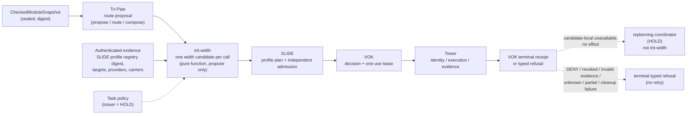

# Trit-width: width-candidate proposal after Tri-Pipe

Date: 2026-10-06

Status: architecture proposal for owner and SuperGrok review. Non-authorizing.
No implementation, no package TODO change, no SLIDE or VOK change. Code is cited
as `path:line` at Galerina `main` `df7f2fb51` unless another ref is named.
RD-0855 is a private KB record and is cited by ID and line only.

Owner inputs (Phillip, 2026-10-06, BST): the component request (16:57), the
three-step fallback order (16:52), "for non science work the 2/3/8 ... may only be
needed (8-bit for API)" (16:59) and "the rest ... should be automatic sorting ie
what's best depending on the logic" (16:59). The 16:59 inputs are his stated
understanding, not yet final decisions; section 12 keeps the details as HOLD.
Package placement B (a module inside `galerina-tri-pipe`) is owner-confirmed
(Phillip, 2026-10-06 22:50 BST); see section 9.

Revision (2026-10-06): design polish from the SuperGrok review
`supergrok-grok-design-trit-width-20261006-answer-01` (authority boundary PASS
with notes, three-step floor PASS with notes, contracts PASS with one required
change, placement B, nothing blocking). Changes: one candidate per
`WidthProposalV1` with ranking kept as evidence only; `AttemptLinkV1` renamed and
extended; trit-width is a pure function with no retry loop of its own; the
`GENERAL` first attempt is scalar only; six refusal codes and tests 15-24 added.

## 1. Purpose and pipeline position

Trit-width turns one non-authorizing Tri-Pipe route proposal into exactly **one**
digest-bound **width candidate** for one attempt (which physical representation
of the one widthless K3 Trit to try next). The ranking behind that choice is kept
as evidence only (`rankingDigest` plus an `excluded` list), never as a second live
candidate. It sits immediately after Tri-Pipe and immediately before SLIDE
profile planning and admission.



There is no arrow from the receipt back into trit-width. Trit-width is a pure
function `(TritWidthRequestV1) -> WidthProposalV1 | WidthRefusalV1` with no retry
loop, iteration or state of its own. The replanning coordinator (HOLD, Galerina
#146) may call trit-width again with a new `TritWidthRequestV1` that carries a
`parent` link. That is admission-time replanning, never an execution-time rescue
(RD-0855 L192-200, L488). Each call yields a new attempt that SLIDE admits and
VOK authorises from scratch.

Why a separate step: Tri-Pipe already carries a single `representationProfile`
operand (`packages-ts/galerina-tri-pipe/src/tri-pipe.ts:13-16,35-40`) and refuses
unregistered profiles (`tri-pipe.ts:85-94`). It has no width ranking, no
workload-class defaults, no binary-carrier rules and no attempt linkage. SLIDE's
planner already accepts an ordered `preferredProfileIds` list and selects only
`ACTIVE_REFERENCE` profiles (SLIDE `src/representation-profile-registry.mjs:183-241`
on `codex/v2c-independent-frontend` `ec31e3d42`). Trit-width is the missing
deterministic step between those two: it produces the one candidate SLIDE plans
from, passed as a single-entry `preferredProfileIds` because the proposal holds one
candidate (section 8). SLIDE can never skip between candidates within one plan.

## 2. Responsibilities

1. **Map the Tri-Pipe plan to one width candidate per call.** Input is one Tri-Pipe
   `PROPOSAL` (`tri-pipe.ts:51-65`); a Tri-Pipe `REFUSED` (`tri-pipe.ts:67-72`)
   is propagated as a trit-width refusal, never repaired.
2. **Read capability and evidence only from authenticated inputs:** the SLIDE
   profile registry snapshot (profile ids, lifecycle, lane count, encoding,
   target and provider ids; registry `:9-15,25-57`), attested target capability
   (as Tri-Pipe uses `resolveHardware`, `tri-pipe.ts:95-100`) and the task's
   declared semantics from the checked snapshot. Caller hints never add a width.
3. **Emit exactly one candidate per call that follows the owner's three-step
   floor** (section 4). The ranking of section 5 applies only inside step 1 and
   only picks that one candidate; the ordering and exclusions are recorded as
   evidence (`rankingDigest`, `excluded`), not emitted as further candidates.
4. **Apply binary-carrier encoding rules** (section 6) to any step-3 candidate
   and to any binary boundary encoding, including 8-bit API packing of the
   current attempt's values.
5. **Run width-specific shape checks** using rules that already exist:
   - lane counts and alignment come from the registry (`laneCount` 1/32/64/256,
     `alignmentBytes` 4/4/8/32, registry `:54-57`);
   - partial vectors use the registry tail policy `MASK_INACTIVE_LANES`
     (registry `:35`); a non-zero inactive tail lane refuses (SLIDE `TODO.md:829-836`);
   - cross-profile operations refuse, not switch
     (`SLIDE-BITPLANE-PROFILE-DISAGREEMENT`, SLIDE `TODO.md:837-842`);
   - integer overflow traps and never wraps (owner Fork A,
     `packages-ts/galerina-core-compiler/src/i32-arith.ts:5`);
   - balanced-ternary carry exists only as scalar operators
     (`packages-ts/galerina-tower-citizen/src/tpl-simulator.ts:130-154`).
   - **Saturation semantics for packed trit vectors are not defined anywhere in
     the inspected code: HOLD.** Trit-width must not invent them.

## 3. Non-responsibilities (fail-closed)

Trit-width has the same authority ceiling as Tri-Pipe (RD-0855 L335-351;
`packages-ts/galerina-tri-pipe/TODO.md:3-4,20`):

- It never admits, authorises, mints, holds, consumes or forwards a VOK decision
  or lease. Every output carries `authorityReleased: false` and
  `admissionAuthority: false`, matching `tri-pipe.ts:62` and registry `:229-230`.
- It never executes or dispatches (compare `dispatchTriPipeEngine`,
  `tri-pipe.ts:132-138`).
- It never turns a refusal into permission. After DENY, revocation, invalid or
  stale evidence, unknown outcome, partial effect or cleanup failure it emits a
  terminal refusal, not a next candidate.
- It never falls back after `CheckedModuleSnapshot` to AST, WAT/Wasm, cached
  TypeScript, Tower or Tri-Pipe semantics (RD-0855 L197-200, L365-374). The only
  step down is admission-time replanning with a new plan identity and its own
  receipt (RD-0855 L488).
- It never changes task semantics or task policy. A different two-valued
  algorithm or degraded semantics is not an alternative; it refuses.
- It is not the task-policy issuer, not the attempt-budget owner and not the
  replanning coordinator (all HOLD; Galerina #146). It is a pure function with no
  retry loop: it never iterates internally and never calls itself again.
- It never consumes an `ExecutionRouter.route` `ExecutionDecision` (an in-band
  profile rewrite) as input; only a `createTriPipeEngine` `PROPOSAL` is accepted
  (`TW_ROUTER_FLOOR_NOT_A_PROPOSAL`, section 13).

## 4. The three-step floor (owner order, 2026-10-06 16:52 BST)

Field name is `step` (1, 2, 3), not `tier`, to avoid collision with the hardware
capability `Tier = "binary" | "hybrid" | "photonic"`
(`packages-ts/galerina-hardware-tier/src/hardware-directive.ts:25`). A hardware
tier named `binary` is a capability class, not permission to use step 3.

| Step | Meaning | Registered today |
|---|---|---|
| 1 | Run at the requested or ranked (non-scalar) trit-width profile | `trit.bitplane32/64/256.v1` registered but `INACTIVE` (registry `:55-57`), so step 1 has no eligible candidate today |
| 2 | Standard Galerina K3 Trit logic: the scalar reference profile | `trit.scalar.v1`, `ACTIVE_REFERENCE` (registry `:54`); `trit.scalar.v1` is always `step: 2` |
| 3 | Binary implementation of the **same** task semantics, K3 still deciding permission | none: no binary profile is registered; step 3 is HOLD until one is |

Rules:

- One proposal = one candidate = one attempt. Steps never reorder
  (`TW_STEP_REORDER`). Ranking (section 5) only picks the single step-1 candidate.
- Step 2 is the first proposal when step 1 has no eligible candidate (no
  `ACTIVE_REFERENCE` non-scalar profile, `GENERAL` work, or scalar requested).
  Otherwise step 2 is proposed only after a step-1 attempt ends in a typed,
  candidate-local `UNAVAILABLE` or `INCOMPATIBLE` refusal with no effect.
- Step 3 is proposed only after step 2 is itself refused as candidate-local
  unprocessable with no effect. A step-3 proposal must carry that step-2 refusal
  digest (`step2RefusalDigest`, section 8); without it trit-width refuses
  `TW_BINARY_WHILE_K3_AVAILABLE`. Step 3 never appears in a first proposal.
- An explicit `requestedWidthId` naming a registry `INACTIVE` profile refuses
  `TW_INACTIVE_PROFILE`; trit-width does not silently substitute scalar (that
  would be an in-band floor like the router's, section 13).
- Policy `HOLD` means no step down at all (`TW_TASK_POLICY_MISSING`).
- Whether step 1 may descend through intermediate widths (256 -> 64 -> 32, as
  RD-0855 L488 permits) before step 2, or go straight to step 2 as the owner's
  wording reads, is HOLD. Fail-closed default: requested width, then step 2,
  with no 256 -> 64 -> 32 descent until the owner lifts that HOLD.
- Width set is **registry-driven**. Phillip's example list (1/8/16/32/64/256)
  includes 8 and 16, which are not registered in SLIDE (registry `:9-15`) or
  Tri-Pipe (`tri-pipe.ts:14`). A request for an unregistered width refuses
  `TW_WIDTH_NOT_REGISTERED`; registering 8 or 16 is an owner decision. 128/512
  stay experimental with no ABI (`tri-pipe.ts:16`; RD-0855 L27).

### 4.1 Workload class and default width sets

Phillip's 16:59 understanding: general (non-science) work needs only binary
(2-state), a single K3 trit (3-state, -1/0/+1) and 8-bit at API boundaries;
wider widths (32/64/256) are mainly for science/compute.

| Workload class | First attempt (attempt 0) | Opt-in |
|---|---|---|
| `GENERAL` | `trit.scalar.v1` only (step 2). An 8-bit API boundary encoding, if requested, is a packing of that same attempt's values, not a separate candidate | none by default |
| `SCIENCE` | as `GENERAL` while no wide profile is `ACTIVE_REFERENCE` | registered `ACTIVE_REFERENCE` wide profiles (32/64/256) via ranking |

Binary (step 3) is never in a first proposal for any workload class. No
`ACTIVE_REFERENCE` wide profile exists today (SLIDE 32/64/256 are all `INACTIVE`,
registry `:55-57`), and ranking requires `ACTIVE_REFERENCE` (section 5), so
`SCIENCE` step 1 is empty and its attempt 0 is also step 2 scalar. Ranking must
not be read as emitting an `INACTIVE` 256 as attempt 0.

- "2" and "3" are state counts, not trit widths: binary is a step-3 carrier,
  "3" is profile 1.
- Whether "8" means 8-bit or 8-trit is HOLD. This design treats it as an
  **8-bit binary encoding at an API boundary**, so section 6 applies.
- Who declares the workload class (task policy, snapshot annotation, caller) is
  HOLD. An undeclared class is `GENERAL` (smallest set). A caller claim of
  `SCIENCE` widens only the opt-in set and is bound into the proposal digest.

## 5. Selection and ranking (step 1 only)

Phillip's 16:59 input: beyond the fixed defaults, trit-width sorts by "what's
best depending on the logic". This matches RD-0855 L29 and L202-210: a
deterministic selector over admitted evidence that may propose a profile but
never authorise one.

**Scoring inputs** (all from the sealed snapshot or authenticated evidence):

| Input | Source | Effect (direction only; weights HOLD) |
|---|---|---|
| Operation shape (K3 MEET/JOIN/NEGATE, arithmetic, compare, bit ops) | checked snapshot / canonical GIR | only profiles whose provider covers every op stay eligible |
| Value range and precision | snapshot value states and types | a width that cannot represent the declared range is excluded, not ranked low |
| Element count and lane parallelism | snapshot shape vs registry `laneCount` | favour lane counts the work fills; tail-masking waste lowers the score |
| Carrier availability | registry lifecycle, target and provider ids | only `ACTIVE_REFERENCE` with a matching target and provider is eligible (registry `:197-212`) |
| Cost | declared static cost from admitted evidence only | lower declared cost ranks higher; no self-reported runtime timing |
| Workload class | section 4.1 | limits the eligible set |

**Determinism.** A pure function of the canonical input bytes. Integer scores, no
floating point, no clock, no randomness, no learned model, no network.

**Tie-break**, in order: higher score; position in the workload-class default
order; smaller `laneCount` (closer to the scalar oracle); profile id by code
point.

**Ranking is evidence, not a candidate list.** The ranking picks one step-1
candidate. The full ordered eligible set and every exclusion reason are hashed
into `rankingDigest`; excluded widths are listed in `excluded`. Lower-ranked
widths are not live candidates: the proposal carries exactly one candidate, so
SLIDE can never skip between candidates within one plan. A later attempt is a new
call by the replanning coordinator (HOLD), not a read of a stored tail.

**Reason record** for the chosen candidate, emitted and digested with the
proposal: each factor's value, its evidence digest and its contribution; for every
excluded width, the exclusion code. Nothing is dropped silently, in the style of
`decideTargetFallback` (`packages-ts/galerina-core-runtime/src/runtime-contracts.ts:190-213`).

**Propose-only.** The top-ranked candidate is still only a proposal. SLIDE
independently admits it and VOK authorises the attempt. A low rank never refuses
a task by itself, and a high rank never skips admission.

## 6. Binary-carrier encoding rules

These apply to step 3 and to any binary boundary encoding (including 8-bit API).
They follow `rd0855-fallback-astra-adjudication-20261006` (answer 3) and reuse
existing encodings rather than adding one.

1. At least 2 bits per independently encoded trit value.
2. Exactly three legal codes. The fourth code refuses (`TW_BINARY_ILLEGAL_CODE`),
   never maps to a value. Existing precedents: the TPL/I2_S code table
   `0b00=-1, 0b01=0, 0b10=+1, 0b11=illegal`
   (`packages-ts/galerina-tower-citizen/src/tpl-simulator.ts:56-60,74-81`) and the
   SLIDE `two-bit-bitplane` encoding, `illegalCodePolicy: "REFUSE_NON_TRIT"`, whose
   both-bits state refuses (registry `:31-34`; SLIDE `TODO.md:829-836`). Each
   candidate names its `encodingId`; mixing encodings refuses `TW_ENCODING_MISMATCH`.
3. K3 semantics are preserved inside the computation. UNKNOWN stays
   distinguishable. Collapse to Boolean happens only at the declared final
   permission boundary: c(ALLOW)=true, c(DENY)=false, c(UNKNOWN)=false. Early
   collapse is wrong because c(NOT_K3 UNKNOWN)=false but NOT_bin(c(UNKNOWN))=true.
4. Numeric zero and binary false are not K3 UNKNOWN; integer/bit/Boolean
   operations already declared as such keep their own semantics, with K3 still
   governing permission.
5. 8-bit API packing: fail-closed default is four 2-bit trits per byte under rule
   2. Base-3 packing (five trits per byte, codes 243-255 refuse) is not adopted:
   HOLD. 8-bit packing is an encoding of the current attempt's values, not a
   step-3 candidate.

## 7. Typed contracts (sketch only, not code)

```ts
type Step = 1 | 2 | 3;
type WorkloadClass = "GENERAL" | "SCIENCE";
type TaskSemantics =
  | "K3_POLICY" | "BALANCED_TERNARY_ARITH" | "INTEGER_BIT_BOOLEAN" | "PACKED_K3";

interface TritWidthRequestV1 {
  readonly schema: "galerina.trit-width.request.v1";
  readonly triPipe: TriPipeProposal;               // tri-pipe.ts:51-65, digest re-checked
  readonly checkedSnapshotDigest: string;          // sha256:..., same for every attempt of a task
  readonly taskSemantics: TaskSemantics;           // from the snapshot, not the caller
  readonly workloadClass?: WorkloadClass;          // absent => GENERAL
  readonly requestedWidthId?: string;              // registry id; absent => ranked
  readonly evidence: {
    readonly registryDigest: string;               // authenticated SLIDE registry snapshot
    readonly targetIds: readonly string[];
    readonly providerIds: readonly string[];
    readonly evidenceEpoch: string;                // stale => refuse
  };
  readonly taskPolicyRef: string | "HOLD";          // "HOLD" => first attempt only; any step down refuses
  readonly parent?: AttemptLinkV1;                 // present on every step down
}

interface WidthCandidateV1 {
  readonly rank: number;                           // position in the ranking behind rankingDigest (evidence only)
  readonly step: Step;
  readonly widthId: string;                        // e.g. "trit.bitplane64.v1"
  readonly laneCount: number;                      // copied from the registry
  readonly encodingId: string;                     // e.g. "two-bit-bitplane"
  readonly targetId: string;
  readonly providerId: string;
  readonly reasons: readonly ReasonRecordV1[];
  readonly candidateDigest: string;
}

interface WidthProposalV1 {
  readonly kind: "WIDTH_PROPOSAL";
  readonly schema: "galerina.trit-width.proposal.v1";
  readonly planIdentity: string;                   // see binding order below
  readonly triPipeDigest: string;                  // triPipe.candidateRouteDigest
  readonly attemptIndex: number;
  readonly candidate: WidthCandidateV1;            // exactly one; this attempt
  readonly rankingDigest: string;                  // H(ordered eligible + excluded reasons)
  readonly excluded: readonly ReasonRecordV1[];
  readonly authorityReleased: false;
  readonly admissionAuthority: false;
  readonly dataBrand: "Trit";
  readonly governanceBrand: "Verdict";
}

interface WidthRefusalV1 {
  readonly kind: "REFUSED";
  readonly schema: "galerina.trit-width.refusal.v1";
  readonly code: TritWidthRefusalCode;
  readonly planIdentity?: string;
  readonly authorityReleased: false;
  readonly admissionAuthority: false;
}
```

`planIdentity` binds, in this order, a domain tag then: schema,
`checkedSnapshotDigest`, `triPipeDigest`, `candidate.candidateDigest`,
`attemptIndex`, parent `planIdentity` or the token `ABSENT`,
`evidence.evidenceEpoch`, `evidence.registryDigest`, `workloadClass` (or
`GENERAL`), `taskSemantics`, `taskPolicyRef`, `rankingDigest`. It does not bind a
remaining-candidate tail, because there is none.

Refusal codes (all terminal for this request):

| Code | When |
|---|---|
| `TW_INPUT_MALFORMED` | missing or extra fields, non-canonical input |
| `TW_AUTHORITY_FIELD_PRESENT` | input carries a lease, decision or receipt as a capability |
| `TW_TRIPIPE_REFUSED` | Tri-Pipe returned `REFUSED` |
| `TW_TRIPIPE_DIGEST_MISMATCH` | recomputed Tri-Pipe digest differs |
| `TW_SNAPSHOT_MISMATCH` | snapshot digest differs from the parent attempt |
| `TW_WIDTH_NOT_REGISTERED` | requested width not in the registry (e.g. 8, 16) |
| `TW_WIDTH_EXPERIMENTAL` | 128/512/adaptive |
| `TW_WORKLOAD_CLASS_EXCLUDES_WIDTH` | width outside the class set |
| `TW_EVIDENCE_UNAUTHENTICATED` / `TW_EVIDENCE_STALE` | registry or target evidence fails |
| `TW_TASK_POLICY_MISSING` | step down requested with policy `HOLD` |
| `TW_PRIOR_OUTCOME_TERMINAL` | parent was DENY, revoked, invalid evidence, unknown, partial, cleanup failure |
| `TW_PRIOR_EFFECT_NOT_EXCLUDED` | no-effect evidence absent (HOLD what counts) |
| `TW_ATTEMPT_BUDGET_EXHAUSTED` / `TW_ATTEMPT_CHAIN_CYCLE` | budget spent or a width repeats |
| `TW_BINARY_WHILE_K3_AVAILABLE` | step 3 without a step-2 refusal digest |
| `TW_SEMANTIC_DEGRADATION_FORBIDDEN` | binary candidate changes task semantics |
| `TW_BINARY_ENCODING_UNDERWIDTH` | fewer than 2 bits per trit |
| `TW_BINARY_ILLEGAL_CODE` | fourth code observed or allowed |
| `TW_ENCODING_MISMATCH` | encoding differs from the candidate's `encodingId` |
| `TW_NO_CANDIDATE` | every step exhausted |
| `TW_ROUTER_FLOOR_NOT_A_PROPOSAL` | input is an `ExecutionDecision` / in-band profile rewrite, not a Tri-Pipe `PROPOSAL` |
| `TW_INACTIVE_PROFILE` | proposal names a registry `INACTIVE` id as this attempt's candidate |
| `TW_STEP_REORDER` | parent step >= proposed step, or step 3 with parent step != 2 |
| `TW_LEASE_SCHEMA` | parent link bytes are a lease/decision rather than a terminal receipt |
| `TW_HARDWARE_TIER_AS_STEP` | hardware `binary` tier used as permission for step 3 |
| `TW_MULTI_CANDIDATE` | implementation would emit more than one live candidate to SLIDE |

`TW_WIDTH_EXPERIMENTAL` may fold into `TW_WIDTH_NOT_REGISTERED` plus a reason
record; keeping both is fine while experimental is a distinct lifecycle.

## 8. Attempt linkage and receipts per step down

```ts
interface AttemptLinkV1 {
  readonly taskId: string;
  readonly attemptIndex: number;                    // parent + 1
  readonly checkedSnapshotDigest: string;           // must equal the request; else TW_SNAPSHOT_MISMATCH
  readonly parentPlanIdentity: string;
  readonly parentStep: Step;
  readonly parentWidthId: string;
  readonly parentRefusalDigest: string;             // the parent's typed refusal, kept as is
  readonly parentRefusalClass: "CANDIDATE_LOCAL_UNAVAILABLE" | "CANDIDATE_LOCAL_INCOMPATIBLE";
  readonly parentTerminalReceiptDigest: string;     // VOK terminal receipt, not a lease
  readonly noEffectEvidenceRef: string | "HOLD";     // HOLD => TW_PRIOR_EFFECT_NOT_EXCLUDED
  readonly step2RefusalDigest?: string;             // required when proposing step 3
}
```

- The link is a digest link, never a capability. `parentTerminalReceiptDigest`
  (renamed from `parentVokReceiptDigest`) names a VOK terminal receipt so a lease
  object cannot be smuggled in by field name. Trit-width re-checks the digest; it
  does not hold, forward or mint anything. Bytes whose schema is a lease or
  decision refuse `TW_AUTHORITY_FIELD_PRESENT` / `TW_LEASE_SCHEMA`.
- A step-3 proposal requires `step2RefusalDigest`, and that digest must be a
  candidate-local refusal of **this** snapshot at step 2 scalar, not a recycled
  step-1 refusal; otherwise `TW_BINARY_WHILE_K3_AVAILABLE`. `parentStep` must be
  lower than the proposed step, and must be 2 for a step-3 proposal
  (`TW_STEP_REORDER`).
- One attempt = one candidate. SLIDE's `preferredProfileIds` has length 1 because
  the proposal contains one candidate, not because a caller sliced a list. SLIDE's
  in-plan skip (`fallbackUsed`, registry `:199-220`) therefore never merges two
  candidates or two steps into one plan. This matches SLIDE `TODO.md:853-856`
  (fallback only through a new digest-bound candidate plan).
- Every attempt gets fresh SLIDE admission, a fresh VOK decision and one-use
  lease, and its own terminal receipt. The parent refusal is linked, not replaced.
- The VOK receipt already binds selected profile, plan digest, target and
  provider for the scalar route (SLIDE `TODO.md:845-852`). Proposed addition
  (VOK owner's call): bind `step`, `attemptIndex` and `parentPlanIdentity`.
- The same `checkedSnapshotDigest` is bound into every attempt; a changed
  snapshot is a new task (Galerina #146 core-compiler rows).

## 9. Package placement (owner-confirmed: B)

**Owner decision (Phillip, 2026-10-06 22:50 BST): B**, trit-width is a module
inside `packages-ts/galerina-tri-pipe` (`src/trit-width.ts`), not its own package.
SuperGrok's review recommended B for the same reasons: Tri-Pipe already owns
`RepresentationProfile`, the proposal-only invariant and `authorityReleased: false`;
a new package (A) adds a graph border without adding an authority border; C sits
next to the #146 policy/budget HOLDs and the v1 CPU/WASM freeze.

Constraints on B: own schema ids, own exports and tests; no import of
`ExecutionRouter.route`; consume the `createTriPipeEngine` `PROPOSAL` only. If a
second consumer appears, lifting to A is a new owner decision.

Options considered:

| Option | For | Against |
|---|---|---|
| A. New `packages-ts/galerina-trit-width` | clear component seam; own boundary policy | new package border and graph edges; RD-0855 L343-344 keeps the sibling Tri-Fuse role a contract, not a package |
| B. Module in `packages-ts/galerina-tri-pipe` (`src/trit-width.ts`) | Tri-Pipe already owns `RepresentationProfile` and the proposal-only invariant (`tri-pipe.ts:13-16,62`); no new authority surface | Tri-Pipe grows; seam is a module boundary only |
| C. Module in `packages-ts/galerina-core-compute` | existing fallback-planning vocabulary (`TODO.md:23,29,37,41`) | v1 freeze limits targets to CPU/WASM (`TODO.md:3-6`); #146 puts task-policy and budget HOLD rows here, so it would sit next to authority-adjacent policy |

B is kept as a logical component inside Tri-Pipe's existing proposal-only
boundary. Trit-width is not the replanning coordinator in any option.

## 10. Security and zero-trust analysis

Defaults: undeclared workload class is `GENERAL`; missing or stale evidence
refuses; policy `HOLD` allows no step down at all; unknown widths refuse; unregistered
encodings refuse; every output is non-authorizing.

| Threat | Mitigation |
|---|---|
| Downgrade to binary by forged "unavailable" claims | step 3 needs an authenticated step-2 refusal digest from SLIDE/VOK; trit-width does not accept its own or the caller's unavailability claim |
| Ranking bias by crafted inputs (inflated element count, fake cost, caller `SCIENCE` claim) | inputs come from the sealed snapshot and authenticated registry only; caller hints reorder nothing across steps; reason records and evidence digests are bound into `planIdentity` so SLIDE re-derives and disagrees |
| Profile spoofing (claiming a profile is active) | lifecycle read only from the authenticated registry digest; SLIDE independently re-checks (registry `:201`) |
| Width or encoding confusion (TPL vs bitplane codes, lane count mismatch) | `encodingId` and `laneCount` in every candidate; mismatch refuses; cross-profile operations refuse (SLIDE `TODO.md:841-842`) |
| Replay of an old proposal or lease | `planIdentity` binds snapshot, attempt index, parent and evidence epoch; VOK leases are one-use and never pass through trit-width |
| Refusal laundering (DENY turned into a "new attempt") | parent refusal class must be candidate-local; anything else is `TW_PRIOR_OUTCOME_TERMINAL` |
| Unbounded attempt chains | budget owner HOLD; until decided there is no step down at all; afterwards a width never repeats in one task and the owner budget caps attempts |
| Hardware `binary` tier read as permission | `step` and hardware `Tier` are separate types (section 4); `TW_HARDWARE_TIER_AS_STEP` |
| In-plan skip between candidates (SLIDE `fallbackUsed`) | one candidate per proposal; `preferredProfileIds` length 1; `TW_MULTI_CANDIDATE` |
| Router floor read as a proposal (`ExecutionDecision` with profile rewritten to 1) | input type is Tri-Pipe `PROPOSAL` only; `TW_ROUTER_FLOOR_NOT_A_PROPOSAL` |
| Lease smuggled through the attempt link | `parentTerminalReceiptDigest` names a terminal receipt; lease/decision schema refuses `TW_LEASE_SCHEMA` |

## 11. Test plan (no code)

1. 256 requested (once 256 is `ACTIVE_REFERENCE`), 256 refused candidate-local
   with no effect -> next proposal is step 2 `trit.scalar.v1`, new `planIdentity`,
   linked to the refusal.
2. Step 2 refused as candidate-local unprocessable -> step-3 binary proposal;
   K3 results and typed refusals identical to the scalar oracle on the full
   operand table.
3. Step 3 proposed while step 2 is processable or without the step-2 refusal
   digest -> `TW_BINARY_WHILE_K3_AVAILABLE`.
4. Parent DENY, revoked, invalid evidence, unknown outcome, partial effect,
   cleanup failure -> `TW_PRIOR_OUTCOME_TERMINAL`, no candidate.
5. Fourth binary code at decode and at the 8-bit API boundary -> `TW_BINARY_ILLEGAL_CODE`.
6. Early UNKNOWN collapse followed by NOT -> refuses; final-boundary collapse
   maps only ALLOW to true and keeps the UNKNOWN diagnostic.
7. Requested width 8 or 16 -> `TW_WIDTH_NOT_REGISTERED`; 128/512 -> `TW_WIDTH_EXPERIMENTAL`.
8. Same input twice -> byte-identical proposal and digest; permuting caller hint
   order inside step 1 does not cross steps.
9. Caller-supplied `SCIENCE` with `GENERAL` policy -> wide widths excluded with reasons.
10. Tri-Pipe `REFUSED` input -> `TW_TRIPIPE_REFUSED`; tampered Tri-Pipe digest ->
    `TW_TRIPIPE_DIGEST_MISMATCH`.
11. Input carrying a lease or decision object -> `TW_AUTHORITY_FIELD_PRESENT`.
12. Changed snapshot digest between attempts -> `TW_SNAPSHOT_MISMATCH`.
13. Repeated width in a chain or budget exhausted -> cycle/budget refusals.
14. Every output has `authorityReleased: false` and `admissionAuthority: false`;
    no export dispatches.
15. `SCIENCE` with only `INACTIVE` wide profiles -> first proposal is step 2
    scalar; `TW_INACTIVE_PROFILE` if a wide id is forced.
16. `ExecutionDecision` with profile rewritten to 1 after a requested 8 ->
    `TW_ROUTER_FLOOR_NOT_A_PROPOSAL`.
17. `GENERAL` attempt 0 never contains `step: 3`.
18. Step-3 proposal whose `step2RefusalDigest` is a step-1 width's refusal ->
    `TW_BINARY_WHILE_K3_AVAILABLE`.
19. `AttemptLinkV1.parentTerminalReceiptDigest` pointing at lease bytes ->
    `TW_AUTHORITY_FIELD_PRESENT` / `TW_LEASE_SCHEMA`.
20. Two proposals, same snapshot, `attemptIndex` 0 vs 1 -> distinct `planIdentity`.
21. Caller-supplied element count, cost or `SCIENCE` hint not present on the
    snapshot -> ignored; cannot cross steps (ranking bias).
22. `WidthRefusalV1` always has `admissionAuthority: false`.
23. Hardware `tier: "binary"` does not add a step-3 candidate.
24. The trit-width module has no export that calls `dispatchTriPipeEngine` or
    `ExecutionRouter.route`.

Tests 1-4, 8, 11 and 14 are the authority-critical set.

## 12. Open questions (HOLD)

1. Who issues the task policy that permits step-downs.
2. Which package coordinates replanning (not trit-width).
3. Who owns the retry/attempt budget.
4. What evidence proves non-execution / no prior effect.
5. Exact default width sets per workload class, and who declares the class.
6. Is "8" 8-bit (API encoding) or 8-trit; should 8 and/or 16 trit widths be registered.
7. Which registered binary profile serves step 3 (none exists).
8. Ranking weights.
9. Step-1 descent through intermediate widths (RD-0855 L488) vs straight to step 2.
10. 8-bit packing (2-bit x4 default vs base-3 x5) and which 2-bit code table at API boundaries.
11. Packed-vector saturation semantics.
12. Package placement: resolved, B (module inside `galerina-tri-pipe`),
    owner-confirmed 2026-10-06 22:50 BST (section 9). Items 1-11 stay owner HOLDs.

## 13. Conflicts with existing code or docs

- `ExecutionRouter.route` maps an unknown or experimental profile to profile 1
  in-band with a "digital floor" decision rather than a typed refusal and new
  plan identity (`packages-ts/galerina-tri-pipe/src/execution-router.ts:122-137`).
  `createTriPipeEngine` refuses instead (`tri-pipe.ts:86-94`). This is a
  pre-existing fail-open in other code. Trit-width consumes the Tri-Pipe
  `PROPOSAL`/`REFUSED` only and refuses an `ExecutionDecision` input with
  `TW_ROUTER_FLOOR_NOT_A_PROPOSAL`. **Follow-up (recorded, not fixed here; this
  PR changes no code):** owner/Tri-Pipe to reconcile `ExecutionRouter.route` with
  the typed refusal (section 14).
- Phillip's width list names 8 and 16; only 1/32/64/256 are registered
  (registry `:9-15`; `tri-pipe.ts:14`).
- `docs/TODO.md:2861-2864` names physical profiles 1, 64, 256 with 32 as
  compatibility; Tri-Pipe's `ADMITTED_REPRESENTATION_PROFILES` (`tri-pipe.ts:14`)
  includes 32 and is a candidate set, not SLIDE admission. Naming only.
- `packages-ts/galerina-tri-pipe/TODO.md:13` fixes default profile 1. Automatic
  ranking does not change that default: with no ranking evidence, or for
  `GENERAL`, the first candidate stays profile 1 (and while no wide profile is
  `ACTIVE_REFERENCE`, the same holds for `SCIENCE`).
- Two 2-bit trit code tables exist (TPL/I2_S and SLIDE bitplane); see section 6.
- `galerina-core-compiler/TODO.md` at `main` has no width or replanning rows;
  #146 proposes them as HOLD.

## 14. TODO rows that would follow (not added to any TODO yet)

- tri-pipe: `[HOLD] trit-width module (src/trit-width.ts, placement B owner-confirmed 2026-10-06): WidthProposalV1 / WidthRefusalV1 schema, three-step floor, propose-only, pure function with no retry loop`.
- tri-pipe: `[HOLD] WidthProposalV1 is one candidate per attempt; ranking evidence in rankingDigest + excluded`.
- tri-pipe: `[HOLD] Ranking inside step 1: deterministic integer score, tie-break, reason records; weights owner decision`.
- tri-pipe: `[HOLD] Binary-carrier rules: >=2 bits per trit, fourth code refuses, named encodingId, final-boundary-only UNKNOWN collapse`.
- tri-pipe (follow-up, no code change in this PR): `[HOLD] Reconcile ExecutionRouter.route in-band profile floor (unknown profile -> profile 1) with the createTriPipeEngine typed refusal`.
- core-compute: `[HOLD] Workload class (GENERAL/SCIENCE) and default width sets; class declarer`.
- SLIDE: `[HOLD] Register a binary step-3 profile (same semantics, K3 permission) before any step-3 proposal`.
- SLIDE: `[HOLD] Owner decision on registering 8/16 trit widths`.
- SLIDE/VOK: `[HOLD] Receipt binds step, attemptIndex, parentPlanIdentity`.
- docs/TODO RD-0855 section: `[HOLD] Link trit-width to the admission-time replanning row (#146)`.

## References

- Galerina #145 (Tri-Pipe Tri-Fuse row), #146 (RD-0855 admission-time fallback
  HOLD rows, three-step order, head `c3ea7c27a`), SLIDE #21 (alternative and VOK
  attempt rows, head `ba6658e24`). Not edited here.
- `docs/architecture/galerina-slide-vok-current-flow-2026-08-24.md:35-49`.
- Bridge: `rd0855-fallback-astra-adjudication-20261006`,
  `codex-rd0855-fallback-astra-20261006-answer-01`,
  `galerina2-rd0855-astra-fallback-20261006`.
- RD-0855 (private; ID and line only): L23-31, L192-200, L202-210, L335-351,
  L365-374, L488, section 4.3.
